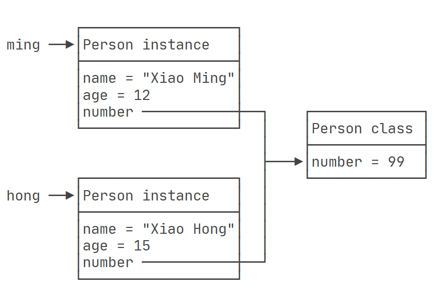

# 静态类

## 静态变量

在类中定义的普通变量，我们称为 实例变量，实例变量的特点是 **每个对象的实例变量都拥有独立的内存空间，各个对象的实例变量之间互不干涉**。

在类中用 `static` 关键字修饰的字段，就是 <span style="color:#CC0000; font-weight:bold;">静态变量 / 类变量</span>，静态变量的特点是 <span style="color:#CC0000; font-weight:bold;">所有实例对象共享同一个静态字段</span>。

```java {5,9,19}
public static void main(String[] args) {
  Person p1 = new Person("Xiao Ming", 12);
  Person p2 = new Person("Xiao Hong", 15);

  p1.number = 99;
  System.out.println(p1.number); //99
  System.out.println(p2.number); //99
  
  p2.number = 200;
  System.out.println(p1.number); //200
  System.out.println(p2.number); //200
}

class Person {
  //实例变量
  public String name;
  public int age;
  //静态变量 / 类变量
  public static int number;

  public Person(String name, int age) {
    this.name = name;
    this.age = age;
  }
}
```

上面示例中，`p1` 和 `p2` 的 `number` 属性都指向同一块内存空间，所以获取的值都是一样的。



由于字段使用 `static` 关键字定义的原因，因此我们在获取 静态变量 的时候，可以**不用 `p1.number` ，而是直接使用 `Person.number` （更加推荐，也更规范）**。

```java {5}
public static void main(String[] args) {
  Person p1 = new Person("Tom", 20);
  Person p2 = new Person("Sunny", 20);

  Person.number = 200;
}
```


## 静态方法

有静态变量，就有静态方法。用 `static` 关键字修饰的方法就是 静态方法。

调用静态方法同样也不需要实例对象 `p1.setNumber()` 来调用，而是直接使用 `Person.setNumber()`。

```java {5,6,20-22}
public static void main(String[] args) {
  Person p1 = new Person("Tom", 20);
  Person p2 = new Person("Sunny", 20);

  Person.setNumber(100);
  System.out.println(Person.number);
}


class Person {
  public String name;
  public int age;
  public static int number;

  public Person(String name, int age) {
    this.name = name;
    this.age = age;
  }

  public static void setNumber(int value){
    number = value;
  }
}
```

::: warning 注意

1. 因为静态方法属于 `class` 类，而不属于实例，因此在 <span style="color:#CC0000; font-weight:bold;">静态方法内部，无法使用 `this` 关键字</span>；
2. <span style="color:#CC0000; font-weight:bold;">静态方法内部，只能获取静态变量、调用静态方法，无法获取 实例变量；</span>
3. 非静态方法内部，可以获取静态变量、调用静态方法，也可以获取实例变量、调用实例方法；

:::

```java {12,15}
class Person {
  public String name;
  public int age;
  public static int number;

  public Person(String name, int age) {
    this.name = name;
    this.age = age;
  }

  public static void setNumber(int value){
    number = value;                //✔️获取静态变量
    System.out.println(this.name); //❌报错：静态方法无法获取成员变量

    eat(); 	  //✔️调用静态方法
    sleep();  //❌报错：静态方法无法调用非静态方法
  }

  public static void eat() {
    System.out.println("Person eat...");
  }

  public void sleep() {
    System.out.println(Person.number); //✔️非静态方法可以获取静态变量
    System.out.println(this.name);     //✔️非静态方法也可以获取非静态变量

    System.out.println("Person sleep...");
  }
}
```


## 使用场景

思考：开发中，什么时候需要将属性或方法声明为静态类？

1. 对变量来说：
   - 判断当前类的多个实例能否共享此成员变量，能共享则可以声明为静态；
   - 开发中一些常量一般可以声明为静态使用，例如 Math.PI；

2. 对方法来说：
   - 方法内操作的变量如果都是静态变量（而非实例变量）时，则该方法可以声明为静态变量；
   - 开发中，工具类中的一些方法，一般可以声明为静态方法，例如 Arrays 类、Math 类；


::: info 面试题

调用 order.hello() 和 order.count 是输出值，还是报空指针异常？

```java
public static void main(String[] args) {
  Order order = null;

  order.hello(); //10
  System.out.println(order.count); //hello, world
}

class Order {
  public static double count = 10;

  public static void hello() {
    System.out.println("hello, world!");
  }
}
```

:::

