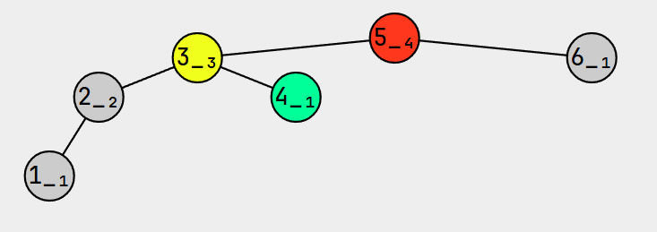
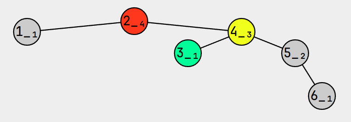
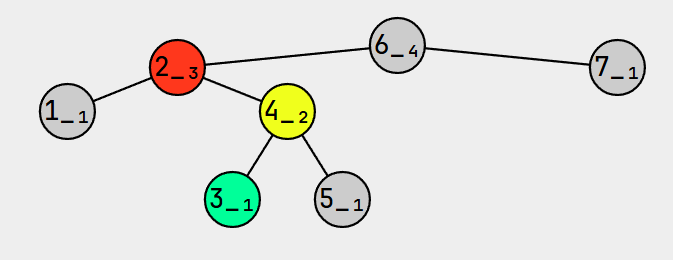
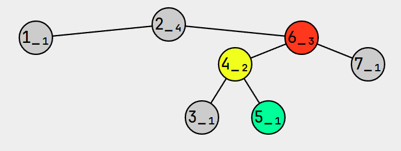

# AVL 树

**平衡二叉搜索树**（Balanced Binary Tree，BBT）是一种结构平衡的二叉搜索树，即 **叶子节点的高度差不超过 1**，并且左右两个子树都是一棵平衡二叉树。

它能在 $O(log_2n)$ 内完成插入、查找和删除操作，最早被发明的平衡二叉搜索树就是 AVL 树。

常见的平衡二叉搜索树有：AVL 树、红黑树和 Treap（树堆）。


::: code-group

```java [AVLTree]
public class AVLTree {
  AVLNode root;

  /**
   * 获取 AVL 树节点的高度
   * @param node 节点
   * @return 节点的高度
   */
  private int height(AVLNode node) {
    return node == null ? 0 : node.height;
  }

  /**
   * 更新节点高度
   * @param node 节点
   */
  private void updateHeight(AVLNode node) {
    int leftHeight = height(node.left);
    int rightHeight = height(node.right);
    // 当前节点的高度 = 左右节点的最大高度 + 1
    node.height = Integer.max(leftHeight, rightHeight) + 1;
  }

  /**
   * 获取节点的平衡因子（balance factor）
   * @param node 节点
   * @return 0 | 1 | -1 表示树平衡，>1 表示左边树高，< -1 表示右边树高
   */
  private int bf(AVLNode node) {
    return height(node.left) - height(node.right);
  }
}
```

```java [AVLNode]
public static class AVLNode {
  int key;
  Object value;
  AVLNode left;
  AVLNode right;
  int height = 1;

  public AVLNode(int key) {
    this.key = key;
  }

  public AVLNode(int key, Object value) {
    this.key = key;
    this.value = value;
  }

  public AVLNode(int key, Object value, AVLNode left, AVLNode right) {
    this.key = key;
    this.value = value;
    this.left = left;
    this.right = right;
  }
}
```

:::

> [!NOTE] 平衡因子
>
> 平衡因子 就是指左叶子节点减去右叶子节点的高度差，其中：
>
> - 左右节点的差为 `-1`、`0`、`1` 时，表示该节点平衡；
> - 左右节点差 `>1` 时，表示左侧节点高，右侧节点低；
> - 左右节点差 `<-1` 时，表示右侧节点高，左侧节点低；


## 四种失衡情况

当 AVL 树进行旋转的时候，需要先判断当前的树是哪边失衡。因此树失衡一共可分为 4 种：

|          |                            失衡一                            |                            失衡二                            |
| :------: | :----------------------------------------------------------: | :----------------------------------------------------------: |
| 失衡名称 |                          左左（LL）                          |                          右右（RR）                          |
|   描述   |      失衡节点 **左边更高**，且失衡子节点也 **左边更高**      |      失衡节点 **右边更高**，且失衡子节点也 **右边更高**      |
|   图示   |  |  |
| 解决方案 |                           一次右旋                           |                           一次左旋                           |

|          |                            失衡三                            |                            失衡四                            |
| :------: | :----------------------------------------------------------: | :----------------------------------------------------------: |
| 失衡名称 |                          左右（LR）                          |                          右左（RL）                          |
|   描述   |        失衡节点 **左侧更高**，但失衡子节点 **右侧更高**        |        失衡节点 **右侧更高**，但失衡子节点 **左侧更高**        |
|   图示   |  |  |
| 解决方案 |                        先左旋，后右旋                        |                        先右旋，后左旋                        |


## 旋转树

### 左旋

```java
public class AVLTree {
  AVLNode root;

  public AVLNode leftRotate(AVLNode red) {
    AVLNode yellow = red.right;
    AVLNode green = yellow.left;
    yellow.left = red; // 上位
    red.right = green; // 换爹
    updateHeight(red); // 更新高度
    updateHeight(yellow);
    return yellow;
  }
}
```


### 右旋

```java
public class AVLTree {
  AVLNode root;

  public AVLNode rightRotate(AVLNode red) {
    AVLNode yellow = red.left;
    AVLNode green = yellow.right;
    yellow.right = red; // 上位
    red.left = green;   // 换爹
    updateHeight(red);  // 更新高度
    updateHeight(yellow);
    return yellow;
  }
}
```


### 左右旋

```java
public class AVLTree {
  AVLNode root;

  public AVLNode leftRightRotate(AVLNode node) {
    // 失衡子节点先左旋，返回值需要重新找爹（根节点）
    node.left = leftRotate(node.left);
    // 再右旋根节点
    return rightRotate(node);
  }

}
```


### 右左旋

```java
public class AVLTree {
  AVLNode root;

  public AVLNode rightLeftRotate(AVLNode node) {
    node.right = rightRotate(node.right);
    return leftRotate(node);
  }
}
```


## 判断树是否平衡

```java
public class AVLTree {
  AVLNode root;

  public AVLNode balance(AVLNode node) {
    if (node == null) {
      return null;
    }
    // 判断根节点是否失衡
    int bf = bf(node);
    if (bf > 1 && bf(node.left) >= 0) { // LL
      return rightRotate(node);
    } else if (bf > 1 && bf(node.left) < 0) { // LR
      return leftRightRotate(node);
    } else if (bf < -1 && bf(node.right) > 0) { // RL
      return rightLeftRotate(node);
    } else if (bf < -1 && bf(node.right) <= 0) { // RR
      return leftRotate(node);
    }
    // 平衡时，直接返回根节点
    return node;
  }
}
```


## 新增

```java
public class AVLTree {
  AVLNode root;

  public void put(int key, Object value) {
    root = doPut(root, key, value);
  }

  private AVLNode doPut(AVLNode node, int key, Object value) {
    // 找到空位置，创建新节点
    if (node == null) {
      return new AVLNode(key, value);
    }
    // key已经存在，则更新
    if (key == node.key) {
      node.value = value;
      return node;
    }
    // 继续查找
    if (key < node.key) {
      node.left = doPut(node.left, key, value);
    } else {
      node.right = doPut(node.right, key, value);
    }
    // 调整节点的高度
    updateHeight(node);
    // 平衡树
    return balance(node);
  }
}
```


## 删除

> 太难了，听不懂…😭😭😭😭

```java
public class AVLTree {
  AVLNode root;

  public void remove(int key) {
    root = doRemove(root, key);
  }

  private AVLNode doRemove(AVLNode node, int key) {
    // node 为空时，直接返回null
    if (node == null) {
      return null;
    }

    if (key < node.key) {
      node.left = doRemove(node.left, key);
    } else if (node.key < key) {
      node.right = doRemove(node.right, key);
    } else {
      if (node.left == null && node.right == null) { // 没有左右孩子
        return null;
      } else if (node.left == null) { // 有右孩子
        return node.right;
      } else if (node.right == null) { // 有左孩子
        return node.left;
      } else { // 左右孩子都有
        AVLNode s = node.right;
        while (s.left != null) {
          s = s.left;
        }
        s.right = doRemove(node.right, s.key);
        s.left = node.left;
        node = s;
      }
    }
    // 更新高度
    updateHeight(node);
    // 平衡树
    return balance(node);
  }
}
```

