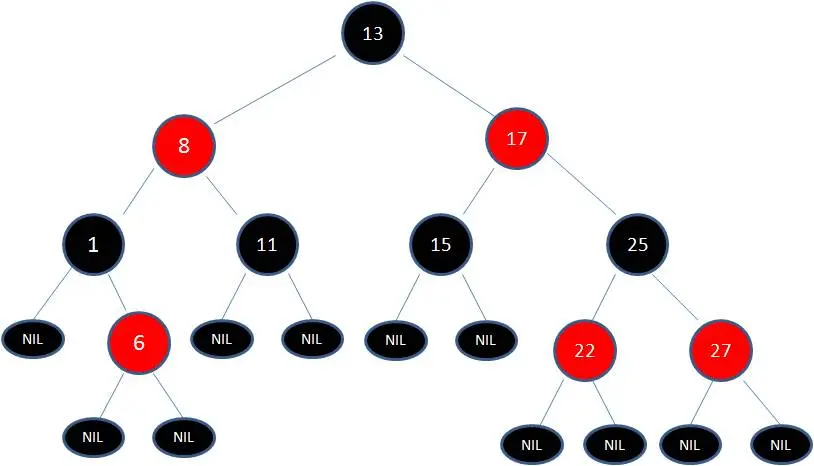

# 红黑树

红黑树（对称二叉 B 树）是一种自平衡的二叉搜索树，它在二叉搜索树的基础上增加了 **颜色属性和平衡规则**，确保树在最坏的情况下，仍能保持近似平衡，从而保证基本操作的时间复杂度为 $O(log_n)$。

> [!NOTE] 红黑树特点
>
> - **节点颜色**：每个节点非红即黑，根节点必须为黑色，黑色决定平衡，红色不决定平衡；
> - **NIL 节点**：每个叶子节点都是黑色的空节点（NIL 节点），这里指的是红黑树都会有一个空的叶子节点，是红黑树自己的规则；
> - **节点规则**：如果节点是红色的，则它的子节点必须是黑色的（反之不一定）。换句话说，不会有连续的红色节点；
> - **路径规则**：从任意节点到它的叶子节点或空子节点的每条路径，必须包含相同数目的黑色节点；

相比较于 AVL 树，红黑树的平衡条件更宽松一些，红黑树只需要保证黑色节点平衡即可，因此插入与删除节点所需的旋转操作更少，节点增删的平均效率更高。

|   特性    |    红黑树    |  AVL 树   |
| :-------: | :----------: | :------: |
| 平衡要求  |   相对宽松   | 严格平衡 |
| 旋转次数  |      少      |    多    |
| 查找性能  |      慢      |    快    |
| 插入/删除 |      快      |    慢    |
| 应用场景  | 频繁插入删除 | 频繁查找 |

