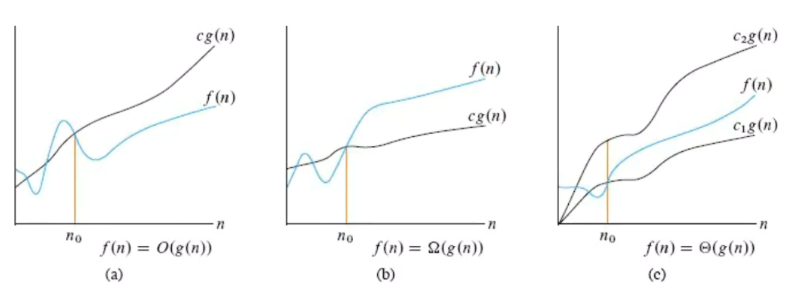

# 算法复杂度分析

在计算机中，一个算法性能的好坏受限于硬件、语言、测试数据等等的因素，因此将代码单纯“跑一次”（事后分析法）并不具有可比性。

## 时间复杂度

时间复杂度用来衡量 算法的执行，随着数据规模的增大，而增加的时间成本。

> [!NOTE] 如何表示时间复杂度呢？
>
> - 假设算法要处理的数据规模是 $n$，代码总的执行行数用函数 $f(n)$ 来表示，例如：
>   - 线性查找算法的函数是 $f(n) = 3 * n + 3$
>   - 二分查找算法的函数是 $f(n) = (floor(log_2(n))) * 5 + 4$
> - 为了对 $f(n)$ 函数进行简化，我们需要找到一个变化趋势与之相近的表示法，这就是 **[大 $O$ 表示法](#大O表示法)**。

常见的时间复杂度：

|   执行次数函数   |       阶       | 时间复杂度 | 非正式术语                                                   |
| :--------------: | :------------: | :--------: | ------------------------------------------------------------ |
|       $10$       |     $O(1)$     |   ↓ 最优   | [常数阶](https://www.freecodecamp.org/chinese/news/big-o-notation/)（时间复杂度不随着数据规模而变化） |
|  $log_2(n) + 5$  | $O(log_2(n))$  |     ⇣      | 对数阶                                                       |
|     $2n + 3$     |     $O(n)$     |     ⇣      | 线性阶                                                       |
| $2nlog_2(n) + 5$ | $O(nlog_2(n))$ |     ⇣      | 拟线性阶                                                     |
| $2n^2 + 3n + 4$  |    $O(n^2)$    |     ⇣      | 平方阶                                                       |
| $2n^3 + n^2 + 4$ |    $O(n^3)$    |     ⇣      | 立方阶                                                       |
|      $2^n$       |    $O(2^n)$    |   ↓ 最差   | 指数阶                                                       |

## 空间复杂度

空间复杂度用来衡量 算法的执行，随着数据规模的增加，而增加的额外空间成本。

常见的空间复杂度：

|  执行次数函数   |      阶       | 空间复杂度 | 非正式术语 |
| :-------------: | :-----------: | :--------: | ---------- |
|      $10$       |    $O(1)$     |   ↓ 最优   | 常数阶     |
| $log_2(n) + 5$  | $O(log_2(n))$ |     ⇣      | 对数阶     |
|    $2n + 3$     |    $O(n)$     |     ⇣      | 线性阶     |
| $2n^2 + 3n + 4$ |   $O(n^2)$    |     ⇣      | 平方阶     |
|      $2^n$      |   $O(2^n)$    |   ↓ 最差   | 指数阶     |

理想情况下，我们希望算法的时间复杂度和空间复杂度都能达到最优。但在实际情况中，同时达到最优通常都比较困难。因此，**减低时间复杂度通常需要以提升空间复杂度为代价，反之亦然**。这种思路就是“以空间换时间”，反之，则称为“以时间换空间”。

## 大O表示法

计算机科学里，大O表示法用来表示一个 **算法的上界**。它通常用输入大小的函数表示算法的最大运行时间，也可以用来表示内存占用。

如图，其中：

- $c_1$，$c_2$，$c_3$ 都为常数；
- $f(n)$ 是实际执行代码行数与 $n$ 的函数；
- $g(n)$ 是经过提取最高次项，忽略常数项和其他次要项后得到的简化函数，它的变化趋势与 $f(n)$ 基本一致；

> [!NOTE] ⛺ 图(a)：渐进上界（最坏的复杂度）
>
> 从某个常数 $n_0$ 开始，$c*g(n)$ 总是位于 $f(n)$ 上方，那么记作 $O(g(n))$。
>
> 例如：$f(n) = n^2 + 100$，从 $n_0 = 10$ 时，$g(n) = 2 * n^2$ 是它的渐进上界，记作 $O(n^2)$。

> [!NOTE] ⛺ 图(b)：渐进下界（最优的复杂度）
>
> 从某个常数 $n_0$ 开始，$c*g(n)$ 总是位于 $f(n)$ 下方，那么记作 $Ω(g(n))$。

> [!NOTE] ⛺ 图(c)：渐进紧界（既能表示最差，也能表示最优）
>
> 从某个常数 $n_0$ 开始，$f(n)$ 总是在 $c_1 * g(n)$ 和 $c_2 * g(n)$ 之间，那么记作 $Θ(g(n))$。

