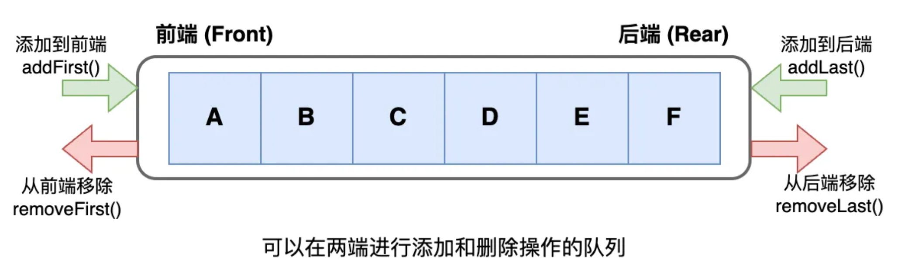

# 双端队列

双端队列（Deque）是一种 **允许在队列两端都进行插入和删除操作** 的数据结构。它既可以当作队列使用，也可以当作栈使用。

|   类型   |          对比          |       英文       |
| :------: | :--------------------: | :--------------: |
| 普通队列 |   尾部入队，头部出队   | 先进先出（FIFO） |
|    栈    | 尾部压入栈，尾部弹出栈 | 后进先出（LIFO） |
| 双端队列 | 两端都能入，两端都能出 |        /         |

> [!NOTE] 优势
>
> - **更加灵活**：既能充当栈，又能充当队列；
> - **实现滑动窗口**：特别适合需要从两端操作的滑动窗口算法；
> - **在两端操作效率更高**：无论从哪一端插入或删除，都可以达到 $O(1)$ 的时间复杂度，避免了动态数组头部需要移动大量元素的问题；
> - **语言支持上普遍且优化良好**：Java 中的 `ArrayDeque` 和 `LinkedList` 都可以作为双端队列；




## 双向链表实现

使用双向链表实现双端队列，每个节点包含前驱和后继指针。

这种实现优点是可以 **动态调整大小，不需要预先分配空间**，缺点是每个元素需要 **额外的空间存储指针，且内存不连续**。

::: code-group

```java [LinkedListDeque]
public class LinkedListDeque<E> implements Deque<E>, Iterable<E> {
  // 节点类
  static class Node<E> {
    Node<E> prev;
    E value;
    Node<E> next;

    public Node(Node<E> prev, E value, Node<E> next) {
      this.prev = prev;
      this.value = value;
      this.next = next;
    }
  }

  int size;
  int capacity;
  Node<E> sentinel = new Node<>(null, null, null); // 哨兵节点

  public LinkedListDeque(int capacity) {
    this.capacity = capacity;
    sentinel.prev = sentinel;
    sentinel.next = sentinel;
  }

  @Override
  public boolean offerFirst(E e) {
    if (isFull()) {
      return false;
    }
    Node<E> head = sentinel; // 哨兵节点当作头节点
    Node<E> tail = sentinel.next;
    Node<E> added = new Node<>(head, e, tail);
    head.next = added;
    tail.prev = added;
    size++;
    return true;
  }

  @Override
  public boolean offerLast(E e) {
    if (isFull()) {
      return false;
    }
    Node<E> tail = sentinel; // 哨兵节点当作尾节点
    Node<E> head = sentinel.prev;
    Node<E> added = new Node<>(head, e, tail);
    head.next = added;
    tail.prev = added;
    size++;
    return true;
  }

  @Override
  public E pollFirst() {
    if (isEmpty()) {
      return null;
    }
    Node<E> first = sentinel.next;
    sentinel.next = first.next;
    first.next.prev = sentinel;
    E value = first.value;
    size--;
    return value;
  }

  @Override
  public E pollLast() {
    if (isEmpty()) {
      return null;
    }
    Node<E> last = sentinel.prev;
    sentinel.prev = last.prev;
    last.prev.next = sentinel;
    E value = last.value;
    size--;
    return value;
  }

  @Override
  public E peekFirst() {
    if (isEmpty()) {
      return null;
    }
    return sentinel.next.value;
  }

  @Override
  public E peekLast() {
    if (isEmpty()) {
      return null;
    }
    return sentinel.prev.value;
  }

  @Override
  public boolean isEmpty() {
    return size == 0;
  }

  @Override
  public boolean isFull() {
    return size == capacity;
  }

  @Override
  public Iterator<E> iterator() {
    return new Iterator<>() {
      Node<E> p = sentinel.next;

      @Override
      public boolean hasNext() {
        return p != sentinel;
      }

      @Override
      public E next() {
        E value = p.value;
        p = p.next;
        return value;
      }
    };
  }
}
```

```java [Deque]
public interface Deque<E> {
  /**
   * 头部入队
   * @param e 数据
   * @return true：入队成功；false：入队失败
   */
  boolean offerFirst(E e);

  /**
   * 尾部入队
   * @param e 数据
   * @return true：入队成功；false：入队失败
   */
  boolean offerLast(E e);

  /**
   * 头部出队
   * @return 数据
   */
  E pollFirst();

  /**
   * 尾部出队
   * @return 数据
   */
  E pollLast();

  /**
   * 返回头部数据
   * @return 头部数据
   */
  E peekFirst();

  /**
   * 返回尾部数据
   * @return 尾部数据
   */
  E peekLast();

  /**
   * 判断队列是否为空
   * @return true：为空；false：不为空
   */
  boolean isEmpty();

  /**
   * 判断队列是否已满
   * @return true：已满；false：未满
   */
  boolean isFull();
}
```

:::


## 循环数组实现

使用循环数组实现双端队列，需要维护前端和后端两个指针，并在边界条件下进行循环操作。优点是空间利用率高，缺点是需要预先分配固定大小的空间。

::: code-group

```java [ArrayDeque] {11,22,33,46,59,64,69,74}
public class ArrayDeque<E> implements Deque<E>, Iterable<E> {
  private E[] array;
  private int head = 0;
  private int tail = 0;

  public ArrayDeque(int capacity) {
    array = (E[]) new Object[capacity + 1];
  }

  @Override
  public boolean offerFirst(E e) {
    if (isFull()) {
      return false;
    }
    // head指针往前走一步，再添加元素
    head = dec(head, array.length);
    array[head] = e;
    return true;
  }

  @Override
  public boolean offerLast(E e) {
    if (isFull()) {
      return false;
    }
    // 先添加元素，tail指针再往后走一步
    array[tail] = e;
    tail = inc(tail, array.length);
    return true;
  }

  @Override
  public E pollFirst() {
    if (isEmpty()) {
      return null;
    }
    E e = array[head];
    // 将引用变量置为null，帮助垃圾回收
    array[head] = null;
    // 先获取值，head再向后移动一位
    head = inc(head, array.length);
    return e;
  }

  @Override
  public E pollLast() {
    if (isEmpty()) {
      return null;
    }
    // tail先向前移动一位，再获取值
    tail = dec(tail, array.length);
    E e = array[tail];
    // 将引用变量置为null，帮助垃圾回收
    array[tail] = null;
    return e;
  }

  @Override
  public E peekFirst() {
    return isEmpty() ? null : array[head];
  }

  @Override
  public E peekLast() {
    return isEmpty() ? null : array[dec(tail, array.length)];
  }

  @Override
  public boolean isEmpty() {
    return head == tail;
  }

  @Override
  public boolean isFull() {
    if (head < tail) {
      return tail - head == array.length - 1;
    } else if (head > tail) {
      return head - tail == 1;
    } else {
      return false;
    }
  }

  @Override
  public Iterator<E> iterator() {
    return new Iterator<>() {
      int p = head;

      @Override
      public boolean hasNext() {
        return p != tail;
      }

      @Override
      public E next() {
        E e = array[p];
        p = inc(p, array.length);
        return e;
      }
    };
  }

  /**
   * 尾部添加时，防止越界
   * @param i      当前索引
   * @param length 数组长度
   * @return 当前有效索引
   */
  static int inc(int i, int length) {
    // 当数组索引越界时，重新回到索引 0 的位置
    if (i + 1 >= length) {
      return 0;
    }
    return i + 1;
  }

  /**
   * 头部添加时，防止越界
   * @param i      当前索引
   * @param length 数组长度
   * @return 当前有效索引
   */
  static int dec(int i, int length) {
    if (i - 1 < 0) {
      return length - 1;
    }
    return i - 1;
  }
}
```

```java [Deque]
public interface Deque<E> {
  /**
   * 头部入队
   * @param e 数据
   * @return true：入队成功；false：入队失败
   */
  boolean offerFirst(E e);

  /**
   * 尾部入队
   * @param e 数据
   * @return true：入队成功；false：入队失败
   */
  boolean offerLast(E e);

  /**
   * 头部出队
   * @return 数据
   */
  E pollFirst();

  /**
   * 尾部出队
   * @return 数据
   */
  E pollLast();

  /**
   * 返回头部数据
   * @return 头部数据
   */
  E peekFirst();

  /**
   * 返回尾部数据
   * @return 尾部数据
   */
  E peekLast();

  /**
   * 判断队列是否为空
   * @return true：为空；false：不为空
   */
  boolean isEmpty();

  /**
   * 判断队列是否已满
   * @return true：已满；false：未满
   */
  boolean isFull();
}
```

:::


