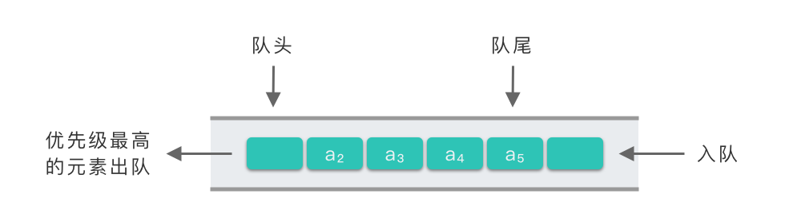

# 优先级队列

优先级队列（Priority Queue）是一种 **为每个元素分配优先级** 的特殊队列结构。每次访问或移除元素时，总是处理优先级最高的元素。

Java 中使用 `PriorityQueue` 来实现优先级队列。

> [!NOTE] 与普通队列区别
>
> - 普通队列按照 先进先出（FIFO）原则，元素按入队顺序依次出队；
> - 优先级队列根据元素的优先级决定出队顺序，遵循 **优先级高者先出** 的规则，与入队顺序无关；

::: info 常见场景

- **最短路径搜索**：如 Dijkstra 算法，优先扩展当前距离最小的节点；
- **任务调度**：根据任务优先级动态分配执行顺序；
- **事件驱动仿真**：如排队系统，优先处理最早到达或优先级最高的事件；
- **最小生成树构建**：如 Prim 算法，优先选择权值最小的边；
- **Top-K 问题**：查找第 k 大（小）元素、实时维护前 k 个高频元素等；

:::




## 无序数组实现

> [!NOTE] 优点
>
> - 无序数组 **入队操作非常快**，因为只需要将新元素插入到数组的末尾即可，时间复杂度为 $O(1)$；
>

> [!WARNING] 缺点
>
> - `poll()` **出队操作效率极低**，时间复杂度为 $O(n)$，因为数组是无需的，需要遍历整个数组查找最大（最小）值，找到后还需要将其从该数组中移除；
> - `peek()` **查看操作效率极低**，时间复杂度为 $O(n)$，即使是查看优先级最高的元素，也需要遍历整个数组来查找；

::: code-group

```java [PriorityQueue] {10,19,30,39,44,49}
public class PriorityQueue1<E extends Priority> implements Queue<E> {
  private final Priority[] array;
  private int size;

  public PriorityQueue1(int capacity) {
    array = new Priority[capacity];
  }

  @Override
  public boolean offer(E value) {
    if (isFull()) {
      return false;
    }
    array[size++] = value;
    return true;
  }

  @Override
  public E poll() {
    if (isEmpty()) {
      return null;
    }
    int max = selectMax();
    E e = (E) array[max];
    remove(max);
    return e;
  }

  @Override
  public E peek() {
    if (isEmpty()) {
      return null;
    }
    int max = selectMax();
    return (E) array[max];
  }

  @Override
  public boolean isEmpty() {
    return size == 0;
  }

  @Override
  public boolean isFull() {
    return size == array.length;
  }

  @Override
  public int size() {
    return size;
  }

  /**
   * 查找数组中优先级最高的索引
   * @return 索引值
   */
  private int selectMax() {
    int max = 0;
    for (int i = 1; i < size; i++) {
      if (array[i].priority() > array[max].priority()) {
        max = i;
      }
    }
    return max;
  }

  /**
   * 从数组中移除元素
   * @param index 索引值
   */
  private void remove(int index) {
    // 如果移除的元素不是倒数第一个元素，需要拷贝数组
    if (index < size - 1) {
      System.arraycopy(array, index + 1, array, index, size - index - 1);
    }
    // 否则如果是倒数第一个元素，size--，无法访问到最后一个元素即可
    size--;
    // 垃圾回收
    array[--size] = null;
  }
}
```

```java [Priority]
public interface Priority {
  /**
   * 返回对象的优先级，值越大，优先级越高
   * @return 优先级
   */
  int priority();
}
```

```java [Entry]
public class Entry implements Priority {
  private final String value; // 描述
  private final int priority; // 优先级值

  public Entry(String value, int priority) {
    this.value = value;
    this.priority = priority;
  }

  @Override
  public int priority() {
    return this.priority;
  }

  @Override
  public String toString() {
    return "(" + this.value + ", priority=" + this.priority + ")";
  }
}

```

```java [Queue]
public interface Queue<E> {
  /**
   * 向队列尾部插入值
   * @param value 待插入值
   * @return true：插入成功；false：插入失败
   */
  boolean offer(E value);

  /**
   * 从队列头获取值，并移除
   * @return 如果队列非空返回对列头值，否则返回null
   */
  E poll();

  /**
   * 从队列头获取值，不移除
   * @return 如果队列非空返回对列头值，否则返回null
   */
  E peek();

  /**
   * 检查队列是否为空
   * @return true：为空；false：不为空
   */
  boolean isEmpty();

  /**
   * 检查队列是否已满
   * @return true：已满；false：未满
   */
  boolean isFull();
  
  /**
   * 返回队列长度
   * @return 队列长度
   */
  int size();
}
```

```java [单元测试]
public class TestPriorityQueue1 {
  @Test
  @DisplayName("测试优先级队列-入队")
  void testOffer() {
    PriorityQueue1<Entry> queue = new PriorityQueue1<>(5);
    queue.offer(new Entry("task2", 2));
    queue.offer(new Entry("task1", 1));
    queue.offer(new Entry("task5", 5));
    queue.offer(new Entry("task3", 3));
    queue.offer(new Entry("task4", 4));

    assertFalse(queue.isEmpty());
    assertTrue(queue.isFull());
  }

  @Test
  @DisplayName("测试优先级队列-出队")
  void testPoll() {
    PriorityQueue1<Entry> queue = new PriorityQueue1<>(5);
    queue.offer(new Entry("task2", 2));
    queue.offer(new Entry("task1", 1));
    queue.offer(new Entry("task5", 5));
    queue.offer(new Entry("task3", 3));
    queue.offer(new Entry("task4", 4));

    assertEquals(5, queue.peek().priority());

    assertEquals(5, queue.poll().priority());
    assertEquals(4, queue.poll().priority());
    assertEquals(3, queue.poll().priority());
    assertEquals(2, queue.poll().priority());
    assertEquals(1, queue.poll().priority());
  }
}
```

:::


## 有序数组实现

有序数组实现优先级队列时，本质是保持数组按优先级从小到大（或从大到小）的顺序排序。

> [!NOTE] 优点
>
> - 入队操作非常快，从小到大顺序排序时，只需要往数组最后添加即可，时间复杂度是 $O(1)$；
>
> - `peek()` 查看操作非常快，因为元素按优先级排好序了，时间复杂度是 $O(1)$；

> [!WARNING] 缺点
>
> - `poll()` 出队操作效率极低，时间复杂度为 $O(n)$，出队后需要整体向后移动数据；

::: code-group

```java [PriorityQueue]
public class PriorityQueue2<E extends Priority> implements Queue<E> {
  private final Priority[] array;
  private int size;

  public PriorityQueue2(int capacity) {
    array = new Priority[capacity];
  }

  @Override
  public boolean offer(E value) {
    if (isFull()) {
      return false;
    }
    insert(value);
    size++;
    return true;
  }

  @Override
  public E poll() {
    if (isEmpty()) {
      return null;
    }
    E e = (E) array[size - 1];
    // 垃圾回收
    array[--size] = null;
    return e;
  }

  @Override
  public E peek() {
    if (isEmpty()) {
      return null;
    }
    return (E) array[size - 1];
  }

  @Override
  public boolean isEmpty() {
    return size == 0;
  }

  @Override
  public boolean isFull() {
    return size == array.length;
  }

  @Override
  public int size() {
    return size;
  }

  /**
   * 插入元素
   * @param value 待插入值
   */
  private void insert(E value) {
    int i = size - 1;
    // 当前元素的优先级比待插入元素的优先级高
    while (i >= 0 && array[i].priority() > value.priority()) {
      array[i + 1] = array[i];
      i--;
    }
    array[i + 1] = value;
  }
}
```

```java [单元测试]
public class TestPriorityQueue2 {
  @Test
  @DisplayName("测试优先级队列-入队")
  void testOffer() {
    PriorityQueue2<Entry> queue = new PriorityQueue2<>(5);
    queue.offer(new Entry("task2", 2));
    queue.offer(new Entry("task1", 1));
    queue.offer(new Entry("task5", 5));
    queue.offer(new Entry("task3", 3));
    queue.offer(new Entry("task4", 4));

    assertTrue(queue.isFull());
    assertFalse(queue.isEmpty());

    assertEquals(5, queue.size());
  }

  @Test
  @DisplayName("测试优先级队列-出队")
  void testPoll() {
    PriorityQueue2<Entry> queue = new PriorityQueue2<>(5);
    queue.offer(new Entry("task2", 2));
    queue.offer(new Entry("task1", 1));
    queue.offer(new Entry("task5", 5));
    queue.offer(new Entry("task3", 3));
    queue.offer(new Entry("task4", 4));

    assertEquals(5, queue.peek().priority());

    assertEquals(5, queue.poll().priority());
    assertEquals(4, queue.poll().priority());
    assertEquals(3, queue.poll().priority());
    assertEquals(2, queue.poll().priority());
    assertEquals(1, queue.poll().priority());
  }
}
```

:::


## 堆实现


