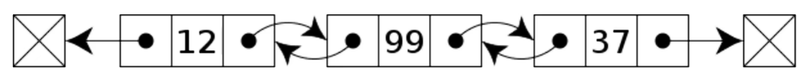
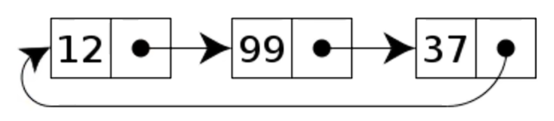

# 链表

在计算机科学中，链表（Linked List）是数据元素的线性集合，其每个元素都指向下一个元素，元素在存储上并不连续。

> [!NOTE] 链表分类
>
> - **单向链表**：每个元素只知道下一个元素是谁，尾节点指向 `null`
    >
    >   
>
> - **双向链表**：每个元素知道其上一个和下一个元素是谁，首节点和尾节点指向 `null`
    >
    >   
>
> - **循环链表**：循环链表的尾节点指向的是头节点，而不是 `null`
    >
    >   

::: info 哨兵节点

链表内还有一种特殊的节点成为 **哨兵节点**（或哑元节点），它不存储数据，通常用在链表头尾，用于简化边界判断。

:::

## 单向链表

### 插入

### 查询

### 遍历

### 删除

### 带哨兵链表

## 双向链表

### 带哨兵链表

## 双向环形链表

### 带哨兵链表

## 链表递归遍历

