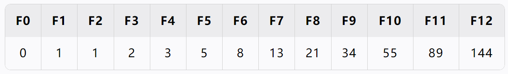
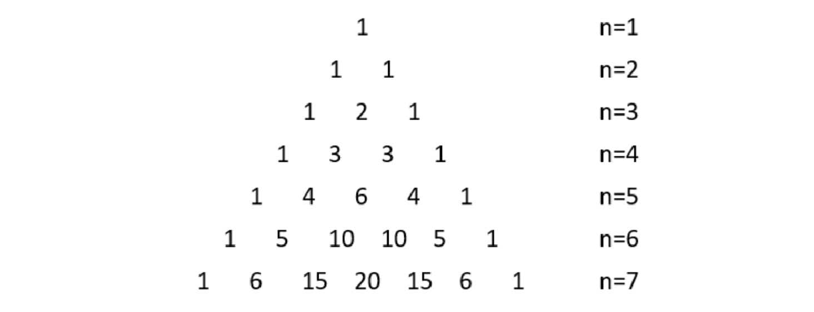

# 递归

递归（Recursion）是一种 **函数调用自身** 的编程方法。它把一个复杂问题分解为规模更小的同类问题，直到达到一个 **终止条件** 为止。


## 求阶乘

::: info 递归方式求阶乘

- 阶乘的定义 $n! = 1 · 2 · 3 ··· (n - 2) · (n - 1) · n$，其中 $n$ 为自然数，当然 $0! = 1$；

- 递推关系如下：
  $$
  f(n) =
  \begin{cases}
  1, & n = 1 \\\\
  n * f(n - 1), & n > 1
  \end{cases}
  $$

:::

```java {6}
public class Factorial {
  public static int f(int n) {
    if (n == 1) {
      return 1;
    }
    return n * f(n - 1);
  }

  public static void main(String[] args) {
    int result = f(4);
    System.out.println(result); // 24
  }
}
```


## 反向打印字符串

::: info 递归反向打印字符串

用递归反向打印字符串，n 为字符在整个字符串 str 中的索引位置。其中：

- 递：n 从 0 开始，每次 n + 1，一直递归到 n == str.length() - 1；

- 归：从 n == str.length() 开始归，从归打印，顺序就是倒序的；

- 递推关系：
  $$
  f(n) =
  \begin{cases}
  停止, & n = str.length() \\\\
  f(n + 1), & 0 <= n <= str.length() - 1
  \end{cases}
  $$

:::

```java {7}
public class ReversePrintString {
  public static void f(int n, String str) {
    if (n == str.length()) {
      return;
    }
    // 每次取字符串的第 n 个字符，然后进行输出
    f(n + 1, str);
    System.out.println(str.charAt(n));
  }

  public static void main(String[] args) {
    f(0, "abcd");
  }
}
```


## 二分查找

> [!TIP] 提示
>
> 递归二分查找就是用递归的方式，替换之前二分查找通过 `while` 循环来不断缩小 $i$ 和 $j$ 的过程。

```java {15,18}
public class E03BinarySearch {
  public static int search(int[] a, int target) {
    return f(a, target, 0, a.length - 1);
  }

  private static int f(int[] a, int target, int i, int j) {
    // 终止条件
    if (i > j) {
      return -1;
    }

    int m = (i + j) >>> 1;
    if (target < a[m]) {
      // 左半边，j减小，继续递归判断
      return f(a, target, i, m - 1);
    } else if (a[m] < target) {
      // 右半边，i增加，继续递归判断
      return f(a, target, m + 1, j);
    } else {
      return m;
    }
  }
}
```

> [!NOTE] 主定理求二分查找时间复杂度
>
> 从代码可得，子问题个数 $a=1$，子问题随数据规模缩小倍数 $b=2$（因为每次范围缩小一半），处递归外执行的计算是常数级 $c=0$，故得出公式为
> $$
> T(n) = T(\frac{n}{2}) + n^0
> $$
> 此时，$x=log_2 1 = 0 = c$，故时间复杂度为 $Θ(logn)$。


## 冒泡排序

> [!TIP] 提示
>
> 代码中的 `x` 起到一个计数的作用，每次发生交换时，就把 `i` 的值赋值给 `x` ，一轮循环结束后，`x` 的右侧就表示已排好序，左侧表示可能还存在未排好序的值。

```java {7,15,19,10}
public class E04BubbleSort {
  private static void bubble(int[] a, int j) { // j表示数组要排序的右边界
    if (j == 0) {
      return;
    }

    int x = 0;
    for (int i = 0; i < j; i++) {
      // 从第 i 个 和 第 i+1 个比较，然后交换顺序
      if (a[i] > a[i + 1]) {
        int temp = a[i];
        a[i] = a[i + 1];
        a[i + 1] = temp;
        // 只要发生了交换，就把 i 的值赋值给 x，此时 x 就是已排好序和有可能乱序的分界线
        x = i;
      }
    }
    // x 是分界线，所以下次直接右边界设置为 x，因此 x 右侧已经是排好序的了
    bubble(a, x);
  }

  public static void main(String[] args) {
    int[] array = {2, 3, 1, 5, 6, 4, 7};
    bubble(array, array.length - 1);
    System.out.println(Arrays.toString(array));
  }
}
```


## 插入排序

> [!IMPORTANT] 重要
>
> 插入排序的内容听的不是太懂，多看几次！
>
> 视频连接地址：https://www.bilibili.com/video/BV1Lv4y1e7HL?t = 1.4&p = 50

```java {30}
public class E05InsertionSort {
  public static void sort(int[] a) {
    insertion(a, 1);
  }

  /**
   * 递归函数
   * @param a   数组
   * @param low 已排好序的左边界
   */
  private static void insertion(int[] a, int low) {
    if (low == a.length) {
      return;
    }

    // 把左边界 low 的值存储起来
    int value = a[low]; // 4
    // low - 1 = 0，表示数组中的第一个元素默认认为它是拍好序的
    int i = low - 1; // 0

    while (i >= 0 && a[i] > value) {
      a[i + 1] = a[i];
      i--;
    }
    if (i + 1 != low) {
      // 退出循环的时候，就表示 i 处的值比 value 要小，所以 value 插入到 i + 1 的位置
      a[i + 1] = value;
    }

    insertion(a, low + 1);
  }

  public static void main(String[] args) {
    int[] a = {2, 4, 5, 10, 7, 1};
    sort(a);
    System.out.println(Arrays.toString(a));
  }
}
```


## 斐波那契数列

>之前的例子中，每个递归函数中只包含了一个自身的调用，这种称之为 **单路递归**。而像下面的递归求斐波那契数列中，递归函数被自身调用了两次，这种称之为 **多路递归**。

::: info 递归求斐波那契数列

递归关系：
$$
f(n) =
\begin{cases}
0 & n = 0 \\\\
1 & n = 1 \\\\
f(n - 1) + f(n + 1) & n > 1
\end{cases}
$$
下面表格列出了数列的前几项：



:::

```java
public class E06Fibonacci {
  public static int f(int n) {
    if (n == 0) {
      return 0;
    }
    if (n == 1) {
      return 1;
    }

    int x = f(n - 1);
    int y = f(n - 2);
    return x + y;
  }

  public static void main(String[] args) {
    int f = f(6);
    System.out.println("f = " + f); // 8
  }
}
```


### 记忆法优化

记忆法（Memoization）是一种通过 **存储已计算结果的优化技术**，避免重复计算相同子问题。它主要用于优化递归算法，特别是具有重叠子问题特性的算法。

::: code-group

```java [参数方式] {4,13,19}
public class E06Fibonacci {
  public static int fibonacci(int n) {
    // 缓存数组，大小为 n+1，因为存储从0到n的所有结果
    int[] cache = new int[n + 1]; 
    Arrays.fill(cache, -1); // 数组元素填充为-1，如果
    cache[0] = 0;
    cache[1] = 1;
    return f1(n, cache);
  }

  public static int f1(int n, int[] cache) {
    // 如果结果已经计算过，直接返回缓存值
    if (cache[n] != -1) {
      return cache[n];
    }
    int x = f1(n - 1, cache);
    int y = f1(n - 2, cache);
    // 将计算结果存入缓存，供后续使用（n正好就是数组的第n项）
    cache[n] = x + y;
    return cache[n];
  }

  public static void main(String[] args) {
    int f = fibonacci(5);
    System.out.println(f); // 5
  }
}
```

```java [静态方式]
public class E06Fibonacci2 {
  // 静态缓存，全局使用同一个数组
  private static int[] cache = null;

  public static int fibonacci(int n) {
    if (cache == null) {
      cache = new int[n + 1];
      Arrays.fill(cache, -1);
      cache[0] = 0;
      cache[1] = 1;
    }

    if (cache[n] != -1) {
      return cache[n];
    }

    int x = fibonacci(n - 1);
    int y = fibonacci(n - 2);
    cache[n] = x + y;
    return cache[n];
  }

  public static void main(String[] args) {
    int f = fibonacci(5);
    System.out.println(f); // 5
  }
}
```

:::


## 求递归时间复杂度

### 主定理

主定理（Master Theorem）提供了一种“菜谱式”的方法，用于求解形如
$$
T(n) = a ⋅ T(\frac{n}{b}) + f(n)
$$
的递归方程的时间复杂度。其中：

- $a >= 1$，表示子问题个数；
- $b > 1$，表示子问题缩小的倍数；
- $f(n)$ 是非递归部分的代价；

令 $x=log_ba$，即 $x=log_{\text{子问题缩小倍数}} 子问题个数$，则
$$
f(n) =
\begin{cases}
Θ(n^x) & f(n) = O(n^c) 并且 c < x \\\\
Θ(n^xlogn) & f(n) = Θ(n^x) 并且 c = x \\\\
Θ(n^c) & f(n) = Ω(n^c) 并且 c > x
\end{cases}
$$
> [!WARNING] 注意
>
> 主定理只能求解符合该公式的算法，但如 斐波那契数列、例 6 的快速排序、递归求和等，它并不符合主定理公式，所以不能使用主定理求时间复杂度！


::: info 例 1

若 $T(n) = 2T(\frac{n}{2}) + n^4$，此时的时间复杂多为多少？

解析：

- 此时 $a=2, b=2, c=4$，则 $x=log_22 = 1$，由于 $x < c$，故对照上面 $f(n)$ 的公式可知，时间复杂度为 $Θ(n^4)$。

::: 

::: info 例 2

若 $T(n) = 16T(\frac{n}{4}) + n^2$，此时的时间复杂多为多少？

解析：

- 此时 $a=16, b=4, c=2$，则 $x=log_416 = 2$，由于 $x = c$，故对照上面 $f(n)$ 的公式可知，时间复杂度为 $Θ(n^2logn)$。

::: 

::: info 例 3

若 $T(n) = T(\frac{7n}{10}) + n$，此时的时间复杂多为多少？

解析：

- 此时 $a=1, b=\frac{10}{7}, c=1$，则 $x=log_\frac{10}{7}1 = 0$，由于 $x < c$，故对照上面 $f(n)$ 的公式可知，时间复杂度为 $Θ(n)$。

::: 

::: info 例 4

若 $T(n) = 7T(\frac{n}{2}) + n^2$，此时的时间复杂多为多少？

解析：

- 此时 $a=7, b=2, c=2$，则 $x=log_27 ≈ 2.80735$ ，由于 $x > c$，故对照上面 $f(n)$ 的公式可知，时间复杂度为 $Θ(n^{log_2 7})$。

::: 

::: info 例 5：归并排序时间复杂度

```java
void split(B[], i, j, A[]) 
{
  if (j - i <= 1) return;
  m = (i + j) / 2;
  
  // 递归
  split(A, i, m, B);
  split(A, m, j, B);
  // 合并
  merge(B, i, m, j, A);
}
```

解析：

- 此时 $a=2,b=2,c=1$，除递归外，其他时间花在 合并操作 上，它可以用 $f(n) = n$ 表示，则公式为
  $$
  T(n) = 2T(\frac{n}{2}) + n
  $$

- 则 $x=log_2 2=1=c$，故时间复杂度为 $Θ(n logn)$。

:::

> [!CAUTION] 例 6：快速排序时间复杂度
>
> ```python
> algorithm quicksort(A, lo, hi) is
>   if lo >= hi || lo < 0 then
>     return
>   
>   // 分区
>   p := partition(A, lo, hi)
>   
>   // 递归
>   quicksort(A, lo, p - 1)
>   quicksort(A, p + 1, hi)
> ```
>
> 解析：
>
> - 子问题个数 $a=2$
> - 子问题规模虽小倍数
>   - 如果分区分的好，如 $b=2$，此时 $T(n) = 2T(\frac{n}{2}) + n$，求得 $x=c=1$，故时间复杂度为 $Θ(nlogn)$；
>   - 如果分区分的不好，例如分区 1 的数据是 0，而分区 2 的数据是 $n-1$，此时 $T(n) = T(n-1) + T(1) + n$，就不能用主定理求解；
> - 除递归外，其他时间花费在分区上，它可以用 $f(n)=n$ 表示


### 展开式

展开式法求时间复杂度的基本思想是：

1. 将递归式 **反复展开**，直到达到递归基础情况
2. 观察展开后的 **模式**（通常表示为一棵树或一个求和式）
3. 计算整个展开式的 **总工作量**
4. 用 **渐进符号** 表示结果


::: info 例1：递归求和时间复杂度

```java
long sum(long n)
{
  if (n == 1) return 1;
  return n + sum(n - 1);
}
```

解析：

- 此时 $T(n)=T(n-1)+c$，其中，$T(1)=c$，将该公式展开：
  - $T(n)=T(n-2)+c+c$
  - $T(n)=T(n-3)+c+c+c$
  - …
  - $T(n)=T(1)+(n-1)c = c+(n-1)c = cn$（舍弃掉常数项）

- 故得出时间复杂度为 $O(n)$。

:::


## 杨辉三角形



```java {14}
public class E08PascalTriangle {

  /**
   * 计算杨辉三角形某行某列处的值
   * @param i 行
   * @param j 列
   * @return i行j列处的值
   */
  private static int element(int i, int j) {
    if (j == 0 || i == j) {
      return 1;
    }
    // [i][j] = [i - 1][j - 1] + [i - 1][j]
    return element(i - 1, j - 1) + element(i - 1, j);
  }

  /**
   * 打印杨辉三角形
   * @param n 几行
   */
  private static void print(int n) {
    for (int i = 0; i < n; i++) {
      // 打印杨辉三角形缩进
      printSpace(n, i);
      for (int j = 0; j <= i; j++) {
        System.out.printf("%-4d", element(i, j));
      }
      // 打印换行
      System.out.println();
    }
  }

  /**
   * 打印杨辉三角形行的缩进
   * @param n 行数
   * @param i 第几行
   */
  private static void printSpace(int n, int i) {
    int nums = (n - 1 - i) * 2;
    for (int j = 0; j < nums; j++) {
      System.out.print(" ");
    }
  }

  public static void main(String[] args) {
    int nums = 7;
    print(nums);
  }
}
```

