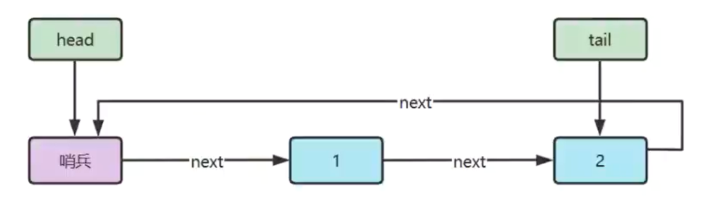
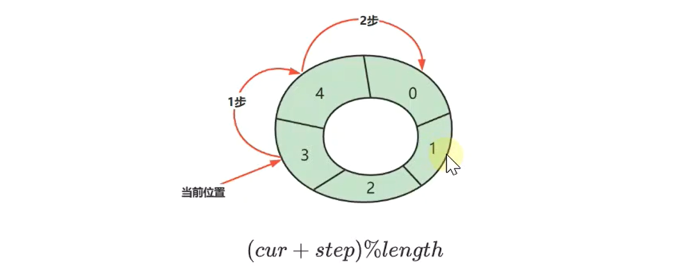

# 队列

队列（Queue）是数据结构中一种 **特殊的线性表**，它遵循“**先进先出**”的原则。

特殊地，队列只允许在表的前端（队头）进行删除操作，在表的后端（队尾）进行插入操作。队列中没有元素时，称为空队列。

> [!NOTE] 队列的优势
>
> - **保证顺序性**：队列遵循先进先出，天然适合需要按顺序处理数据的场景；
> - **操作高效**：入队和出队操作都只涉及队尾和队头，通常时间复杂度为 $O(1)$；
> - **节省空间**：链式队列根据需要动态分配内存，不像顺序队列那样容易数组容量溢出或浪费；
> - **支持异步和流式处理**：队列可作为缓存或消息中间件，在分布式系统、异步任务处理等场景实用；

|  |  |
| :---------------------------------------: | :---------------------------------------: |


## 环形链表实现

使用环形链表实现队列的好处在于可提升操作的灵活度和稳定性，尤其在需要 **频繁在队头、队尾增删元素** 的场景。

> [!NOTE] 优势
>
> - **时间复杂度低**：队头队尾操作只需要维护 `head` 和 `tail`，时间复杂度都能做到 $O(1)$；
> - **扩容成本为零**：不像顺序队列（数组实现）可能需要扩容、搬迁数据，链表天然动态扩展，无需重新开辟更大的空间；
> - **避免“假溢出问题”**：基于数组的队列在未循环处理时，会出现前面空间空闲但无法写入的情况，而链表不会；
> - **可稳定地处理大数据量**：大数据场景下，链表不会因为一次扩容而导致卡顿，而数组扩容成本高且不稳定；



::: code-group

```java [LinkedListQueue] {29,42,57,65,70}
public class LinkedListQueue<E> implements Queue<E>, Iterable<E> {
  // 节点类
  private static class Node<E> {
    E value;
    Node<E> next;

    public Node(E value, Node<E> next) {
      this.value = value;
      this.next = next;
    }
  }

  private Node<E> head = new Node<>(null, null); // 哨兵节点
  private Node<E> tail = head; // 尾节点
  private int size = 0; // 队列当前数量
  private int capacity = Integer.MAX_VALUE; // 队列最大容量

  public LinkedListQueue() {
    // 默认尾节点指向头节点
    tail.next = head;
  }

  public LinkedListQueue(int capacity) {
    this.capacity = capacity;
    tail.next = head;
  }

  @Override
  public boolean offer(E value) {
    // 队列已经满了，直接返回 false
    if (isFull()) {
      return false;
    }
    Node<E> added = new Node<>(value, head);
    tail.next = added;
    tail = added;
    size++;
    return true;
  }

  @Override
  public E poll() {
    if (isEmpty()) {
      return null;
    }
    Node<E> first = head.next;
    head.next = first.next;
    // 只有一个节点时，要把尾节点指向头节点
    if (first == tail) {
      tail = head;
    }
    size--;
    return first.value;
  }

  @Override
  public E peek() {
    if (isEmpty()) {
      return null;
    }
    return head.next.value;
  }

  @Override
  public boolean isEmpty() {
    return head == tail;
  }

  @Override
  public boolean isFull() {
    return size == capacity;
  }

  @Override
  public Iterator<E> iterator() {
    return new Iterator<>() {
      Node<E> p = head.next;

      @Override
      public boolean hasNext() {
        return p != head;
      }

      @Override
      public E next() {
        E value = p.value;
        p = p.next;
        return value;
      }
    };
  }
}
```

```java [Queue]
public interface Queue<E> {
  /**
   * 向队列尾部插入值
   * @param value 待插入值
   * @return true：插入成功；false：插入失败
   */
  boolean offer(E value);

  /**
   * 从队列头获取值，并移除
   * @return 如果队列非空返回对列头值，否则返回null
   */
  E poll();

  /**
   * 从队列头获取值，不移除
   * @return 如果队列非空返回对列头值，否则返回null
   */
  E peek();

  /**
   * 检查队列是否为空
   * @return true：为空；false：不为空
   */
  boolean isEmpty();

  /**
   * 检查队列是否已满
   * @return true：已满；false：未满
   */
  boolean isFull();
}
```

```java [单元测试]
public class TestLinkedListQueue {
  @Test
  @DisplayName("测试链表队列-offer方法")
  void testOffer() {
    LinkedListQueue<Integer> queue = new LinkedListQueue<>(3);
    queue.offer(1);
    queue.offer(2);
    queue.offer(3);
    assertFalse(queue.offer(4));
    assertFalse(queue.offer(5));

    assertIterableEquals(List.of(1, 2, 3), queue);
  }

  @Test
  @DisplayName("测试链表队列-poll方法")
  void testPoll() {
    LinkedListQueue<Integer> queue = new LinkedListQueue<>(3);
    assertNull(queue.poll());

    queue.offer(1);
    queue.offer(2);
    queue.offer(3);
    assertEquals(1, queue.poll());
    assertEquals(2, queue.poll());
    assertEquals(3, queue.poll());

    assertNull(queue.poll());
  }

  @Test
  @DisplayName("测试链表队列-peek方法")
  void testPeek() {
    LinkedListQueue<Integer> queue = new LinkedListQueue<>(3);
    assertNull(queue.peek());

    queue.offer(1);
    queue.offer(2);
    queue.offer(3);
    assertEquals(1, queue.peek());
    assertEquals(1, queue.peek());
  }

  @Test
  @DisplayName("测试链表队列-isEmpty方法")
  void testIsEmpty() {
    LinkedListQueue<Integer> queue = new LinkedListQueue<>(1);
    assertTrue(queue.isEmpty());

    queue.offer(1);
    assertFalse(queue.isEmpty());
  }

  @Test
  @DisplayName("测试链表队列-isFull方法")
  void testIsFull() {
    LinkedListQueue<Integer> queue = new LinkedListQueue<>(1);
    assertFalse(queue.isFull());

    queue.offer(1);
    assertTrue(queue.isFull());
  }

  @Test
  @DisplayName("测试链表队列-iterator方法")
  void testIterator() {
    LinkedListQueue<Integer> queue = new LinkedListQueue<>(3);
    queue.offer(1);
    queue.offer(2);
    queue.offer(3);

    for (Integer value : queue) {
      System.out.println(value);
    }
  }
}
```

:::


## 环形数组实现

使用环形数组实现队列的好处在于 **利用固定空间实现高效的循环队列**，避免数据搬移带来的开销。

> [!NOTE] 优势
>
> - **避免元素移动**：常规数组实现的队列在出队时，需要整体往前搬移，时间复杂度为 $O(n)$。而环形数组通过 **模运算** 控制头指针和尾指针，不需要移动元素，时间复杂度为 $O(1)$；
> - **空间利用率高**：环形结构使队列首尾相连，所有空闲空间都能循环利用；
> - **不依赖动态扩容**：只要指定好队列容量，就能稳定运行，非常适合内存受限、实时性要求高的系统；
> - **缓存友好**：数组连续存储有利于 CPU 缓存，提高访问速度，比链表队列更快；

> [!IMPORTANT] 下标计算
>
> 环形数组没有结束，可以无限的循环下去，因此下标计算很重要。
>
> 
>
> 例如，数组长度是 5，当前位置是 3，往前走 2 步，此时下标为 $(3 + 2) \% 5 = 1$。


::: code-group

```java [ArrayQueue]
public class ArrayQueue<E> implements Queue<E>, Iterable<E> {
  private final E[] array;
  private int head = 0;
  private int tail = 0;
  private int size = 0;

  @SuppressWarnings("all")
  public ArrayQueue(int capacity) {
    this.array = (E[]) new Object[capacity];
  }

  @Override
  public boolean offer(E value) {
    if (isFull()) {
      return false;
    }
    array[tail] = value;
    // 尾指针向后移动一位，避免指针超过数组长度，这里需要对其进行模运算
    tail = (tail + 1) % array.length;
    size++;
    return true;
  }

  @Override
  public E poll() {
    if (isEmpty()) {
      return null;
    }
    E value = array[head];
    // 头指针向后移动一位，避免指针超过数组长度，这里需要对其进行模运算
    head = (head + 1) % array.length;
    size--;
    return value;
  }

  @Override
  public E peek() {
    return isEmpty() ? null : array[head];
  }

  @Override
  public boolean isEmpty() {
    return size == 0;
  }

  @Override
  public boolean isFull() {
    return size == array.length;
  }

  @Override
  public Iterator<E> iterator() {
    return new Iterator<>() {
      int p = head;
      int count = 0;

      @Override
      public boolean hasNext() {
        return count < size;
      }

      @Override
      public E next() {
        E value = array[p];
        p = (p + 1) % array.length;
        count++;
        return value;
      }
    };
  }
}
```

```java [Queue]
public interface Queue<E> {
  /**
   * 向队列尾部插入值
   * @param value 待插入值
   * @return true：插入成功；false：插入失败
   */
  boolean offer(E value);

  /**
   * 从队列头获取值，并移除
   * @return 如果队列非空返回对列头值，否则返回null
   */
  E poll();

  /**
   * 从队列头获取值，不移除
   * @return 如果队列非空返回对列头值，否则返回null
   */
  E peek();

  /**
   * 检查队列是否为空
   * @return true：为空；false：不为空
   */
  boolean isEmpty();

  /**
   * 检查队列是否已满
   * @return true：已满；false：未满
   */
  boolean isFull();
}
```

```java [单元测试]
public class TestArrayQueue {
  @Test
  @DisplayName("测试数组队列-offer方法")
  void testOffer() {
    ArrayQueue<Integer> queue = new ArrayQueue<>(3);
    queue.offer(1);
    queue.offer(2);
    queue.offer(3);
    assertFalse(queue.offer(4));
    assertFalse(queue.offer(5));

    assertIterableEquals(List.of(1, 2, 3), queue);
  }

  @Test
  @DisplayName("测试数组队列-poll方法")
  void testPoll() {
    ArrayQueue<Integer> queue = new ArrayQueue<>(3);
    assertNull(queue.poll());

    queue.offer(1);
    queue.offer(2);
    queue.offer(3);
    assertEquals(1, queue.poll());
    assertEquals(2, queue.poll());
    assertEquals(3, queue.poll());

    assertNull(queue.poll());
  }

  @Test
  @DisplayName("测试数组队列-peek方法")
  void testPeek() {
    ArrayQueue<Integer> queue = new ArrayQueue<>(3);
    assertNull(queue.peek());

    queue.offer(1);
    queue.offer(2);
    queue.offer(3);
    assertEquals(1, queue.peek());
    assertEquals(1, queue.peek());
  }

  @Test
  @DisplayName("测试数组队列-isEmpty方法")
  void testIsEmpty() {
    ArrayQueue<Integer> queue = new ArrayQueue<>(1);
    assertTrue(queue.isEmpty());

    queue.offer(1);
    assertFalse(queue.isEmpty());
  }

  @Test
  @DisplayName("测试数组队列-isFull方法")
  void testIsFull() {
    ArrayQueue<Integer> queue = new ArrayQueue<>(1);
    assertFalse(queue.isFull());

    queue.offer(1);
    assertTrue(queue.isFull());
  }

  @Test
  @DisplayName("测试数组队列-iterator方法")
  void testIterator() {
    ArrayQueue<Integer> queue = new ArrayQueue<>(3);
    queue.offer(1);
    queue.offer(2);
    queue.offer(3);

    for (Integer value : queue) {
      System.out.println(value);
    }
  }
}
```

:::


## 二叉树层序遍历


