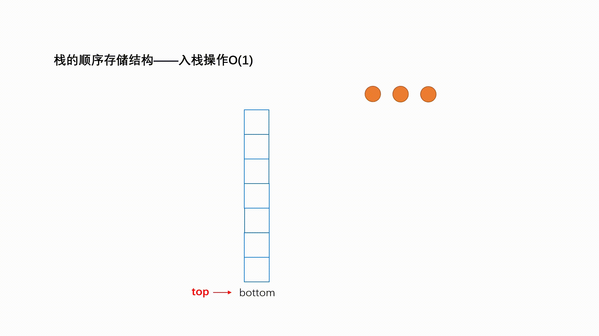
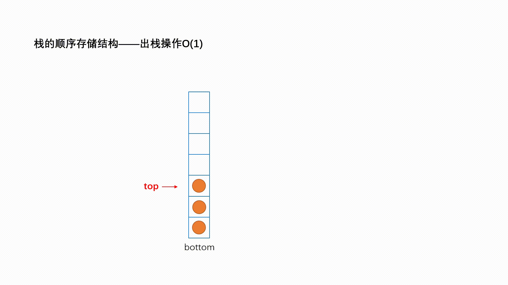

# 栈

栈（Stack）是一种 **运算受限的线性表**，仅在表尾进行插入和删除操作的线性表，它遵循“**后进先出**”的原则。

其中，进行插入和删除的这一端被称为 **栈顶**，另一端被称为 **栈底**。向一个栈插入新元素的过程又被称为 **进栈**（入栈、压栈），从一个栈删除元素又被称为 **出栈** （退栈）。

> [!NOTE] 栈的优势
>
> - **操作简单且高效**：入栈和出栈都只操作栈顶元素，因此时间复杂度为 $O(1)$；
> - **占用空间可控**：链式栈可动态扩展，不会浪费固定数组空间；
> - **方便实现逆序操作**：比如字符串逆序、表达式求值等；
> - **自然支持递归和回溯**：编程中递归本质上就是利用栈存储函数调用信息，算法中常用于回溯问题（如迷宫、八皇后）；

|  |  |
| :---------------------------------------: | :---------------------------------------: |


## 链表实现栈

链表实现的栈适用于数据规模变化大、不适合预留大量连续内存的场景。而数组栈更适合固定规模、高访问局部性需求的场景。

> [!NOTE] 优势
>
> - **无需预先分配固定内存**：链表栈根据 `push` 动态申请节点，不浪费空间，也不存在扩容成本，而数组栈通常需要指定容量；
> - **内存利用率更高**：链表栈只为当前存储的元素分配节点，多余空间不会占用，对数据规模不确定、经常变化的场景更友好；
> - **不会发生栈满**：链表只要还有内存就能继续入栈，而数组栈容量固定，会出现上溢现象；
> - **插入、删除操作更稳定**：`push` / `pop` 只操作表头节点，时间复杂度为 $O(1)$，无需移动数据或检查扩容；

::: code-group

```java [LinkedListStack] {21,31,42,50,55}
public class LinkedListStack<E> implements Stack<E>, Iterable<E> {
  static class Node<E> {
    E value;
    Node<E> next;

    public Node(E value, Node<E> next) {
      this.value = value;
      this.next = next;
    }
  }

  private int size;
  private int capacity;
  private final Node<E> head = new Node<>(null, null); // 哨兵节点

  public LinkedListStack(int capacity) {
    this.capacity = capacity;
  }

  @Override
  public boolean push(E value) {
    if (isFull()) {
      return false;
    }
    head.next = new Node<>(value, head.next);
    size++;
    return true;
  }

  @Override
  public E pop() {
    if (isEmpty()) {
      return null;
    }
    Node<E> first = head.next;
    head.next = first.next;
    size--;
    return first.value;
  }

  @Override
  public E peek() {
    if (isEmpty()) {
      return null;
    }
    return head.next.value;
  }

  @Override
  public boolean isEmpty() {
    return size == 0;
  }

  @Override
  public boolean isFull() {
    return size == capacity;
  }

  @Override
  public int size() {
    return size;
  }

  @Override
  public Iterator<E> iterator() {
    return new Iterator<>() {
      Node<E> p = head.next;

      @Override
      public boolean hasNext() {
        return p != null;
      }

      @Override
      public E next() {
        E value = p.value;
        p = p.next;
        return value;
      }
    };
  }
}
```

```java [Stack]
public interface Stack<E> {
  /**
   * 向栈顶压入元素
   * @param value 待压入值
   * @return true：压入成功；false：压入失败
   */
  boolean push(E value);

  /**
   * 从栈顶弹出元素
   * @return 栈非空返回栈顶元素，栈为空返回null
   */
  E pop();

  /**
   * 返回栈顶元素，不弹出
   * @return 栈非空返回栈顶元素，栈为空返回null
   */
  E peek();

  /**
   * 判断栈是否为空
   * @return true：空；false：不为空
   */
  boolean isEmpty();

  /**
   * 判断栈是否已满
   * @return true：已满；false：未满
   */
  boolean isFull();
  
  /**
   * 栈中元素个数
   * @return 元素个数
   */
  int size();
}
```

```java [单元测试]
@Test
@DisplayName("测试链表实现栈-添加元素")
void testPush() {
  LinkedListStack<Integer> stack = new LinkedListStack<>(3);
  stack.push(1);
  stack.push(2);
  stack.push(3);

  assertFalse(stack.push(4));

  assertIterableEquals(List.of(3, 2, 1), stack);
}

@Test
@DisplayName("测试链表实现栈-弹出元素")
void testPop() {
  LinkedListStack<Integer> stack = new LinkedListStack<>(3);
  stack.push(1);
  stack.push(2);
  stack.push(3);

  assertEquals(3, stack.pop());
  assertEquals(2, stack.pop());
  assertEquals(1, stack.pop());

  assertNull(stack.pop());
}
```

:::


## 数组实现栈

数组实现的栈更快、省内存，适合规模稳定且要求高性能的场景。

> [!NOTE] 优势
>
> - **访问速度更快**：数组存储连续，CPU缓存命中率高，`push` / `pop` 操作更快，对比链表栈需要频繁操作指针，数组栈更轻量；
> - **内存开销小**：数组只存储数据本身，不需要额外指针字段；
> - **实现更简单**：用一个 `top` 指针即可，不涉及动态节点分配；
> - **适合规模已知的场景**：如果栈大小固定、可预测，数组一次性分配即可，使用更高效；

::: code-group

```java [ArrayStack] {11,20,25,31,36,41}
public class ArrayStack<E> implements Stack<E>, Iterable<E> {
  private final E[] array;
  private int top = 0;

  @SuppressWarnings("all")
  public ArrayStack(int capacity) {
    this.array = (E[]) new Object[capacity];
  }

  @Override
  public boolean push(E value) {
    if (isFull()) {
      return false;
    }
    array[top++] = value;
    return true;
  }

  @Override
  public E pop() {
    return isEmpty() ? null : array[--top];
  }

  @Override
  public E peek() {
    // top是会向后移动一位的，所以栈顶元素要 top - 1
    return isEmpty() ? null : array[top - 1];
  }

  @Override
  public boolean isEmpty() {
    return top == 0;
  }

  @Override
  public boolean isFull() {
    return top == array.length;
  }

  @Override
  public int size() {
    return top;
  }

  @Override
  public Iterator<E> iterator() {
    return new Iterator<>() {
      int p = top;

      @Override
      public boolean hasNext() {
        return p > 0;
      }

      @Override
      public E next() {
        return array[--p];
      }
    };
  }
}
```

```java [Stack]
public interface Stack<E> {
  /**
   * 向栈顶压入元素
   * @param value 待压入值
   * @return true：压入成功；false：压入失败
   */
  boolean push(E value);

  /**
   * 从栈顶弹出元素
   * @return 栈非空返回栈顶元素，栈为空返回null
   */
  E pop();

  /**
   * 返回栈顶元素，不弹出
   * @return 栈非空返回栈顶元素，栈为空返回null
   */
  E peek();

  /**
   * 判断栈是否为空
   * @return true：空；false：不为空
   */
  boolean isEmpty();

  /**
   * 判断栈是否已满
   * @return true：已满；false：未满
   */
  boolean isFull();
  
  /**
   * 栈中元素个数
   * @return 元素个数
   */
  int size();
}
```

```java [单元测试]
public class TestLinkedListStack {
  @Test
  @DisplayName("测试链表实现栈-添加元素")
  void testPush() {
    LinkedListStack<Integer> stack = new LinkedListStack<>(3);
    stack.push(1);
    stack.push(2);
    stack.push(3);

    assertFalse(stack.push(4));

    assertIterableEquals(List.of(3, 2, 1), stack);
  }

  @Test
  @DisplayName("测试链表实现栈-弹出元素")
  void testPop() {
    LinkedListStack<Integer> stack = new LinkedListStack<>(3);
    stack.push(1);
    stack.push(2);
    stack.push(3);

    assertEquals(3, stack.pop());
    assertEquals(2, stack.pop());
    assertEquals(1, stack.pop());

    assertNull(stack.pop());
  }

  @Test
  @DisplayName("测试链表实现栈-弹出元素")
  void testPeek() {
    LinkedListStack<Integer> stack = new LinkedListStack<>(3);
    stack.push(1);
    stack.push(2);
    stack.push(3);

    assertEquals(3, stack.peek());
    assertEquals(3, stack.peek());
    assertEquals(3, stack.peek());
  }

  @Test
  @DisplayName("测试链表实现栈-是否为空")
  void testIsEmpty() {
    LinkedListStack<Integer> stack = new LinkedListStack<>(3);
    assertTrue(stack.isEmpty());

    stack.push(1);
    stack.push(2);
    stack.push(3);
    assertFalse(stack.isEmpty());
    assertTrue(stack.isFull());

    assertEquals(3, stack.size());
  }

  @Test
  @DisplayName("测试链表实现栈-遍历")
  void testForEach() {
    LinkedListStack<Integer> stack = new LinkedListStack<>(3);
    stack.push(1);
    stack.push(2);
    stack.push(3);

    for (Integer value : stack) {
      System.out.println(value);
    }
  }
}
```

:::


## 双栈模拟队列

```tex
┌─────────────────────────────────────────┐
│             双栈模拟队列结构               │
├─────────────────────────────────────────┤
│  栈s1 (用于出队)       栈s2 (用于入队)      │
│  ┌─────┐              ┌─────┐           │
│  │  c  │ ← 顶         │  a  │ ← 顶       │
│  ├─────┤              ├─────┤           │
│  │  b  │              │  b  │           │
│  ├─────┤              ├─────┤           │
│  │  a  │ ← 底         │  c  │ ← 底       │
│  └─────┘              └─────┘           │
│   队列头                队列尾             │
│  (出队端)              (入队端)            │
└─────────────────────────────────────────┘
```

::: code-group

```java [MyQueue]
class MyQueue {
  ArrayStack<Integer> s1 = new ArrayStack<>(100);
  ArrayStack<Integer> s2 = new ArrayStack<>(100);

  public MyQueue() {
  }

  public void push(int x) {
    s2.push(x);
  }

  public int pop() {
    // 当 s1 栈中为空时，才把 s2 栈中的元素拷贝过去
    if (s1.isEmpty()) {
      while (!s2.isEmpty()) {
        s1.push(s2.pop());
      }
    }
    return s1.pop();
  }

  public int peek() {
    if (s1.isEmpty()) {
      while (!s2.isEmpty()) {
        s1.push(s2.pop());
      }
    }
    return s1.peek();
  }

  public boolean empty() {
    return s1.isEmpty() && s2.isEmpty();
  }
}
```

```java [测试案例]
public static void main(String[] args) {
  MyQueue myQueue = new MyQueue();
  myQueue.push(1);
  myQueue.push(2);
  myQueue.push(3);
  myQueue.push(4);
  System.out.println(myQueue.pop()); // 1
  myQueue.push(5);
  System.out.println(myQueue.pop()); // 2
  System.out.println(myQueue.pop()); // 3
  System.out.println(myQueue.pop()); // 4
  System.out.println(myQueue.pop()); // 5
}
```

:::


## 单队列模拟栈

::: code-group

```java [MyStack] {11}
class MyStack {
  ArrayQueue2<Integer> queue = new ArrayQueue2<>(100);

  public MyStack() {
  }

  public void push(int x) {
    queue.offer(x);
    // 循环将队列内已有的元素，重新添加到队列尾部
    for (int i = 1; i < queue.size(); i++) {
      queue.offer(queue.poll());
    }
  }

  public int pop() {
    return queue.poll();
  }

  public int top() {
    return queue.peek();
  }

  public boolean empty() {
    return queue.isEmpty();
  }
}

```

```java [测试案例]
public static void main(String[] args) {
  MyStack myStack = new MyStack();
  myStack.push(1);
  myStack.push(2);
  System.out.println(myStack.top()); // 2
  System.out.println(myStack.pop()); // 2
  System.out.println(myStack.empty()); // false
}
```

:::

