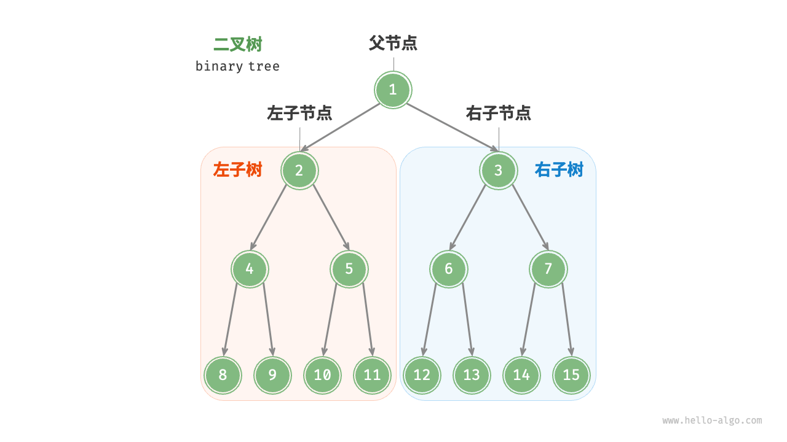

# 二叉树

二叉树（Binary Tree）是一种 **非线性数据结构**，代表“祖先”与“后代”之间的派生关系，体现了“一分为二”的分治逻辑。其中每个节点最多只能有两个子节点，分别称为 **左子节点** 和 **右子节点**。

它是树结构中最基础、最重要的一类，很多高级结构（如堆、二叉搜索树、红黑树）都是从它演化出去的。

> [!IMPORTANT] 二叉树常见类型
>
> - **满二叉树**（Full Binary Tree）：每个节点要么有 0 个孩子，要么有 2 个孩子；
> - **完全二叉树**（Complete Binary Tree）：从上到下、从左到右依次填满，堆就是典型的完全二叉树；
> - **二叉搜索树**（BST）：满足 左子树 < 根节点 < 右子树，用于快速查找、插入、删除；
> - **平衡二叉树**（Balanced Tree）：左右子树高度差保持在合理范围，访问效率更稳定；

> [!NOTE] 二叉树优势
>
> - **结构灵活，适合表达层级关系**：如组织结构、文件目录、语法树等；
> - **容易进行快速查找和更新**：如二叉搜索树，平均时间复杂度可做到 $O(logn)$；
> - **可支持多种遍历方式**：根 ➜ 左 ➜ 右、左 ➜ 根 ➜ 右、左 ➜ 右 ➜ 根、自顶向下等等；




## 二叉树遍历

二叉树遍历可以分为 2 种：

- **广度优先遍历**（Breadth-First Search）
- **深度优先遍历**（Depth-First Search）


### 广度优先遍历

广度优先遍历（BFS）是指 从起点开始，先访问离起点最近的节点，再一层一层往外扩散。

> [!NOTE] 适用场景
>
> - 最短路径（无权图）
> - 按层统计（如二叉树层序遍历）
> - 状态扩散问题（迷宫、棋盘、病毒传播）

```tex
        	1
        /   \
     	 2     3
      /     / \
     4     5   6

如上所述的二叉树，使用广度优先遍历后的结果是：
1 2 3 4 5 6
```

代码实现可参照 [队列-二叉树层序遍历](https://cwt113.github.io/geomind/backend/java/data-structure/basic-structure/6.队列#二叉树层序遍历)。


### 深度优先遍历

深度优先遍历（DFS）是指 从起点开始，一条路走到头，走不通不回头（先纵向到底，再回头换路）。

对于深度优先遍历，又可以细分为三种：

- **前序遍历（根 -> 左 -> 右）**：对于每一棵子树，先访问 **该节点**，然后是 **左子树**，最后是 **右子树**；
- **中序遍历（左 -> 根 -> 右）**：对于每一棵子树，先访问 **左子树**，然后是 **该节点**，最后是 **右子树**；
- **后序遍历（左 -> 右 -> 根）**：对于每一棵子树，先访问 **左子树**，然后是 **右子树**，最后是 **该节点**；


#### 递归实现

::: code-group

```java [前序遍历]
public static void main(String[] args) {
  TreeNode root = new TreeNode(
    new TreeNode(new TreeNode(4), 2, null),
    1,
    new TreeNode(new TreeNode(5), 3, new TreeNode(6))
  );

  preOrder(root); // 1 2 4 3 5 6
}

static void preOrder(TreeNode node) {
  if (node == null) {
    return;
  }
  System.out.print(node.val + "\t");
  preOrder(node.prev);
  preOrder(node.next);
}
```

```java [中序遍历]
public static void main(String[] args) {
  TreeNode root = new TreeNode(
    new TreeNode(new TreeNode(4), 2, null),
    1,
    new TreeNode(new TreeNode(5), 3, new TreeNode(6))
  );

  inOrder(root); // 4	2	1	5	3	6
}    

static void inOrder(TreeNode node) {
  if (node == null) {
    return;
  }
  inOrder(node.prev);
  System.out.print(node.val + "\t");
  inOrder(node.next);
}
```

```java [后序遍历]
public static void main(String[] args) {
  TreeNode root = new TreeNode(
    new TreeNode(new TreeNode(4), 2, null),
    1,
    new TreeNode(new TreeNode(5), 3, new TreeNode(6))
  );

  inOrder(root); // 4	2	5	6	3	1
}    

static void postOrder(TreeNode node) {
  if (node == null) {
    return;
  }
  postOrder(node.prev);
  postOrder(node.next);
  System.out.print(node.val + "\t");
}
```

```java [TreeNode]
public class TreeNode {
  public TreeNode prev;
  public int val;
  public TreeNode next;

  public TreeNode(int val) {
    this.val = val;
  }

  public TreeNode(TreeNode prev, int val, TreeNode next) {
    this.prev = prev;
    this.val = val;
    this.next = next;
  }

  @Override
  public String toString() {
    return String.valueOf(this.val);
  }
}

```

:::


