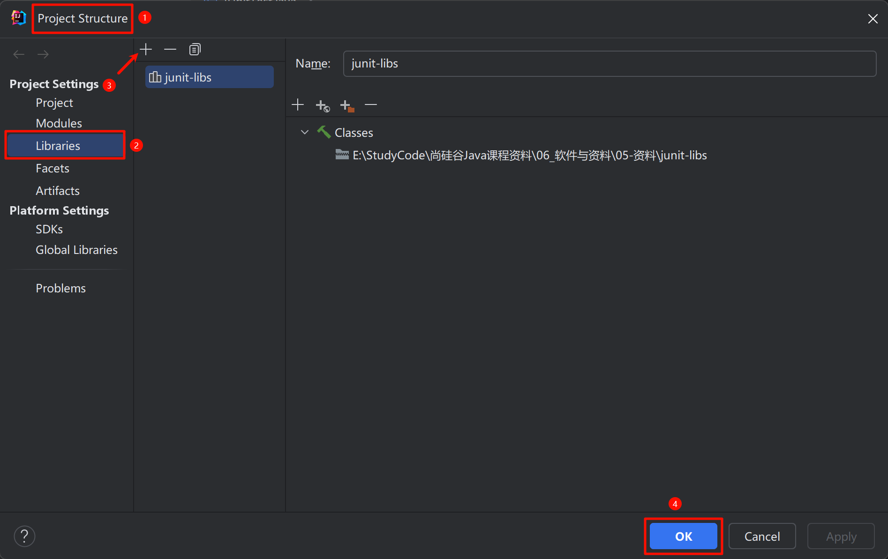

# JUnit单元测试

JUnit 是一个测试框架，供 Java 开发人员编写单元测试使用的。

要使用 JUnit，必须在项目的编译路径中引入 JUnit 的库，即相关的 .class 文件组成的 jar 包。

这里使用 JUnit，需要安装一下两个 jar 包：[junit-4.13.2.jar](https://github.com/junit-team/junit4/wiki/Download-and-Install) 和 [hamcrest-core-1.3.jar](https://github.com/junit-team/junit4/wiki/Download-and-Install)。


## IDEA中引入jar包

1. 在顶部栏中找到 File，点击 Project Structure，然后加载下载好的 jar 包：

   

2. 继续打开 Project Structure，侧边栏选择 Modules，为指定的模块导入 jar 包：

   

3. 若其他模块也需要引入 jar 包的话，重复第二步的步骤即可。


## 单元测试

::: info 单元测试要求

1. 单元测试所在的类必须是 public 的、非抽象的、包含唯一的无参构造器的（一般也不写构造器）；
2. @Test 标记的方法本身必须是 public 的、非抽象的、非静态的、void无返回值的，() 内无参数的。

:::

```java
import org.junit.Test;

public class JUnitTest {
    private int num = 10;

    @Test
    public void test() {
        System.out.println("number is" + num);
    }
}
```


## 解决单元测试中 Scanner 无效

默认情况下，在单元测试方法中使用 Scanner 时，并不能实现控制台数据的输 入。

需要做如下设置：

1. 在顶部工具栏中，找到 Help，点击 Edit Custom VM Options，写入下面代码：

   ```shell
   -Deditable.java.test.console=true
   ```

2. 完成之后，重启 IDEA 即可；

3. 在单元测试中使用 Scanner：

   ```java
   import org.junit.Test;
   import java.util.Scanner;
   
   public class JUnitTest {
       @Test
       public void test3() {
           Scanner scan = new Scanner(System.in);
           System.out.println("请输入一个数值：");
           int num = scan.nextInt();
           System.out.println(num);
       }
   }
   ```

   


## 自定义单元测试模板


