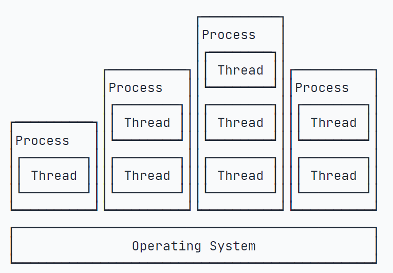

# 进程与线程

## 进程与线程

### 进程

进程（Process）是操作系统中资源分配的基本单位，每个进程都有自己独立的内存空间。

>例如，浏览器、视频播放器、QQ 它们都是进程。

进程的特征：

- 独立性：进程之前是相互独立的，一个进程的奔溃不会影响其他进程；

- 资源分配：每个进程拥有自己独立的资源（如内存）；

- 上下文切换：操作系统在不同进程之前切换时，需要保存和恢复进程的上下文，这是开销较大的操作；

### 线程

线程（Thread）是进程的一个执行单元，一个进程可以包含多个线程。所有线程共享该进程的资源。

>例如，浏览器开启了 10 个页面，每个页面都是一个线程。

线程的特征：

- 共享资源：多个线程共享该进程的内存和资源，因此线程之间通信和数据共享更高效；

- 并发执行：多个线程可以并发执行，充分利用多核CPU的优势，提高程序的执行效率；

- 轻量级：线程的创建和销毁比进程更快，上下文切换的开销也比较小；

 

线程和进程的关系图：

## 并发与并行

### 并发

并发（concurrency）是 指在同一时间段内处理多个任务的能力。

并发并不一定意味着这些任务是同时执行的，而是指系统能够处理多个任务，使它们看起来是在同时执行。

>例如，写一分钟语文作业，写一分钟数学作业，看起来同时在写两个作业。

并发特征：

- 任务交替：并发系统可能会交替执行多个任务，即处理器在不同任务时间来回切换，使得看起来是在并行执行；

- 任务相互影响：并发系统中，任务可能会互相干扰或共享资源，因此需要适当的同步机制来避免冲突或不一致性；

### 并行

并行（parallel）是 指同一时刻真正同时执行多个任务。

并行处理通常需要多核CPU来实现，因为每个处理器可以独立的执行一个任务。

>例如，视频播放器就是 视频 和 音频 两个任务在同时执行的，不然就会出现声音和视频不同步的情况。

特征：

- 真正同时：并行处理意味着任务在实际的物理时间上同时进行，不仅仅是看起来同时；

- 任务分解：为了实现并行，任务通常需要被分解为可以同时执行的子任务，这些子任务可以独立运行；

