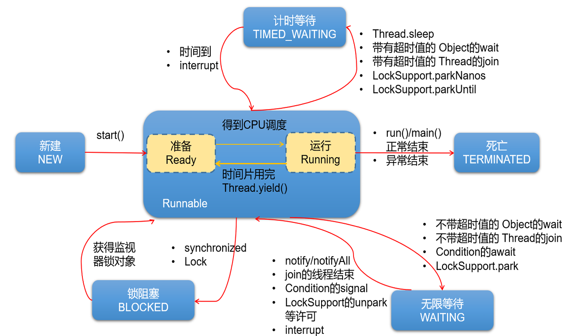

# 线程生命周期

- NEW（新建）：线程刚被创建，但是并未启动，即还没有调用 `start()`；

- RUNNABLE（可运行）：线程处于可运行状态，只有获得了 CPU 时间片的线程才能执行；

- TEMINATED（被中止）：表明程序已经结束生命周期，终止运行；

- 3 个阻塞状态：

  - BLOCKED（锁阻塞）：一个正在阻塞，等待另一个监视器锁的线程处于该状态。只有获得锁对象的线程才能有执行机会。

    > 例如，A 线程和 B 线程使用同一个锁，如果 A 线程获取到了锁，那么 A 线程就进入到 Runnable 状态，B 线程就进入到了 Bloaked 阻塞状态。

  - TIMED_WAITING（计时状态）：一个正在限时等待另一个线程执行一个（唤醒）动作的线程处于该状态。

  - WAITING（无限等待）：一个正在无限期等待另一个线程执行一个特别的（唤醒）动作的线程处于该状态。
