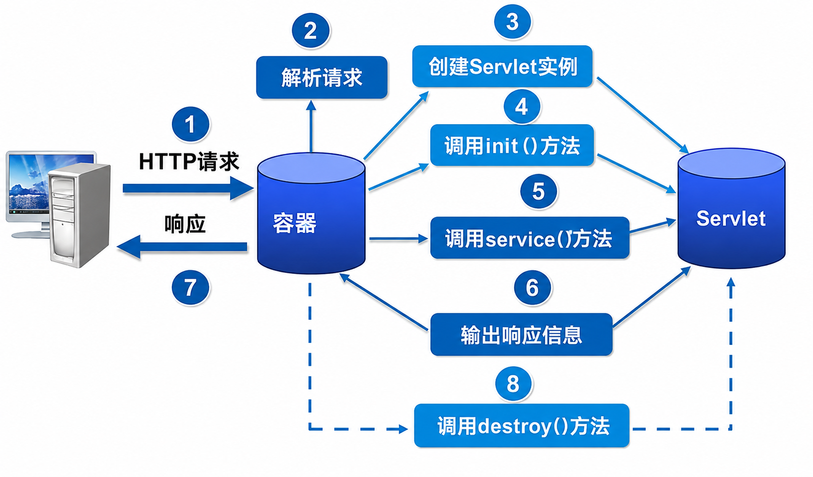

# 生命周期

Servlet 是 Java Web 开发的核心组件，运行在服务器端，用于接收客户端的请求并动态生成响应。它是 JavaEE 规范的一部分，现代主流的
Java 框架（如 Spring MVC）底层本质上都是基于 Servlet 封装出来的。

> [!NOTE] 核心职责
>
> Servlet 的基本工作模式可以总结为以下 3 步：
>
> - **接收请求**：解析客户端发来的 HTTP 请求（包括请求头、URL 参数、Form 表单、请求体等）；
> - **处理逻辑**：调用 Java 业务代码（如读取数据库、处理逻辑计算）；
> - **返回响应**：将处理结果（如 HTML、JSON、图片）封装成 HTTP 响应返回给客户端；

## 生命周期

Servlet 生命周期是指其从创建到销毁的整个过程，一共经历以下 4 步：

1. Servlet 初始化后调用 `init()` 方法；
2. Servlet 调用 `service()` 方法来处理客户端的请求；
3. Servlet 销毁前调用 `destroy()` 方法；
4. 最后，Servlet 由 JVM 的垃圾回收器将其进行垃圾回收；



### init () 方法

`init()` 方法被设计成只调用一次。它在第一次创建 Servlet 时被调用，在后续每次用户请求时不再调用。

当用户调用一个 Servlet 时，就会创建一个 Servlet 实例，每一个用户请求都会产生一个新的线程，适当的时候移交给 doGet 或 doPost
方法。`init()` 方法简单地创建或加载一些数据，这些数据将被用于 Servlet 的整个生命周期。

```java
public void init() throws ServletException {
  // 初始化代码
}
```

### service () 方法

Servlet 容器（即 Web 服务器）调用 `service()` 方法来处理来自客户端的请求，并把格式化的响应写回给客户端。

每次服务器接收到一个 Servlet 请求时，服务器就会产生一个新的线程并调用服务。`service()` 检查 HTTP 请求类型，并在适当的时候调用
doGet、doPost、doPut、doDelete 等方法。

```java
public void service(ServletRequest request, ServletResponse response) throws ServletException, IOException {
  // 其他逻辑
}
```

### destroy () 方法

`destroy()` 方法只会被调用一次，在 Servlet 生命周期结束时被调用。destroy () 方法可以让 Servlet 关闭数据库连接、停止后台线程、把
Cookie 列表或点击计数器写入到磁盘，并执行其他类似的清理活动。

在调用 destroy () 方法之后，Servlet 对象就被标记为垃圾回收。

```java 
public void destroy() {
  // 终止化代码
}
```


