# 环境配置

想要在 Java 的普通项目中支持 Java Web 应用程序，需要下载 Tomcat 并设置环境变量等参数才能正常使用。

## 下载 Tomcat

::: navCard 1

```yaml
- name: Tomcat 11
  desc: Tomcat 11 下载地址
  link: https://tomcat.apache.org/download-11.cgi
  img: https://tomcat.apache.org/res/images/tomcat.png
  badge: Tomcat
  badgeType: tip
```

:::

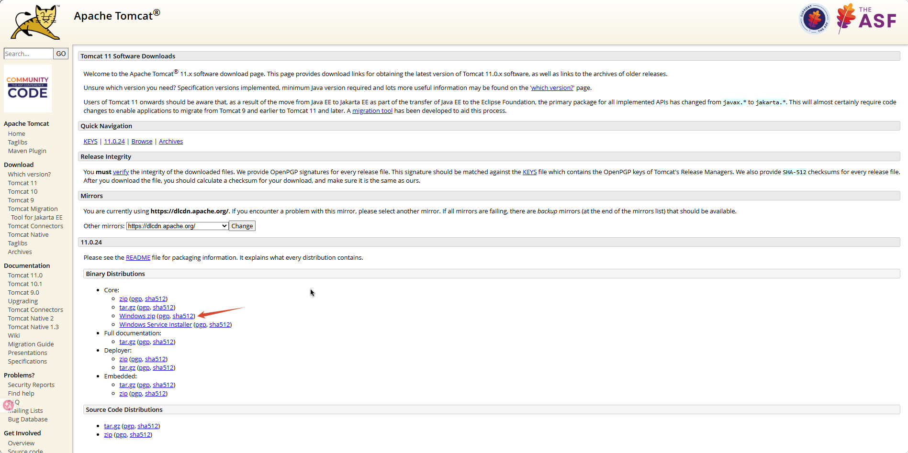

选择 `Windows zip` 版本，下载完成后，将其解压并放在没有中文的文件夹下。

## 配置 Tomcat 环境变量

打开系统环境变量配置，在 系统变量 模块依次配置：

第一步：新建 **CATALINA_BASE** 变量

```tex
变量名：CATALINA_BASE
变量值：D:\softs\apache-tomcat-11.0.24
```

第二步：新建 **CATALINA_HOME** 变量

```tex
变量名：CATALINA_HOME
变量值：D:\softs\apache-tomcat-11.0.24
```

第三步：新建 **CATALINA_TMPDIR** 变量

```tex
变量名：CATALINA_TMPDIR
变量值：D:\softs\apache-tomcat-11.0.24\temp
```

第四步：进入 Path 变量，新增 tomcat bin 文件夹

```tex
变量值：D:\softs\apache-tomcat-11.0.24\bin
```

## 检测 Tomcat 安装成功

第一步：打开 `cmd` 后，在窗口中输入 `startup` 并回车，打开 Tomcat。

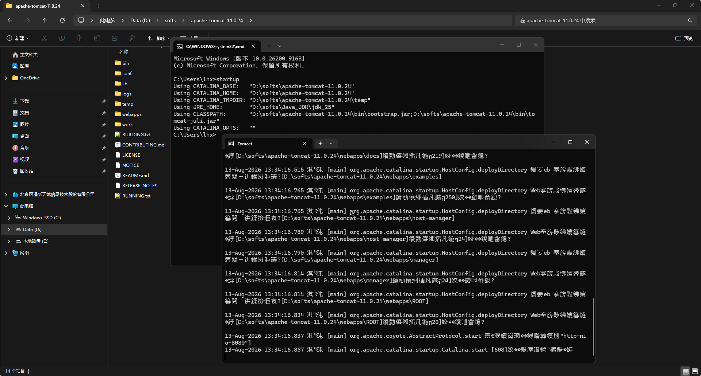

第二步：在浏览器输入 `127.0.0.1:8080` 后查看 Tomcat 的启动页面。注意：8080 端口不要被其他程序占用！！

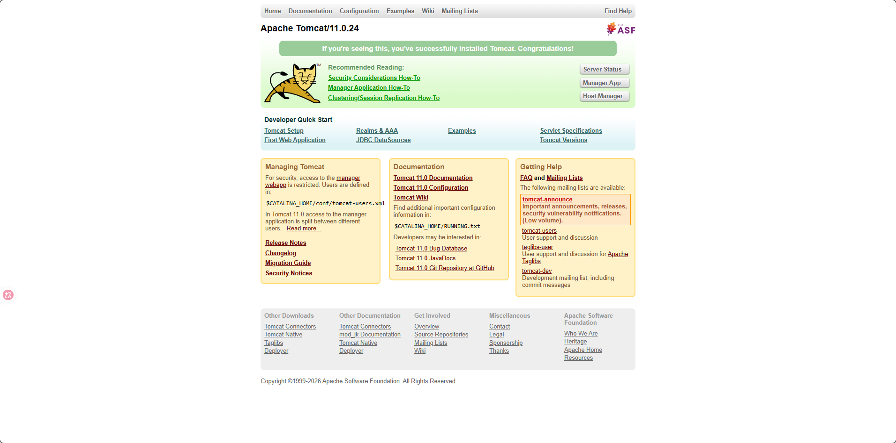

## 创建 JavaWeb 项目

第一步：新建 Java 空项目。

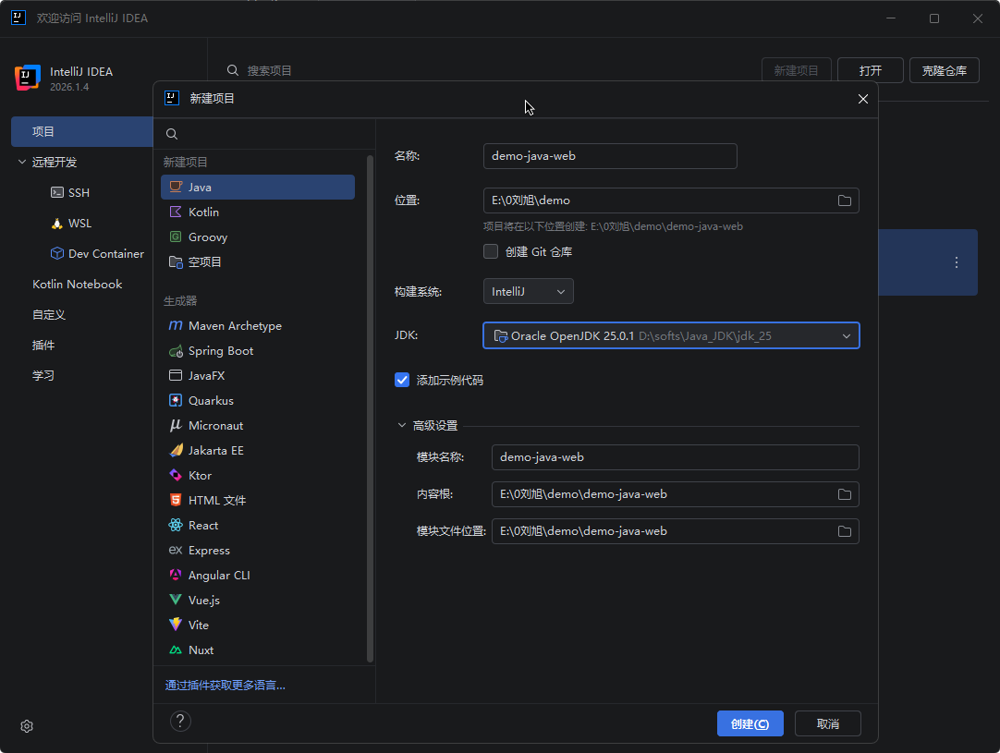

第二步：修改项目结构，新建 Web 模块。

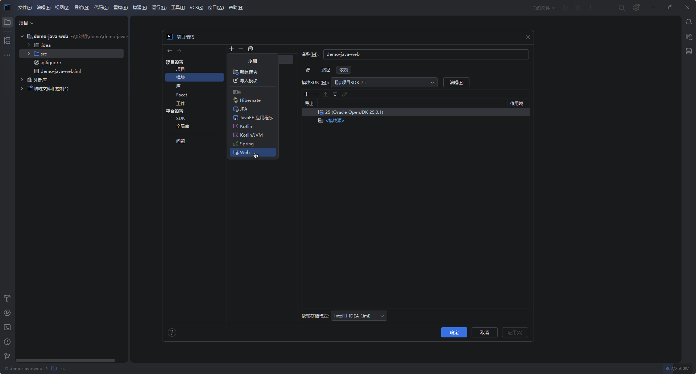

第三步：创建工件。

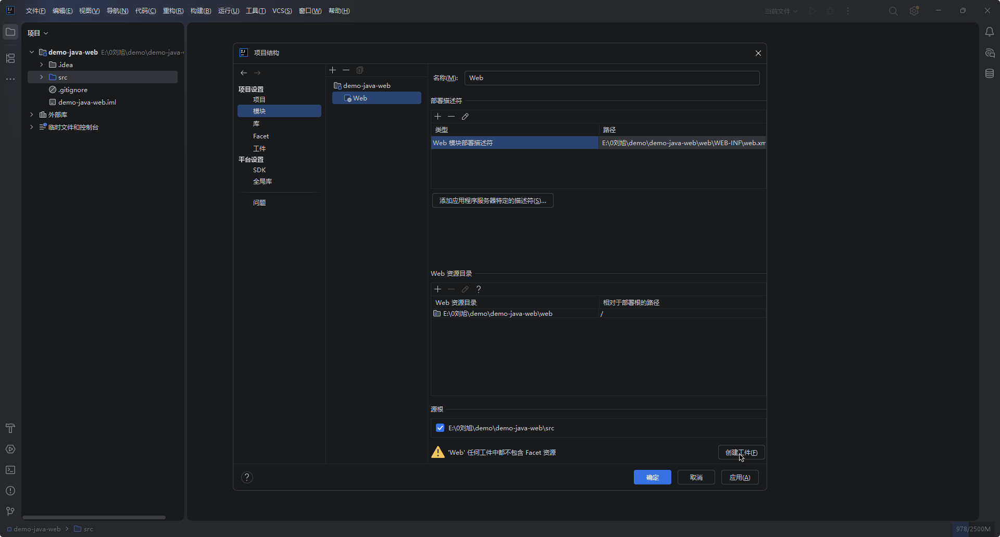

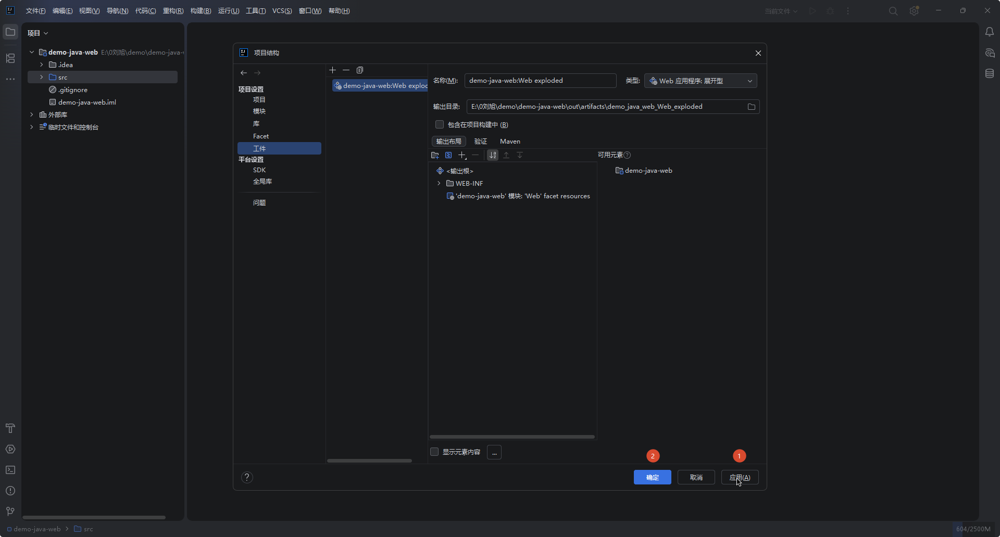

第四步：编辑配置，并创建 Tomcat 服务器配置。

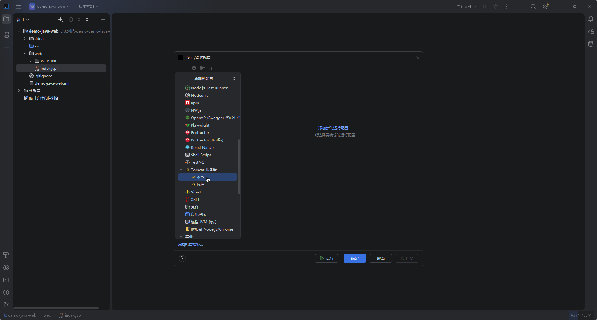

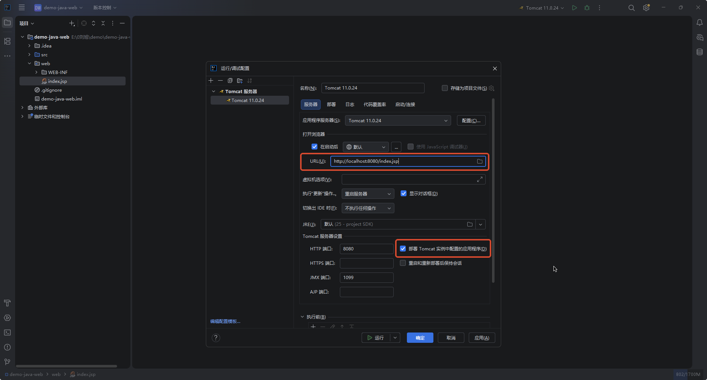

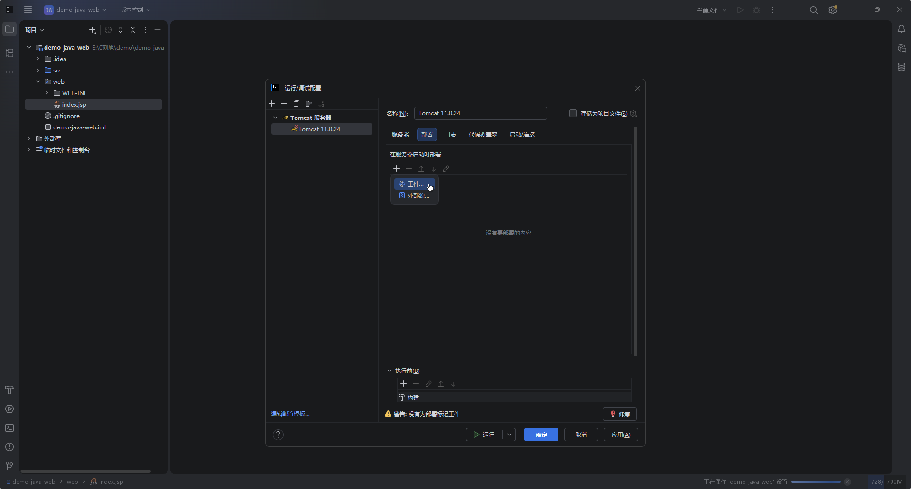

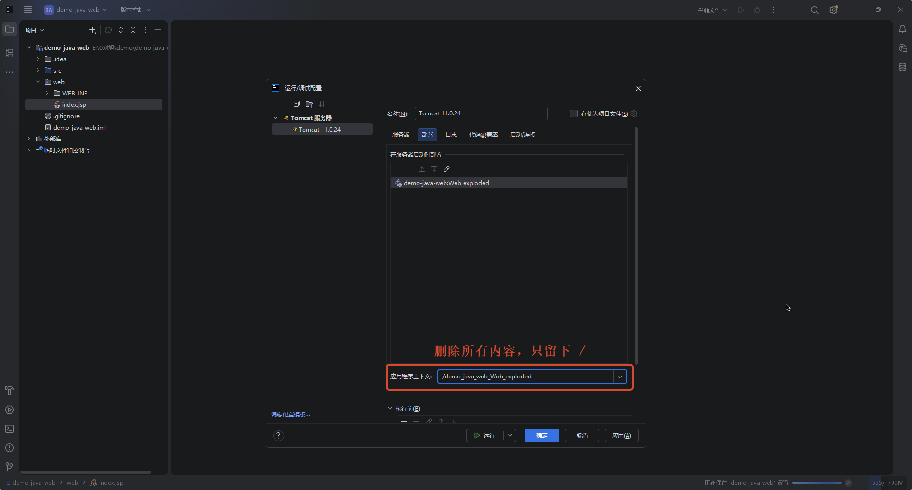

第五步：在 web 目录下新建 `index.jsp` 文件，用于启动程序测试页面。

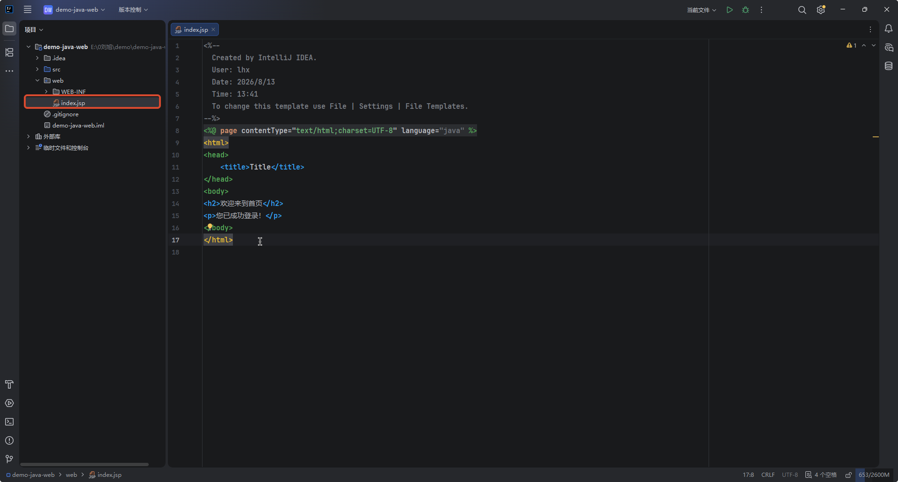

第六步：启动 Tomcat，渲染网页。

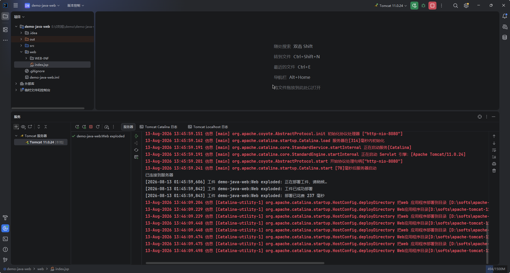

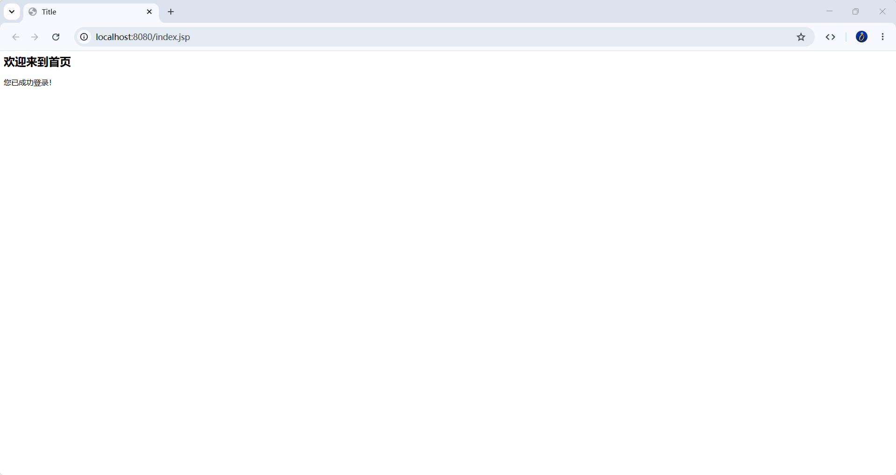


