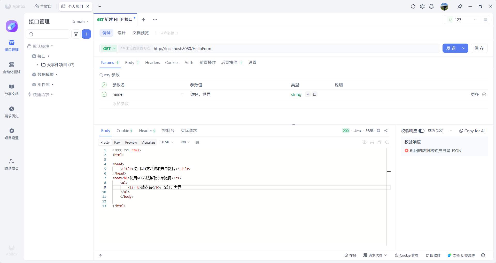
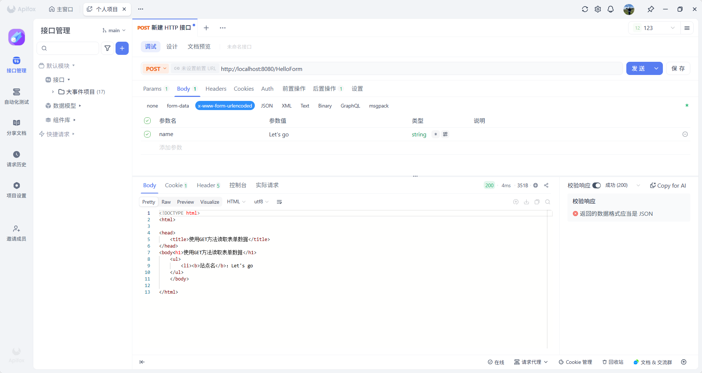
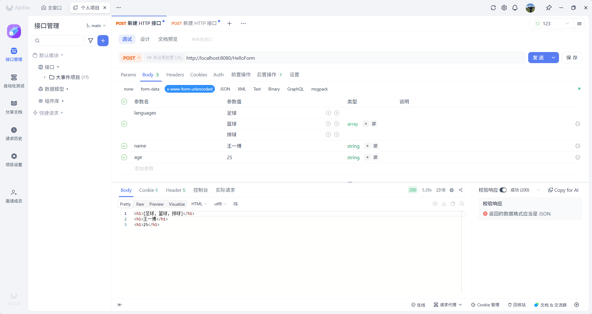

# 表单数据

客户端通过 GET 或 POST 请求把数据传递到服务端，服务端使用 Servlet 读取表单数据，这些数据可以通过以下的方法进行自动解析：

|         方法         | 描述                               |
| :------------------: | ---------------------------------- |
|    getParameter()    | 获取表单参数的值                   |
| getParameterValues() | 获取参数出现一次以上的值，如复选框 |
| getParameterNames()  | 获取请求中所有参数的完整列表       |


## URL 方式发起 GET 请求

URL 方式发起 GET 请求并传递参数到服务端，需要使用 `?name=你好` 的形式进行传递，在 Servlet 接收到请求后，使用 `getParameter()`  获取参数值。

```java {1,7,5}
@WebServlet("/HelloForm")
public class HelloForm extends HttpServlet {
  // 处理客户端的 GET 请求
  @Override
  protected void doGet(HttpServletRequest req, HttpServletResponse resp) throws ServletException, IOException {
    // 从请求头中获取 name 属性，并注意中文问题
    String nameParam = req.getParameter("name");
    String name = nameParam == null ? "未提供name名称" : nameParam;

    // 设置响应内容类型
    resp.setContentType("text/html;charset=UTF-8");
    PrintWriter writer = resp.getWriter();
    writer.println("<!DOCTYPE html>\n" +
                   "<html>" +
                   "<head>" +
                   "<title>使用GET方法读取表单数据</title>" +
                   "</head>" +
                   "<body" +
                   "<h1>使用GET方法读取表单数据</h1>" +
                   "<ul>" +
                   "<li><b>站点名</b>：" + name + "\n" +
                   "</ul>" +
                   "</body>" +
                   "</html>"
                  );
  }

  // 处理客户端的 POST 请求
  @Override
  protected void doPost(HttpServletRequest req, HttpServletResponse resp) throws ServletException, IOException {
    // 这里的处理逻辑简单，直接调用 doGet 方法返回内容
    doGet(req, resp);
  }
}
```


## 表单 方式发起 GET 请求

表单方式发起 GET 请求，需要通过 `Params` 进行传参，后端同样使用 `getParameter()` 获取参数值。




## 表单 方式发起 POST 请求

表单方式发起 POST 请求，需要通过 `form` 表单的形式传参，后端同样使用 `getParameter()` 获取参数值。




## 复选框数据传递到 Servlet

复选框可以同时传递多个值到服务端，因此 Servlet 不能再使用 `getParameter()` 来接收，而是需要使用 `getParameterValues()`。

```java {7}
@WebServlet("/HelloForm")
public class HelloForm extends HttpServlet {
  // 处理客户端的 GET 请求
  @Override
  protected void doGet(HttpServletRequest req, HttpServletResponse resp) throws ServletException, IOException {
    // 从请求头中获取 languages 参数
    String[] languages = req.getParameterValues("languages");

    resp.setContentType("text/html;charset=UTF-8");
    PrintWriter writer = resp.getWriter();
    writer.println("<h2>" + Arrays.toString(languages) + "</h2>");
  }

  // 处理客户端的 POST 请求
  @Override
  protected void doPost(HttpServletRequest req, HttpServletResponse resp) throws ServletException, IOException {
    // 这里的处理逻辑简单，直接调用 doGet 方法返回内容
    doGet(req, resp);
  }
}
```


## 读取所有表单参数

读取所有表单参数列表需要使用 `getParameterNames()` 方法，该方法返回一个枚举，其中包含未指定顺序的参数名。

有了此枚举之后，可以使用其 `hasMoreElements()` 方法来循环获取每个参数的值。

```java {10,11,12,13}
@WebServlet("/HelloForm")
public class HelloForm extends HttpServlet {
  // 处理客户端的 GET 请求
  @Override
  protected void doGet(HttpServletRequest req, HttpServletResponse resp) throws ServletException, IOException {
    resp.setContentType("text/html;charset=UTF-8");
    PrintWriter writer = resp.getWriter();

    // 获取所有的请求头参数名称
    Enumeration<String> paramsNames = req.getParameterNames();
    while (paramsNames.hasMoreElements()) {
      String paramName = paramsNames.nextElement();
      String[] paramValue = req.getParameterValues(paramName);
      // 读取单个值
      if (paramValue.length == 1) {
        writer.println("<h1>" + paramValue[0] + "</h1>");
      } else {
        writer.println("<h1>" + Arrays.toString(paramValue) + "</h1>");
      }
    }
  }

  // 处理客户端的 POST 请求
  @Override
  protected void doPost(HttpServletRequest req, HttpServletResponse resp) throws ServletException, IOException {
    // 这里的处理逻辑简单，直接调用 doGet 方法返回内容
    doGet(req, resp);
  }
}
```


