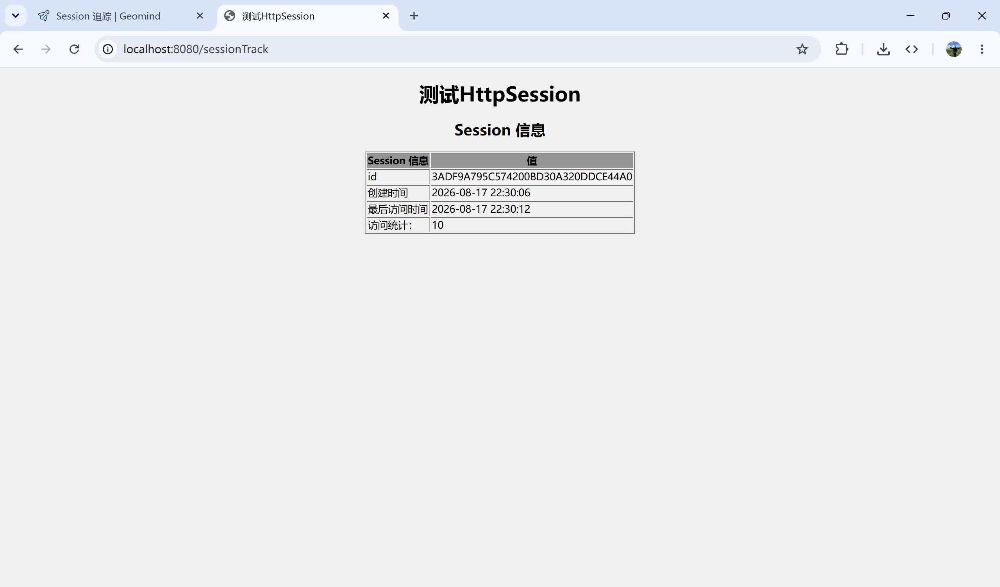

# Session 追踪

HTTP 是一种“无状态”协议，这意味着每次客户端检索网页时，都会打开一个单独的连接到服务器端，服务器端默认无法判断多个请求是否来自同一浏览器。为了不在请求间共享用户状态（如登录状态、购物车），Servlet 提供了 Session 会话追踪技术。

> [!NOTE] 工作原理
>
> - **唯一标识**：当客户端首次访问服务器时，服务器为该客户端创建一个 `HttpSession` 对象，并生成一个唯一的字符串 ID（即 JSESSIONID）；
> - **回传机制**：服务器将 JSESSIONID 发送给客户端，客户端后续发起的请求都会将这个 ID 带回服务器，服务器以此找到对应的 Session 对象；

> [!TIP] 实现 Session 追踪的 4 种方式
>
> 1. **Cookie 方式（最常用）**
>    - 机制：服务器将 JSESSIONID 写入 HTTP 响应头部的 `Set-Cookie` 中，浏览器保存在本地。后续请求会自动通过 Cookie 请求头将 JSESSIONID 传给服务器；
>    - 局限：若用户关闭了浏览器的 Cookie 功能，此方式将失效；
> 2. **URL 重写**
>    - 机制：当浏览器禁用 Cookie 时，服务器将 JSESSIONID 附加在 URL 后面；
> 3. **隐藏表单域**
>    - 机制：将 SessionID 作为 HTML 表单中的 `<input type="hidden">` 标签传输；
>    - 局限：仅适用于表单提交场景，无法直接作用于普通超链接；
> 4. **SSL 会话**
>    - 机制：在 HTTPS 连接建立时，利用 SSL 协议层握手产生的 SSL SessionID 来区分客户端；
>    - 优点：安全性高，不依赖于 Cookie 或 URL


## HttpSession 对象

HttpSession 用来创建一个或多个 HTTP 客户端之间的 Session 会话，会话可以指定持续的时间段，跨多个连接或页面请求。

HttpSession 对象通过 HttpServletRequest 的公共方法 getSession() 来获取：

```java
HttpSession session = request.getSession();
```

| 方法                      | 描述                                                 |
| ------------------------- | ---------------------------------------------------- |
| getAttribute(name)        | 获取会话中指定名称的对象，未找到返回 null            |
| getAttributeNames()       | 获取绑定到会话的所有对象名称                         |
| getCreationTime()         | 返回会话被创建的时间                                 |
| getId()                   | 获取会话的唯一标识符字符串                           |
| getLastAccessedTime()     | 获取客户端最后一次请求时，会话的时间                 |
| getMaxInactiveInterval()  | 获取客户端访问时保持会话打开的最大时间间隔，单位：秒 |
| invalidate()              | 使会话无效，并解除绑定到它上面的所有对象             |
| removeAttribute(name)     | 从会话中移除指定名称的对象                           |
| setAttribute(name, value) | 绑定指定名称和值的对象到当前会话                     |


## 实现 Session 追踪

示例展示了如何使用 HttpSession 对象获取 Session 会话创建时间和最后访问时间。

```java {6,8,10,19,20,21}
@WebServlet("/sessionTrack")
public class SessionTrack extends HttpServlet {
  @Override
  protected void doGet(HttpServletRequest req, HttpServletResponse resp) throws ServletException, IOException {
    // 如果不存在 session 会话，则新创建一个
    HttpSession session = req.getSession(true);
    // 获取 session 创建时间
    Date createTime = new Date(session.getCreationTime());
    // 获取网页的最后一次访问时间
    Date lastAccessTime = new Date(session.getLastAccessedTime());

    // 设定日期输出的格式
    SimpleDateFormat df = new SimpleDateFormat("yyyy-MM-dd HH:mm:ss");

    int visitCount = 0;
    String visitCountKey = "visitCount";

    // 第一次获取 visitCount，初始化值
    if (session.getAttribute(visitCountKey) == null) {
      session.setAttribute(visitCountKey, visitCount);
    }
    visitCount = (int) session.getAttribute(visitCountKey);
    visitCount++;
    session.setAttribute(visitCountKey, visitCount);

    resp.setContentType("text/html;chartset=UTF-8");
    PrintWriter writer = resp.getWriter();
    String docType = "<!DOCTYPE html>\n";
    writer.println(docType +
                   "<html>\n" +
                   "<head><title>测试HttpSession</title></head>\n" +
                   "<body bgcolor=\"#f0f0f0\">\n" +
                   "<h1 align=\"center\">测试HttpSession</h1>\n" +
                   "<h2 align=\"center\">Session 信息</h2>\n" +
                   "<table border=\"1\" align=\"center\">\n" +
                   "<tr bgcolor=\"#949494\">\n" +
                   "  <th>Session 信息</th><th>值</th></tr>\n" +
                   "<tr>\n" +
                   "  <td>id</td>\n" +
                   "  <td>" + session.getId() + "</td></tr>\n" +
                   "<tr>\n" +
                   "  <td>创建时间</td>\n" +
                   "  <td>" +  df.format(createTime) +
                   "  </td></tr>\n" +
                   "<tr>\n" +
                   "  <td>最后访问时间</td>\n" +
                   "  <td>" + df.format(lastAccessTime) +
                   "  </td></tr>\n" +
                   "<tr>\n" +
                   "  <td>访问统计：</td>\n" +
                   "  <td>" + visitCount + "</td></tr>\n" +
                   "</table>\n" +
                   "</body></html>");
  }
}
```




## 删除 Session 会话数据

当完成了一个用户的 Session 会话数据，可以有以下几种选择删除会话数据：

- **移除属性**：调用 `removeAttribute(name)` 方法来删除与特定的键相关联的值；

- **删除整个 Session 会话**：调用 `invalidate()` 方法来丢弃整个会话；

- **设置 Session 会话过期时间**：调用 `setMaxInactiveInterval(interval)` 方法来单独设置会话过期时间；

- **`web.xml` 配置**：如果使用的是 Tomcat，除了上述方法，还可以通过 xml 配置实现：

  ```xml
  <session-config>
    <!-- Tomcat 默认是是30分钟 -->
    <session-timeout>15</session-timeout>
  </session-config>
  ```
