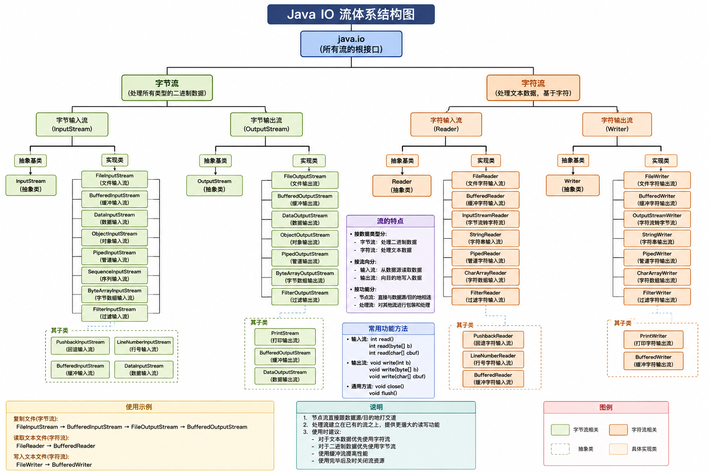

# IO 流

IO 流是 Java 中处理数据输入和输出的核心机制，以内存为核心：

- 输入流（Input）：将外部数据读取到程序内存中；
- 输出流（Output）：将程序内存中的数据写入到外部设备中；

Java 中的 IO 流主要分为 2 大类，区分的关键在于 **处理数据的最小单位**：

|  分类  |          抽象基类          |     最小处理单位     | 适用场景                                         |
| :----: | :------------------------: | :------------------: | :----------------------------------------------- |
| 字节流 | InputStream / OutputStream |    8位（1 byte）     | 所有文件类型（图片、音视频、二进制文件、文本等） |
| 字符流 |      Reader / Writer       | 16位（2 byte，Char） | 纯文本文件（如txt、java等）                      |

