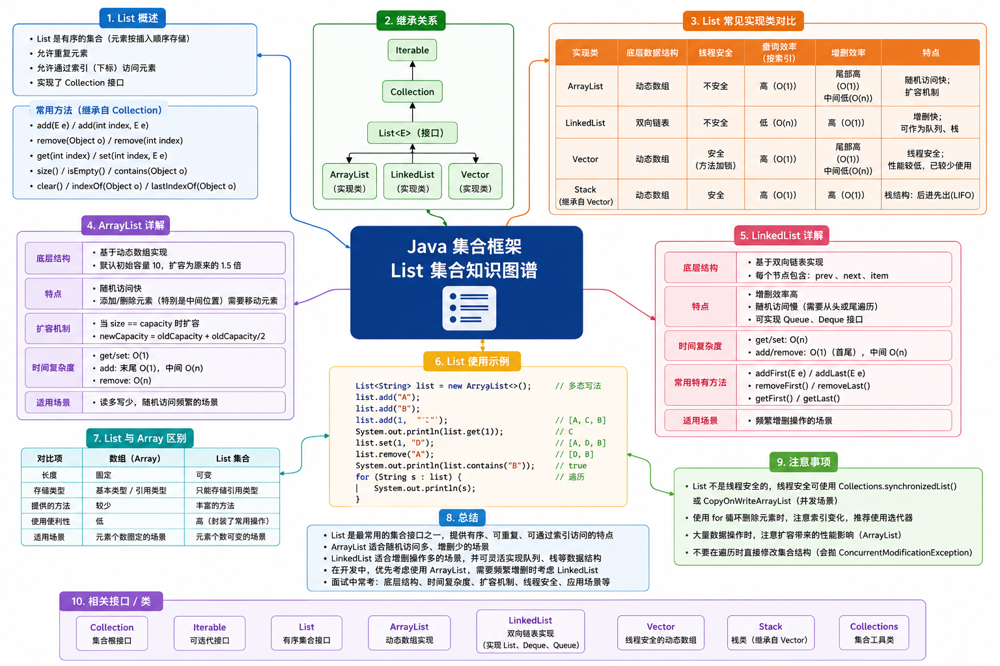

# List 集合




## ArrayList

`ArrayList` 是 Java 中的一个 **动态数组类**。它实现了 `List` 接口，是集合框架中最常用的数据结构之一。

与普通的 Java 数组相比，`ArrayList` 的核心优势在于 **它的长度是可变的**。

> [!NOTE] 核心特点
>
> - **容量动态增长**：普通数组在创建时必须指定大小，且后续无法更改。而 ArrayList 会在元素数量不足自动进行扩容（通常是当前容量的 1.5 倍扩容）；
> - **基于数组实现**：底层依然是一个 Object 数组，因此它保留了数组通过索引快速随机访问的特性；
> - **允许重复与 Null 值**：可以在 ArrayList 中存储重复的元素，也可以放入多个 null 值；
> - **元素有序性**：元素被访问和遍历的顺序与它们被插入的顺序完全一致；

> [!TIP] 优势和缺点
>
> ✅ 优势：
>
> - **随机查询速度极快**：通过索引（index）访问元素效率极高，时间复杂度为 $O(1)$；
> - **尾部操作高效**：在数组末尾添加元素非常快，时间复杂度也为 $O(1)$；
> - **空间连续性**：在内存中占用连续的存储空间，对 CPU 缓存友好；
>
> ❌ 缺点：
>
> - **中间插入/删除效率低**：在数组中间插入或删除元素时，需要移动该位置之后的所有元素，最坏情况下的时间复杂度为 $O(n)$；
> - **扩容有性能开销**：当内部数组满时，ArrayList 会自动创建一个原数组 1.5 倍大小的新数组，并将旧数据复制过去，频繁扩容会消耗性能；
> - **只能存储引用类型**：不能直接存储基本数据类型（如 `int`、`char`），必须使用它们的包装类（如 `Integer`、``Character`），这会带来装箱和拆箱的额外开销；

::: info 适用场景

- **读多写少**：需要频繁查询数据，但很少进行插入和删除操作的场景；
- **尾部追加数据**：比如从数据库读取一批数据，然后顺次放入列表中进行展示；
- **数据量基本固定或可预测**：可以提前指定初始容量，避免频繁扩容；

:::

### 常用方法

|        方法         | 描述                                                         |
| :-----------------: | ------------------------------------------------------------ |
|    add(element)     | 在列表的末尾添加指定的元素                                   |
| add(index, element) | 在指定的索引位置插入元素（原本该位置及之后的元素均向后移动一位） |
| addAll(collection)  | 将另一个集合中的所有元素批量添加到当前列表末尾               |
|    remove(index)    | 删除指定索引位置的元素                                       |
|   remove(element)   | 删除列表中第一次出现的指定元素                               |
|       clear()       | 清空列表中的所有元素                                         |
|     get(index)      | 获取指定索引位置的元素                                       |
| set(index, element) | 将指定索引位置的元素修改为新元素，并返回被替换的旧元素       |
|       size()        | 返回列表中元素的总个数                                       |
|      isEmpty()      | 判断列表是否为空                                             |
|  contains(element)  | 检查列表中是否包含指定的元素                                 |

::: code-group

```java [基础使用] {8,12,14,16,20,22,24}
public static void main() {
  ArrayList<String> list = new ArrayList<>();

  // 添加元素
  list.add("A");
  list.add("B");
  list.add("C");
  list.add(1, "X");
  System.out.println(list); // [A, X, B, C]

  // 删除元素
  list.remove(3);
  System.out.println(list); // [A, X, B]
  list.remove("B");
  System.out.println(list); // [A, X]
  list.clear();
  System.out.println(list); // []

  // 查询/修改元素
  String element = list.get(1);
  System.out.println(element); // X
  list.set(1, "Z");
  System.out.println(list); // [A, Z, B, C]
  int size = list.size();
  System.out.println(size); // 4
}
```

```java [遍历方法]
public static void main(String[] args) {
  ArrayList<String> list = new ArrayList<>();
  list.add("A");
  list.add("B");
  list.add("C");

  // 方式一：迭代器遍历
  Iterator<String> iterator = list.iterator();
  while (iterator.hasNext()) {
    String next = iterator.next();
    System.out.println(next);
  }

  // 方式二：增强for循环遍历（推荐）
  for (String s : list) {
    System.out.println(s);
  }

  // 方式三：forEach遍历
  list.forEach(s -> System.out.println(s));
  list.forEach(System.out::println); // 方法引用

  // 方式四：普通for循环
  for (int i = 0; i < list.size(); i++) {
    System.out.println(list.get(i));
  }
}
```

:::


### 误区一

默认情况下，创建的 ArrayList 在未添加元素时它的内部数组容量是 0，当添加第一个元素时会初始化为 10。

如果在明确知道大概存储多少个元素时，推荐指定容量：

```java
ArrayList<String> list = new ArrayList<>(1000);
```


### 

### 误区二

谨慎使用 `Arrays.asList(array)` 转换出来的集合，它的底层并不是 `java.util.ArrayList`，而是 Arrays 的一个内部类。这个内部类没有实现 `add()` 和 `remove()` 方法，调用它们会直接抛出 UnsupportedOperationException。

正确的使用方式：

```java
public static void main(String[] args) {
  List<Integer> list = Arrays.asList(1, 2, 3, 4, 5);
  list.add(10); // [!code --]

  ArrayList<Integer> list = new ArrayList<>(Arrays.asList(1, 2, 3, 4, 5)); // [!code ++]
  list.add(10);
  System.out.println(list); // [1, 2, 3, 4, 5, 10]
}
```


### 误区三

ArrayList 的 `remove()` 方法删除元素时，index 索引删除的优先级高于 element 元素删除。

```java {9}
public static void main(String[] args) {
  ArrayList<Integer> list = new ArrayList<>();
  list.add(1);
  list.add(2);
  list.add(3);
  list.add(4);

  // 默认以 index 索引进行删除，而不是元素
  list.remove(2);
  System.out.println(list); // [1, 2, 4]
}
```


### 误区四

在 for 循环 或 for-each 循环 遍历 ArrayList 时，如果直接调用 `list.remove()`，此时程序会抛出 ConcurrentModificationException 异常。

正确的做法是使用迭代器（Iterator）的 `remove()` 方法，或者使用 Java8+ 的 `list.removeIf()`。

```java
public static void main(String[] args) {
  ArrayList<String> list = new ArrayList<>();
  list.add("AAA");
  list.add("BBB");
  list.add("CCC");
  list.add("DDD");

  // ❌ 错误写法
  for (String s : list) {
    if ("BBB".equals(s)) {
   	  list.remove(s); // [!code --]
    }
  }

  // ✅ 正确：使用 Iterator
  Iterator<String> iterator = list.iterator();
  while (iterator.hasNext()) {
    String next = iterator.next();
    if ("BBB".equals(next)) {
      iterator.remove(); // [!code ++]
    }
  }
  System.out.println(list); // [AAA, CCC, DDD]

  // ✅ 正确：使用 removeIf
  list.removeIf(s -> "BBB".equals(s)); // [!code ++]
  list.removeIf("BBB"::equals);
  System.out.println(list); // [AAA, CCC, DDD]

  // ✅ 正确：使用普通for循环（倒序遍历）
  for (int i = list.size() - 1; i >= 0; i--) {
    if ("BBB".equals(list.get(i))) {
      list.remove(i); // [!code ++]
    }
  }
  System.out.println(list); // [AAA, CCC, DDD]
}
```


## LinkedList

LinkedList 是另一个核心集合类，它的底层是基于 **双向链表** 实现的。

相比于基于数组的 ArrayList 不同，LinkedList 的每一个元素都是一个独立的对象（称为节点 Node），每个节点除了存储实际的数据外，还包含两个指针：一个指向前一个节点（`prev`），一个指向后一个节点（`next`）。

> [!NOTE] 核心特点
>
> - **底层基于链表**：内存空间不需要连续，元素通过指针相互连接；
> - **双向遍历**：因为是双向链表，既可以从头到尾遍历，也可以从尾向头遍历；
> - **实现了多个接口**：它不仅实现了 List 接口，还实现了 Deque（双端队列）和 Queue（队列）接口，因此它可以当作队列或栈来使用；
> - **非线程安全**：与 ArrayList 一样，它在多线程并发修改时是不安全的；

> [!TIP] 优势和缺点
>
> ✅ 优势：
>
> - **增删效率高**：插入或删除元素时，只需要修改指针指向，因此时间复杂度是 $O(1)$，不需要像数组那样大量移动元素；
> - **没有容量限制**：它是动态增长的，不需要像 ArrayList 那样进行整体的数组扩容和数据赋值；
>
> ❌ 缺点：
>
> - **随机访问慢**：不支持通过索引随机访问，如果要获取第 n 个元素，必须从头顺着指针一个一个往后找，时间复杂度为 $O(n)$；
> - **内存占用大**：除了存储数据本身，每个节点还要额外存储两个指针；

::: info 适用场景

- **频繁在首尾进行增删操作**：比如实现 FIFO（先进先出）的队列，或者 LIFO（后进先出）的栈；
- **不需要或很少需要随机访问**：主要是通过迭代器按顺序遍历数据，而不是通过下标随机查找；

:::


### 常用方法

由于 LinkedList 实现了 List 和 Deque 接口，它的方法非常丰富：

| 分类         | 方法               | 描述                  |
| :----------: | ------------------ | --------------------- |
| List 基础操作 | add(e) / remove(e) | 尾部添加/删除指定元素 |
| 头部/尾部特有 | addFirst(e) / addLast(e) | 最前面/最后面添加元素 |
|              | getFirst() / getLast() | 获取第一个/最后一个元素 |
| | removeFirst() / removeLast() | 移除并返回第一个/最后一个元素 |
| 队列 | offer(e) / poll() | 进队（尾部）/ 出队（头部） |
| 栈 | push(e) / pop() | 压栈（头部）/ 弹栈（头部） |

::: code-group

```java {5,9,11,14,16,18,22} [普通List]
public static void main(String[] args) {
  LinkedList<String> linkedList = new LinkedList<>();
  linkedList.add("BBB");
  linkedList.add("CCC");
  linkedList.addFirst("AAA");
  linkedList.addLast("DDD");
  System.out.println(linkedList); // [AAA, BBB, CCC, DDD]

  String res1 = linkedList.get(1);
  System.out.println(res1); // BBB
  String res2 = linkedList.getLast();
  System.out.println(res2); // DDD

  linkedList.remove(1);
  System.out.println(linkedList); // [AAA, CCC, DDD]
  linkedList.remove("AAA");
  System.out.println(linkedList); // [CCC, DDD]
  linkedList.removeFirst();
  System.out.println(linkedList); // [CCC, DDD]

  // 使用 listIterator 逆序遍历
  ListIterator<String> it = linkedList.listIterator(linkedList.size());
  while (it.hasPrevious()) {
    System.out.println(it.previous());
  }
}
```

```java [队列]
public static void main(String[] args) {
  LinkedList<String> queue = new LinkedList<>();
  queue.offer("排队顾客A");
  queue.offer("排队顾客B");
  queue.offer("排队顾客C");

  // 获取队列顶部元素
  System.out.println(queue.peek()); // 排队顾客A

  while (!queue.isEmpty()) {
    // 弹出元素
    System.out.println("移除元素：" + queue.poll());
  }
  System.out.println(queue); // []
}
```

```java [栈]
public static void main(String[] args) {
  LinkedList<String> stack = new LinkedList<>();
  stack.push("百度");
  stack.push("Github");
  stack.push("掘金");

  // 获取栈顶元素
  System.out.println(stack.peek()); // 掘金

  while (!stack.isEmpty()) {
    // 弹出元素
    System.out.println(stack.pop());
  }
  System.out.println(stack);
}
```

:::


### 误区一

避免使用普通的 for 循环遍历 LinkedList，因为每次调用 `get(i)` 都会从头开始重新查找，导致整个遍历的时间复杂度飙升到 $O(n^2)$。

正确做法是使用 `for-each` 循环、`Inteator` 迭代器或 Java8+ 的 `forEach()`。

```java
public static void main(String[] args) {
  LinkedList<String> linkedList = new LinkedList<>();
  linkedList.add("BBB");
  linkedList.add("CCC");
  linkedList.addFirst("AAA");
  linkedList.addLast("DDD");
  System.out.println(linkedList);

  // ❌ 错误写法：每次从头遍历，时间复杂度为O(n²)
  for (int i = 0; i < linkedList.size(); i++) {
    String s = linkedList.get(i);
    System.out.println(s);
  }

  // ✅ 正确写法：使用增强for循环遍历（推荐）
  for (String s : linkedList) {
    System.out.println(s);
  }
}
```
