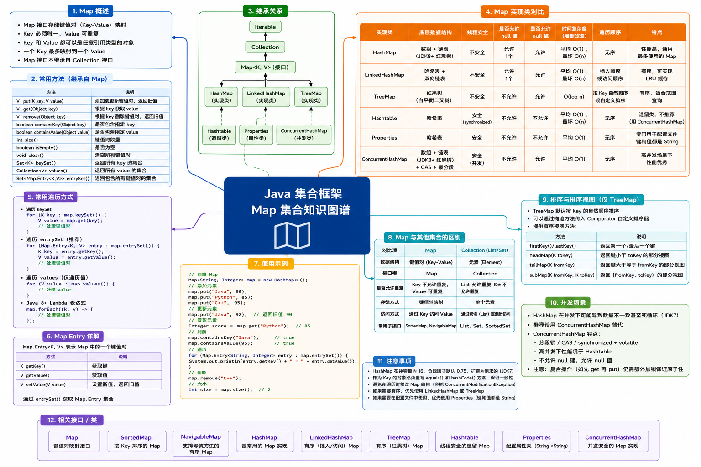

# Map




## HashMap

HashMap 是集合框架中非常常用的类之一，位于 `java.util` 包中。它基于 **哈希表**（Hash Table）实现，以 **键值对** 的形式存储数据。

> [!NOTE] 核心特点
>
> - **基于哈希表实现**：内部结合了数组、链表和红黑树来存储数据；
> - **无序性**：存入和取出的顺序不保证一致，且元素的顺序可能会随时间发生变化；
> - **允许 null 值**：允许存储一个为 null 的键，以及多个为 null 的值；
> - **非线程安全**：HashMap 是异步的，在多线程并发修改的场景下可能会导致数据不一致或产生死循环；

> [!TIP] 优势和缺点
>
> 优势：
>
> - **高效的读写性能**：在理想状态（没有哈希冲突）下，查找、插入和删除的时间复杂度都接近 $O(1)$；
> - **灵活的数据结构**：支持动态扩容，在 JDK8 引入红黑树后，极端冲突条件下的最坏查找时间复杂度也从 $O(n)$ 优化到了 $O(logn)$；
>
> 缺点：
>
> - **线程不安全**：无法直接在并发环境下安全使用（需要使用 `ConcurrentHashMap`）；
> - **无序存储**：如果需要按插入顺序或自然顺序遍历，HashMap 无法满足要求；
> - **内存开销较小但有浪费**：由于存在加载因子（默认 0.75）和预留扩容空间，会占用比实际存入元素更多的内存；

::: info 适用场景

- **快速查找**：需要根据某个唯一的标识频繁查询对应的对象；
- **缓存数据**：临时保存 key-value 的映射结果，以空间换时间；
- **统计计数**：列入统计文章中每个单词出现的次数；

:::


### 常用方法

|      方法      | 描述               |
| :------------: | ------------------ |
|     put()      | 添加/更新元素      |
|     get()      | 获取元素           |
| getOrDefault() | 安全获取元素       |
| containsKey()  | 是否包含指定 key   |
|    remove()    | 根据 key 删除元素  |
|     size()     | 获取元素键值对数量 |
|    clear()     | 清空集合           |
|   isEmpty()    | 判断集合是否为空   |

```java
public static void main(String[] args) {
  HashMap<String, Integer> scoreMap = new HashMap<>();

  // 添加元素
  scoreMap.put("A", 90);
  scoreMap.put("B", 85);
  scoreMap.put("C", 95);
  scoreMap.put("B", 88); // 若键已经存在，则覆盖旧值

  // 获取元素
  System.out.println("B的分数：" + scoreMap.get("B")); // 88
  // 安全获取值，避免出现null
  System.out.println("D的分数" + scoreMap.getOrDefault("D", 0)); // 0

  // 判断 key 是否存在
  if (scoreMap.containsKey("A")) {
    System.out.println("A的分数是：" + scoreMap.get("A")); // 90
  }

  // 根据 key 移除元素
  scoreMap.remove("C");

  // 获取键值对的数量
  System.out.println("元素数量：" + scoreMap.size()); // 2

  // 遍历 HashMap，最常用的是 EntrySet 方式
  for (Map.Entry<String, Integer> entry : scoreMap.entrySet()) {
    System.out.println(entry.getKey() + ":" + entry.getValue());
  }

  // 清空 HashMap
  scoreMap.clear();
  System.out.println("是否为空：" + scoreMap.isEmpty()); // true
}
```


### 误区一

自定义类作为 Key 时，**必须要重写 `hashCode()` 和 `equals()` 方法**，否则两个内容完全相同的对象，HashMap 会认为它们是不同的 Key，导致存入重复数据。

::: code-group

```java {4,6} [Main]
public static void main(String[] args) {
  HashMap<User, String> userMap = new HashMap<>();

  User tom1 = new User(1, "tom");
  userMap.put(tom1, "tom1");
  User tom2 = new User(1, "tom");
  userMap.put(tom2, "tom2");

  System.out.println(tom1.equals(tom2));

  // 如果没有重写 equals 和 hashCode 方法，tom1 和 tom2 是不同的对象，会重复插入
  for (Map.Entry<User, String> entry : userMap.entrySet()) {
    System.out.println(entry.getKey() + "：" + entry.getValue());
  }
}
```

```java [User]
public class User {
  private Integer id;
  private String name;

  public User(Integer id, String name) {
    this.id = id;
    this.name = name;
  }

  @Override
  public boolean equals(Object o) {
    if (o == null || getClass() != o.getClass()) return false;
    User user = (User) o;
    return Objects.equals(id, user.id) && Objects.equals(name, user.name);
  }

  @Override
  public int hashCode() {
    return Objects.hash(id, name);
  }

  @Override
  public String toString() {
    return "User{" +
      "id=" + id +
      ", name='" + name + '\'' +
      '}';
  }
}
```

:::


### 误区二

自定义类作为 Key 时，如果修改了类内参与 hashCode 计算的属性，这将导致后续重新计算哈希查询时找不回原来的数据，甚至导致对象无法被移除，引发内存泄漏。

> [!TIP] 解决方案
>
> 如果真的需要修改类内参与 hashCode 计算的属性，在修改前把 Key 移除，修改后再添加到 Map 中。

::: code-group

```java [错误案例]
public static void main(String[] args) {
  HashMap<User, String> userMap = new HashMap<>();

  User tom1 = new User(1, "tom");
  userMap.put(tom1, "tom1");

  // 放入Map后，修改参与计算 hashCode 的属性
  tom1.setName("tom666"); // [!code --]

  // 修改属性后，用原来的 key 引用去查找，返回 null
  System.out.println(userMap.get(tom1)); // null
  System.out.println(userMap.containsKey(tom1)); // false

  for (Map.Entry<User, String> entry : userMap.entrySet()) {
    System.out.println(entry.getKey() + ": " + entry.getValue()); // User{id=1, name='tom666'}: tom1
  }
}
```

```java [解决办法]
public static void main(String[] args) {
  HashMap<User, String> userMap = new HashMap<>();

  User tom1 = new User(1, "tom");
  userMap.put(tom1, "tom1");

  userMap.remove(tom1); // [!code ++]
  // 放入Map后，修改参与计算 hashCode 的属性
  tom1.setName("tom666");
  userMap.put(tom1, "tom666"); // [!code ++]

  // 修改属性后，用原来的 key 引用去查找，返回 null
  System.out.println(userMap.get(tom1)); // null
  System.out.println(userMap.containsKey(tom1)); // false

  for (Map.Entry<User, String> entry : userMap.entrySet()) {
    System.out.println(entry.getKey() + ": " + entry.getValue()); // User{id=1, name='tom666'}: tom1
  }
}
```

:::


### 误区三

多线程同时调用 `put()` 方法时，会导致数据被覆盖丢失，甚至破环内部节点链表结构。

```java
public static void main(String[] args) throws InterruptedException {
  HashMap<Integer, Integer> hashMap = new HashMap<>();

  Thread t1 = new Thread(() -> {
    for (int i = 0; i < 10000; i++) {
      hashMap.put(i, i);
    }
  });
  Thread t2 = new Thread(() -> {
    for (int i = 0; i < 10000; i++) {
      hashMap.put(i, i);
    }
  });

  t1.start();
  t2.start();
  t1.join();
  t2.join();

  // 理论预期是 20000 条，但实际输出可能并不是，会存在数据丢失
  System.out.println("最终 Map 大小：" + hashMap.size());
}
```


### 误区四

如果在明确知道 Map 需要存储多少条数据时，建议指定容量。如果不指定容量，插入大量元素时会频繁触发扩容，导致效率降低。

::: code-group

```java [不指定容量]
public static void main(String[] args) throws InterruptedException {
  int elementCount = 1_000_000_0;

  HashMap<Integer, Integer> hashMap = new HashMap<>();

  long start = System.currentTimeMillis();
  for (int i = 0; i < elementCount; i++) {
    hashMap.put(i, i);
  }
  long end = System.currentTimeMillis();
  System.out.println("不指定容量耗时：" + (end - start) + "ms");
}
```

```java {5} [指定容量]
public static void main(String[] args) throws InterruptedException {
  int elementCount = 1_000_000_0;

  // 初始容量 = (预期数据量 / 加载因子0.75) + 1
  int initialCapacity = (int) (elementCount / 0.75F) + 1;
  HashMap<Integer, Integer> hashMap = new HashMap<>(initialCapacity);

  long start = System.currentTimeMillis();
  for (int i = 0; i < elementCount; i++) {
    hashMap.put(i, i);
  }
  long end = System.currentTimeMillis();
  System.out.println("不指定容量耗时：" + (end - start) + "ms");
}
```

:::


### 误区五

在使用 for-each 循环遍历时，如果直接调用 `map.remove()`，会抛出 `ConcurrentModificationException` 异常。

> [!NOTE] 解决办法
>
> 如果真的要移除元素，需要使用迭代器 `iterator.remove()` 方法，或者利用 JDK8 的 `removeIf()` 函数。

```java
public static void main(String[] args) {
  HashMap<String, Integer> hashMap = new HashMap<>();
  hashMap.put("A", 1);
  hashMap.put("B", 2);
  hashMap.put("C", 3);

  // ❌ 错误写法：抛出 ConcurrentModificationException 异常
  for (String key : hashMap.keySet()) {
    if ("B".equals(key)) {
      hashMap.remove(key);
    }
  }

  // ✅ 正确写法：使用 iterator
  Iterator<Map.Entry<String, Integer>> iterator = hashMap.entrySet().iterator();
  while (iterator.hasNext()) {
    Map.Entry<String, Integer> next = iterator.next();
    if ("B".equals(next.getKey())) {
      iterator.remove();
    }
  }
  System.out.println("删除后的 Map 大小：" + hashMap.size()); // 2

  // ✅ 正确写法：使用JDK8的 removeIf()
  hashMap.entrySet().removeIf(entry -> "B".equals(entry.getKey()));
  System.out.println("删除后的 Map 大小：" + hashMap.size()); // 2
}
```


## LinkedHashMap

LinkedHashMap 是 HashMap 的子类，底层在 HashMap 的基础上，额外维护了一个 **双向链表**，解决了 HashMap 元素无序的问题。

> [!NOTE] 核心特点
>
> - 有序性：LinkedHashMap 维护了一个双向链表，因此元素都是有序的；
> - 基于双向链表：在哈希表槽位的节点之外额外增加了双向指针，将所有节点串连起来；
> - 允许 null 值：允许 null 键和 null 值；
> - 线程不安全：如果多线程并发访问，需要进行同步处理；

> [!TIP] 优势和缺点
>
> 优势：
>
> - **顺序控制**：可以保证按插入的顺序访问，便于输出和维护顺序依赖；
> - **性能高效**：查询/插入性能依然能保持接近 $O(1)$ 的哈希查找性能；
> - **缓存友好**：原生支持 LRU 算法逻辑，便于实现缓存淘汰机制；
>
> 缺点：
>
> - **内存开销更大**：每个节点需要额外存储两个指针；
> - **写操作略慢**：`put()` 和 `remove()` 时除了修改哈希表，还需要更新双向链表；
> - **不具备排序功能**：仅记录“操作顺序”，无法像 TreeMap 一样按 Key 进行自然排序/比较器排序；

::: info 适用场景

- **需要固定迭代顺序的映射关系**：例如解析 JSON/配置文件后需要保持字段原有顺序写回；
- **构建 LRU 缓存**：重写 `removeEldestEntry` 方法即可轻松实现自动淘汰最久未访问的数据；
- **敏感数据去重与保留顺序**：如记录用户的浏览记录或操作轨迹；

:::


### 常用方法

|         方法          | 描述                                  |
| :-------------------: | ------------------------------------- |
|         put()         | 添加/更新键值对                       |
|         get()         | 根据 Key 获取值                       |
|    getOrDefault()     | 根据 Key 安全获取值，不存在返回默认值 |
|       remove()        | 根据 Key 删除键值对                   |
|     containsKey()     | 检查是否存在某个 Key                  |
|        clear()        | 清空 Map                              |
| entrySet() / keySet() | 获取键值对/键对集合进行遍历           |

::: code-group

```java [基础使用]
public static void main(String[] args) {
  LinkedHashMap<String, Integer> linkedHashMap = new LinkedHashMap<>();

  // 添加键值对
  linkedHashMap.put("A", 3);
  linkedHashMap.put("B", 1);
  linkedHashMap.put("C", 2);
  System.out.println(linkedHashMap); // {A=3, B=1, C=2}

  // 根据 Key 获取值
  System.out.println("A = " + linkedHashMap.get("A")); // 3
  System.out.println("D = " + linkedHashMap.getOrDefault("D", 100)); // 100

  // 检查是否包含键
  if (linkedHashMap.containsKey("B")) {
    linkedHashMap.remove("B");
  }

  // 遍历集合
  for (Map.Entry<String, Integer> entry : linkedHashMap.entrySet()) {
    System.out.println(entry.getKey() + " = " + entry.getValue());
  }

  // 清空集合
  linkedHashMap.clear();
}
```

```java [LRU缓存] {9,11}
public static void main(String[] args) {
  LRUCache<Integer, String> cache = new LRUCache<>(3);

  cache.put(1, "A");
  cache.put(2, "B");
  cache.put(3, "C");

  // 访问了1，此时1会被移动到队尾，顺序变为 2 -> 3 -> 1
  cache.get(1);
  // 超出容量限制，此时会将队首的元素2给删除掉
  cache.put(4, "D");
  System.out.println(cache); // {3=C, 1=A, 4=D}
}
```

```java [LRUCache] {12}
public class LRUCache<K, V> extends LinkedHashMap<K, V> {
  private final int capacity;

  public LRUCache(int capacity) {
    super(capacity, 0.75F, true);
    this.capacity = capacity;
  }

  // 重写该方法：当 size 超过容量时自动删除最久未使用的节点
  @Override
  protected boolean removeEldestEntry(Map.Entry<K, V> eldest) {
    return this.size() > capacity;
  }
}
```

:::


### 误区一

LinkedHashMap 可以显式的开启按访问顺序排序（accessOrder = true），即之前被访问的元素会被自动移动到双向链表的末尾。

在这种情况下遍历集合，不仅不能调用 `put()` 或 `remove()` 操作，也不能执行 `get()` 操作。

```java {10}
public static void main(String[] args) {
  // 显式开启按访问顺序排序：accessOrder = true
  LinkedHashMap<Integer, String> linkedHashMap = new LinkedHashMap<>(16, 0.75F, true);
  linkedHashMap.put(1, "A");
  linkedHashMap.put(2, "B");
  linkedHashMap.put(3, "C");
  System.out.println(linkedHashMap); // {1=A, 2=B, 3=C}

  // 访问了Key为1的元素，它会被移动到链表末尾
  linkedHashMap.get(1);
  System.out.println(linkedHashMap); // {2=B, 3=C, 1=A}

  // 显式开启 accessOrder = true 时，不允许遍历时获取元素
  for (Integer key : linkedHashMap.keySet()) {
    String s = linkedHashMap.get(key); // ❌ 直接报错：ConcurrentModificationException
    System.out.println(s);
  }
}
```


## TreeMap


## Hashtable

Hashtable 是集合框架中非常古老的一个实现类（诞生于 JDK1.0），它实现了 Map 接口，用于存储键值对映射。

在现代 Java 开发中，Hashtable 基本已经被视为遗留类，大多数情况下已被 HashMap 或 ConcurrentHashMap 替代。


