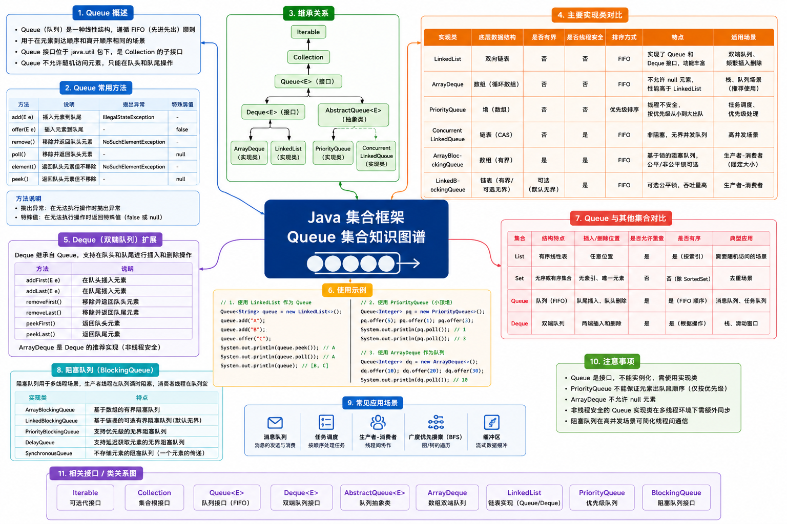

# Queue 队列




Queue（队列）继承自 `Collection` 接口 ，它代表了一种标准的 **先进先出** 的数据结构，强调的是对 **队头（Head）** 和 **队尾（Tail）** 的操作控制。

> [!NOTE] 核心特点
>
> - **边际操作高效**：从队头取出和队尾插入的时间复杂度通常为 $O(1)$；
> - **操作规范化**：限制了随机访问的能力，强行保证了数据的顺序处理；
> - **支持高并发**：Java 并发包（`java.util.concurrent`）提供了大量的 `BlockingQueue`（阻塞队列）实现，是生产者-消费者模式的核心实现机制；

::: info 适用场景

- **任务调度/缓冲**：Web  服务器处理请求、线程池的等待队列等，必须要严格的先进先出；
- **算法实现**：图与树的广度优先搜索；
- **消息传递**：异步事件驱动架构中的本地事件队列；

:::

Java 中的 Queue 常见的实现类有 `LinkedList`、`PriorityQueue` 和 `ArrayQueue`，其中后两者最常见且性能更好。


## PriorityQueue

PriorityQueue（优先级队列）并不严格遵循先进先出的顺序，而是按照 **元素的优先级（Priority）出队**，每次出队的都是当前队列中优先级最高（或最小）的元素。

> [!NOTE] 核心特点
>
> - **底层结构**：基于二叉小顶堆实现，内部由可变长数组存储；
> - **时间复杂度**：插入（offer）和删除（poll）的时间复杂度均为 $O(log n)$，查看队头（peek）为 $O(1)$；


### 常用方法

| 操作类型 |  推荐方法  | 抛异常方法 | 描述                                              |
| :------: | :--------: | :--------: | ------------------------------------------------- |
|   入队   | offer(E e) |  add(E e)  | 插入队列，成功返回 true                           |
|   出队   |   poll()   |  remove()  | 获取并移除优先级最高的元素，队列为空时返回 null   |
| 查看队头 |   peek()   | element()  | 获取但不移除优先级最高的元素，队列为空时返回 null |

```java
public static void main(String[] args) {
  // 创建优先级队列，默认小顶堆
  PriorityQueue<Integer> queue = new PriorityQueue<>();

  // 入队
  queue.offer(30);
  queue.offer(10);
  queue.offer(20);

  // 查看队头元素（不移除）
  System.out.println("队头元素：" + queue.peek()); // 10

  // 查看队列状态
  System.out.println("队列长度：" + queue.size()); // 3
  System.out.println("包含元素：" + queue.contains(15)); // false

  // 删除指定元素
  queue.remove(20);

  // 依次出队
  while (!queue.isEmpty()) {
    System.out.print(queue.poll() + " "); // 10 20 30
  }
}
```


### 误区一

PriorityQueue 和 ArrayDeque 均 **不允许插入 null 元素**，否则直接抛出 NullPointerException。

这是因为 `poll()` 和 `peek()` 方法 **使用 null 作为队列为空时的特殊返回值**，如果允许插入 null 值，则无法区分 “队列为空” 和 “队头元素本身存入 null 值” 的情况。

```java
public static void main(String[] args) {
  PriorityQueue<Integer> queue = new PriorityQueue<>();
  queue.offer(30);
  queue.offer(10);
  queue.offer(20);
  queue.offer(null); // 直接报错：NullPointerException // [!code --]
}
```


### 误区二

直接通过 `for-each` 或 `iterator()` 遍历 PriorityQueue，打印出的序列 **并不是升序/降序的**。

> [!TIP] 解决方式
>
> 只有反复调用 `poll()` 出队，或者将元素取出后再进行排序，才能保证获得有序序列。

```java
public static void main(String[] args) {
  PriorityQueue<Integer> queue = new PriorityQueue<>();
  queue.offer(30);
  queue.offer(10);
  queue.offer(20);

  // ❌ for-each遍历
  for (Integer i : queue) {
    System.out.print(i + " "); // 10 30 20
  }

  // ❌ iterator迭代器遍历
  Iterator<Integer> iterator = queue.iterator();
  while (iterator.hasNext()) {
    System.out.print(iterator.next() + " "); // 10 30 20
  }

  // ✅ 依次出队
  while (!queue.isEmpty()) {
    System.out.print(queue.poll() + " "); // 10 20 30
  }
}
```


### 误区三

将一个对象放入 PriorityQueue 后，如果直接修改了对象中参与排序的属性，PriorityQueue 内部 **不会自动更新该对象在队中的位置**，这会导致队列内部结构损坏，后续 `poll()` 拿到的不是最优元素。

> [!TIP] 解决办法
>
> 如果必须修改排序属性，先将该对象 `remove()` 取出，修改完后再 `offer()` 重新入队。
>

```java
public static void main(String[] args) {
  Task task1 = new Task("Task1", 30);
  Task task2 = new Task("Task2", 10);
  Task task3 = new Task("Task3", 20);

  PriorityQueue<Task> queue = new PriorityQueue<>();
  queue.offer(task1);
  queue.offer(task2);
  queue.offer(task3);

  System.out.println("队头元素：" + queue.peek()); // Task2(优先级:10)

  // ❌ 修改对象的优先级属性，会导致队列优先级混乱
  task1.setPriority(1); // [!code --]
  System.out.println("队头元素：" + queue.peek()); // Task2(优先级:10)

  // ✅ 先移除，然后重新入队
  queue.remove(task1);
  task1.setPriority(1);
  queue.offer(task1);
  System.out.println("队头元素：" + queue.peek()); // Task1(优先级:1)
}
```


## ArrayDeque

ArrayDeque（双端顺序队列）是 Deque（双端队列）接口的数组实现。它既可以作为单向队列（Queue）使用，也可以作为栈（Stack）使用。

> [!NOTE] 核心特点
>
> - 底层结构：基于循环数组实现，支持自动扩容；
> - 性能优势：作为队列使用时，性能通常优于 `LinkedList`（无节点创建开销，内存连续队 CPU 缓存友好）；作为栈使用时，性能显著优于 `Stack`；


### 常用方法

|   操作类型   |    队头操作     |    队尾操作    | 描述                        |
| :----------: | :-------------: | :------------: | --------------------------- |
| （队列）插入 | offerFirst(E e) | offerLast(E e) | 在队头/队尾插入元素         |
| （队列）获取 |   pollFirst()   |   pollLast()   | 从队头/队尾取出并移除元素   |
| （队列）查看 |   peekFirst()   |   peekLast()   | 查看队头/队尾元素（不移除） |
|              |                 |                |                             |
|  （栈）压栈  |    push(E e)    |       -        | 在队头插入                  |
|  （栈）弹栈  |      pop()      |       -        | 在队头取出，栈为空时抛异常  |
|  （栈）查看  |     peek()      |       -        | 查看栈顶元素                |

::: info 提示

除了上面的方法，还有类似的如 addFirst(E e)、addLast(E e) 等方法，但不推荐使用这些方法，因为它们在队列为空时并不会返回 null，而是抛出异常。

:::

::: code-group

```java [作为队列]
public static void main(String[] args) {
  ArrayDeque<String> deque = new ArrayDeque<>();

  // 双端插入
  deque.offerFirst("20");
  deque.offerFirst("10");
  deque.offerLast("30");
  System.out.println(deque); // [10, 20, 30]

  // 查看两端
  System.out.println("队头元素：" + deque.peekFirst()); // 10
  System.out.println("队尾元素：" + deque.peekLast()); // 30

  // 两端弹出
  System.out.println("从队头取出：" + deque.pollFirst()); // 10
  System.out.println("从队尾取出：" + deque.pollLast()); // 30
  System.out.println("剩余元素：" + deque); // [20]
}
```

```java [作为栈]
public static void main(String[] args) {
  ArrayDeque<String> stack = new ArrayDeque<>();
  // 压栈
  stack.push("1");
  stack.push("2");
  stack.push("3");
  System.out.println(stack); // [3, 2, 1]

  // 查看栈顶元素
  System.out.println("栈顶元素：" + stack.peek()); // 3

  // 依次弹栈
  while (!stack.isEmpty()) {
    System.out.print(stack.pop() + " "); // 3 2 1
  }
}
```

:::

> [!TIP]  提示
>
> 创建栈时，不要再使用旧版本的 Stack 了，它继承自 Vector，所有同步方法都带有锁，性能开销大，且破坏了面向对象的设计理念。官方文档中明确建议使用 ArrayQueue 代替 Stack 来实现单线程下的栈。
>


