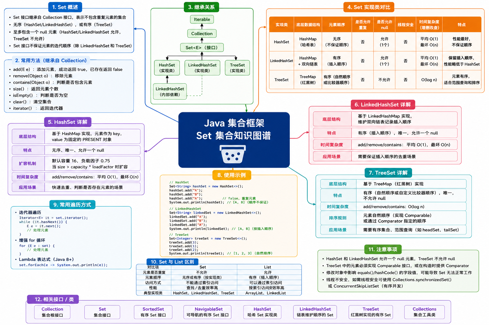

# Set 集合




## HashSet

HashSet 是 `java.util` 包中的一个核心集合类，它实现了 Set 接口，但底层本质上是 **基于 HashMap 来存储数据** 的。

与 List 不同，HashSet 是一个 **不允许存储重复元素** 的无序集合，当向 HashSet 中添加一个元素时，它实际上是把这个元素作为 Key 存入了内部的 HashMap 中。

> [!NOTE] 核心特点
>
> - **元素唯一性**：保证集合中不会出现重复的元素。如果添加已经存在的元素，操作会被忽略（并返回 false）；
> - **元素无序性**：存入元素的顺序和遍历输出的顺序可能完全不同，无法保证任何元素的顺序；
> - **仅允许一个 null 值**：允许存储一个且只能存储一个 null 值；
> - **非线程安全**：它是异步的，如果有多个线程同时修改 HashSet，必须手动进行同步；

> [!TIP] 优势和缺点
>
> ✅ 优势：
>
> - **查找和增删速度极快**：底层利用了哈希表，在没有哈希冲突的情况下，增、删、查操作的时间复杂度都是 $O(1)$；
> - **元素自动去重**：极其适合用于需要自动过滤重复数据的场景，无需手动写逻辑判断；
>
> ❌ 缺点：
>
> - **元素无序**：无法像 List 那样通过索引下标来获取元素，也不能保证元素按插入顺序排列；
> - **遍历性能受容器容量影响**：遍历 HashSet 的时间取决于集合中元素的数量以及底层哈希表的总容量；

::: info 适用场景

- **数据去重**：比如从一堆订单数据中提取出所有独立的用户 ID；
- **高效查找/集合运算**：比如判断某个元素是否存在于集合中（如黑名单过滤）、求两个集合的交集、并集或差集；

:::


### 常用方法

|   方法名    | 描述                                           |
| :---------: | ---------------------------------------------- |
|  add(ele)   | 向集合中添加元素，若已存在则添加失败返回 false |
|  remove(o)  | 向集合中删除指定元素，删除成功返回 true        |
| contains(o) | 判断集合中是否包含该元素                       |
|   size()    | 返回集合中的元素个数                           |
|  isEmpty()  | 判断集合是否为空                               |
|   clear()   | 清空集合                                       |

```java {8,11,15}
public static void main(String[] args) {
  HashSet<String> set = new HashSet<>();
  set.add("AAA");
  set.add("BBB");
  set.add("CCC");
  System.out.println(set); // [AAA, CCC, BBB]

  System.out.println("集合大小：" + set.size()); // 3

  // 添加已有元素
  boolean isAdded = set.add("CCC");
  System.out.println(isAdded); // false

  // 快速查找
  if (set.contains("CCC")) {
    System.out.println("集合包含元素CCC");
  }

  // 遍历集合
  for (String s : set) {
    System.out.println(s);
  }
}
```


### 误区一

当向 HashSet 中放入自定义对象（如 User、Student）时，必须同时重写该类的 `hashCode()` 和 `equals()` 方法。

> [!TIP] 判断逻辑
>
> HashSet 判断两个元素是否相同的逻辑：
> - 先比较两个对象的 `hashCode()` 是否相等；
> - 如果相等，再通过 `equals()` 判断类内部属性值是否相等；

如果不重写，即使两个对象的所有属性完全一样，它们也会被视为两个不同的对象存入 HashSet，从而导致去重失效。

::: code-group

```java {8} [Main]
public static void main(String[] args) {
  Student s1 = new Student(1, "张三");
  Student s2 = new Student(1, "张三");
  Student s3 = new Student(3, "李四");

  HashSet<Student> set = new HashSet<>();
  set.add(s1);
  set.add(s2); // 如果 Student 内部重写了 equals 方法，这里的 s2 会自动被过滤掉
  set.add(s3);
  System.out.println(set);
}
```

```java [Student]
public class Student {
  private Integer id;
  private String name;

  public Student() {
  }

  public Student(Integer id, String name) {
    this.id = id;
    this.name = name;
  }

  @Override
  public boolean equals(Object o) {
    if (o == null || getClass() != o.getClass()) return false;
    Student student = (Student) o;
    return Objects.equals(id, student.id) && Objects.equals(name, student.name);
  }

  @Override
  public int hashCode() {
    return Objects.hash(id, name);
  }

  @Override
  public String toString() {
    return "Student{" +
      "id=" + id +
      ", name='" + name + '\'' +
      '}';
  }
}
```

:::


### 误区二

将可变对象存入 HashSet 时，不要修改能影响到 hashCode/equals 计算的字段，否则会导致对象“丢失”，无法被正确查找、删除。

> [!TIP] 最佳实践
>
> - 如果对象要放入 HashSet，最好设计为不可变对象（字段用 final，且不提供 setter）；
> - 如果一定要修改，先 `set.remove()` ，修改完后再 `set.add()`；

::: code-group

```java [Main]
public static void main(String[] args) {
  Student s1 = new Student(1, "张三");
  Student s3 = new Student(2, "李四");

  HashSet<Student> set = new HashSet<>();
  set.add(s1);
  set.add(s3);
  System.out.println(set);

  s1.setName("王一博"); // 不要进行修改！ // [!code --]
  System.out.println(set);

  System.out.println(set.contains(s1)); // false
}
```

```java [Student]
public class Student {
  // 字段是用 final 修饰，且不提供 setter 方法
  private final Integer id;
  private final String name;

  public Student(Integer id, String name) {
    this.id = id;
    this.name = name;
  }

  @Override
  public boolean equals(Object o) {
    if (o == null || getClass() != o.getClass()) return false;
    Student student = (Student) o;
    return Objects.equals(id, student.id) && Objects.equals(name, student.name);
  }

  @Override
  public int hashCode() {
    return Objects.hash(id, name);
  }

  @Override
  public String toString() {
    return "Student{" +
      "id=" + id +
      ", name='" + name + '\'' +
      '}';
  }
}
```

:::


## LinkedHashSet

LinkedHashSet 是 HashSet 的一个直接子类，相比于 HashSet，它是 **有序且去重** 的集合。

LinkedHashSet 底层不仅使用了 HashSet 来保证元素的唯一性，还额外维护了一个 **双向链表** 来记录元素的插入顺序。

> [!NOTE] 核心特点
>
> - **元素唯一性**：继承自 HashSet，集合内不允许出现重复元素；
> - **维护插入顺序**：遍历 LinkedHashSet 时，元素的输出顺序与他们被 add 进去的先后顺序完全一致；
> - **仅允许一个 null 值**：允许存储一个且只能存储一个 null 值；
> - **非线程安全**：它是异步的，如果有多个线程同时修改 HashSet，必须手动进行同步；

> [!TIP] 优势和缺点
>
> ✅ 优势：
>
> - **元素有序性**：解决了 HashSet 存取顺序不一致的痛点，能严格按照插入顺序进行迭代；
> - **性能高效**：虽然比 HashSet 略慢，但其增、删、查操作的时间复杂度依然是稳定的 $O(1)$ 级别；
> - **迭代更高效**：遍历的时间只与集合内实际元素的数量 $(n)$ 有关，而与底层的哈希表的总容量无关；
>
> ❌ 缺点：
>
> - **内存开销更高**：因为每个元素都需要额外维护两个指针（prev 和 next）来保持链表顺序，所以它比 HashSet 消耗更多的内存；
> - **略微的性能牺牲**：再进行插入和删除操作时，需要同时维护哈希表和双向链表，因此由于链表指针的移动，性能会略低于 HashSet；

::: info 适用场景

- 去重且需要保持顺序：比如从日志文件中读取用户的访问 IP 记录，既需要过滤掉重复的 IP，又需要保持它们首次出现的先后顺序；

:::


### 常用方法

因为 LinkedHashSet 继承自 HashSet，因此它们的方法几乎完全一致，并没有引入特殊的新方法。

> [!TIP] 提示
>
> - 向 LinkedHashSet 放入自定义对象时，同样必须重写 `hashCode()` 和 `equals()` 方法，否则去重功能会失效；
> - 重复添加元素并不会生效，而且该元素在链表中的原本顺序也不会发生任何改变；

```java
public static void main(String[] args) {
  LinkedHashSet<String> hashSet = new LinkedHashSet<>();
  hashSet.add("BBB");
  hashSet.add("CCC");
  hashSet.addFirst("AAA");
  hashSet.addLast("DDD");
  System.out.println(hashSet); // [AAA, BBB, CCC, DDD]

  System.out.println(hashSet.size()); // 4

  boolean isAdded = hashSet.add("BBB");
  System.out.println(isAdded); // false

  if (hashSet.contains("CCC")) {
    System.out.println("集合中包含元素CCC");
  }

  for (String s : hashSet) {
    System.out.println(s);
  }
}
```


## TreeSet

TreeSet 实现了 NavigableSet 接口（且该接口扩展了 SortedSet），它的底层完全基于 TreeMap（红黑树）来存储数据。

如果说 HashSet 是“无序的”，LinkedHashSet 是“按顺序插入的”，那么 TreeSet 就是“按大小自动排好序的”。

> [!NOTE] 核心特点
>
> - **元素唯一性**：继承自 Set 接口，集合内不允许出现重复元素；
> - **自动排序**：放入 TreeSet 的元素会自动按照某种排序规则排列（比如数字从小到大，字母按 A-Z），也可以在创建时传入自定义比较器（Comparator）；
> - **不允许 null 值**：TreeSet 不允许插入 null 元素，因为再插入时需要调用元素的比较方法，如果是 null 会直接抛出 NullPointerException；
> - **底层是红黑树**：红黑树是一种自平衡的二叉查找树，它能保证数据在插入后依然保持有序；

> [!TIP] 优势和缺点
>
> ✅ 优势：
>
> - **始终有序**：无论以什么顺序添加元素，遍历它时都是严格有序的；
> - **强大的区间查找功能**：提供了非常丰富的导航方法，比如查找比某个值大的最小元素、查找某个范围内的子集合等；
> - **性能稳定**：它的增、删、查等操作的时间复杂度都稳定在 $O(logn)$；
>
> ❌ 缺点：
>
> - **性能略逊于哈希表**：相比于 HashSet 的 $O(1)$ 复杂度，$O(\log n)$ 的速度在数据量极大时会慢一些；
> - **元素必须具备可比性：** 存入的对象必须实现 `Comparable` 接口，或者在创建 TreeSet 时提供 `Comparator`，否则会直接报运行时异常；


::: info 适用场景

- **需要元素自动排序**：比如展示一个实时更新的高分排行榜；

- **区间提取与范围查找**：比如需要找出价格在 100 到 500 元之间的所有商品，或者查找年龄大于 18 岁的第一个用户；

:::


### 常用方法

除了基础的 `add()`、`remove()` 方法外，TreeSet 拥有很多独有的导航和截取方法：

|           方法           | 描述                                             |
| :----------------------: | ------------------------------------------------ |
|     first() / last()     | 返回当前集合中的 最小/最大 元素                  |
|   lower(e) / higher(e)   | 返回严格 小于/大于 给定元素的最近一个元素        |
|  floor(e) / ceiling(e)   | 返回 小于等于/大于等于 给定元素的最近一个元素    |
| pollFirst() / pollLast() | 弹出并返回当前集合中的 最小/最大 元素            |
|     subSet(from, to)     | 截取并返回从 from（包含）到 to（不包含）的子集合 |

::: code-group

```java {11,14,17,20,24} [基础数据]
public static void main(String[] args) {
  TreeSet<Integer> treeset = new TreeSet<>();
  treeset.add(80);
  treeset.add(67);
  treeset.add(90);
  treeset.add(59);
  treeset.add(80); // 重复元素会被自动过滤
  System.out.println(treeset); // [59, 67, 80, 90]

  // 获取最大值
  System.out.println(treeset.last()); // 90

  // 获取严格小于80分的最近一个元素
  System.out.println(treeset.lower(80)); // 67

  // 获取小于等于80分的最近一个元素
  System.out.println(treeset.floor(80)); // 80

  // 弹出并返回当前集合中的最大元素
  System.out.println(treeset.pollLast()); // 90
  System.out.println(treeset); // [59, 67, 80]

  // 截取子集合
  SortedSet<Integer> newSet = treeset.subSet(50, 70);
  System.out.println(newSet); // [59, 67]
}
```

```java {14-19} [对象排序1]
public static void main(String[] args) {
  // 原始写法：必须显式声明比较器
  // TreeSet<Project> treeset = new TreeSet<>(new Comparator<Project>() {
  //   @Override
  //   public int compare(Project o1, Project o2) {
  // 	if (o1.price.equals(o2.price)) {
  // 	  return o1.name.compareTo(o2.name);
  // 	}
  // 	return Double.compare(o1.price, o2.price);
  //   }
  // });

  // lambda表达式简写
  TreeSet<Project> treeset = new TreeSet<>((o1, o2) -> {
    if (o1.price.equals(o2.price)) {
      return o1.name.compareTo(o2.name);
    }
    return Double.compare(o1.price, o2.price);
  });

  treeset.add(new Project("iPhone17", 4999.0));
  treeset.add(new Project("xiaomi17", 4399.0));
  treeset.add(new Project("huawei mate80", 5399.0));

  System.out.println(treeset);
}
```

```java [Project]
public class Project {
  final String name;
  final Double price;

  public Project(String name, Double price) {
    this.name = name;
    this.price = price;
  }

  @Override
  public String toString() {
    return "Project{" +
      "name='" + name + '\'' +
      ", price=" + price +
      '}';
  }
}
```

```java [对象排序2]
public static void main(String[] args) {
  // 无需在 TreeSet 中指定比较器，因为 Project 已经实现了 Comparable 接口
  TreeSet<Project> treeset = new TreeSet<>();

  treeset.add(new Project("iPhone17", 4999.0));
  treeset.add(new Project("xiaomi17", 4399.0));
  treeset.add(new Project("huawei mate80", 5399.0));

  System.out.println(treeset);
}
```

```java {1,18-24} [Project]
public class Project implements Comparable<Project> {
  final String name;
  final Double price;

  public Project(String name, Double price) {
    this.name = name;
    this.price = price;
  }

  @Override
  public String toString() {
    return "Project{" +
      "name='" + name + '\'' +
      ", price=" + price +
      '}';
  }

  @Override
  public int compareTo(Project o) {
    if (this.price.equals(o.price)) {
      return this.name.compareTo(o.name);
    }
    return Double.compare(this.price, o.price);
  }
}
```

:::


### 误区一

TreeSet 去重逻辑不依赖于 `equals()` 而是依赖 `compareTo()`，它判断两个元素是否重复，完全是看比较器的结果是否为 0。

- 如果 `a.compareTo(b) == 0`，TreeSet 就认为它们是同一个元素，第二次添加的操作就会被拒绝（去重）；
- 哪怕两个对象的 `equals()` 返回 false，只要 `compareTo()` 返回 0，TreeSet 也认为它们重复。因此在编写自定义类时，强烈建议保持 `compareTo()` 的逻辑与  `equals()` 的实现一致；

::: code-group

```java [Main]
public static void main(String[] args) {
  Student s1 = new Student(1, "张三");
  Student s2 = new Student(2, "张三"); // 学号相同，但是姓名不相同，这是两位同学

  TreeSet<Student> treeset = new TreeSet<>();
  treeset.add(s1);
  treeset.add(s2); // 但是 compareTo() 方法中认定，只要姓名相同就是重复，因此第二位同学无法添加
  System.out.println(treeset); // [Student{id=1, name='张三'}]
}
```

```java [Student] {15,34}
public class Student implements Comparable<Student> {
  private final Integer id;
  private final String name;

  public Student(Integer id, String name) {
    this.id = id;
    this.name = name;
  }

  @Override
  public boolean equals(Object o) {
    if (o == null || getClass() != o.getClass()) return false;
    Student student = (Student) o;
    // 认为 id 和 name 都相同才是同一个学生
    return Objects.equals(id, student.id) && Objects.equals(name, student.name);
  }

  @Override
  public int hashCode() {
    return id.hashCode() + name.hashCode();
  }

  @Override
  public String toString() {
    return "Student{" +
      "id=" + id +
      ", name='" + name + '\'' +
      '}';
  }

  @Override
  public int compareTo(Student o) {
    // 只要 name 相同，就认定为重复
    return this.name.compareTo(o.name);
  }
}
```

:::
