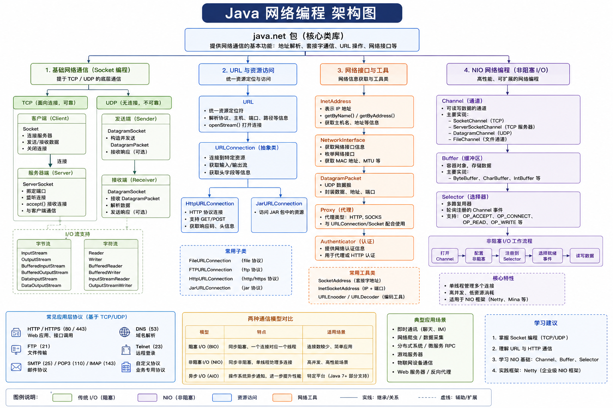

# 网络编程

网络编程是指编写能够运行在不同计算机（通过网络连接）上的程序，使它们之间可以相互传输数据、共享资源。

Java 中内置了强大的网络库（主要集中在 `java.net` 包中），使得开发者无需直接处理复杂的底层网络协议细节，就能轻松构建基于 TCP/IP 或 UDP 协议的网络应用。

网络编程中最常见的架构模式是 C/S架构：

- **服务端（Server）**：监听特定端口，等待客户端发起连接请求，接收请求并返回响应结果；
- **客户端（Client）**：向服务端的 IP 地址和端口发起连接请求，发送数据并接收服务端的处理结果；

根据数据传输方式的不同，网络编程主要基于两种协议：

|       协议类型        |          特点          |             Java类             | 适用场景                     |
| :-------------------: | :--------------------: | :----------------------------: | ---------------------------- |
|  TCP（传输控制协议）  | 面向连接、可靠、字节流 |      Socket、ServerSocket      | 文件传输、网页浏览、聊天信息 |
| UDP（用户数据报协议） | 无连接、不可靠、速度快 | DatagramSocket、DatagramPacket | 视频直播、在线游戏、语音通话 |

## TCP

## UDP

