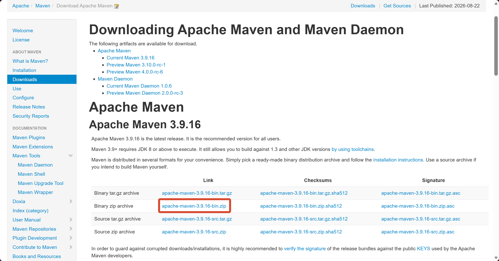
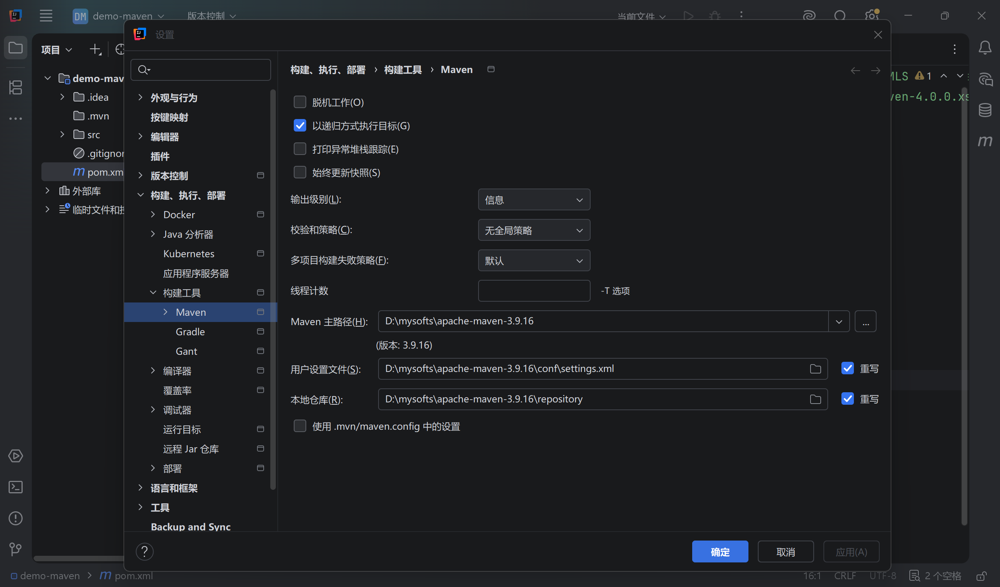

# 环境配置

Maven 是为 Java 项目管理构建、依赖管理的工具，使用 Maven 可以自动化构建、测试、打包和发布项目，大大提高了开发效率和质量。

> [!NOTE] 核心功能
>
> - **依赖管理**：管理项目中用到的依赖，包括自动下载所需依赖库，并保证没有版本冲突；
> - **构建管理**：管理项目中的编译、测试、打包、部署等构建过程，通过实现标准的构建生命周期，Maven 可以确保每一个构建过程都遵循相同的规则；


## Maven 安装

第一步：在 [Maven 官网](https://maven.apache.org/download.cgi) 下载安装包，将安装包解压至没有中文的目录下。




第二步：配置系统环境变量，在 “系统环境” 中新增 `MAVEN_HOME` 变量。

```tex
MAVEN_HOME=D:\mysofts\apache-maven-3.9.9
```


第三步：在“环境变量”的 path 中新增 `bin` 目录。

```java
%MAVEN_HOME%\bin
```


第四步：打开控制台，输入 `mvn -v` 检查当前 Maven 是否配置成功。


## Maven 功能配置

Maven 安装完成之后，打开 `conf/settings.xml` 文件，需要手动修改一些默认配置。

第一步：修改默认的 repository 仓库地址。

```xml
<!-- localRepository
   | The path to the local repository maven will use to store artifacts.
   |
   | Default: ${user.home}/.m2/repository
  <localRepository>/path/to/local/repo</localRepository>
  -->
<!-- 自定义 repository 仓库地址 -->
<localRepository>D:\mysofts\apache-maven-3.9.16\repository</localRepository>
```


第二步：配置国内阿里镜像源。

```xml
<mirrors>
  <!-- 阿里云 nexus 镜像地址 -->
  <mirror>
    <id>alimaven</id>
    <mirrorOf>central</mirrorOf>
    <name>aliyun maven</name>
    <url>http://maven.aliyun.com/nexus/content/groups/public/</url>
  </mirror>
</mirrors>
```


第三步：配置 JDK21 的依赖构建版本。

```xml
<profiles>
  <!-- 配置 JDK21 版本 -->
  <profile>
    <id>jdk-21</id>
    <activation>
      <activeByDefault>true</activeByDefault>
      <jdk>21</jdk>
    </activation>
    <properties>
      <maven.compiler.source>21</maven.compiler.source>
      <maven.compiler.target>21</maven.compiler.target>
      <maven.compiler.compilerVersion>21</maven.compiler.compilerVersion>
    </properties>
  </profile>
</profiles>
```


## 新建 Maven 工程

打开 IDEA，新建一个 Maven 工程后，需要在设置中更改 Maven 主路径及配置仓库地址。




## Maven 的 GAVP

GAVP 是 Maven 中用来标识一个依赖或项目构建产物（Artifact）的四大核心要素首字母缩写。

它是 Maven 依赖管理的核心机制，包含以下四个部分：

| 要素 |    全称    | 说明                                           | 示例                    |
| :--: | :--------: | :--------------------------------------------- | :---------------------- |
|  G   |  GroupId   | 组织或项目的唯一标识符（通常采用反向域名格式） | com.alibaba.boot        |
|  A   | ArtifactId | 项目或模块的名称                               | spring-boot-starter-web |
|  V   |  Version   | 项目或依赖的具体版本号                         | 3.2.0                   |
|  P   | Packaging  | 打包类型文件格式（默认为 `jar`）               | jar、war、pom           |


```xml
<!-- 项目自身的 GAVP 定义 -->
<groupId>com.example</groupId>
<artifactId>my-app</artifactId>
<version>1.0.0-SNAPSHOT</version>
<packaging>jar</packaging> <!-- 打包格式 -->

<dependencies>
  <!-- 引入第三方依赖 -->
  <dependency>
    <groupId>org.springframework.boot</groupId>
    <artifactId>spring-boot-starter-web</artifactId>
    <version>3.2.0</version>
  </dependency>
</dependencies>
```


