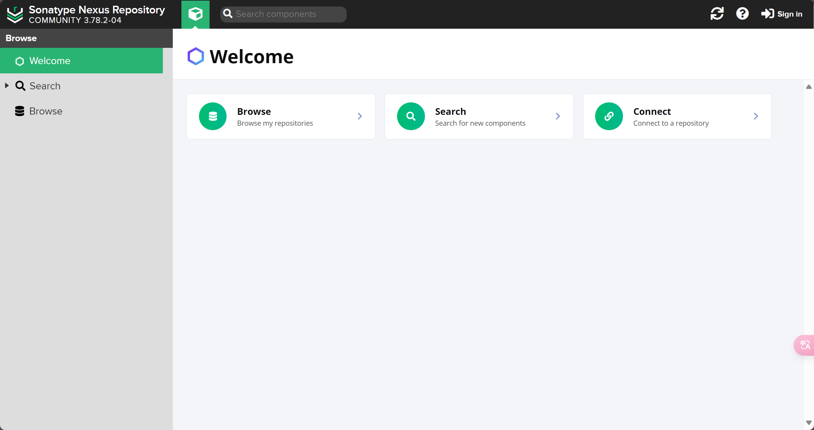

# 私服和Nexus

Maven私服是一种特殊的远程仓库，它是**假设在局域网的仓库服务**，用来代理位于外部的远程仓库。

>当然，也并不是说私服只能建立在局域网，也可以把它部署到公司的公网，然后所有人都可以使用。

建立了私服以后，当局域网内的用户需要某个构件时，会按照如下顺序进行请求和下载：

1. 第一步：请求本地仓库，若本地仓库不存在依赖，则进行第二步；
2. 第二步：请求Maven私服，将所需依赖下载到本地仓库，若私服中不存在所需依赖，则进行第三步；
3. 第三步：请求远程的仓库（如中央仓库、镜像仓库），将所需依赖下载并缓存到Maven私服，若远程仓库也不存在所需依赖，则报错；

此外，一些无法从外部仓库下载到的依赖，也能从本地上传到私服供其他人下载使用。


## Nexus安装

下载地址：[Nexus下载链接](https://help.sonatype.com/en/download.html)

>下载完成后，解压安装包，可以看到有 2 个文件夹：
>
>- nexus-3.78.2-04：nsxus的运行程序；
>- sonatype-work：nexus的工作空间，仓库文件存储位置；
>
>然后，进入 nexus-3.78.2-04\bin 文件夹下，先双击 `install-nexus-service.bat`，再双击 `nexus.bat`，此时 nexus 就算启动成功了。
>
>打开浏览器，输入 `localhost:8081` 即可查看 nexus 的可视化界面。



## Nexus登录

1. 点击右上角 Sign in 登录，默认用户名为 `admin`，密码根据提示路径获取（它是随机生成的）。

2. 登录完成后，重新修改密码为 `nexus@1234`：

   

3. 点击Next，来到第5步，选择 Nexus 的访问类型，选择 Disable anonymous access（不允许匿名访问）：

   


## Nexus仓库类型


仓库分类：

|    仓库名称     | 描述                                                         |
| :-------------: | ------------------------------------------------------------ |
|  maven-central  | Nexus对Maven中央仓库的**代理**，所以类型为 proxy             |
|  maven-public   | Nexus默认创建，供开发人员下载使用的**组仓库**，所以类型为 group |
| maven-releases  | Nexus默认创建，供开发人员部署自己的 jar 包到宿主仓库中，要求必须是**releases正式版本**（即包名称中必须包含 releases） |
| maven-snapshots | Nexus默认创建，供开发人员部署自己的 jar 包到宿主仓库中，要求必须是**snapshots测试版本**（即包名称中必须包含 snapshots） |

仓库类型：

| 仓库类型 | 描述                                      |
| :------: | ----------------------------------------- |
|  proxy   | 某个远程仓库的代理                        |
|  group   | 存放通过 Nexus 获取的第三方 jar 包        |
|  hosted  | 存放团队其他开发人员部署到 Nexus 的 jar包 |


## 通过Nexus下载jar包

1. 找到 `maven/conf/settings.xml` 文件，修改其中的配置为本地 Nexus：

   - 修改本地仓库路径：

     ::: info 提示

     这里需要手动在路径下创建 nexus-repository 空文件夹。

     :::

     ```xml
     <localRepository>D:\apache-maven-3.9.9\nexus-repository</localRepository>
     ```

   - `<mirrors>`中配置本地Nexus仓库：

     ```xml {5}
     <mirrors>
       <!-- 本地 Nexus 配置 -->
       <mirror>
         <!-- 注意这个 id 名称，后续需要使用到 -->
         <id>nexus-mine</id>
         <mirrorOf>central</mirrorOf>
         <name>Nexus mine</name>
         <url>http://localhost:8081/repository/maven-public/</url>
       </mirror>
     </mirrors>
     ```

   - 如果前面允许匿名访问的话，该内容不用配置，若不允许匿名访问，则需要配置 Nexus 用户名和密码：

     ```xml {4}
     <servers>
       <server>
         <!-- 注意：这里的 id 需要和 mirror 中的 id 保持一致 -->
         <id>nexus-mine</id>
         <username>admin</username>
         <password>nexus@1234</password>
       </server>
     </servers> 
     ```

   2. 打开 IDEA，查看 Maven 配置的仓库路径是否修改为 nexus-repository：

      

   3. 打开一个Maven项目，执行 `clean` 和 `package` 生命周期，再次查看 Nexus 客户端 nexus-public 路径，此时就把包下载到私服了：

      

4. 如果从私服下载依赖时，速度比较慢的话，可以修改中央仓库的默认地址为 阿里云镜像地址：

   ```
   http://maven.aliyun.com/nexus/content/groups/public/
   ```

   

   


## 部署jar包到Nexus

1. 在要部署的项目的 pom.xml 中，配置以下内容：

   ```xml
   <distributionManagement>
     <snapshotRepository>
       <!-- 需要和 settings.xml 中 mirror 标签中配置的名称一致 -->
       <id>nexus-mine</id>
       <!-- name名称可以随便命名 -->
       <name>nexus snapshot</name>
       <!-- 就是本地私服中 maven-snapshots 的地址 -->
       <url>http://localhost:8081/repository/maven-snapshots/</url>
     </snapshotRepository>
   </distributionManagement>
   ```

2. 给当前项目执行 **`deploy`** 生命周期，等构建完成以后，在 Nexus 的 maven-snapshots 中就能看到依赖了：

   


## 引用Nexus部署的包

在项目的 pom.xml 中配置以下内容：

```xml
<repositories>
  <repository>
    <id>nexus-mine</id>
    <name>nexus-mine</name>
    <url>http://localhost:8081/repository/maven-snapshots/</url>
    <snapshots>
      <enabled>true</enabled>
    </snapshots>
    <releases>
      <enabled>true</enabled>
    </releases>
  </repository>
</repositories>
```