# 请求参数接收

## GET 请求

### 基本参数注入

该方式使用 `GET` 或 `POST` 类型的请求都可以拿到参数，但一般为 `GET` 请求。

```java {8}
@Slf4j
@RestController
@RequestMapping("/user")
public class UserController {
  
  @GetMapping("/list")
  // @PostMapping("/list")
  public Response<Object> list(String username, Integer age) {
    log.info("接收的参数：{}, {}", username, age);
    return Response.ok(Map.of("username", username, "age", age));
  }
  
}
```

| 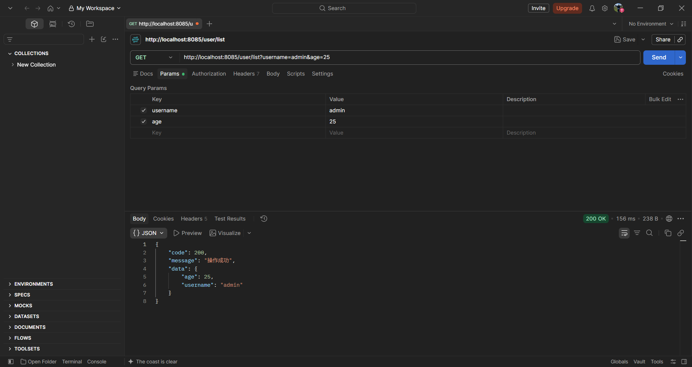 | 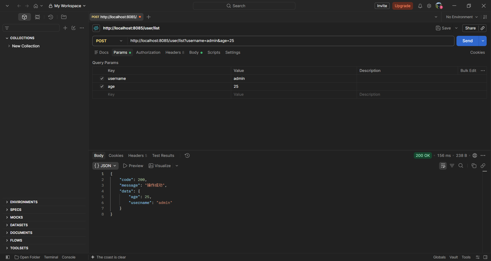 |
| :----------------------------------------------------------: | :----------------------------------------------------------: |
|                           GET 请求                            |                           POST 请求                           |


### 指定参数注入

如果前端传过来的参数名称和后端接收的形参名称不一致时，则需要使用 `@RequestParam` 注解进行映射。

```java {8,9}
@Slf4j
@RestController
@RequestMapping("/user")
public class UserController {
  
  @GetMapping("/list")
  public Response<Object> list(
		  @RequestParam("name") String username,
		  @RequestParam("myAge") Integer age) {
    log.info("接收的参数：{}, {}", username, age);
    return Response.ok(Map.of("username", username, "age", age));
  }
  
}
```

| 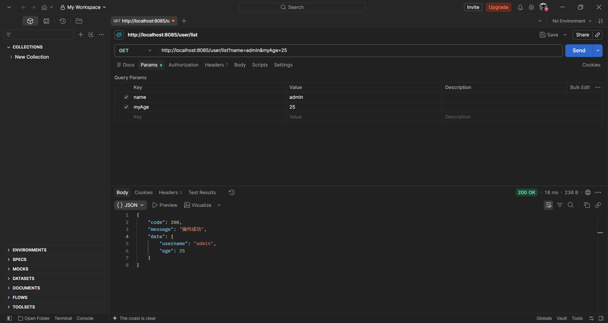 | 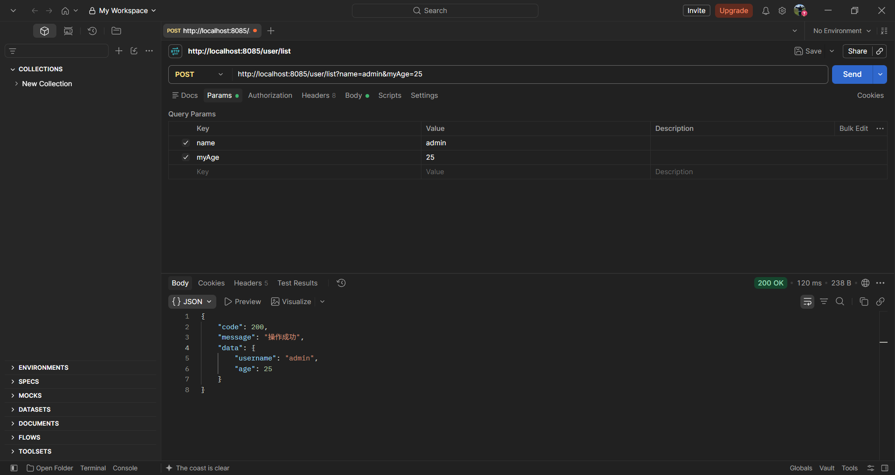 |
| :----------------------------------------------------------: | :----------------------------------------------------------: |
|                           GET 请求                           |                          POST 请求                           |


### 占位符参数注入

通过 `@PathVariable` 注解将 URL 中占位符参数绑定到控制器处理方法中形参上。

::: code-group

```java [自动映射] {6,7}
@Slf4j
@RestController
@RequestMapping("/user")
public class UserController {
  
  @GetMapping("/delUser/{userId}")
  public Response<Object> delUser(@PathVariable Integer userId) {
    log.info("接收的参数：{}", userId);
    return Response.ok(Map.of("userId", userId));
  }
  
}
```

```java [手动映射] {6,7}
@Slf4j
@RestController
@RequestMapping("/user")
public class UserController {
  
  @GetMapping("/delUser/{id}")
  public Response<Object> delUser(@PathVariable("id") Integer userId) { // 把请求路径中的 id 映射到 userId 上
    log.info("接收的参数：{}", userId);
    return Response.ok(Map.of("userId", userId));
  }
  
}
```

:::

| 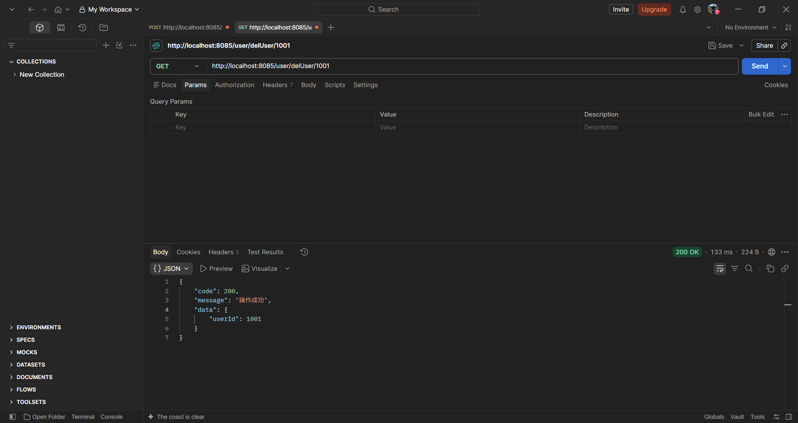 | 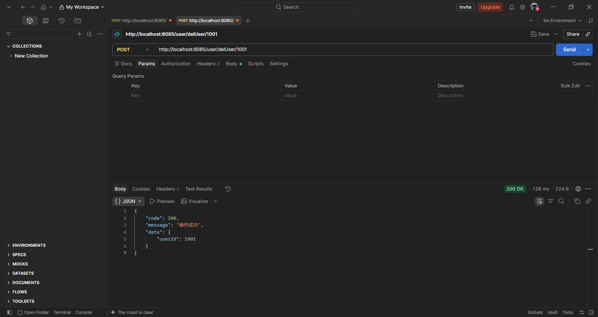 |
| :----------------------------------------------------------: | :----------------------------------------------------------: |
|                           GET 请求                           |                          POST 请求                           |


### 实体类参数注入

自定义一个实体类，当前端传过来的参数与实体类中的属性名一致，且实体类内有 `setter` 和 `getter` 方法时，参数会自动映射到实体类同名属性上。

::: code-group

```java [UserController] {7}
@Slf4j
@RestController
@RequestMapping("/user")
public class UserController {

  @GetMapping("/list")
  public Response<Object> list(User user) {
    log.info("接收的参数：{}", user);
    return Response.ok(Map.of("user", user));
  }

}
```

```java [User]
@Data
public class User {
  private String username;

  private Integer age;
}
```

:::

其实，如果前端传过来的参数只要与实体类中的属性名一致，无论接口方法上绑定了几个实体类，参数都能自动映射到实体类上。

::: code-group

```java [UserController]
@Slf4j
@RestController
@RequestMapping("/user")
public class UserController {
  @GetMapping("/list")
  public Response<Object> list(User user, PageQuery pageQuery) {
    log.info("接收的参数：{}", user);
    log.info("接收的参数：{}", pageQuery);
    return Response.ok(Map.of("user", user, "pageQuery", pageQuery));
  }
}

```

```java [PageQuery]
@Data
public class PageQuery {
  public Integer pageNum;

  public Integer pageSize;
}
```

:::

|  | 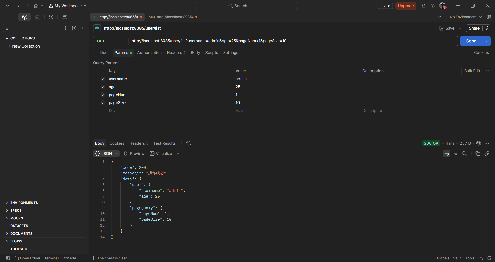 |
| :----------------------------------------------------------: | :----------------------------------------------------------: |
|                        单个实体类映射                        |                        多个实体类映射                        |


### 实体类 List 注入

实体类集合注入时，虽然是使用 `GET` 请求，但是遇到了 List 集合，就需要满足以下两个条件：

- 必须使用 `@RequestBody`；
- 参数必须是 JSON 格式（POST 请求的传参方式），不能是在 URL 后面用 `?` 的方式拼接；

```java {6}
@Slf4j
@RestController
@RequestMapping("/user")
public class UserController {
  @GetMapping("/batchInsert")
  public Response<List<User>> batchInsert(@RequestBody List<User> users) {
    log.info("接收的参数：{}", users);
    return Response.ok(users);
  }
}
```

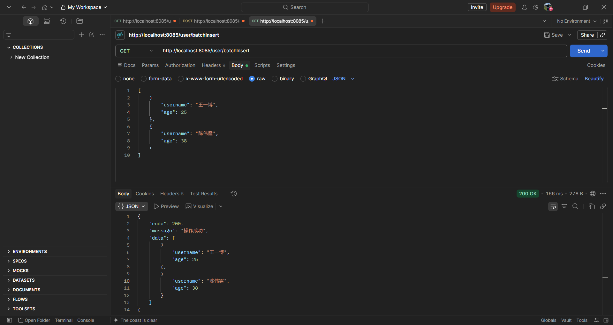


### 基本类型 List 注入

基本类型通过集合方式传参时，后端接口需要使用 `@RequestParam` 注解接收。

::: code-group

```java [自动映射] {7}
@Slf4j
@RestController
@RequestMapping("/user")
public class UserController {

  @GetMapping("/list")
  public Response<List<String>> list(@RequestParam List<String> names) {
    log.info("接收到的参数：{}", names);
    return Response.ok(names);
  }

}
```

```java [手动映射] {7}
@Slf4j
@RestController
@RequestMapping("/user")
public class UserController {

  @GetMapping("/list")
  public Response<List<String>> list(@RequestParam("name") List<String> names) { // 将请求参数 name 映射到形参 names 上
    log.info("接收到的参数：{}", names);
    return Response.ok(names);
  }

}
```

```java [多个集合映射] {8,9}
@Slf4j
@RestController
@RequestMapping("/user")
public class UserController {

  @GetMapping("/list")
  public Response<Object> list(
		  @RequestParam List<String> names,
		  @RequestParam List<Integer> ages) {
    log.info("接收到的参数：{}", names);
    log.info("接收到的参数：{}", ages);
    return Response.ok(Map.of("names", names, "ages", ages));
  }

}
```

:::

| 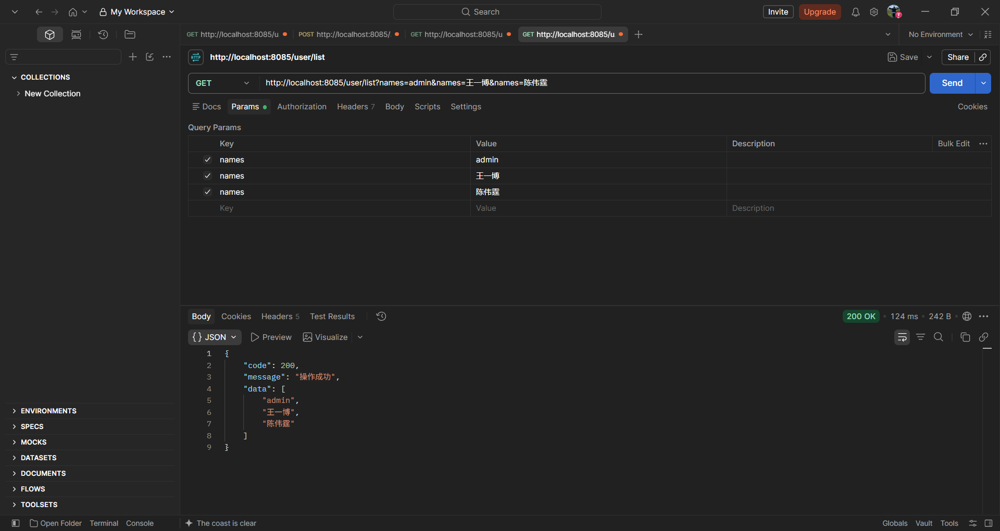 | 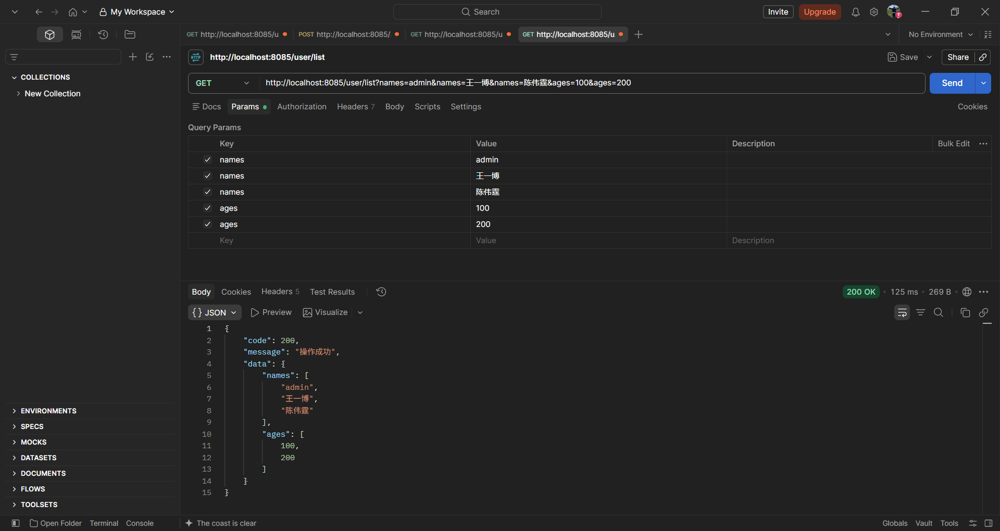 |
| :----------------------------------------------------------: | :----------------------------------------------------------: |
|                         单个集合映射                         |                         多个集合映射                         |


### 基本类型 Map 注入

使用 `Map<K, V>` 集合可以接收前端传过来的任意基本类型，但必须搭配 `@RequestParam` 注解使用。

```java {7}
@Slf4j
@RestController
@RequestMapping("/user")
public class UserController {

  @GetMapping("/list")
  public Response<Object> list(@RequestParam Map<String, Object> params) {
    log.info("接收到的参数：{}", params);
    return Response.ok(params);
  }

}
```

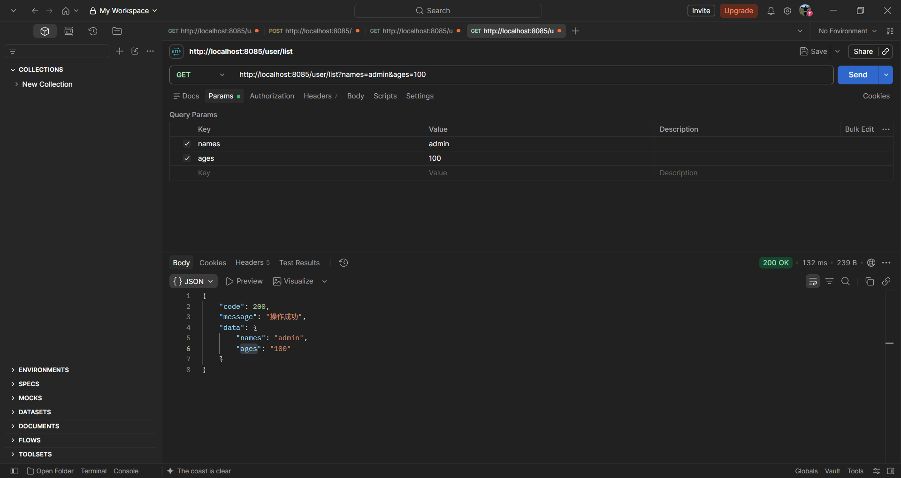


### 基本类型 数组 注入

::: code-group

```java [自动映射] {7}
@Slf4j
@RestController
@RequestMapping("/user")
public class UserController {

  @GetMapping("/list")
  public Response<String[]> list(String[] names) {
    log.info("接收到的参数：{}", Arrays.toString(names));
    return Response.ok(names);
  }

}
```

```java [手动映射] {7}
@Slf4j
@RestController
@RequestMapping("/user")
public class UserController {

  @GetMapping("/list")
  public Response<String[]> list(@RequestParam("name") String[] names) {
    log.info("接收到的参数：{}", Arrays.toString(names));
    return Response.ok(names);
  }

}
```

```java [多个数组映射] {7}
@Slf4j
@RestController
@RequestMapping("/user")
public class UserController {

  @GetMapping("/list")
  public Response<Object> list(String[] names, Integer[] ages) {
    log.info("接收到的参数：{}", Arrays.toString(names));
    log.info("接收到的参数：{}", Arrays.toString(ages));
    return Response.ok(Map.of("names", names, "ages", ages));
  }

}
```

:::

| 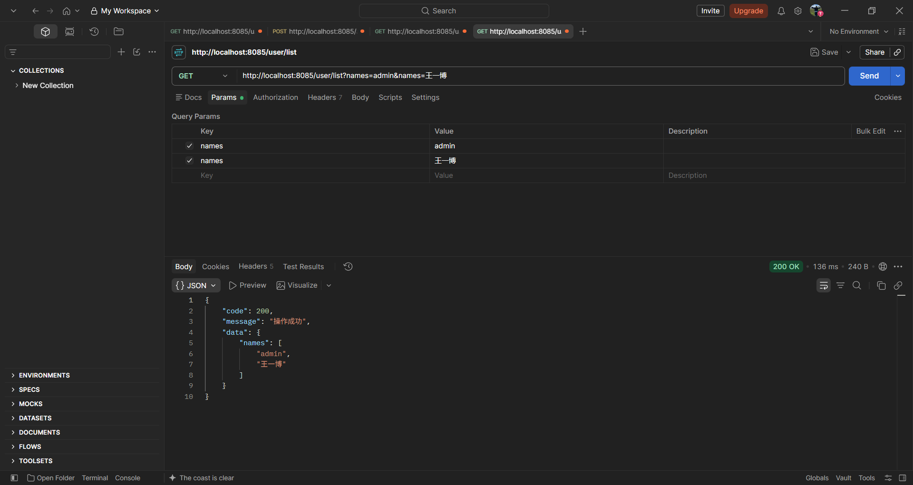 | 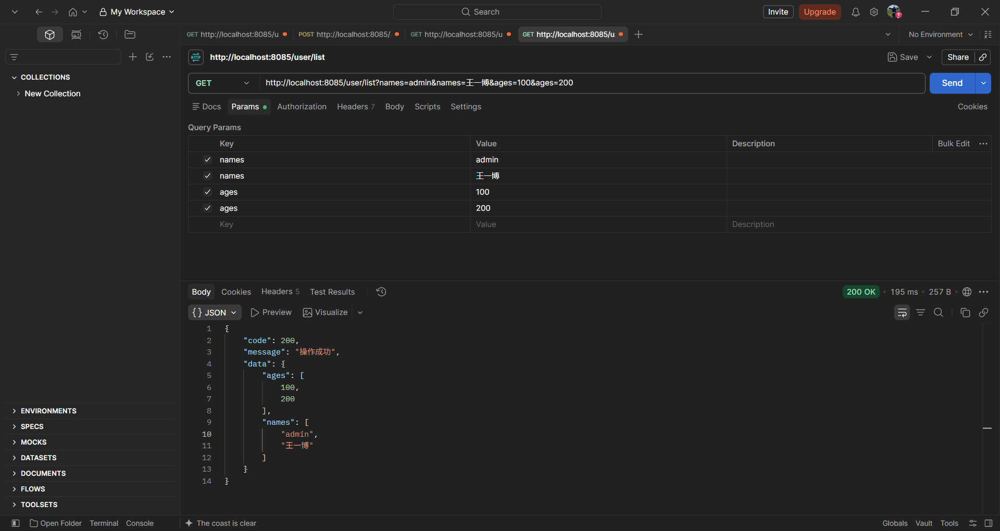 |
| :----------------------------------------------------------: | :----------------------------------------------------------: |
|                           自动映射                           |                         多个数组映射                         |


## POST 请求

> [!IMPORTANT] 
>
> 在 `POST` 请求中，一个方法里只能使用一次 `@RequestBody`，其他的参数需要通过其他方式传过来。这是因为 `@RequestBody` 执行一次后，就关闭了请求流，这导致其他 `@RequestBody` 修饰的参数无法获取到 JSON，从而报错。

### 基本参数注入

```java
@Slf4j
@RestController
@RequestMapping("/user")
public class UserController {

  @PostMapping("/list")
  public Response<Object> list(@RequestBody String name) {
    log.info("接收到的参数：{}", name);
    return Response.ok(Map.of("name", name));
  }

}
```

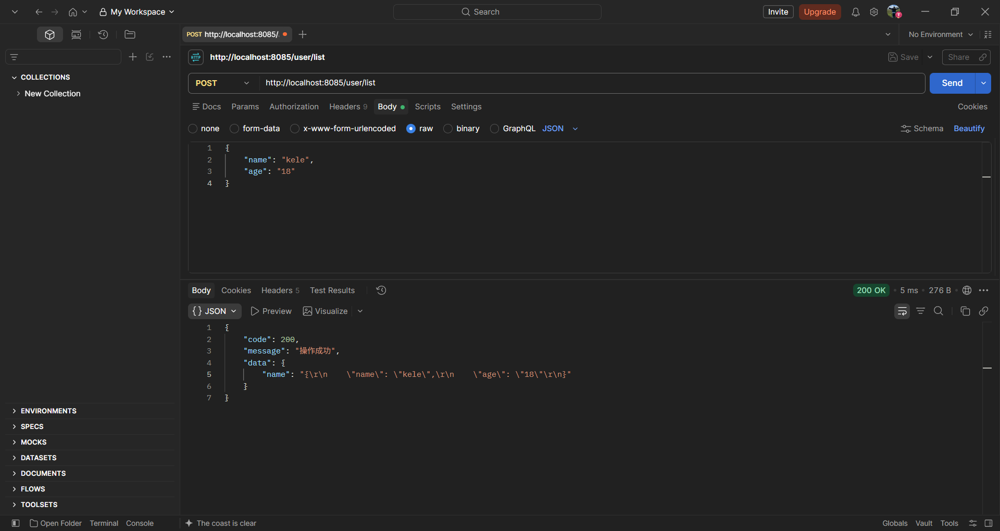


### 实体类参数注入

```java
@Slf4j
@RestController
@RequestMapping("/user")
public class UserController {

  @PostMapping("/list")
  public Response<Object> list(@RequestBody User user) {
    log.info("接收到的参数：{}", user);
    return Response.ok(user);
  }

}
```

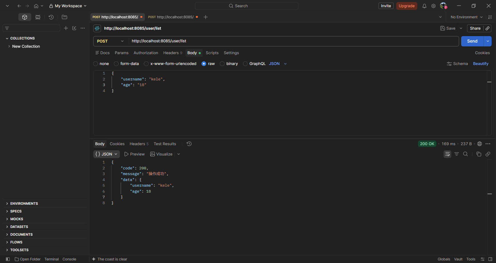


### 实体类 List 注入

```java
@Slf4j
@RestController
@RequestMapping("/user")
public class UserController {

  @PostMapping("/batchInsert")
  public Response<List<User>> batchInsert(@RequestBody List<User> users) {
    log.info("接收到的参数：{}", users);
    return Response.ok(users);
  }

}
```

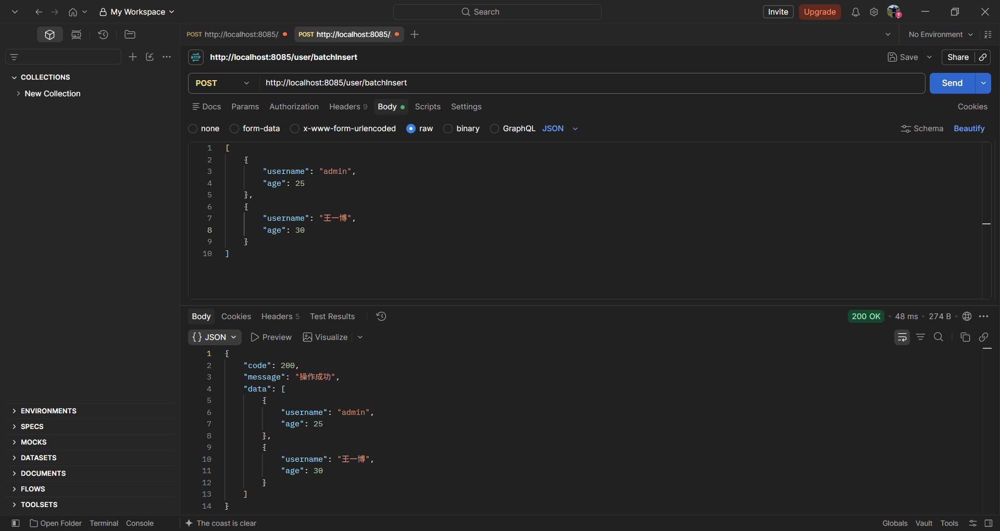


### Form 表单

Form 表单传参使用 `x-www-form-unlencoded`，后端接收参数的方式和 `GET` 请求基本类似。但在使用时，需要注意以下几点：

- 实体类、实体类集合作为参数时，只能接收通过  JSON 格式传递的参数，无法接收 `x-www-form-unlencoded`；
- 如果是其他非实体类的参数，则需要在参数前面添加 `@RequestParam` 接收即可，包括：List、Map、数组等；

```java
@Slf4j
@RestController
@RequestMapping("/user")
public class UserController {

  @PostMapping("/addUser")
  public Response<Object> addUser(@RequestParam List<String> names) {
	log.info("接收到的参数：{}", names);
	return Response.ok(names);
  }

  @PostMapping("/addUser2")
  public Response<Object> addUser2(@RequestParam String[] names) {
	log.info("接收到的参数：{}", Arrays.toString(names));
	return Response.ok(names);
  }

  @PostMapping("/addUser3")
  public Response<Object> addUser3(@RequestParam Map<String, Object> names) {
	log.info("接收到的参数：{}", names);
	return Response.ok(names);
  }

}
```

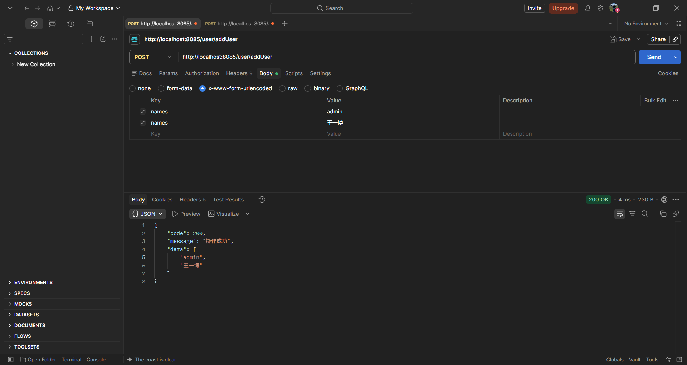


