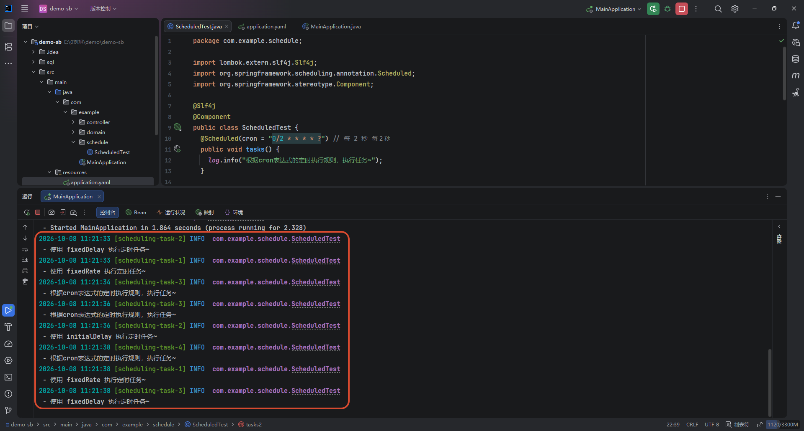

# 定时任务

SpringBoot 中的定时任务是一种无需依赖外部调度中心（如 Quartz），通过内置注解即可让程序在指定时间或固定间隔自动执行特定业务逻辑的机制。

> [!NOTE] 核心注解
>
> SpringBoot 内部基于 Spring Framework 的 `TaskScheduler` 接口封装，最基础的实现仅需 2 个注解：
>
> - `@EnableScheduling`：标注在 **启动类** 或 **配置类** 上，用于发现并启用容器中的定时任务；
> - `@Scheduled`：标注在 **具体的方法** 上，定义该任务的触发规则与执行周期；

::: code-group

```java {1} [MainApplication]
@EnableScheduling // 启用定时任务
@SpringBootApplication
public class MainApplication {
  public static void main(String[] args) {
    SpringApplication.run(MainApplication.class, args);
  }
}
```

```java {4} [ScheduledTest]
@Slf4j
@Component
public class ScheduledTest {
  @Scheduled(cron = "0/2 * * * * ?") // 每 2 秒
  public void tasks() {
    log.info("根据cron表达式的定时执行规则，执行任务~");
  }
}
```

:::

> [!CAUTION] 注意事项
>
> - **标注了 `@Scheduled` 的方法必须满足两个基本条件**：
>   - 方法返回类型必须是 `void`；
>   - 方法不能有入参（触发时由调度器调用，无法传递运行时参数）；
> - **分布式环境并发问题**：当服务进行多实例（集群/容器化）部署时，每个节点都会独立运行该定时任务，导致同一任务被重复执行多次。在分布式架构中，通常需要引入 分布式锁 或使用专门的分布式任务调度平台（如 Quartz）；


## @Scheduled 注解

`@Scheduled` 注解的主要触发方式有以下几种：

|   属性参数   | 说明                                           | 实例                                               | 场景                                   |
| :----------: | ---------------------------------------------- | -------------------------------------------------- | -------------------------------------- |
|  fixedRate   | 按照固定频率执行（以前一次任务的开始时间计算） | @Scheduled(fixedRate = 10000)                      | 无论前次耗时多久，每 10 秒尝试触发一次 |
|  fixedDelay  | 按照固定间隔执行（以前一次任务的完成时间计算） | @Scheduled(fixedDelay = 5000)                      | 前次运行结束后，等待 5 秒再执行下次    |
| initialDelay | 首次执行的延迟时间                             | @Scheduled(initialDelay = 10000, fixedRate = 5000) | 服务启动 10 秒后才开始首次轮询         |
|     cron     | 使用 Cron 表达式精确指定复杂的执行规则         | @Scheduled(cron = "0/2 * * * * ?")                 | 每 2 秒执行一次                        |

```java {4,9,14,19}
@Slf4j
@Component
public class ScheduledTest {
  @Scheduled(cron = "0/2 * * * * ?") // 每 2 秒
  public void tasks() {
    log.info("根据cron表达式的定时执行规则，执行任务~");
  }

  @Scheduled(fixedRate = 5000)
  public void tasks1() {
    log.info("使用 fixedRate 执行定时任务~");
  }

  @Scheduled(fixedDelay = 5000)
  public void tasks2() {
    log.info("使用 fixedDelay 执行定时任务~");
  }

  @Scheduled(initialDelay = 3000, fixedDelay = 5000)
  public void tasks3() {
    log.info("使用 initialDelay 执行定时任务~");
  }
}
```


## 单线程阻塞问题

默认情况下，SpringBoot 的定时任务运行在一个单线程的线程池中。如果某个任务耗时过长或发生阻塞，后续的所有定时任务都会排队阻塞。

生产环境中通常需要配置自定义的 `TaskScheduler` 或 `ThreadPoolTaskScheduler`：

```yaml
spring:
  task:
    scheduling:
      pool:
        # 将定时任务线程池大小调整为多个线程
        size: 5
      # 线程统一的名称前缀
      thread-name-prefix: scheduling-task-
```




