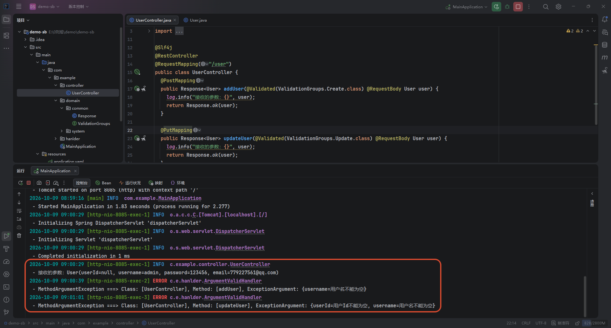

# 参数校验

参数校验是网站不可或缺的功能，虽然前端可以涵盖大部分的校验职责，如用户名唯一性、密码长度、邮箱格式等，但是为了避免用户绕过浏览器，使用第三方工具直接向后端请求一些违法数据，服务端的校验也非常有必要。


## 基础校验

在 SpringBoot 项目中，只需要引入 `spring-boot-starter-validation` 校验器即可：

```xml
<dependencies>
  <dependency>
    <groupId>org.springframework.boot</groupId>
    <artifactId>spring-boot-starter-validation</artifactId>
  </dependency>
</dependencies>
```

引入后，在需要进行参数校验的位置使用 `@Valid` 注解标注。


::: code-group

```java [UserController] {6}
@Slf4j
@RestController
@RequestMapping("/user")
public class UserController {
  @PostMapping
  public Response<User> addUser(@Valid @RequestBody User user) {
    log.info("接收的参数：{}", user);
    return Response.ok(user);
  }
}
```

```java [User]
@Data
@NoArgsConstructor
@AllArgsConstructor
public class User {
  @NotNull(message = "用户Id不能为空")
  private Long userId;

  @NotBlank(message = "用户名不能为空")
  @Size(min = 2, max = 20, message = "用户名长度必须在 2 到 20 之间")
  private String username;

  @NotBlank(message = "密码不能为空")
  @Length(min = 6, max = 12, message = "密码长度必须在 6 到 12 位之间")
  private String password;

  @NotBlank(message = "邮箱不能为空")
  @Email(message = "邮箱格式不正确")
  private String email;
}
```

::: 

常用的校验注解：

|    校验注解    | 描述                                                         |
| :------------: | ------------------------------------------------------------ |
|   @NotBlank    | 只能用于字符串，表示字符串不能为 null，并且去除两端空白字符后长度大于 0 |
|   @NotEmpty    | 只能用于字符串、集合、Map、数组，表示不能为 null，并且 长度大于等于 1 |
|    @NotNull    | 适用于所有类型，且不能为 null                                |
|  @AssertTrue   | 被标注的元素必须为 true                                      |
|  @AssertFalse  | 被标注的元素必须为 false                                     |
|  @Min(value)   | 被标注的元素必须是一个数字，且值必须大于等于指定值           |
|  @Max(value)   | 被标注的元素必须是一个数字，且值必须小于等于指定值           |
| @Size(min, max) | 被标注的元素的大小必须在指定范围内                           |
|     @Email     | 被标注的元素必须是合法的电子邮件格式                         |
|    @Length     | 被标注的字符串长度必须在指定范围内                           |
|     @Range     | 被标注的元素必须在指定的范围内                               |

> [!TIP] 提示
>
> 如果是参数是字符串类型，优先使用 `@NotBlank`，而不是 `@NotNull` 或 `@NotEmpty`。这是因为如果字符串是 “” ，后两个无法判断是否为空。
>


## 获取校验消息

当参数校验失败时，可以通过方法参数 `BindingResult` 获取失败的 Message。

```java {6}
@Slf4j
@RestController
@RequestMapping("/user")
public class UserController {
  @PostMapping
  public Response<User> addUser(@Valid @RequestBody User user, BindingResult bindingResult) {
    if (bindingResult.hasErrors()) {
      // 获取相应字段上添加的 message 的内容
      String message = bindingResult.getFieldError().getDefaultMessage();
      log.info("接收的参数有误：{}", message);
      return Response.fail(message);
    }
    log.info("接收的参数：{}", user);
    return Response.ok(user);
  }
}
```

实际开发中，在方法参数中声明 `BindingResult` 会比较麻烦。因此可以借助切面编程，在全局捕获 **方法参数校验异常**：

::: code-group

```java {7} [Exception获取类名]
/**
 * 参数校验异常处理器
 */
@Slf4j
@RestControllerAdvice
public class ArgumentValidHandler {
  @ExceptionHandler(MethodArgumentNotValidException.class)
  public Response<Map<String, String>> handleValidationExceptions(MethodArgumentNotValidException exception) {
    MethodParameter parameter = exception.getParameter();
    // 获取请求的类名称
    String simpleName = parameter.getContainingClass().getSimpleName();
    // 获取请求的接口名称
    Method method = parameter.getMethod();
    String methodName = (method != null) ? method.getName() : "UNKNOWN";

    // 获取请求出现参数校验的失败字段
    Map<String, String> errors = new HashMap<>();
    for (FieldError error : exception.getBindingResult().getFieldErrors()) {
      errors.put(error.getField(), error.getDefaultMessage());
    }
    log.error("MethodArgumentException ===> Class: [{}], Method: [{}], ExceptionArgument: {}", simpleName, methodName, errors);
    return Response.fail(errors);
  }
}
```

```java [HandlerMethod获取类名]
/**
 * 参数校验异常处理器
 */
@Slf4j
@RestControllerAdvice
public class ArgumentValidHandler {
  @ExceptionHandler(MethodArgumentNotValidException.class)
  public Response<Map<String, String>> handleValidationExceptions(MethodArgumentNotValidException exception, HandlerMethod handlerMethod) {
    String simpleName = "UNKNOWN";
    String methodName = "UNKNOWN";
    if (handlerMethod != null) {
      simpleName = handlerMethod.getBeanType().getSimpleName();
      methodName = handlerMethod.getMethod().getName();
    }

    // 获取请求出现参数校验的失败字段
    Map<String, String> errors = new HashMap<>();
    for (FieldError error : exception.getBindingResult().getFieldErrors()) {
      errors.put(error.getField(), error.getDefaultMessage());
    }
    log.error("MethodArgumentException ===> Class: [{}], Method: [{}], ExceptionArgument: {}", simpleName, methodName, errors);
    return Response.fail(errors);
  }
}
```

:::




## 分组校验

分组校验通常用于同一 DTO 在不同操作场景下的差异化约束（如 新增时不需要传 Id，修改时必须传 Id）。

首先，需要定义一个空的 Java 接口，作为 **检验分组的标识符**：

```java
public interface ValidationGroups {
  // 继承 Default 之后，未指定 groups 的字段默认触发所有校验
  interface Create extends Default {
  }

  interface Update extends Default {
  }
}
```


然后，在 DTO 实体的注解上指定 `groups` 属性，约束注解与分组绑定。

```java
@Data
@NoArgsConstructor
@AllArgsConstructor
public class User {
  @NotNull(message = "用户Id不能为空", groups = {ValidationGroups.Update.class}) // 更新时必填 // [!code ++]
  private Long userId;

  @NotBlank(message = "用户名不能为空")
  @Size(min = 2, max = 20, message = "用户名长度必须在 2 到 20 之间") // 继承了 Default 之后，不写 groups 默认新增和更新都生效
  private String username;

  @NotBlank(message = "密码不能为空", groups = {ValidationGroups.Create.class}) // 新增时必填 // [!code ++]
  @Length(min = 6, max = 12, message = "密码长度必须在 6 到 12 位之间")
  private String password;

  @NotBlank(message = "邮箱不能为空")
  @Email(message = "邮箱格式不正确") // 继承了 Default 之后，不写 groups 默认新增和更新都生效
  private String email;
}
```


最后，在 Controller 层使用 `@Validated` 指定激活的分组：

> [!WARNING] 注意
>
> 必须使用 Spring 提供的 `@Validated` 注解，`@Valid` 注解不支持分组。

```java {6,12}
@Slf4j
@RestController
@RequestMapping("/user")
public class UserController {
  @PostMapping
  public Response<User> addUser(@Validated(ValidationGroups.Create.class) @RequestBody User user) {
    log.info("接收的参数：{}", user);
    return Response.ok(user);
  }

  @PutMapping
  public Response<User> updateUser(@Validated(ValidationGroups.Update.class) @RequestBody User user) {
    log.info("接收的参数：{}", user);
    return Response.ok(user);
  }
}
```


## 嵌套校验

实现嵌套校验的核心是：在父类（`User`）中的嵌套对象字段上添加 `@Valid` 注解。

如果不加 `@Valid` ，校验引擎只会检查父类 `User` 自身的第一层属性，直接跳过内部的 `Role` 对象的约束。

::: code-group

```java [User] {20,24}
@Data
@NoArgsConstructor
@AllArgsConstructor
public class User {
  @NotNull(message = "用户Id不能为空")
  private Long userId;

  @NotBlank(message = "用户名不能为空")
  @Size(min = 2, max = 20, message = "用户名长度必须在 2 到 20 之间")
  private String username;

  @NotBlank(message = "密码不能为空")
  @Length(min = 6, max = 12, message = "密码长度必须在 6 到 12 位之间")
  private String password;

  @NotBlank(message = "邮箱不能为空")
  @Email(message = "邮箱格式不正确")
  private String email;

  @Valid // 开启级联校验（嵌套校验）
  @NotNull(message = "用户角色信息不能为空") // 如果嵌套对象本身不能为null，配合 @NotNull 注解再次约束
  private Role role;

  @Valid // List 集合时，@Valid 同样可以开启级联校验
  private List<Role> roles;
}
```

```java [Role]
@Data
@NoArgsConstructor
@AllArgsConstructor
public class Role {
  @NotBlank(message = "角色Id不能为空")
  private String roleId;

  @NotBlank(message = "角色名称不能为空")
  private String roleName;
}
```

```java [UserController]
@Slf4j
@RestController
@RequestMapping("/user")
public class UserController {
  @PostMapping
  public Response<User> addUser(@Valid @RequestBody User user) {
    log.info("接收的参数：{}", user);
    return Response.ok(user);
  }
}
```

:::


