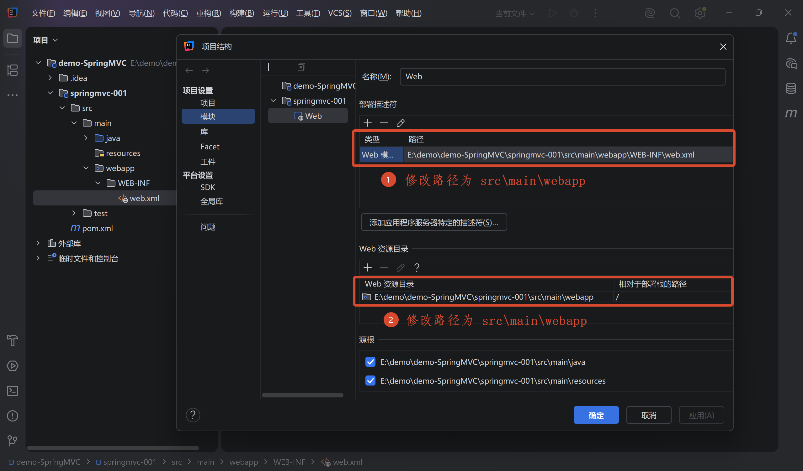
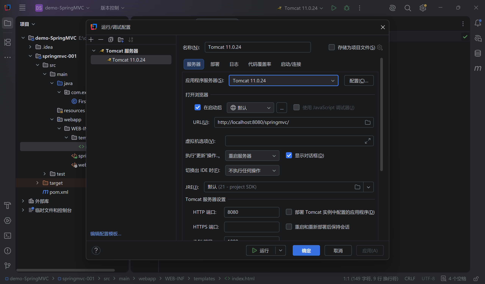
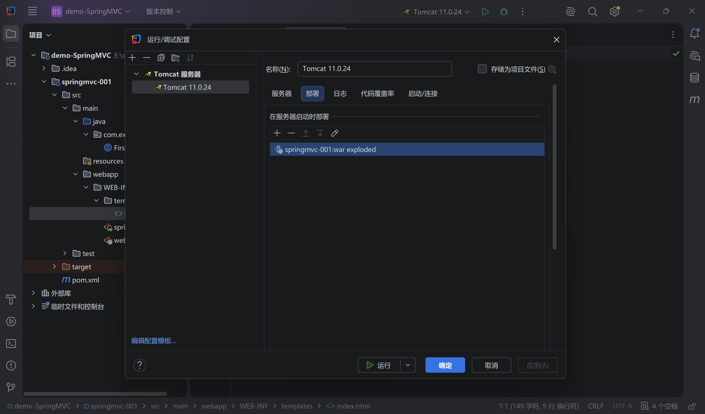
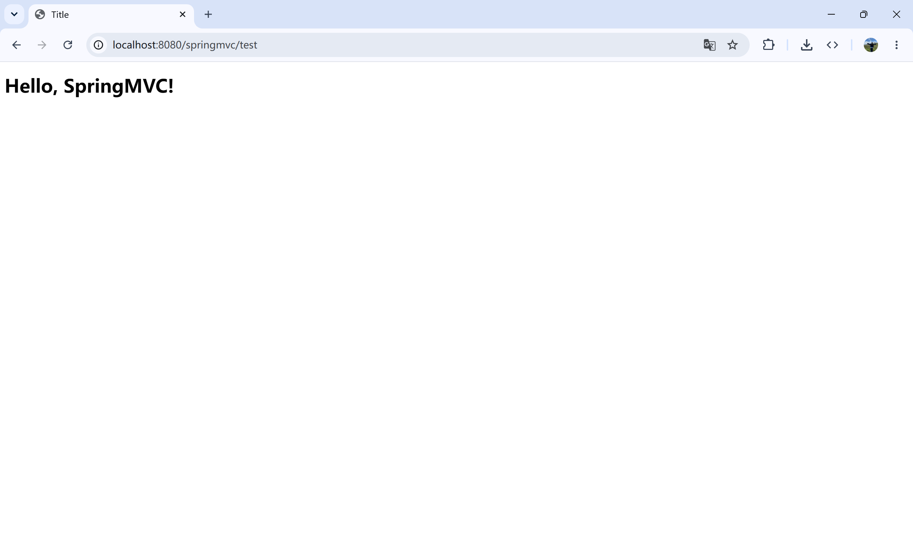

# 基础概述

MVC 是一种软件架构设计模式，而 SpringMVC 是基于 Java 语言和 Spring 框架对 MVC 模式的具体实现。


## 什么是 MVC

MVC 是 Model-View-Controller（模型-视图-控制器）的缩写，核心目的是 **关注点分离**，将业务逻辑、数据展示与用户交互解耦。

- **M（Model，模型层）**：处理数据的 JavaBean 类；
  - 实体类 Bean：存储业务数据
  - 业务处理 Bean：Service 或 Dao，处理业务逻辑和数据访问

- **V（View，视图层）**：负责将数据以用户可感知的形式展现（如 HTML 页面、JSP 等）；
- **C（Controller，控制层）**：负责接收用户的请求，协调 Model 处理数据，并决定将哪个 View 展示给用户；


## 什么是 SpringMVC

SpringMVC 是 Spring 中的一个轻量级 Web 模块，它围绕原生的 Servlet API 构建，提供了一整套基于 MVC 思想的 Web 开发解决方案。

SpringMVC 的核心设计理念是前端控制器模式（Front Controller Parttern），所有的请求都会先经过统一的中央调度器 `DispatcherServlet`，再由它分派给具体的组件执行。


### 执行流程

当客户端发起一个 HTTP 请求时，SpringMVC 内部会依次执行以下步骤：

|       控制器        |     名称     | 描述                                                         |
| :-----------------: | :----------: | :----------------------------------------------------------- |
|  DispatcherServlet  |  前端控制器  | 接收客户端发送的请求，作为总入口统一调度                     |
|   HandlerMapping    | 处理器映射器 | 根据请求的 URL、Method 等信息，查找对应的处理器              |
|   HandlerAdapter    | 处理器适配器 | 负责适配并真正执行具体的 Controller 方法                     |
|     Controller      |    控制器    | 开发者编写的业务处理类，调用业务层逻辑并返回结果             |
|    ViewResolver     |  视图解析器  | 如果是传统页面渲染，ViewResolver 会根据逻辑视图名称解析为物理视图对象 |
| 视图渲染 / 数据返回 |      /       | 借助 `HttpMessageConverter` 将 Controller 返回的对象直接序列化为 JSON 写入 HTTP 响应体 |


## 创建项目

### 引入依赖

新建 `demo-SpringMVC` 文件夹，然后再新建 `springmvc-001` 模块（使用 Maven 创建），建好之后引入 SpringMVC 的相关依赖：

```xml {11,32}
<?xml version="1.0" encoding="UTF-8"?>
<project xmlns="http://maven.apache.org/POM/4.0.0"
         xmlns:xsi="http://www.w3.org/2001/XMLSchema-instance"
         xsi:schemaLocation="http://maven.apache.org/POM/4.0.0 http://maven.apache.org/xsd/maven-4.0.0.xsd">
  <modelVersion>4.0.0</modelVersion>

  <groupId>com.example</groupId>
  <artifactId>springmvc-001</artifactId>
  <version>1.0-SNAPSHOT</version>
  <!-- 设置打包方式 -->
  <packaging>war</packaging>

  <properties>
    <maven.compiler.source>21</maven.compiler.source>
    <maven.compiler.target>21</maven.compiler.target>
    <project.build.sourceEncoding>UTF-8</project.build.sourceEncoding>
  </properties>

  <dependencies>
    <!-- 引入 spring-webmvc 依赖 -->
    <dependency>
      <groupId>org.springframework</groupId>
      <artifactId>spring-webmvc</artifactId>
      <version>6.2.19</version>
    </dependency>
    <!-- 引入 servlet-api 依赖 -->
    <dependency>
      <groupId>jakarta.servlet</groupId>
      <artifactId>jakarta.servlet-api</artifactId>
      <version>6.1.0</version>
      <!-- 设置依赖范围，只在开发环境生效，生产环境由 tomcat 提供 -->
      <scope>provided</scope>
    </dependency>
    <!-- 引入 logback 依赖 -->
    <dependency>
      <groupId>ch.qos.logback</groupId>
      <artifactId>logback-classic</artifactId>
      <version>1.6.3</version>
    </dependency>
    <!-- 引入 thymeleaf-spring6 依赖 -->
    <dependency>
      <groupId>org.thymeleaf</groupId>
      <artifactId>thymeleaf-spring6</artifactId>
      <version>3.1.5.RELEASE</version>
    </dependency>
  </dependencies>
</project>
```


### 创建 webapp 目录

在 `src/main` 下新建 `webapp` 目录，之后在 “项目结构” 中设置 “Web 资源目录” 和 “部署描述符”，把里面的地址都修改为 `src\main\webapp\WEB-INF\web.xml`。




### 配置 web.xml

::: code-group

```xml [web.xml]
<?xml version="1.0" encoding="UTF-8"?>
<web-app xmlns="https://jakarta.ee/xml/ns/jakartaee"
         xmlns:xsi="http://www.w3.org/2001/XMLSchema-instance"
         xsi:schemaLocation="https://jakarta.ee/xml/ns/jakartaee https://jakarta.ee/xml/ns/jakartaee/web-app_6_0.xsd"
         version="6.0">
  <!-- 配置SpringMVC的前端控制器，对浏览器发送的请求统一进行处理 -->
  <servlet>
    <servlet-name>SpringMVC</servlet-name>
    <servlet-class>org.springframework.web.servlet.DispatcherServlet</servlet-class>
  </servlet>

  <servlet-mapping>
    <servlet-name>SpringMVC</servlet-name>
    <!--
        设置哪些请求会出发 SpringMVC 这个前端控制器
        注意：
         - /  表示除了 xx.jsp 结尾的请求路径不会走这个控制器，其他请求都走
         - /* 表示所有的请求路径都会走
     -->
    <url-pattern>/</url-pattern>
  </servlet-mapping>
</web-app>
```

:::


### 配置 springmvc-servlet.xml

在 `WEB-INF` 下新建 `spring-servlet.xml` 文件，配置组件扫描以及视图解析器：

::: code-group

```xml {21,22} [springmvc-servlet.xml]
<?xml version="1.0" encoding="UTF-8"?>
<beans xmlns="http://www.springframework.org/schema/beans"
       xmlns:xsi="http://www.w3.org/2001/XMLSchema-instance"
       xmlns:context="http://www.springframework.org/schema/context"
       xsi:schemaLocation="http://www.springframework.org/schema/beans
                           http://www.springframework.org/schema/beans/spring-beans.xsd
                           http://www.springframework.org/schema/context
                           https://www.springframework.org/schema/context/spring-context.xsd">
  <!-- 配置组件扫描 -->
  <context:component-scan base-package="com.example.controller"/>

  <!-- 配置 Thymeleaf 视图解析器 -->
  <bean id="thymeleafViewResolver" class="org.thymeleaf.spring6.view.ThymeleafViewResolver">
    <property name="characterEncoding" value="UTF-8"/>
    <property name="order" value="1"/>
    <property name="templateEngine">
      <bean class="org.thymeleaf.spring6.SpringTemplateEngine">
        <property name="templateResolver">
          <bean class="org.thymeleaf.spring6.templateresolver.SpringResourceTemplateResolver">
            <!-- 设置模板文件的前缀 -->
            <property name="prefix" value="/WEB-INF/templates/"/>
            <!-- 设置模板文件的后缀 -->
            <property name="suffix" value=".html"/>
            <property name="templateMode" value="HTML"/>
            <property name="characterEncoding" value="UTF-8"/>
          </bean>
        </property>
      </bean>
    </property>
  </bean>
</beans>
```

:::


### 创建 controller

新建 `com.example.controller.FirstController` 控制器，并按照 `springmvc-servlet.xml` 中的模板文件前缀和后缀创建 view 视图文件。

::: code-group

```java [FirstController]
@Controller
public class FirstController {
  @RequestMapping(value = "/test")
  public String hehe() {
    // 表示找 WEB-INF/templagtes/index.html 文件
    return "index";
  }
}
```

```html [index.html]
<!DOCTYPE html>
<html lang="en">
  <head>
    <meta charset="UTF-8">
    <title>Title</title>
  </head>
  <body>
    <h1>Hello, SpringMVC!</h1>
  </body>
</html>
```

:::


### 配置 tomcat 服务器

点击顶部 “编辑配置”，新建配置选择本地 tomcat 服务器，如下图：



点击“部署”，添加新的工件：



然后点击应用，再点击确定，即可完成配置。


### 测试控制器

启动 tomcat 服务器，启动成功后访问：`http://localhost:8080/springmvc/test`，请求返回 `index.html` 中的内容就算配置成功。



