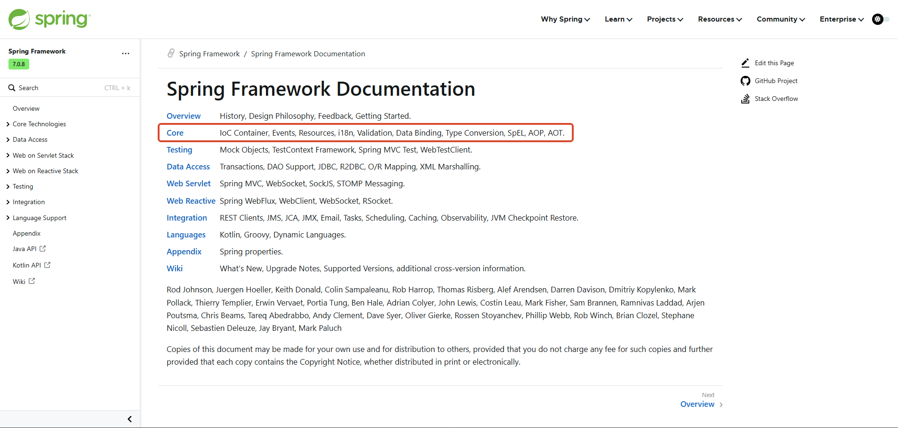

# 基础概述

## Spring 是什么？

Spring 是一款主流的 Java EE 轻量级开源框架，其目的是用于简化 Java 应用的开发难度和开发周期。Spring 框架除了自己提供功能外，还提供了整合其他技术和框架的能力。

在不同的语境中，Spring 所代表的含义也不同，大致可分为 2 个角度：

- **广义的 Spring**：泛指以 Spring Framework 为核心的 Spring 技术栈，其中包含了 SpringMVC、SpringBoot、SpringData、SpringSecurity 等等；
- **狭义的 Spring**：特指 Spring Framework，它是其他子项目的根基；

> [!NOTE] 核心模块
>
> - **IOC**：控制反转，指把创建对象的过程交给 Spring 进行管理；
> - **AOP**：面向切片编程，AOP 用来封装多个类的公共行为，将公共逻辑封装起来，减少系统的重复代码，降低模块间的耦合度。另外，AOP 还解决了系统层面的问题，如 日志、事务、权限等；

## Spring 特点

- **非侵入性**：使用 Spring Framework 开发应用时，对应用本身的结构影响非常小，对功能性组件也只需要简单的注解进行标记，完全不会破坏原有结构，反而能将组件结构进一步简化；
- **IOC 控制反转**：把自己创建资源变为程序自动创建资源，更加便捷；
- **AOP 面向切片编程**：在不修改源代码的基础上增强代码功能；
- **容器**：Spring IOC 是一个容器，它包含并管理组件对象的生命周期。组件享受到了容器化的管理，替开发者屏蔽了组件创建过程中的大量细节，极大的降低了使用门槛，大幅度提高了开发效率；
- **组件化**：Spring 实现了使用简单的组件配置组合成一个复杂的应用。在 Spring 中可以使用 XML 和 Java 注解组合的形式管理类对象；

## Spring 模块组成

下图包含了 Spring 框架的所有模块，其中 Spring Core 是最核心的模块：

### Spring Core

Spring Core 提供了 IOC、DI、Bean 配置装载创建的核心实现。其中：

- Spring-core：IOC 和 DI 的基本实现
- Spring-Beans：BeanFactory 和 Bean 的装配管理
- Spring-context：Spring context 上下文，即 IOC 容器（ApplicationContext）
- Spring-expression：Spring 表达式语言

##### Spring AOP

- Spring-aop：面向切片编程的应用模块
- Spring-aspects：集成 AspectJ、AOP 应用框架
- Spring-instrument：动态 Class Loading 模块

##### Spring Data Access

- Spring-jdbc：Spring 对 JDBC 的封装，用于简化 jdbc 操作
- Spring-orm：Java 对象与数据库数据的映射框架
- Spring-oxm：对象与 XML 文件的映射框架
- Spring-jms： Spring 对 Java Message Service(Java 消息服务)的封装，用于服务之间相互通信
- Spring-tx：Spring jdbc 事务管理

##### Spring Web

- Spring-web：最基础的 Web 支持，建立于 Spring-context 之上，通过 servlet 或 listener 来初始化 IOC 容器
- Spring-webmvc：实现 web mvc
- Spring-websocket：与前端的全双工通信协议
- Spring-webflux：Spring 5.0 提供的，用于取代传统 Java servlet，非阻塞式 Reactive Web 框架，异步，非阻塞，事件驱动的服务

##### Spring Message

- Spring-messaging：Spring 4.0 提供的，为 Spring 集成一些基础的报文传送服务

##### Spring test

- Spring-test：集成测试支持，主要是对 junit 的封装

