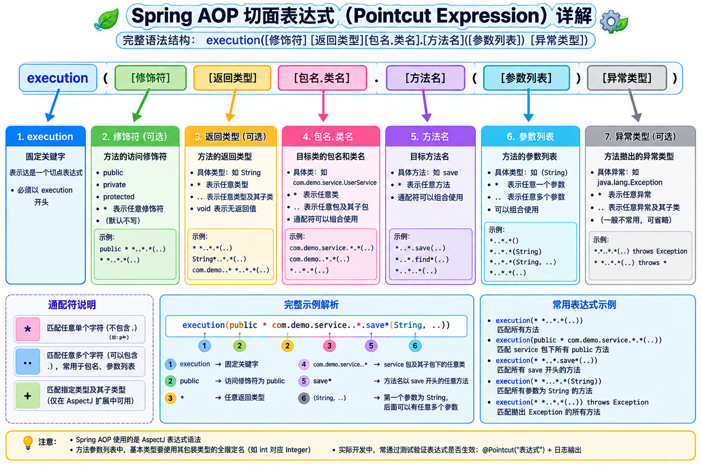

# AOP

AOP（Aspect-Oriented Programming）面向切面编程，是一种编程范式，旨在通过将横切关注点（如日志记录、事务管理、安全检查、性能监控）与 **核心业务逻辑解耦**，从而提高代码的模块化程度和复用性。

在面向对象编程（OOP）中，代码通常是按类和方法纵向构建的，而 AOP 则是通过“切面”横向插入到业务逻辑中，避免了在每个业务方法中重复编写非业务代码。

AOP 核心术语列表：

| 核心术语  |     英文      | 描述                                                         |
| :-------: | :-----------: | ------------------------------------------------------------ |
|   切面    |    Aspect     | 包含切入点和通知的模块，封装了横切关注点                     |
|  连接点   |  Join Point   | 程序执行过程中的某个特定点，如方法调用、异常抛出等。在 Spring AOP 中，连接点总是代表 **方法执行**。 |
|  切入点   |   Pointcut    | 匹配连接点的断言表达式（表达式指定了哪些方法需要被增强）     |
| 通知/增强 |    Advice     | 切面在特定连接点采取的动作（如在方法执行前或执行后做什么）   |
| 目标对象  | Target Object | 被一个或多个切面增强的对象（核心业务逻辑）                   |
|   织入    |    Weaving    | 将切面应用到目标对象并创建代理对象的过程                     |


## 通知类型

通知定义了切面代码的执行时机：

|      通知       |   名称   | 执行顺序 | 描述                                                         |
| :-------------: | :------: | :------: | ------------------------------------------------------------ |
|     @Before     | 前置通知 |    1     | 在目标方法执行之前运行                                       |
| @AfterReturning | 返回通知 |    2     | 在目标方法正常返回之后运行（可获取返回值）                   |
| @AfterThrowing  | 异常通知 |    2     | 在目标方法抛出异常之后运行（可捕获异常对象）                 |
|     @After      | 后置通知 |    3     | 无论目标方法正常结束还是抛出异常，都会在方法退出后执行       |
|                 |          |          |                                                              |
|     @Around     | 环绕通知 |    /     | 环绕通知可以结合 `try-catch-finally` 将上面的四个通知融合到一起 |


## 实现切面编程

### 引入依赖

引入 `spring-aspects` 和 `spring-aop` 依赖，版本和 `spring-context` 保持一致：

```xml {28-32,34-38}
<project xmlns="http://maven.apache.org/POM/4.0.0" xmlns:xsi="http://www.w3.org/2001/XMLSchema-instance"
         xsi:schemaLocation="http://maven.apache.org/POM/4.0.0 http://maven.apache.org/xsd/maven-4.0.0.xsd">
  <modelVersion>4.0.0</modelVersion>

  <groupId>com.example</groupId>
  <artifactId>demo-spring6</artifactId>
  <version>1.0-SNAPSHOT</version>
  <packaging>jar</packaging>

  <name>demo-spring6</name>
  <url>http://maven.apache.org</url>

  <properties>
    <project.build.sourceEncoding>UTF-8</project.build.sourceEncoding>
    <!-- spring 版本 -->
    <spring.version>6.2.19</spring.version>
  </properties>

  <dependencies>
    <!-- 引入 spring-context 核心依赖 -->
    <dependency>
      <groupId>org.springframework</groupId>
      <artifactId>spring-context</artifactId>
      <version>${spring.version}</version>
    </dependency>

    <!-- 引入 spring-aspects 依赖 -->
    <dependency>
      <groupId>org.springframework</groupId>
      <artifactId>spring-aspects</artifactId>
      <version>${spring.version}</version>
    </dependency>
    <!-- 引入 spring-aop 依赖 -->
    <dependency>
      <groupId>org.springframework</groupId>
      <artifactId>spring-aop</artifactId>
      <version>${spring.version}</version>
    </dependency>

    <!-- 引入 log4j 依赖 -->
    <dependency>
      <groupId>org.apache.logging.log4j</groupId>
      <artifactId>log4j-core</artifactId>
      <version>2.26.1</version>
    </dependency>
    <dependency>
      <groupId>org.apache.logging.log4j</groupId>
      <artifactId>log4j-slf4j2-impl</artifactId>
      <version>2.26.1</version>
    </dependency>

    <!-- 引入 junit5 依赖 -->
    <dependency>
      <groupId>org.junit.jupiter</groupId>
      <artifactId>junit-jupiter-api</artifactId>
      <version>5.14.4</version>
      <scope>test</scope>
    </dependency>
  </dependencies>
</project>

```


### 创建 service

创建 `Calculator` 类和 `AppConfig` 类，其中 `AppConfig` 类是专门的配置类，用于配置组件扫描、切面代理等功能；

::: code-group

```java [CalculatorImpl]
public interface Calculator {
  int add(int a, int b);

  int sub(int a, int b);

  int mul(int a, int b);

  int div(int a, int b);
}

@Service
public class CalculatorImpl implements Calculator {
  @Override
  public int add(int a, int b) {
    int res = a + b;
    System.out.println("add加法结果：" + res);
    return res;
  }

  @Override
  public int sub(int a, int b) {
    int res = a - b;
    System.out.println("add减法结果：" + res);
    return res;
  }

  @Override
  public int mul(int a, int b) {
    int res = a * b;
    System.out.println("add乘法结果：" + res);
    return res;
  }

  @Override
  public int div(int a, int b) {
    int res = a / b;
    System.out.println("add除法结果：" + res);
    return res;
  }
}
```

```java [AppConfig] {2}
@Configuration
@EnableAspectJAutoProxy // 开启 AspectJ 自动代理支持
@ComponentScan("com.example")
public class AppConfig {
}
```

:::


### 创建切面类

::: code-group

```java {6,13,19,25,32} [LogAspect]
@Aspect // 标注该类是一个切片类
@Component
public class LogAspect {
  private final Logger logger = LoggerFactory.getLogger(LogAspect.class);

  @Before("execution(public int com.example.service.impl.CalculatorImpl.*(..))")
  public void beforeMethod(JoinPoint joinPoint) {
    String methodName = joinPoint.getSignature().getName();
    String methodArgs = Arrays.toString(joinPoint.getArgs());
    logger.info("[LogAspect] --> 前置通知，方法名：{}，参数：{}", methodName, methodArgs);
  }

  @AfterReturning(value = "execution(* com.example.service.impl.CalculatorImpl.*(..)))", returning = "result")
  public void afterReturningMethod(JoinPoint joinPoint, Object result) {
    String methodName = joinPoint.getSignature().getName();
    logger.info("[LogAspect] --> 返回通知，方法名：{}，结果：{}", methodName, result);
  }

  @AfterThrowing(value = "execution(* com.example.service.impl.CalculatorImpl.*(..)))", throwing = "exception")
  public void afterThrowingMethod(JoinPoint joinPoint, Throwable exception) {
    String methodName = joinPoint.getSignature().getName();
    logger.info("[LogAspect] --> 异常通知，方法名：{}，异常：{}", methodName, exception);
  }

  @After("execution(* com.example.service.impl.CalculatorImpl.*(..))")
  public void afterMethod(JoinPoint joinPoint) {
    String methodName = joinPoint.getSignature().getName();
    logger.info("[LogAspect] --> 后置通知，方法名：{}", methodName);
  }

  // 环绕通知，可以代替前面4个通知
  @Around("execution(* com.example.service.impl.CalculatorImpl.*(..)))")
  public Object aroundMethod(ProceedingJoinPoint joinPoint) {
    // 通过 joinPoint 拿到执行方法信息
    String methodName = joinPoint.getSignature().getName();
    String methodArgs = Arrays.toString(joinPoint.getArgs());
    Object result = null;
    try {
      logger.info("[LogAspect] --> 环绕通知，目标方法执行之前");
      result = joinPoint.proceed();
      logger.info("[LogAspect] --> 环绕通知，目标方法返回值之后");
    } catch (Throwable e) {
      e.printStackTrace();
      logger.info("[LogAspect] --> 环绕通知，目标方法出现异常");
    } finally {
      logger.info("[LogAspect] --> 环绕通知，目标方法执行完毕");
    }
    return result;
  }
}
```

```java [CalculatorTest]
public class CalculatorTest {
  @Test
  void testAdd() {
    // 通过配置类 AppConfig 实现组件扫描和依赖注入
    ApplicationContext context = new AnnotationConfigApplicationContext(AppConfig.class);
    Calculator calculator = context.getBean(Calculator.class);
    calculator.add(1, 2);
  }

  @Test
  void testDiv() {
    ApplicationContext context = new AnnotationConfigApplicationContext(AppConfig.class);
    Calculator calculator = context.getBean(Calculator.class);
    // 模拟出现异常的情况
    calculator.div(1, 0);
  }
}
```

:::


## 切面表达式

```java
execution(public int com.example.service.impl.CalculatorImpl.add(int, int)
```





## 切面表达式复用

通过 `@Pointcut`声明一个模板切面表达式，然后后续复用：

```java {6-8,10}
@Aspect
@Component
public class LogAspect {
  private final Logger logger = LoggerFactory.getLogger(LogAspect.class);

  @Pointcut("execution(* com.example.service.impl.CalculatorImpl.*(..)))")
  public void pointCut() {
  }

  @Before("pointCut()")
  public void beforeMethod(JoinPoint joinPoint) {
    String methodName = joinPoint.getSignature().getName();
    String methodArgs = Arrays.toString(joinPoint.getArgs());
    logger.info("[LogAspect] --> 前置通知，方法名：{}，参数：{}", methodName, methodArgs);
  }

  @AfterReturning(value = "pointCut()", returning = "result")
  public void afterReturningMethod(JoinPoint joinPoint, Object result) {
    String methodName = joinPoint.getSignature().getName();
    logger.info("[LogAspect] --> 返回通知，方法名：{}，结果：{}", methodName, result);
  }

  @AfterThrowing(value = "pointCut()", throwing = "exception")
  public void afterThrowingMethod(JoinPoint joinPoint, Throwable exception) {
    String methodName = joinPoint.getSignature().getName();
    logger.info("[LogAspect] --> 异常通知，方法名：{}，异常：{}", methodName, exception);
  }

  @After("pointCut()")
  public void afterMethod(JoinPoint joinPoint) {
    String methodName = joinPoint.getSignature().getName();
    logger.info("[LogAspect] --> 后置通知，方法名：{}", methodName);
  }
}
```


## 切面优先级

相同目标方法上同时存在多个切面时，可以通过 `@Order()` 配置切面的优先级。值越小，切面优先级越高。

```java {2}
@Aspect
@Order(1)
@Component
public class LogAspect {
  private final Logger logger = LoggerFactory.getLogger(LogAspect.class);

  @Pointcut("execution(* com.example.service.impl.CalculatorImpl.*(..)))")
  public void pointCut() {
  }

  @Before("pointCut()")
  public void beforeMethod(JoinPoint joinPoint) {
    String methodName = joinPoint.getSignature().getName();
    String methodArgs = Arrays.toString(joinPoint.getArgs());
    logger.info("[LogAspect] --> 前置通知，方法名：{}，参数：{}", methodName, methodArgs);
  }

  @AfterReturning(value = "pointCut()", returning = "result")
  public void afterReturningMethod(JoinPoint joinPoint, Object result) {
    String methodName = joinPoint.getSignature().getName();
    logger.info("[LogAspect] --> 返回通知，方法名：{}，结果：{}", methodName, result);
  }

  @AfterThrowing(value = "pointCut()", throwing = "exception")
  public void afterThrowingMethod(JoinPoint joinPoint, Throwable exception) {
    String methodName = joinPoint.getSignature().getName();
    logger.info("[LogAspect] --> 异常通知，方法名：{}，异常：{}", methodName, exception);
  }

  @After("pointCut()")
  public void afterMethod(JoinPoint joinPoint) {
    String methodName = joinPoint.getSignature().getName();
    logger.info("[LogAspect] --> 后置通知，方法名：{}", methodName);
  }
}
```

