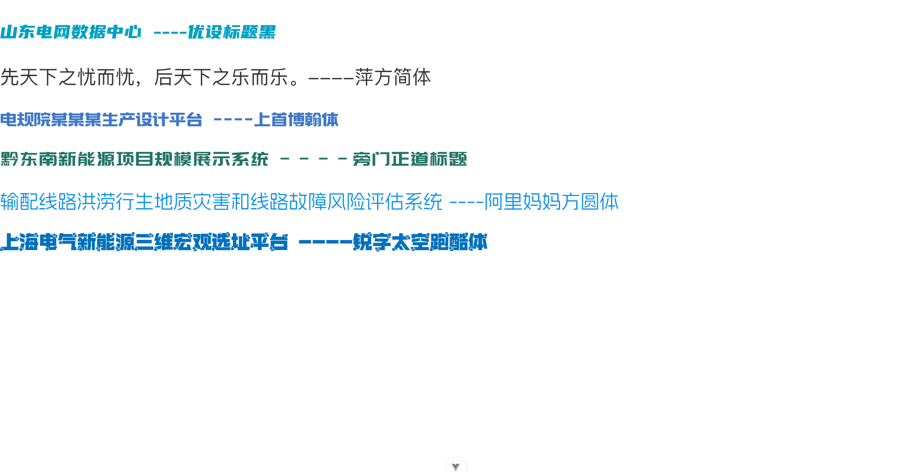

# 字体设置

::: code-group

```vue [App.vue]
<template>
  <p class="text1">山东电网数据中心 ----优设标题黑</p>

  <p class="text2">先天下之忧而忧，后天下之乐而乐。----萍方简体</p>

  <p class="text3">电规院某某某生产设计平台 ----上首博翰体</p>

  <p class="text4">黔东南新能源项目规模展示系统 ----旁门正道标题</p>

  <p class="text5">输配线路洪涝行生地质灾害和线路故障风险评估系统 ----阿里妈妈方圆体</p>

  <p class="text6">上海电气新能源三维宏观选址平台 ----锐字太空跑酷体</p>
</template>

<script setup lang="ts">
</script>

<style scoped lang="scss">
  p {
    font-size: 30px;
  }

  .text1 {
    color: #00a0c3;
    font-family: YouSheBiaoTiHei, serif;
  }

  .text2 {
    color: #333333;
    font-family: PangFangSC-Regular, serif;
  }

  .text3 {
    color: #4178CA;
    font-family: SSMuHei, serif;
  }

  .text4 {
    color: #247568;
    font-family: PangMenZhengDao, serif;
  }

  .text5 {
    color: #0C91E7;
    font-family: AlimamaFangYuanTi, serif;
  }

  .text6 {
    color: #0071BD;
    font-family: RuiZiTaiKongPaoKuTi, serif;
  }
</style>
```

```css [font.scss] {3,11}
@font-face {
  font-family: "YouSheBiaoTiHei";
  src: url("@/assets/font/YouSheBiaoTiHei.ttf") format("truetype");
  font-weight: normal;
  font-style: normal;
  font-display: swap;
}

@font-face {
  font-family: "PangFangSC-Regular";
  src: url("@/assets/font/PingFangSC-Regular.woff2") format("woff2");
  font-weight: normal;
  font-style: normal;
  font-display: swap;
}

```

```css [index.scss]
@use './font.scss';
```

:::




