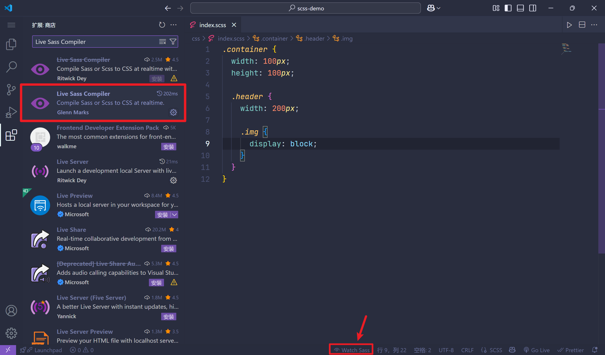

# Sass

## 安装和配置

安装 [Sass](https://www.npmjs.com/package/sass) 包：

```shell
pnpm i sass
```

在 VS Code 中安装 Sass 自动编译为 CSS 文件的插件：

|                    Live Sass Compiler 插件                    |
| :----------------------------------------------------------: |
|  |


## 语法嵌套规则

### 选择器嵌套

::: code-group

```scss
.container {
  width: 100px;
  height: 100px;

  .header {
    width: 200px;

    .img {
      display: block;
    }
  }
}
```

```css
.container {
  width: 100px;
  height: 100px;
}
.container .header {
  width: 200px;
}
.container .header .img {
  display: block;
}
```

:::


### 属性嵌套

当 CSS 属性遵循相同的开头时，可以将相同的开头进行提取，方便管理。

::: code-group

```scss
.container {
  font: {
    size: 16px;
    weight: 700;
    family: 'fantasy'
  }

  border: {
    width: 2px;
    style: solid;
    color: #ccc;
  }
}
```

```css
.container {
  font-size: 16px;
  font-weight: 700;
  font-family: "fantasy";
  border-width: 2px;
  border-style: solid;
  border-color: #ccc;
}
```

:::


### 父选择器&

在嵌套 CSS 时，如果需要使用外层的夫选择器，可以使用 & 代替外层的父选择器。

::: code-group

```scss
.container {
  a {
    color: #ccc;

    &:hover {
      color: skyblue;
      text-decoration: none;
    }
  }
}
```

```css
.container a {
  color: #ccc;
}
.container a:hover {
  color: skyblue;
  text-decoration: none;
}
```

:::

换个思路，也可以使用 & 进行选择器拼接：

::: code-group

```scss
.container {
  color: #ccc;

  &-sidebar {
    width: 200px;
  }
}
```

```css
.container {
  color: #ccc;
}
.container-sidebar {
  width: 200px;
}
```

:::


## 变量

### 基本使用

原生 CSS 中，变量的使用需要在 root 标签中，使用 `--` 的方式进行定义，然后使用 `var()` 进行使用：

```css 
:root {
  --color: skyblue;
}

p {
  color: var(--color);
}
```

在 Sass 中，变量定义使用 `$` 符：

::: success 变量的定义规则

1. 变量以 `$` 符开头，后面跟着变量名；
2. 变量名不以数字开头，但可包含 字母、数字、下划线和中划线；
3. 通过下划线和中划线定义的同名变量，视为同一变量；
4. 变量要先定义后使用；

:::

::: code-group

```scss
$color: skyblue;
$fontSize: 20px;

.container {
  color: $color;
  font-size: $fontSize;
}
```

```css
.container {
  color: skyblue;
  font-size: 20px;
}
```

:::


### 变量作用域

::: success 变量作用域

变量作用域分为两种：

- **全局变量域**：声明在最外层的变量，可以在任何地方使用；
- **局部变量域**：在嵌套规则内定义的变量，只能在嵌套规则内使用；

将局部变量转换为全局变量可以添加 `!global` 声明。

:::


::: code-group

```scss {8,16}
// 全局变量
$color: skyblue;

.container {
  // 局部变量
  $height: 200px;
  // 通过 !global 将局部变量声明为全局变量
  $font-size: 16px !global; 

  color: $color;
  height: $height;
  font-size: $font-size;
}

.p {
  font-size: $font-size;

  // 报错：因为$height不是全局变量
  // height: $height;
}
```

```css
.container {
  color: skyblue;
  height: 200px;
  font-size: 16px;
}

.p {
  font-size: 16px;
}
```

:::


### 变量数据类型

Sass支持 7 中数据类型：

|   数据类型   |                             描述                             |
| :----------: | :----------------------------------------------------------: |
|     数字     |                    如 1rem、2vh、13、10px                    |
|    字符串    |                     如 'bar'、"foo"、baz                     |
|     颜色     |           如 skyblue、#ccc、rgba(255,255,255,0.5)            |
|    布尔值    |                        如 true、false                        |
|     空值     |    null是唯一值，表示缺少值，通常由函数返回以表示确实结果    |
| 数组（list） | 用空格或逗号作为分隔符，如 10px 10px、"Open Sans", Helvetica, Sans-Serif |
|     maps     |       相当于 JavaScript 中的 Object 对象，是键值对形式       |

::: code-group

```scss
$border-width: 2px;
$font-weight: bold;
$font-family: "Open Sans", Helvetica, Sans-Serif;
$bg-color: rgba(255, 255, 255, 0.7);

$blank-mode: true;

$var: null;

$fonts: (
  serif: "Helvetica Neue",
  monospace: "Consolas"
);

.container {
  font-weight: $font-weight;
  font-family: $font-family;
  border-width: $border-width;
  background-color: $bg-color;

  /* 使用 @if 做判断 */
  @if $blank-mode {
    width: 200px;
  } @else {
    width: 500px;
  }

  /* 使用 type-of 判断类型 */
  content: type-of($value: $var);
  /* 使用 length 判断长度 */
  content: length($list: $var);
}

.p {
  /* 使用 map-get 获取字典的值 */
  font: 18px $font-weight map-get($map: $fonts, $key: monospace);
}
```

```css
@charset "UTF-8";
.container {
  font-weight: bold;
  font-family: "Open Sans", Helvetica, Sans-Serif;
  border-width: 2px;
  background-color: rgba(255, 255, 255, 0.7);
  /* 使用 @if 做判断 */
  width: 200px;
  /* 使用 type-of 判断类型 */
  content: null;
  /* 使用 length 判断长度 */
  content: 1;
}

.p {
  /* 使用 map-get 获取字典的值 */
  font: 18px bold "Consolas";
}
```

:::


### 变量默认值

Sass中可以使用 `!default` 来为变量执行默认值：

::: code-group

```scss
$font-size: 18px;
$font-size: 16px !default;

.container {
  /* 如果 $font-size 有值，则使用它，没有使用下面的默认值 */
  @if type-of($value: $font-size) {
    font-size: $font-size;
  } @else {
    font-size: $font-size;
  }
}
```

```scss
@charset "UTF-8";
.container {
  /* 如果 $font-size 有值，则使用它，没有使用下面的默认值 */
  font-size: 18px;
}
```

:::


### 运算符

Sass 中支持使用 `==` 和 `!=` 进行运算：

::: code-group

```scss
$theme: blue;

.container {
  @if $theme == blue {
    background-color: red;
  } @else {
    background-color: green;
  }

  @if $theme != blue {
    width: 200px;
  } @else {
    width: 400px;
  }
}
```

```css
.container {
  background-color: red;
  width: 400px;
}
```

:::


### 关系运算符

Sass 中支持 `>`、`<`、`>=` 、`<=` 关系运算符：

::: code-group

```scss
$count: 5;

.container {
  @if $count > 5 {
    background-color: red;
  } @else {
    background-color: green;
  }
}
```

```css
.container {
  background-color: green;
}
```

:::


### 布尔运算符

Sass 中支持 `and`、`or`、`not`等布尔运算符：

::: code-group

```scss
$width: 100;
$height: 100;
$last: false;

.container {
  @if $width > 50 and $width < 200 {
    background-color: red;
  }

  @if $height > 50 or $height < 80 {
    color: green;
  }

  /* not false 就是 true */
  @if not $last {
    height: 100px;
  }
}
```

```css
@charset "UTF-8";
.container {
  background-color: red;
  color: green;
  /* not false 就是 true */
  height: 100px;
}
```

:::


### 数字操作符

Sass 中支持 `+`、`-`、`*`、`/`、`%` 等运算。

::: code-group

```scss
.container {
  /* ================= + 运算 =============== */
  width: 50 + 20;
  width: 50 + 20%;
  width: 50% + 20%;
  width: 50pt + 20px;
  width: 50px + 20px;

  /* ================= - 运算 =============== */
  height: 50 - 20;
  height: 50 - 20%;
  height: 50px - 20px;

  /* ================= * 运算 =============== */
  width: 50 * 20;
  width: 50 * 20%;
  width: 50 * 20px;
  width: 50pt * 20;

  /* ================= / 运算 =============== */
  height: 100 / 20;
  height: 100px / 20;
  height: 100px / 20px;
  height: (100px / 20) * 10;

  /* ================= % 运算 =============== */
  width: 10 % 3;
  width: 50px % 7;
  width: 50% % 7;
}
```

```css
@charset "UTF-8";
.container {
  /* ================= + 运算 =============== */
  width: 70;
  width: 70%;
  width: 70%;
  width: 65pt;
  width: 70px;
  /* ================= - 运算 =============== */
  height: 30;
  height: 30%;
  height: 30px;
  /* ================= * 运算 =============== */
  width: 1000;
  width: 1000%;
  width: 1000px;
  width: 1000pt;
  /* ================= / 运算 =============== */
  height: 100/20;
  height: 100px/20;
  height: 100px/20px;
  height: 50px;
  /* ================= % 运算 =============== */
  width: 1;
  width: 1px;
  width: 1%;
}
```

:::


