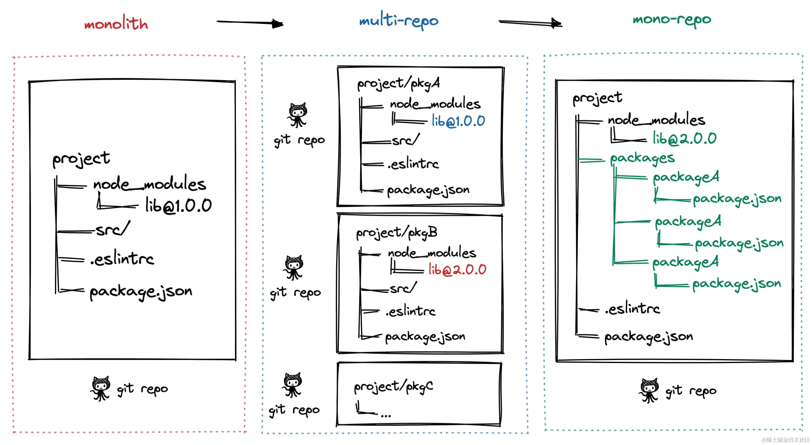

# Monorepo 介绍

Monorepo 是一种项目代码管理方式，指单个仓库中管理多个项目，有助于简化代码共享、版本控制、构建和部署等方面的复杂性，并提供 更好的可重用性和协作性。

## 演进过程

##### 阶段一：单仓库巨石应用

一个 Git 仓库维护着项目代码，随着迭代业务复杂度的提升，项目代码会变得越来越多，越来越复杂，大量代码的构建效率也会降低，最终导致单体巨石应用。这种代码管理方式也被称之为 Monolith。

##### 阶段二：多仓库多模块应用

将单体巨石应用拆解成多个业务模块，并在多个 Git 仓库管理，模块解耦，降低了巨石应用的复杂度，每个模块都可以独立编码、测试、发版，代码管理变得简化，构建效率也得以提升。这种代码管理方式也被称之为 MultiRepo。

> [!CAUTION] 缺点
>
> 多模块应用虽然使得业务得到解耦，但是随着项目复杂度的提升，模块仓库越来越多，便会引发其他问题：
>
> - 跨仓库代码难以共享；
> - 分散在单仓库的模块依赖管理复杂，底层模块升级后，其他上层模块依赖需要同步更新；

##### 阶段三：单仓库多模块应用

为了解决多仓库多模块应用的缺点，于是将多个项目集成到一个仓库下，共享工程配置、共享模块代码。这种方式就被称之为 MonoRepo。

## 优劣对比

|    场景    | Multirepo                                                    | Monorepo                                                     |
| :--------: | ------------------------------------------------------------ | ------------------------------------------------------------ |
| 代码可见性 | ① 代码隔离，开发只需关注自己负责的仓库 ② 包管理按照各自 owner 划分，当出现问题时，需要到依赖包中进行判断解决 | ① 一个仓库中多个项目，很容易看到整个代码库的提交记录，团队协作更好 ② 但增加了非 owner 改动代码的风险 |
|  依赖管理  | 多个仓库都有自己的依赖，存在依赖重复                         | 多个项目代码都在一个仓库中，相同的依赖只需要在顶层安装一次   |
|  代码权限  | 各项目仓库独立，不会出现代码被误改的情况，单个项目出问题不影响其他项目 | 多个业务模块代码放在同一个仓库，没有精细化的权限管理，一个项目出问题可能影像所有项目 |
|  开发迭代  | ① 单仓库体积小，模块划分清晰，可维护性强 ② 但多个仓库来回切换，效率较低 ③ 相同的包不同的版本重复安装，项目依赖出现问题难以排查 | ① 多个项目在同一个仓库，代码复用性高，编码清晰，但代码体积会变大 ② 依赖调试方便，依赖包迭代场景下，借助 `npm link` 可直接使用最新版本，简化操作流程 |
|  工程配置  | 各项目构建、打包、代码校验都各自维护，不一致会导致代码差异或构建差异 | 同一个仓库工程配置一致，代码质量标准及风格都一致             |
|  构建部署  | 多个项目之间存在依赖的话，部署时需要人为控制部署顺序，操作效率低 | 构建性 monorepo 工具可以配置构建优先级 ，实现一次命令完成所有部署 |

## 工具链选型

大型前端或全栈项目中，选择合适的 Monorepo 工具链，本质上是在平衡 “本地开发速度” 和 “工程化约束力”。目前市面上主流工具可以分为三类：包管理器（基础层）、构建编排工具（性能层）、全栈/重型框架（方案层）。

| 工具            |   类型   | 优势                               | 适用场景                                |
| :-------------- | :------: | :--------------------------------- | --------------------------------------- |
| Pnpm Workspaces | 基础管理 | 快速安装、软链接隔离（无幽灵依赖） | 几乎所有 Monorepo 的基础底座            |
| Turborepo       | 构建加速 | 极简配置、智能缓存、并行执行       | 追求工程体验的 React/Next.js 生态项目   |
| Nx              | 任务调度 | 依赖分析可视化、代码生成、插件丰富 | 复杂企业级应用、跨团队大型项目          |
| Lerna           | 发布管理 | 传统的版本管理与发布流程           | 专注于 JS/TS 库的发布（常配合 Nx 使用） |
| Rush            | 流程控制 | 严格的规范约束、中心化配置         | 微软背景，适合多人协作的超大型项目      |

### 选型建议

##### 轻量化组合（推荐 Pnpm + Turborepo）

这是目前最流行、上手成本最低的方案。

> [!NOTE]
>
> - **分工**：Pnpm 负责依赖管理和 Workspace 软链接，Turborepo 负责任务的并行调度和增量缓存；
> - **优势**：配置及其简单（只需要一个 `turbo.json`），本地和 CI 环境下的构建速度提升非常明显；
> - **适用**：中小型团队，前端项目为主；

##### 重型工业级（推荐 Nx）

> [!NOTE]
>
> - **优势**：Nx 不仅仅是任务运行器，它提供了深度的图分析（Graph Analysis）。它可以精确计算出某次代码修改影响了哪些下游包，从而只运行必要的任务；
> - **生态** ：内置了强大的生成器，可以一键创建标准化的小应用或组件库；
> - **适用**：大型企业应用，对一致性、规范化有极高要求的场景；

##### 库开发专用（推荐 Pnpm + Lerna/Changesets）

如果管理的是很多开源库，核心痛点是 **版本发布** 和 **Changelog** 生成。

> [!NOTE]
>
> - **Changesets**：目前最现代的发布流水线工具，对开发者友好，支持预发布版本；
>- **适用**：UI 组件库、SDK 集合；

