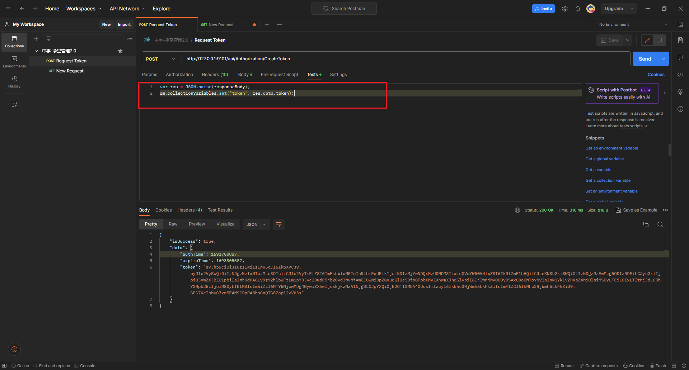

# postman 中配置 token

1. **在 Postman 中新建一个 post 接口，用于请求 token ：**




图中代码：

```C#
var res = JSON.parse(responseBody);
pm.collectionVariables.set("token", res.data.token);
```

1. **点击当前请求所在的 组，在 Authorization 中配置全局 token：**


2. **我们可以发起其他任意的请求，无需再次配置 token，但是注意，token 过期以后需要重新获取一下。**


