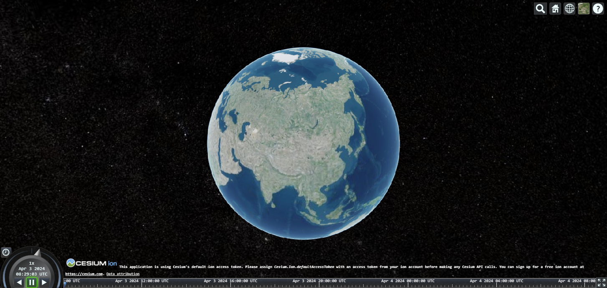

# 快速入门

> Cesium API 文档：http://cesium.xin/cesium/cn/Documentation1.62/index.html
>
> Cesium 中文文档：http://cesium.coinidea.com/guide/
>
> Cesium 官网：https://ion.cesium.com/tokens?page=1

`Cesium`是使用`JavaScript`开发的基于`WebGL`的，实现三维地球和地图可视化的`JS`库，支持海量的三维模型数据、影像数据、地形高程数据、矢量数据等丰富的地理数据的加载。


## 安装

安装 cesium 包和 vite-plugin-cesium 插件：

```shell
pnpm install cesium
pnpm i cesium vite-plugin-cesium
```

在 vite.config.ts 中，注册 vite-plugin-cesium 插件：

```ts
import cesium from "vite-plugin-cesium";

export default defineConfig({
  plugins: [vue(), cesium()]
});
```

页面中导入 cesium 的包：

```js
import * as Cesium from "cesium";
```


## 基础示例

```vue
<template>
  <div id="cesiumContainer"></div>
</template>

<script setup lang="ts">
import { onMounted } from "vue";
import * as Cesium from "cesium";

onMounted(() => {
  const viewer = new Cesium.Viewer("cesiumContainer", {
    infoBox: false
  });
});
</script>
```




## 地图控件

```js
onMounted(() => {
  const viewer = new Cesium.Viewer("cesiumContainer", {
    infoBox: false,
    // 选择图层控件
    baseLayerPicker: false,
    // 动画控件按钮
    animation: false,
    // 时间轴控件
    timeline: false,
    // 全屏按钮控件
    fullscreenButton: false,
    // 搜索框控件
    geocoder: false,
    // 默认视图控件
    homeButton: false,
    // 帮助按钮控件
    navigationHelpButton: false,
    // 投影方式控件
    sceneModePicker: false
  });

  // 隐藏版权logo
  viewer.cesiumWidget.creditContainer.setAttribute("style", "display:none");
});
```
