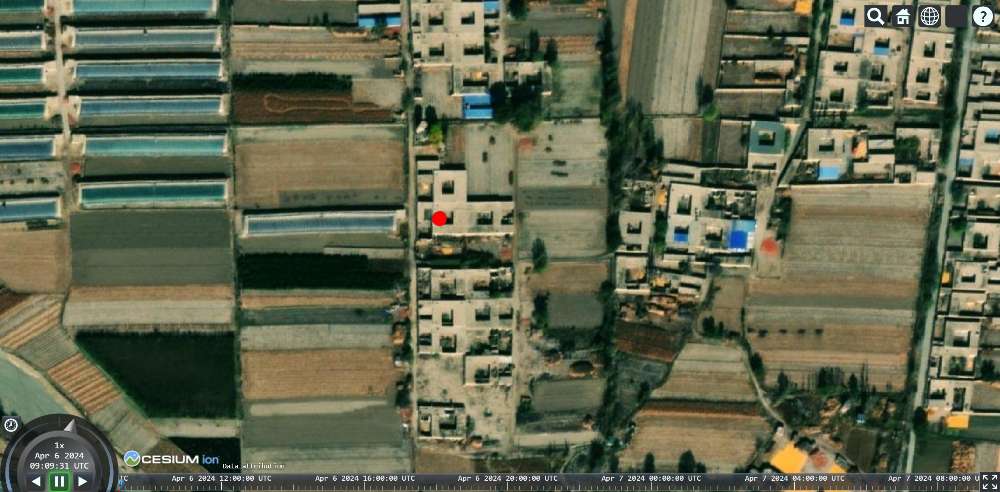
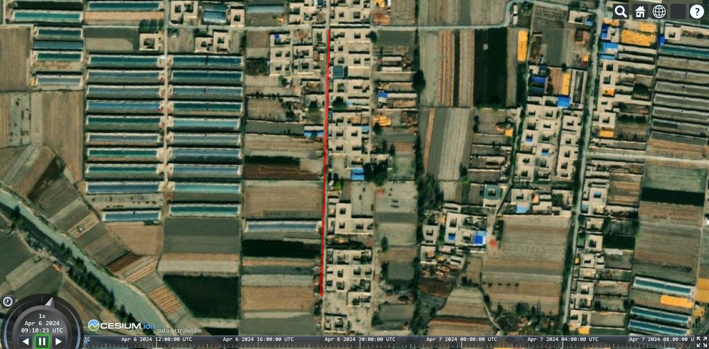
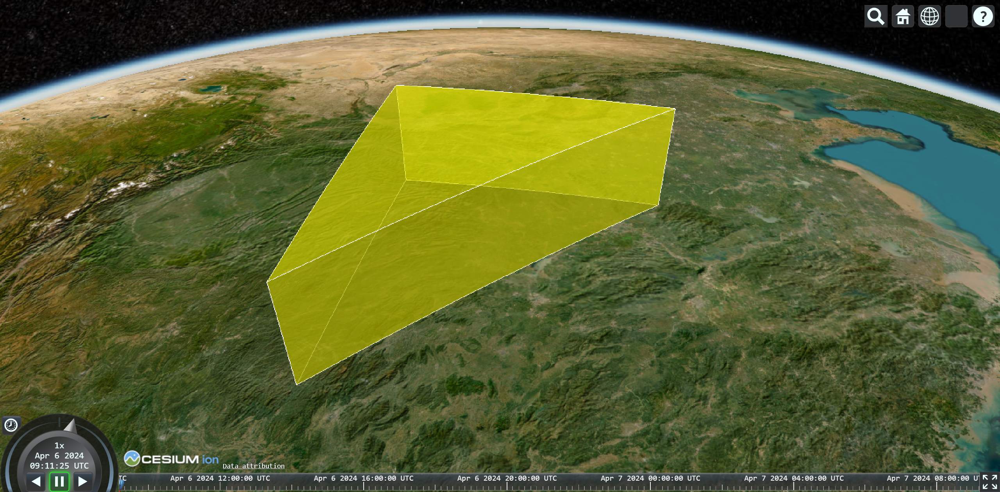
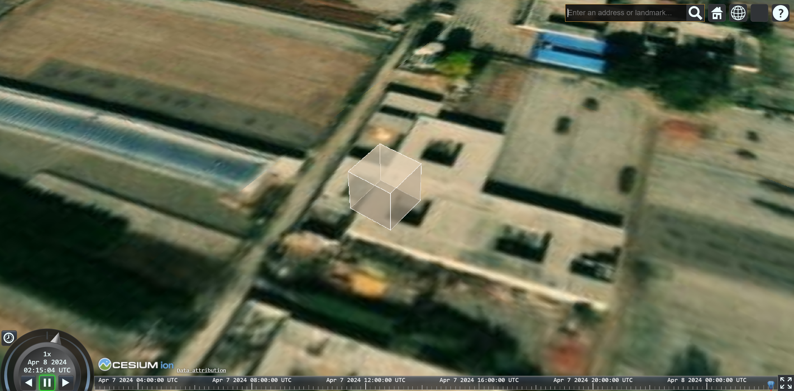
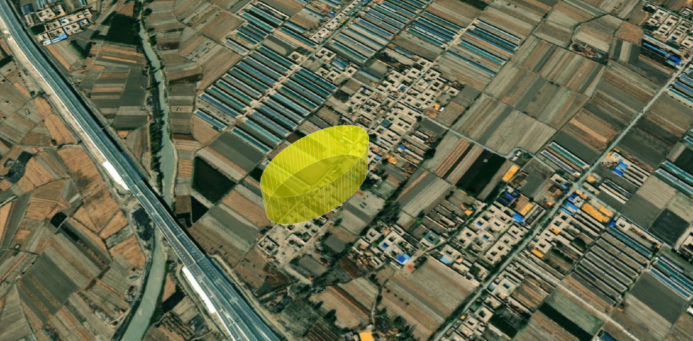
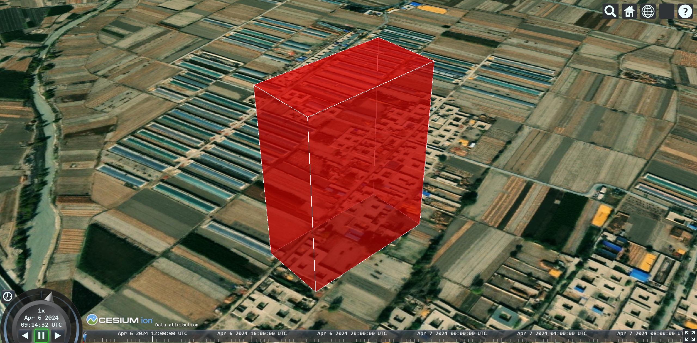
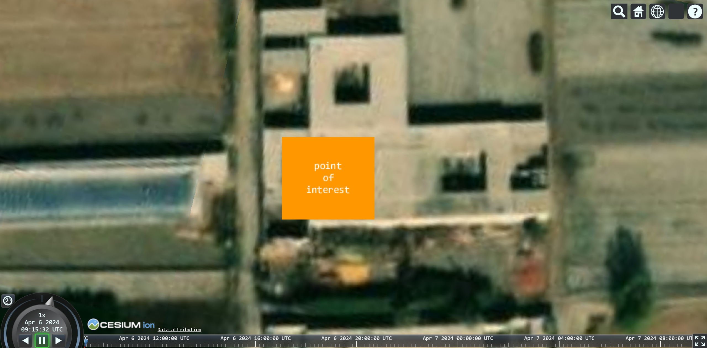

# Entity 实体

cesium 中空间数据可视化 API 共分为 2 部分：

- `Entity` 实体：由 Primitive 图元封装组成，调用方便，但是加载大量数据时效率没有 Primitive 高；
- `Primitive` 图元：灵活性高，更接近 webGL 的底层，没有像 Entity 一样带有附加属性，加载大量数据时效率更高；

> 参考文章：
>
> 1.  https://blog.csdn.net/appleshowc/article/details/123479194
> 2.  https://juejin.cn/post/6974592888420171790

## [点实体](http://cesium.xin/cesium/cn/Documentation1.62/PointGraphics.html)

创建点实体的方法有两种：

- 方法 1：

  ```js
  const position = Cesium.Cartesian3.fromDegrees(102.7362, 38.0249, 0);

  const point = new Cesium.Entity({
    position: position,
    // 点样式
    point: {
      color: Cesium.Color.RED,
      // 大小
      pixelSize: 20
    }
  });

  // 将点添加到视图中
  viewer.entities.add(point);
  // 将视角飞行到点要素处
  viewer.zoomTo(point, {
    heading: Cesium.Math.toRadians(0),
    pitch: Cesium.Math.toRadians(-90),
    range: 500 // 距离中心点的高度
  });
  ```

- 方法 2：

  ```js
  const position = Cesium.Cartesian3.fromDegrees(102.7362, 38.0249, 0);

  const point = viewer.entities.add({
    // id 必须唯一
    id: "point",
    position: position,
    point: {
      color: Cesium.Color.RED,
      pixelSize: 20
    }
  });
  viewer.zoomTo(point);
  ```



## [线实体](http://cesium.xin/cesium/cn/Documentation1.62/PolylineGraphics.html)

```js
const polyline = viewer.entities.add({
  polyline: {
    positions: Cesium.Cartesian3.fromDegreesArray([
      102.73523, 38.02712, 102.73625, 38.02405
    ]),
    // 材质
    material: Cesium.Color.RED.withAlpha(0.5),
    // 线宽
    width: 5
  }
});

viewer.zoomTo(polyline);
```



## [多边形](http://cesium.xin/cesium/cn/Documentation1.62/PolygonGraphics.html)

```js
const polygon = viewer.entities.add({
  polygon: {
    // 多边形层次
    hierarchy: {
      // 外边线环
      positions: Cesium.Cartesian3.fromDegreesArray([
        110, 30, 110, 25, 115, 30
      ]),
      // 层次结构数组
      holes: []
    },
    fill: false, // 面是否填充
    material: Cesium.Color.YELLOW, // 填充材质
    extrudedHeight: 100000, // 多边形(柱体)的拉伸高度(0: 平面几何)
    height: 100000, // 多边形距离地面的高度(0: 贴地)
    outline: true, // 是否显示轮廓
    outlineColor: Cesium.Color.WHITE
  }
});

viewer.zoomTo(polygon);
```



## [立方体](https://cesium.com/learn/cesiumjs/ref-doc/BoxGraphics.html?classFilter=BoxGraphics)

```js
const box = viewer.entities.add({
  position: Cesium.Cartesian3.fromDegrees(102.7362, 38.0249, 0),
  box: {
    // 立方体长、宽、高
    dimensions: new Cesium.Cartesian3(10, 10, 10),
    // 相对于地形的位置
    heightReference: Cesium.HeightReference.RELATIVE_TO_3D_TILE,
    // 是否使用填充(默认为 true)
    fill: false,
    // 填充材质
    material: Cesium.Color.BLANCHEDALMOND,
    // 是否显示轮廓(默认为 false)
    outline: true,
    outlineColor: Cesium.Color.WHITE
  }
});

viewer.zoomTo(box);
```



## 椭圆

```js
const ellipse = viewer.entities.add({
  position: Cesium.Cartesian3.fromDegrees(102.7362, 38.0249, 0),
  ellipse: {
    semiMajorAxis: 100, // 长半轴
    semiMinorAxis: 50, // 短半轴
    fill: true, // 是否填充(默认为true)
    extrudedHeight: 100, // 填充柱体高度
    material: Cesium.Color.YELLOW, // 材质
    rotation: Math.PI / 2, // 旋转角度(正北，逆时针旋转)
    height: 20, // 距离地面的高度
    outline: true, // 轮廓线
    outlineColor: Cesium.Color.WHITE, // 轮廓线颜色
    numberOfVerticalLines: 128 // 轮廓线垂直数量
  }
});

viewer.zoomTo(ellipse);
```



## 矩形

```js
const rectangle = viewer.entities.add({
  position: Cesium.Cartesian3.fromDegrees(102.7362, 38.0249, 0),
  rectangle: {
    // 矩形的左下和右上
    coordinates: Cesium.Rectangle.fromDegrees(
      102.7357,
      38.025,
      102.737,
      38.0258
    ),
    fill: true,
    material: Cesium.Color.RED.withAlpha(0.5),
    height: 10, // 距离地面的高度
    rotation: Math.PI / 2, // 旋转角度(正北, 顺时针旋转)
    extrudedHeight: 200, // 拉伸高度
    outline: true,
    outlineColor: Cesium.Color.WHITE
  }
});

viewer.zoomTo(rectangle);
```



## 文本标签

```js
const label = viewer.entities.add({
  position: Cesium.Cartesian3.fromDegrees(102.7362, 38.0249, 0),
  label: {
    text: "point\nof\ninterest",
    font: "20px sans-serif",
    scale: 1,
    fillColor: Cesium.Color.WHITE,
    outlineColor: Cesium.Color.BLACK,
    showBackground: false, // 是否显示背景颜色
    backgroundColor: new Cesium.Color(112, 86, 151),
    backgroundPadding: new Cesium.Cartesian2(50, 50), // 背景 padding
    horizontalOrigin: Cesium.HorizontalOrigin.CENTER, // 水平居中(left/center/right)
    verticalOrigin: Cesium.VerticalOrigin.CENTER // 垂直居中(center/bottom/baseline/top)
  }
});

viewer.zoomTo(label);
```



## 删除实体

下面演示删除 点实体 的 4 种方法：

- 先查后删：

  ```js
  const point = viewer.entities.getById("1001");
  point && viewer.entities.remove(point);
  ```

- 根据 Id 删除：

  ```js
  viewer.entities.removeById("1001");
  ```

- 直接删除：

  ```js
  viewer.entities.remove(point1);
  ```

- 删除所有点：

  ```js
  viewer.entities.removeAll();
  ```

完整示例：

```js
const point1 = viewer.entities.add({
  id: "1001",
  position: Cesium.Cartesian3.fromDegrees(102.7361, 38.02597, 0),
  point: {
    color: Cesium.Color.RED,
    pixelSize: 20
  }
});

// 方式1: 先查后删
const point = viewer.entities.getById("1001");
point && viewer.entities.remove(point);

// 方式2: 根据 Id 删除
viewer.entities.removeById("1001");

// 方式3: 直接删除
viewer.entities.remove(point1);

// 方式4: 删除所有点
viewer.entities.removeAll();
```
