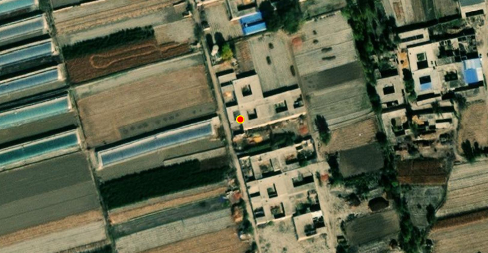
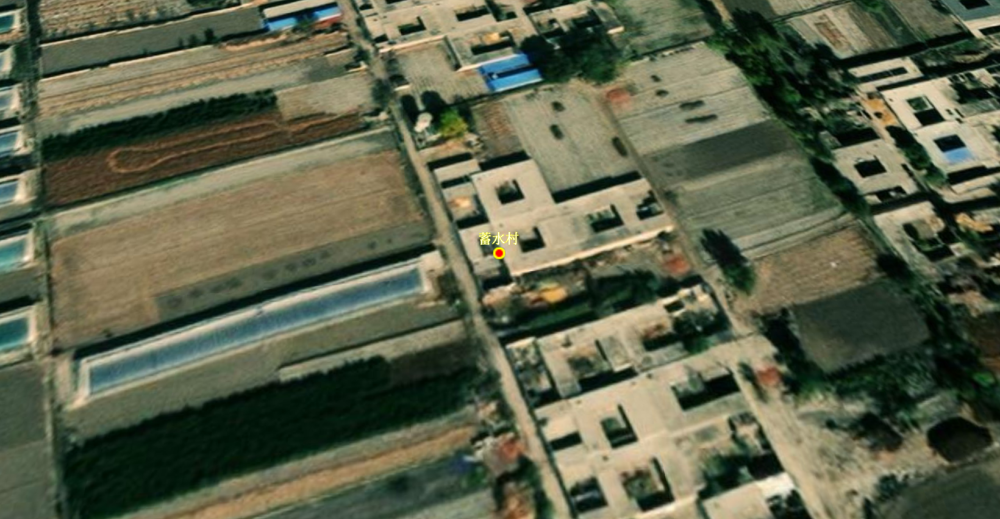
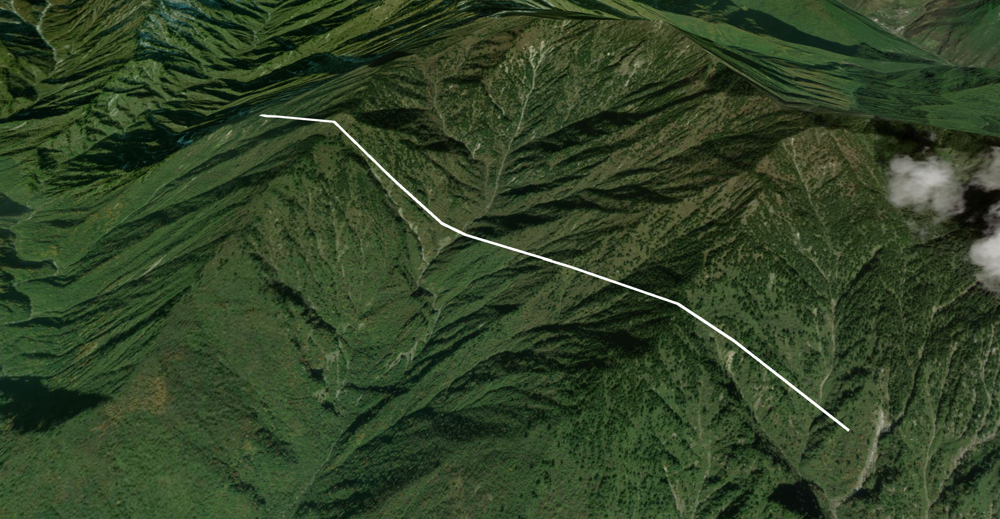
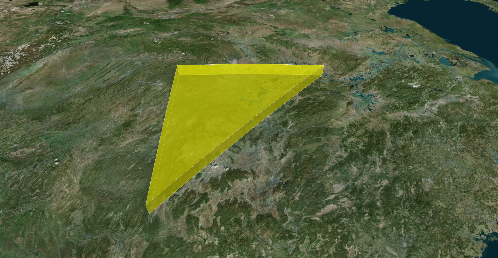
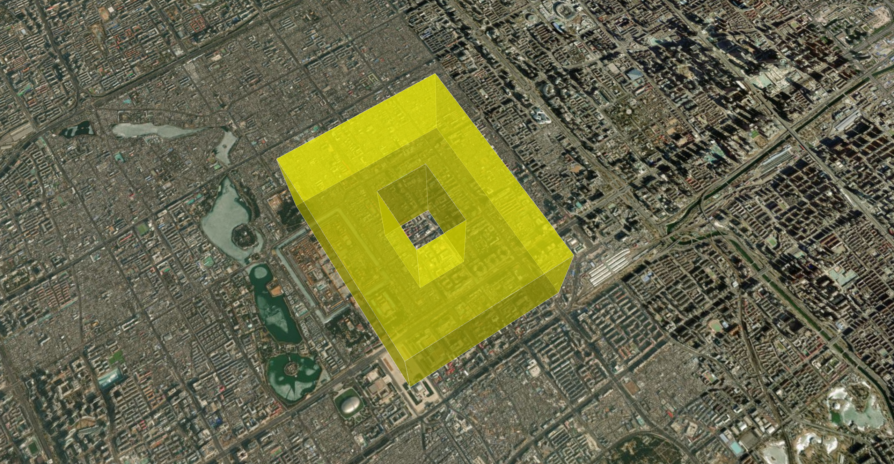
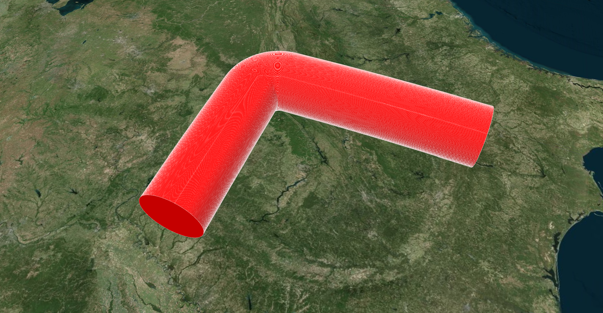
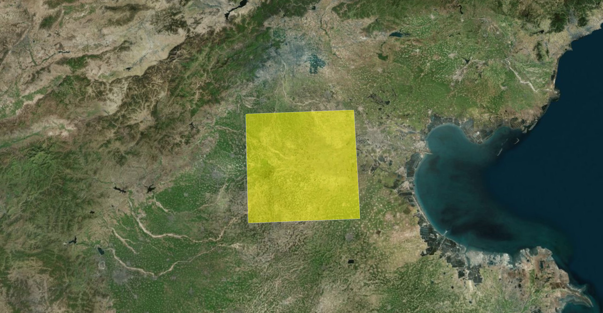
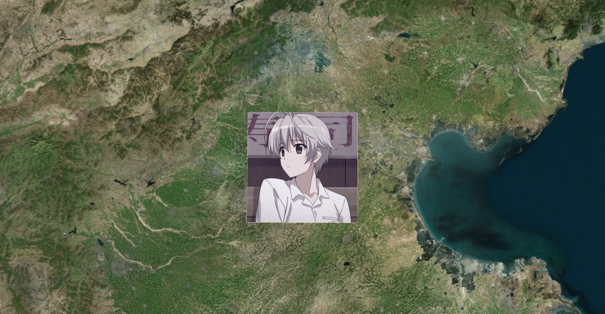
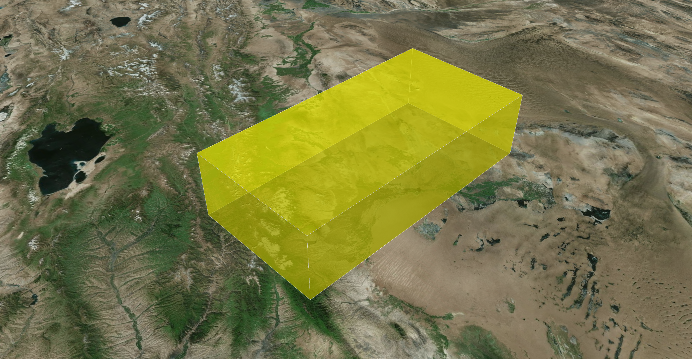

# 绘制 Entity 实体

Entity 是 Cesium 提供的高级 API，底层由 Primitive 封装而成，它将复杂的图形、结构化数据和时间动态性封装在一起，非常适合用来表示“业务对象”（如一架飞机、一辆车等）。

> [!NOTE] 特点
>
> - **易用性**：开发者只需声明属性（位置、形状、颜色），Cesium 会自动处理底层的渲染逻辑；
> - **数据驱动**：天然支持 CZML 数据格式；
> - **动态性**：包含 `Property` 系统，可以轻松实现随时间变化的位置；
> - **集成性**：自动处理选择（Selection）、信息框（InfoWindow）展示；


## Point（点）

::: code-group

```ts [单点]
const point = viewer.entities.add({
  name: "point",
  position: Cesium.Cartesian3.fromDegrees(102.7362, 38.0249, 0),
  properties: {
    despection: "这是自定义的点",
  },
  point: {
    // 点的大小
    pixelSize: 10,
    // 点的外边框宽度
    outlineWidth: 3,
    // 点的外边框颜色
    outlineColor: Cesium.Color.WHITE,
    // 点的填充色
    color: Cesium.Color.fromCssColorString("#14858B").withAlpha(1),
    // 点的高度参考模式
    heightReference: Cesium.HeightReference.CLAMP_TO_GROUND,
    // 永远禁用深度检测
    disableDepthTestDistance: Number.POSITIVE_INFINITY,
    // 根据相机距离调整点大小
    scaleByDistance: new Cesium.NearFarScalar(1000, 2.0, 5000, 0.5),
    // 根据相机距离调整透明度
    translucencyByDistance: new Cesium.NearFarScalar(500, 1.0, 2000, 0.3),
    // 根据相机距离控制点是否显示
    distanceDisplayCondition: new Cesium.DistanceDisplayCondition(0, 3000),
  },
});

viewer.flyTo(point, {
  duration: 3.0,
  offset: new Cesium.HeadingPitchRange(0, -90, 1000),
});
```

```ts [单点+Label]
const point = viewer.entities.add({
  name: "point",
  position: Cesium.Cartesian3.fromDegrees(102.7362, 38.0249, 0),
  properties: {
    despection: "这是自定义的点",
  },
  point: {
    // 点的大小
    pixelSize: 6,
    // 点的外边框宽度
    outlineWidth: 2,
    // 点的外边框颜色
    outlineColor: Cesium.Color.YELLOW,
    // 点的填充色
    color: Cesium.Color.fromCssColorString("#ff0000").withAlpha(1),
    // 点的高度参考模式
    heightReference: Cesium.HeightReference.CLAMP_TO_GROUND,
    // 永远禁用深度检测
    disableDepthTestDistance: Number.POSITIVE_INFINITY,
    // 根据相机距离调整点大小
    scaleByDistance: new Cesium.NearFarScalar(1000, 2.0, 5000, 0.5),
    // 根据相机距离调整透明度
    translucencyByDistance: new Cesium.NearFarScalar(500, 1.0, 2000, 0.3),
    // 根据相机距离控制点是否显示
    distanceDisplayCondition: new Cesium.DistanceDisplayCondition(0, 3000),
  },
  label: {
    text: "蓄水村",
    font: "22px 宋体",
    style: Cesium.LabelStyle.FILL_AND_OUTLINE,
    fillColor: Cesium.Color.WHITE,
    outlineColor: Cesium.Color.YELLOW,
    outlineWidth: 1.0,
    verticalOrigin: Cesium.VerticalOrigin.CENTER,
    horizontalOrigin: Cesium.HorizontalOrigin.CENTER,
    heightReference: Cesium.HeightReference.NONE,
    // X 和 Y 轴方向上的偏移量
    pixelOffset: new Cesium.Cartesian2(0, -25),
  },
});

viewer.flyTo(point, {
  duration: 3.0,
  offset: new Cesium.HeadingPitchRange(0, -90, 1000),
});
```

:::

|  |  |
| :------------------------------------------------------: | :------------------------------------------------------: |
|                           单点                           |                     单点和Label标签                      |


## Polyline（线段）

```ts
const polyline = viewer.entities.add({
  name: "polyline",
  polyline: {
    // 不需要高度时，使用 fromDegreesArray 传入经度、纬度
    positions: Cesium.Cartesian3.fromDegreesArray([104.413264, 32.603808, 104.450848, 32.5903484]),
    // 而需要高度时，使用 fromDegreesArrayHeights 传入经度、纬度、高度
    // positions: Cesium.Cartesian3.fromDegreesArrayHeights([104.413264, 32.603808, 2471.6, 104.450848, 32.5903484, 2344.1]),
    // 线宽
    width: 5,
    // 是否贴合地表
    clampToGround: true,
    // 沿地球表面绘制
    arcType: Cesium.ArcType.GEODESIC,
    // 基础材质
    material: new Cesium.ColorMaterialProperty(Cesium.Color.AQUAMARINE),
    // material: Cesium.Color.fromCssColorString("#00ffff"),
    // 根据距离控制折线的可见性
    distanceDisplayCondition: new Cesium.DistanceDisplayCondition(0, 10000),
    // 折线的精细颗粒度，值越小颗粒度越精细，渲染压力越大
    // granularity: Cesium.Math.RADIANS_PER_DEGREE,
    // 图形如何贴附在场景中的事物上（BOTH：表示线会贴附在地形和3D Tiles模型上）
    classificationType: Cesium.ClassificationType.BOTH,
    // 是否接收投射阴影
    shadows: Cesium.ShadowMode.DISABLED,
    // 多条折线出现重叠时，该值越大，折线的显示优先级越高（仅在clampToGround为true时生效）
    zIndex: 1,
  },
});

viewer.flyTo(polyline, {
  duration: 3.0,
  offset: new Cesium.HeadingPitchRange(0, -90, 10000),
});
```




## Polygon（多边形）

::: code-group

```ts [基础多边形]
const positions = Cesium.Cartesian3.fromDegreesArray([110, 30, 110, 25, 115, 30]);
// 指定高度时，搭配 perPositionHeight 使用
// const positions = Cesium.Cartesian3.fromDegreesArrayHeights([110, 30, 10000, 110, 25, 200000, 115, 30, 300000]);

const polygon = viewer.entities.add({
  name: "polygon",
  polygon: {
    // 定义多边形的顶点位置
    hierarchy: {
      // 外部顶点
      positions: positions,
      // 内部带孔的顶点，平面多边形时可忽略
      holes: [],
    },
    // 是否开启多边形填充
    fill: true,
    // 多边形材质
    material: Cesium.Color.YELLOW.withAlpha(0.5),
    // 是否开启多边形外边框轮廓
    outline: true,
    // 外边框线宽（受WebGL底层影响，该线宽只会显示为1px）
    outlineWidth: 1,
    // 外边框颜色
    outlineColor: Cesium.Color.WHITE,
    // 多边形相对于椭球面的高度
    height: 10000,
    // 指定高度是相对于什么而言的
    heightReference: Cesium.HeightReference.NONE,
    // 多边形的拉伸高度
    extrudedHeight: 50000,
    // 指定拉伸高度相对于什么而言的
    extrudedHeightReference: Cesium.HeightReference.NONE,
    // 纹理旋转角度（弧度制）
    stRotation: Cesium.Math.toRadians(60),
    // 是否使用每个顶点的单独高度（可搭配 fromDegreesArrayHeights 使用）
    perPositionHeight: false,
    // 多边形按地球表面贴地绘制
    arcType: Cesium.ArcType.GEODESIC,
    // 是否闭合顶部
    closeTop: true,
    // 是否闭合底部
    closeBottom: true,
    // 图形如何贴附在场景中的事物上（BOTH：表示线会贴附在地形和3D Tiles模型上）
    classificationType: Cesium.ClassificationType.BOTH,
    // 根据距离控制多边形的可见性
    distanceDisplayCondition: new Cesium.DistanceDisplayCondition(0, 5000000),
    // 多个多边形重合时，值越大多边形显示的越靠上
    zIndex: 0,
  },
});

viewer.zoomTo(polygon);
```

```ts [回型多边形]
// 外部顶点坐标
const outerPositions = Cesium.Cartesian3.fromDegreesArray([
  116.39, 39.9, 116.41, 39.9, 116.41, 39.92, 116.39, 39.92,
]);
// 内部孔洞左边
const innerPositions = Cesium.Cartesian3.fromDegreesArray([
  116.397, 39.907, 116.403, 39.907, 116.403, 39.913, 116.397, 39.913,
]);

const polygon = viewer.entities.add({
  name: "polygon",
  polygon: {
    // 定义多边形的顶点位置
    hierarchy: new Cesium.PolygonHierarchy(outerPositions, [
      new Cesium.PolygonHierarchy(innerPositions),
    ]),
    // 是否开启多边形填充
    fill: true,
    // 多边形材质
    material: Cesium.Color.YELLOW.withAlpha(0.5),
    // 是否开启多边形外边框轮廓
    outline: true,
    // 外边框线宽（受WebGL底层影响，该线宽只会显示为1px）
    outlineWidth: 1,
    // 外边框颜色
    outlineColor: Cesium.Color.WHITE,
    // 多边形相对于椭球面的高度
    height: 1000,
    // 指定高度是相对于什么而言的
    heightReference: Cesium.HeightReference.NONE,
    // 多边形的拉伸高度
    extrudedHeight: 2000,
    // 指定拉伸高度相对于什么而言的
    extrudedHeightReference: Cesium.HeightReference.NONE,
    // 纹理旋转角度（弧度制）
    stRotation: Cesium.Math.toRadians(60),
    // 是否使用每个顶点的单独高度（可搭配 fromDegreesArrayHeights 使用）
    perPositionHeight: false,
    // 多边形按地球表面贴地绘制
    arcType: Cesium.ArcType.GEODESIC,
    // 是否闭合顶部
    closeTop: true,
    // 是否闭合底部
    closeBottom: true,
    // 图形如何贴附在场景中的事物上（BOTH：表示线会贴附在地形和3D Tiles模型上）
    classificationType: Cesium.ClassificationType.BOTH,
    // 根据距离控制多边形的可见性
    distanceDisplayCondition: new Cesium.DistanceDisplayCondition(0, 5000000),
  },
});

viewer.zoomTo(polygon);
```

:::

|  |  |
| :------------------------------------------------------: | :------------------------------------------------------: |
|                        基础多边形                        |                        回型多边形                        |


## PolylineVolume（多线段柱体）

```ts
function addPolylineVolume() {
  const polylineVolume = viewer.entities.add({
    name: "polylineVolume",
    polylineVolume: {
      show: true,
      // 定义多段线柱体的位置数组
      positions: Cesium.Cartesian3.fromDegreesArray([-85.0, 32.0, -85.0, 36.0, -89.0, 36.0]),
      // 指定位置的数组，这些位置定义了要拉伸的形状
      shape: computeCircle(60000),
      // 定义拐角的样式
      cornerType: Cesium.CornerType.ROUNDED,
      // 是否开启填充
      fill: true,
      // 多段线柱体材质
      material: Cesium.Color.RED,
      // 是否开启外边线轮廓
      outline: true,
      // 外边线轮廓颜色
      outlineColor: Cesium.Color.WHITE,
      // 外边线轮廓宽度
      outlineWidth: 1,
      // 根据距离控制多段线柱体的可见性
      distanceDisplayCondition: new Cesium.DistanceDisplayCondition(0, 300000),
    },
  });

  viewer.zoomTo(polylineVolume);
}

function computeCircle(radius: number) {
  const positions = [];
  for (let i = 0; i < 360; i++) {
    const radians = Cesium.Math.toRadians(i);
    positions.push(
      new Cesium.Cartesian2(
        radius * Math.cos(radians),
        radius * Math.sin(radians),
      ),
    );
  }
  return positions;
}
```




## Plane（平面）

```ts {15}
const plane = viewer.entities.add({
  name: "plane",
  position: Cesium.Cartesian3.fromDegrees(116.39, 38.9, 10000),
  plane: {
    // 指定平面的法线和距离（UNIT_Z表示平面垂直于Z轴）
    plane: new Cesium.Plane(Cesium.Cartesian3.UNIT_Z, 0.0),
    // 平面的长度和宽度
    dimensions: new Cesium.Cartesian2(100000, 100000),
    // 根据距离控制实体是否展示
    distanceDisplayCondition: new Cesium.DistanceDisplayCondition(0, 3000000),
    // 是否开启平面填充
    fill: true,
    // 平面材质，也可以填充一张图片
    material: Cesium.Color.YELLOW.withAlpha(0.5),
    // material: "/images/plane.jpg", // 可以指定图片作为填充
    // 是否开启外边框轮廓
    outline: true,
    // 外边框宽度
    outlineWidth: 1,
    // 外边框颜色
    outlineColor: Cesium.Color.WHITE,
  },
});

viewer.zoomTo(plane);
```

|  |  |
| :------------------------------------------------------: | :------------------------------------------------------: |
|                         颜色填充                         |                         图片填充                         |


## Box（盒子）

```ts
const box = viewer.entities.add({
  name: "box",
  position: Cesium.Cartesian3.fromDegrees(102.7362, 38.0249, 50000),
  box: {
    // 指定长宽高
    dimensions: new Cesium.Cartesian3(100000, 200000, 50000),
    // 指定高度是相对于什么的高度
    heightReference: Cesium.HeightReference.NONE,
    // 根据距离控制实体是否展示
    distanceDisplayCondition: new Cesium.DistanceDisplayCondition(0, 3000),
    // 是否开启填充
    fill: true,
    // 填充材质
    material: Cesium.Color.YELLOW.withAlpha(0.5),
    // 是否开启外边框轮廓
    outline: true,
    // 外边框线宽
    outlineWidth: 5,
    // 外边框颜色
    outlineColor: Cesium.Color.WHITE,
  },
});

viewer.zoomTo(box);
```




