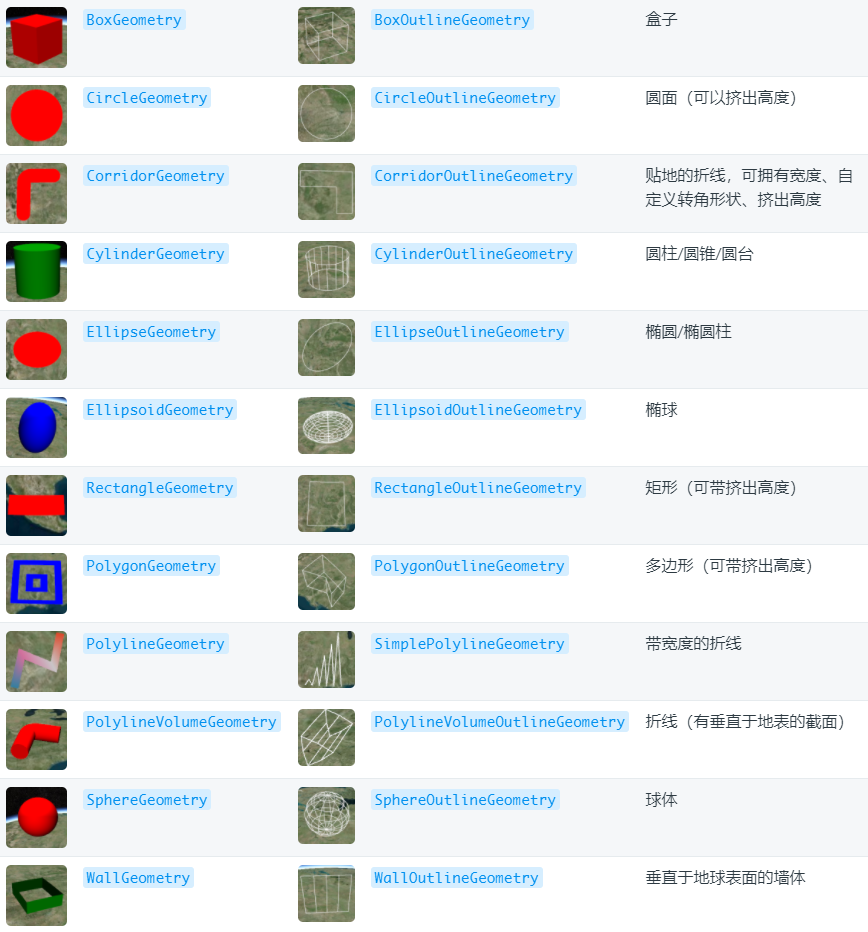
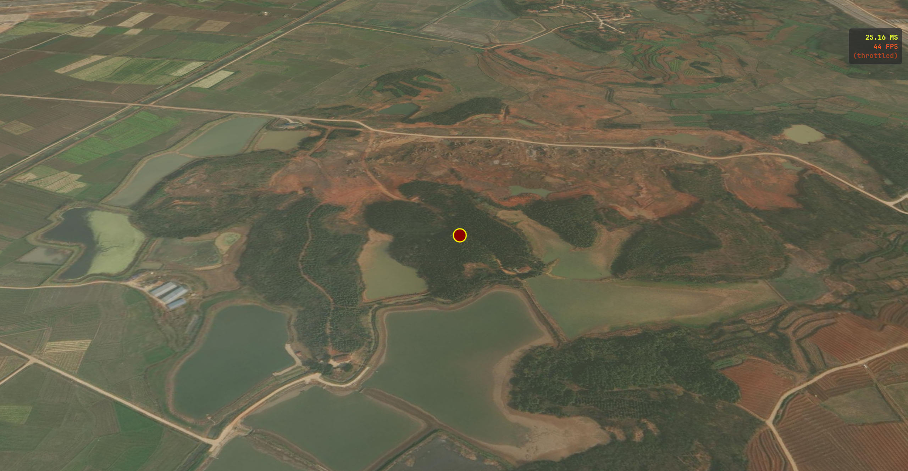
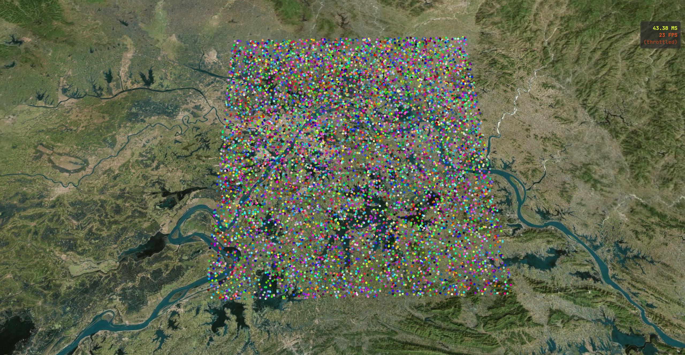
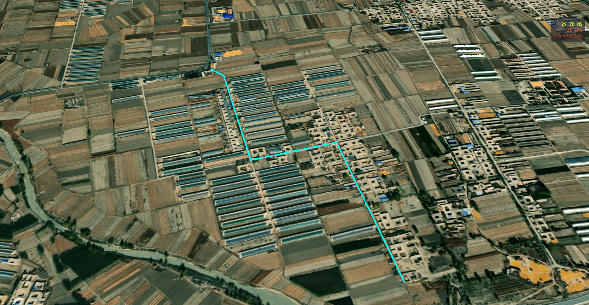
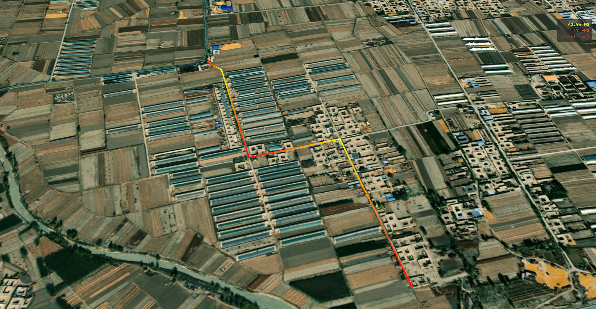

# 绘制 Primitive 图元

在 Cesium 中，Primitive（图元）是位于渲染引擎底层的一个核心概念，可以与 GPU 通信的低级 API。它主要由两部分组成：

- **Geometry（几何体）**：定义形状（如点、线、面、球体的顶点数据）；
- **Appearance（外观）**：定义着色器（GLSL）、材质和渲染状态；

> [!NOTE] Entity 与 Primitive 的区别？
>
> Entity 是由 Primitive 封装组成，调用方便，但是加载大量数据时效率没有 Primitive 高。Primitive 更接近 WebGL 底层，没有像 Entity 一样带有附加属性，加载大量数据时效率更高。
>
> |   特性   |       Entity（高级）       |                 Primitive（低层）                  |
> | :------: | :------------------------: | :------------------------------------------------: |
> |  易用性  | 非常简单，通过属性即可控制 |         复杂，需要手动管理几何形状和着色器         |
> |   性能   |  一般，适合几百个动态对象  |          极高，适合渲染成千上万个静态对象          |
> |  灵活性  |   受限于 API 提供的属性    |           极高，可以编写自定义 GLSL 着色器           |
> | 批量渲染 |           不支持           | 支持（Batching），能将多个几何体合并为一个绘制调用 |


Primitive 支持的集合类都是以 Geometry 结尾的，如下图：




## PointPrimitive（点）

在 Cesium 中使用 Primitive 创建点，通常不是直接使用 `PointPrimitive` 这个类，而是通过 `PointPrimitiveCollection` 类来实现和管理。这是因为点的数量巨大时，使用集合（Collection）可以实现高效的批量渲染。

::: code-group

```ts [单个点]
function addPoint() {
  const collection = new Cesium.PointPrimitiveCollection();
  viewer.scene.primitives.add(collection);

  const point = collection.add({
    id: "point",
    position: Cesium.Cartesian3.fromDegrees(114, 30, 100),
    // 点的大小
    pixelSize: 20,
    // 点的颜色
    color: Cesium.Color.DARKRED,
    // 外轮廓宽度
    outlineWidth: 2,
    // 外轮廓颜色
    outlineColor: Cesium.Color.YELLOW,
    // 是否禁用地形深度检测
    disableDepthTestDistance: Number.POSITIVE_INFINITY,
    // 根据距离控制点是否显示
    distanceDisplayCondition:  new Cesium.DistanceDisplayCondition(0, 10000),
    // 根据相机距离调整点大小
    scaleByDistance: new Cesium.NearFarScalar(1000, 2.0, 5000, 0.5),
    // 根据相机距离调整透明度
    translucencyByDistance: new Cesium.NearFarScalar(500, 1.0, 2000, 0.3),
  });
}
```

```ts [10000个点]
function addPoint() {
  const collection = new Cesium.PointPrimitiveCollection();
  viewer.scene.primitives.add(collection);

  // 循环添加 10000 个点
  for (let i = 0; i < 10000; i++) {
    collection.add({
      position: Cesium.Cartesian3.fromDegrees(114 + Math.random(), 30 + Math.random(), 100),
      color: Cesium.Color.fromRandom({ alpha: 1.0 }),
      pixelSize: 5,
    });
  }
}
```

:::

|  |  |
| :------------------------------------------------------: | :------------------------------------------------------: |
|                          单个点                          |                        10000 个点                         |


## PolylineGeometry（线段）

::: code-group

```ts [基础使用] {32}
function addPolyline() {
  const posArray = [
    102.731346, 38.029915, 1420.9, 102.731804, 38.029624, 1420.9,
    102.732901, 38.026634, 1421.2, 102.735248, 38.027173, 1421.2,
    102.736462, 38.023698, 1421.5,
  ];

  const geometryInstance = new Cesium.GeometryInstance({
    id: "polyline",
    geometry: new Cesium.PolylineGeometry({
      // 添加了地形之后，要实现贴地效果需要增加坐标海拔
      positions: Cesium.Cartesian3.fromDegreesArrayHeights(posArray),
      // 线宽
      width: 3,
      // 顶点颜色过渡是否使用线性插值
      colorsPerVertex: true,
      // 顶点颜色配置，必须和坐标长度相同
      colors: [
        Cesium.Color.RED,
        Cesium.Color.YELLOW,
        Cesium.Color.RED,
        Cesium.Color.YELLOW,
        Cesium.Color.RED,
      ],
      // 设置顶点渲染格式
      vertexFormat: Cesium.VertexFormat.DEFAULT,
      // 指定点与点之间的连接方式（GEODESIC表示大地线插值）
      arcType: Cesium.ArcType.GEODESIC,
    }),
    attributes: {
      // 线条颜色（设置该属性后，上面的 colors 属性将会失效）
      color: Cesium.ColorGeometryInstanceAttribute.fromColor(Cesium.Color.AQUA),
      // 控制线条是否显示
      show: new Cesium.ShowGeometryInstanceAttribute(true),
      // 控制线条的可见范围
      distanceDisplayCondition: new Cesium.DistanceDisplayConditionGeometryInstanceAttribute(0, 5000),
    },
  });
  const primitive = new Cesium.Primitive({
    geometryInstances: geometryInstance,
    appearance: new Cesium.PolylineColorAppearance({
      // 是否将该物体放入透明队列渲染，进行深度排序，确保透明叠加效果正确
      translucent: true,
      // 顶点着色器GLSL代码，用于覆盖默认的着色器
      // vertexShaderSource: "",
      // 片源着色器GLSL代码，用于覆盖默认的着色器
      // fragmentShaderSource: "",
      // 渲染状态，控制底层WebGL的状态，通常不需要手动修改
      // renderState: {},
    }),
    // 是否开启包围盒，仅调试使用
    debugShowBoundingVolume: false,
  });
  viewer.scene.primitives.add(primitive);
  // 视角定位
  flyToPrimitive(posArray);
}

/**
 * 飞行定位至Primitive处
 * @param position 坐标点
 */
function flyToPrimitive(position: Array<number>) {
  const positions = Cesium.Cartesian3.fromDegreesArrayHeights(position);
  const boundingSphere = Cesium.BoundingSphere.fromPoints(positions);
  viewer.camera.flyToBoundingSphere(boundingSphere, {
    offset: new Cesium.HeadingPitchRange(
      0,
      Cesium.Math.toRadians(-45),
      2000,
    ),
  });
}
```

```ts

```

:::

|  |  |
| :------------------------------------------------------: | :------------------------------------------------------: |
|                   attributes 设置 color                    |           顶点单独着色（注释 attributes.color）           |


## BoxGeometry（盒子）


## CircleGeometry（圆面）


## CorridorGeometry（折线）


## CylinderGeometry（圆柱/圆锥）


## EllipseGeometry（椭圆）


## RectangleGeometry（矩形）


## PolygonGeometry（多边形）


## PolylineVolumeGeometry（多段线柱体）


## SphereGeometry（球体）


## WallGeometry（墙）


