# Material 材质

在 Cesium 中，`material` 材质主要用于定义几何图形（Entity 或 Primitive）的外观。根据实现效果，可以分为以下几类：

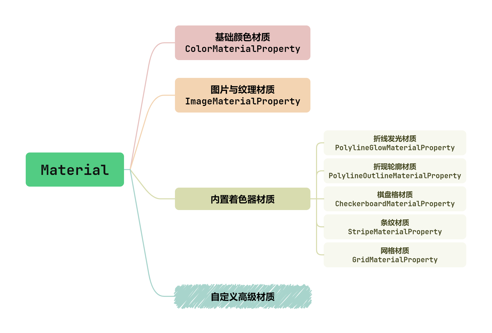


## 基础颜色材质

基础颜色材质是最常用的材质，用于设置 **纯色** 或 **带透明度的颜色**。

```ts {11,13}
const entity = viewer.entities.add({
  name: "plane",
  position: Cesium.Cartesian3.fromDegrees(116.39, 38.9, 10000),
  plane: {
    plane: new Cesium.Plane(Cesium.Cartesian3.UNIT_Z, 0.0),
    dimensions: new Cesium.Cartesian2(100000, 100000),
  },
});

// 基础颜色材质（纯色）
entity.plane.material = Cesium.Color.YELLOW;
// 基础颜色材质（透明色）
entity.plane.material = Cesium.Color.YELLOW.withAlpha(0.5);
```

| 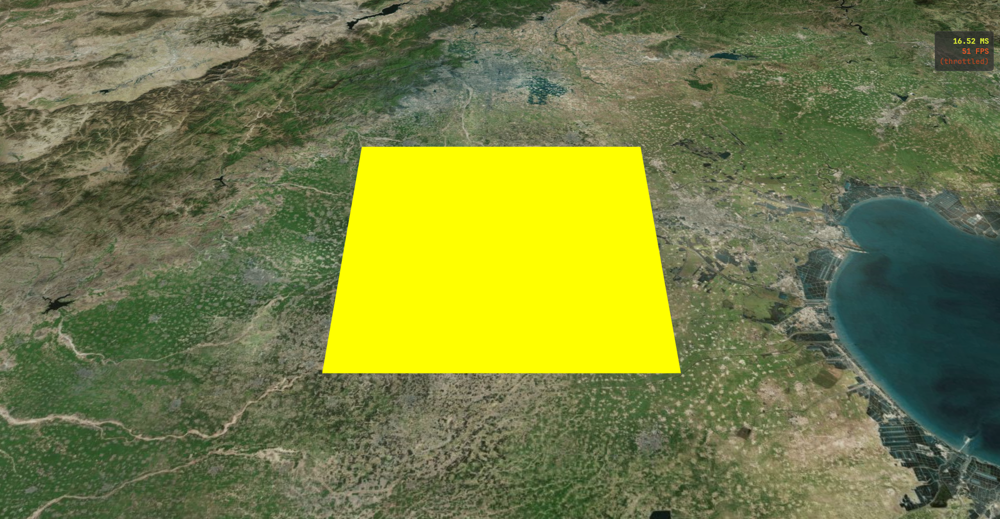 | 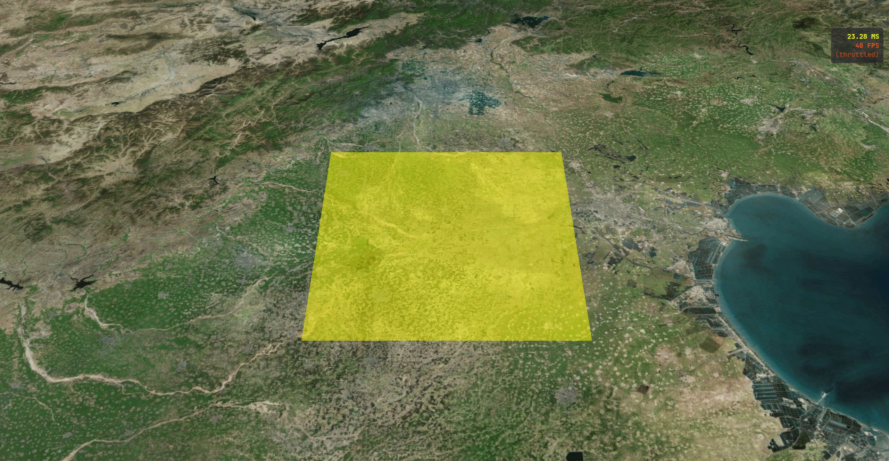 |
| :------------------------------------------------------: | :------------------------------------------------------: |
|                         纯色材质                         |                        透明色材质                        |


## 图片纹理材质

图片纹理材质用于将 **静态图片** 或 **动态 Canvas** 贴在几何体表面。

```ts {11,13}
const entity = viewer.entities.add({
  name: "plane",
  position: Cesium.Cartesian3.fromDegrees(116.39, 38.9, 10000),
  plane: {
    plane: new Cesium.Plane(Cesium.Cartesian3.UNIT_Z, 0.0),
    dimensions: new Cesium.Cartesian2(100000, 100000),
  },
});

// 图片纹理材质
entity.plane.material = "/images/plane.jpg";

entity.plane.material = new Cesium.ImageMaterialProperty({
  image: "/images/plane.jpg",
  // 纹理在X、Y轴的重复次数
  repeat: new Cesium.Cartesian2(2, 2),
  // 应用于图片的颜色，会与原图颜色混合
  color: Cesium.Color.AQUA,
  // 是否开启图片透明度（当 png 等图片有透明部分时开启）
  transparent: true,
});
```

| 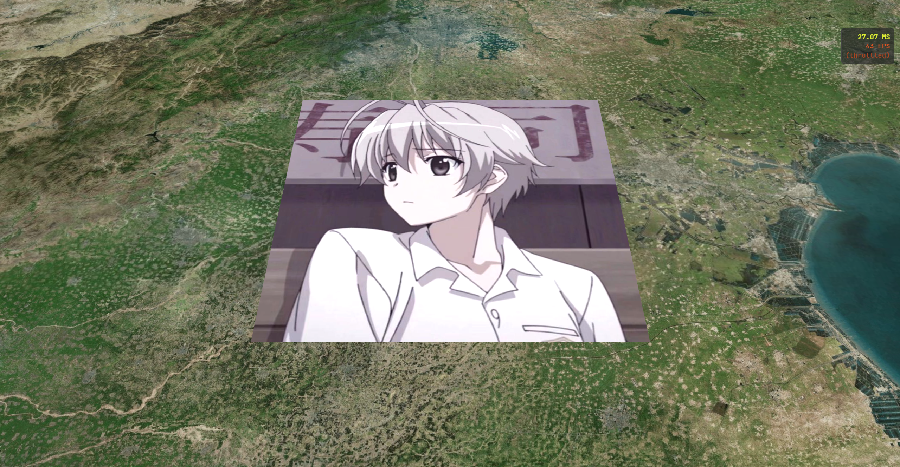 | 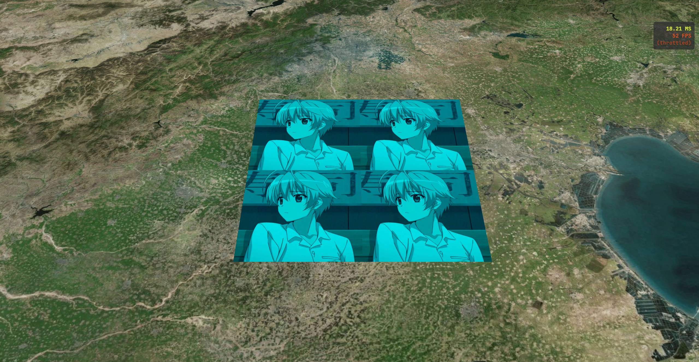 |
| :------------------------------------------------------: | :------------------------------------------------------: |
|                        图片填充1                         |                        图片填充2                         |


## 内置着色器材质

### 折线发光材质

折线发光材质用于实现 **线段中心发光，边缘模糊**。

```ts {11}
const entity = viewer.entities.add({
  name: "polyline",
  polyline: {
    positions: Cesium.Cartesian3.fromDegreesArray([104.413264, 32.603808, 104.450848, 32.5903484]),
    width: 10,
    clampToGround: true,
  },
});

// 折线发光材质
entity.polyline.material = new Cesium.PolylineGlowMaterialProperty({
  // 发光强度（0~1）
  glowPower: 0.25,
  // 渐变效果
  taperPower: 1.0,
  // 材质颜色
  color: Cesium.Color.CYAN,
});
```

| 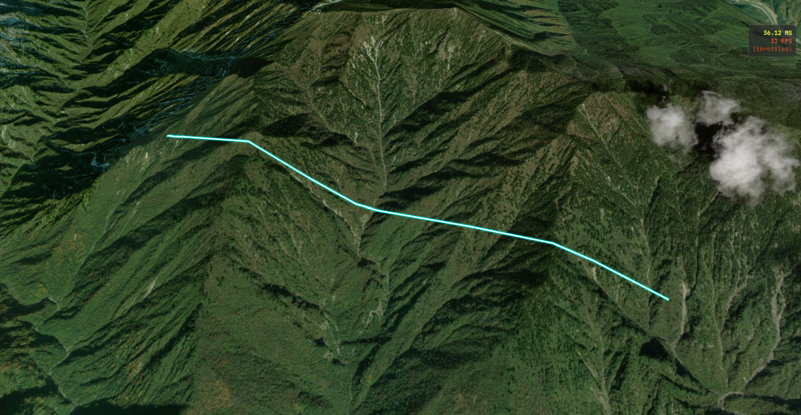 | 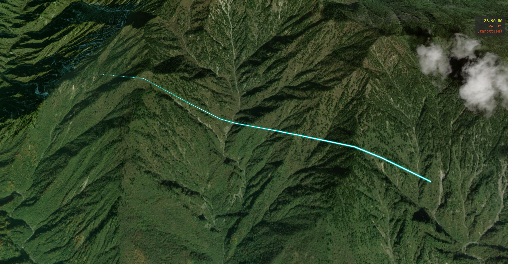 |
| :------------------------------------------------------: | :------------------------------------------------------: |
|                      渐变效果为1.0                       |                      渐变效果为0.2                       |


### 折线轮廓材质

折线轮廓材质用于实现 **线段带有一个不同颜色的边框**。

```ts {11}
const entity = viewer.entities.add({
  name: "polyline",
  polyline: {
    positions: Cesium.Cartesian3.fromDegreesArray([104.413264, 32.603808, 104.450848, 32.5903484]),
    width: 6,
    clampToGround: true,
  },
});

// 折线轮廓材质
entity.polyline.material = new Cesium.PolylineOutlineMaterialProperty({
  // 线条颜色
  color: Cesium.Color.WHITE,
  // 轮廓宽度
  outlineWidth: 4,
  // 轮廓颜色
  outlineColor: Cesium.Color.AQUA,
});
```

| 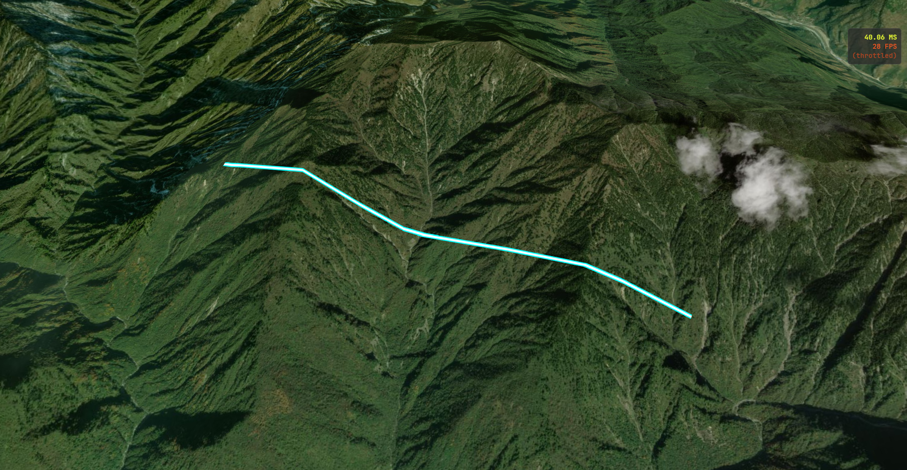 | 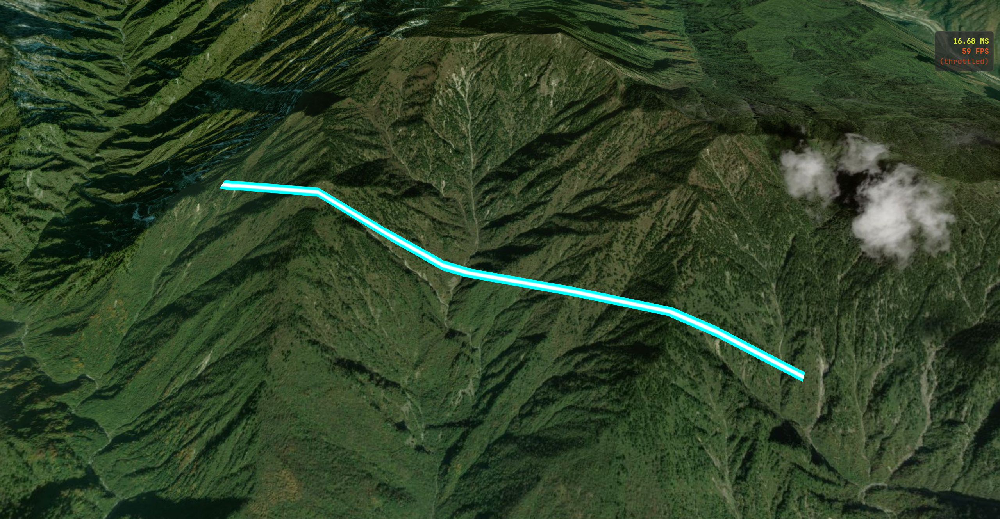 |
| :------------------------------------------------------: | :------------------------------------------------------: |
|                       轮廓宽度为4                        |                       轮廓宽度为10                       |


### 棋盘格材质

棋盘格材质用于实现 **交替的网格**。

```ts
const entity = viewer.entities.add({
  name: "plane",
  position: Cesium.Cartesian3.fromDegrees(116.39, 38.9, 10000),
  plane: {
    plane: new Cesium.Plane(Cesium.Cartesian3.UNIT_Z, 0.0),
    dimensions: new Cesium.Cartesian2(100000, 100000),
  },
});

// 棋盘格材质
entity.plane.material = new Cesium.CheckerboardMaterialProperty({
  // 偶数格颜色
  evenColor: Cesium.Color.WHITE,
  // 奇数格颜色
  oddColor: Cesium.Color.BLACK,
  // 奇偶交替的频次
  repeat: new Cesium.Cartesian2(6, 4),
});
```

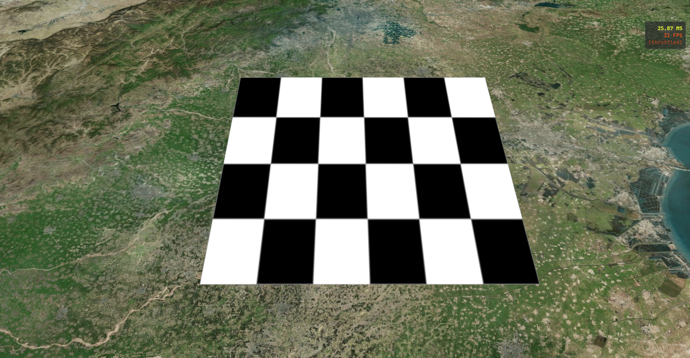


### 条纹材质

条纹材质用于实现 **平行的条纹**。

```ts {11}
const entity = viewer.entities.add({
  name: "plane",
  position: Cesium.Cartesian3.fromDegrees(116.39, 38.9, 10000),
  plane: {
    plane: new Cesium.Plane(Cesium.Cartesian3.UNIT_Z, 0.0),
    dimensions: new Cesium.Cartesian2(100000, 100000),
  },
});

// 平行条纹材质
entity.plane.material = new Cesium.StripeMaterialProperty({
  // 偶数格颜色
  evenColor: Cesium.Color.WHITE,
  // 奇数格颜色
  oddColor: Cesium.Color.BLACK,
  // 重复次数
  repeat: 10,
  // 条纹是纵向或横向
  orientation: Cesium.StripeOrientation.VERTICAL
});
```

| 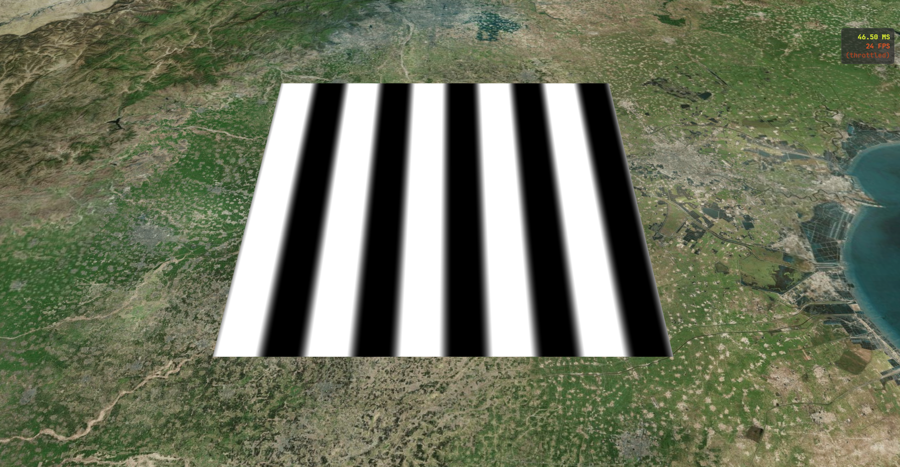 | 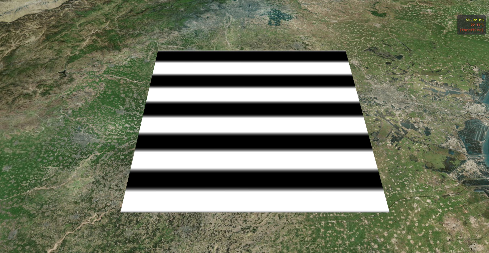 |
| :------------------------------------------------------: | :------------------------------------------------------: |
|                         纵向条纹                         |                         横向条纹                         |


### 网格材质

网格材质用于实现 **在表面绘制细线网格，通常用于经纬网参考**。

```ts
const entity = viewer.entities.add({
  name: "plane",
  position: Cesium.Cartesian3.fromDegrees(116.39, 38.9, 10000),
  plane: {
    plane: new Cesium.Plane(Cesium.Cartesian3.UNIT_Z, 0.0),
    dimensions: new Cesium.Cartesian2(100000, 100000),
  },
});

// 网格条纹材质
entity.plane.material = new Cesium.GridMaterialProperty({
  // 线条颜色和背景色
  color: Cesium.Color.YELLOW,
  // 背景色透明度
  cellAlpha: 0.5,
  // 线条条数
  lineCount: new Cesium.Cartesian2(8, 8),
  // 线条粗细
  lineThickness: new Cesium.Cartesian2(2, 2),
  // 线条偏移量
  lineOffset: new Cesium.Cartesian2(10, 10),
});
```

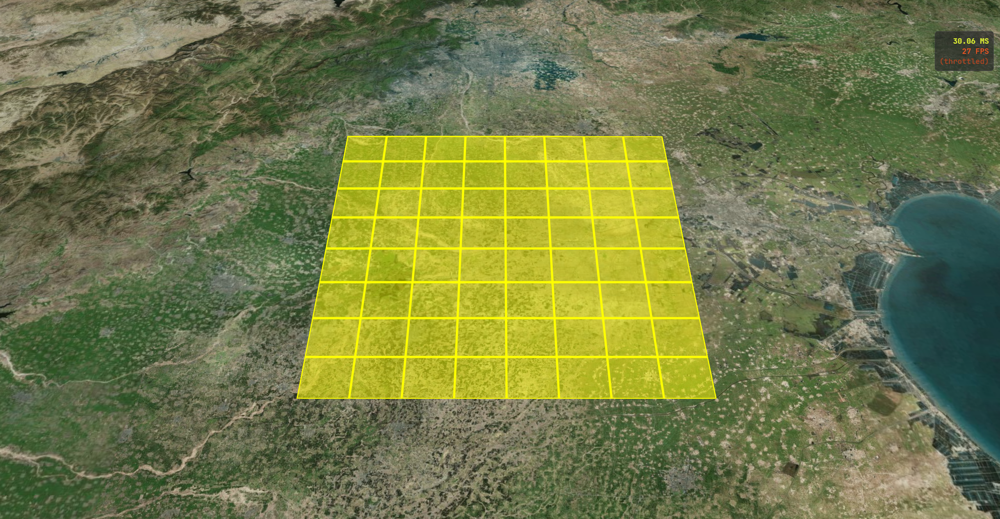


## 自定义高级材质

自定义高级材质用于实现动态水面，流光飞线等炫酷效果，但通常需要编写 GLSL 着色器代码。

