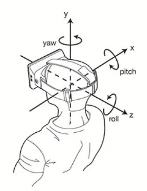

# 相机视角

相机视角主要用于控制相机的飞行定位，例如系统初始化位置定位、视点切换、设备定位、报警事件定位等，这些都是通过对相机进行操作实现的。

Cesium 虽然提供了很多种方法用于实现相机的飞行定位，但这些方法都是 **基于 Viewer 和 Camera 类实现的**。

|  属性  |        Viewer 定位        |   Camera 定位   |
|:----:|:-----------------------:|:-------------:|
|  作用  |     Cesium 总的场景控制器      |   只控制视角和观察点   |
| 常用功能 |     管理 Scene、图层、实体等     | 控制相机移动、旋转、缩放等 |
| 控制重点 |          整个场景           |      摄像机      |
| 生活举例 | 整个电影院（包含大荧幕、灯光、座椅、投影仪等） |     只是投影仪     |

## 相机参数

在 Cesium 中，我们要想确定相机视角，需要设置相机的两个参数：

- **位置**（destination）

  ```typescript
  // 笛卡尔坐标位置
  const cartesian = Cesium.Cartesian3.fromDegrees(longitude, latitude, height);
  ```


- **方向**（orientation）

  ```typescript
  // viewer 定位使用
  const orientation = new Cesium.HeadingPitchRange(heading, pitch, range);
  
  // viewer.camera 定位使用
  const orientation = {
    heading: Cesium.Math.toRadians(0),
    pitch: Cesium.Math.toRadians(-90),
    roll: Cesium.Math.toRadians(0)
  }
  ```

|   参数    | 默认值 | 描述                |
  |:-------:|:---:|:------------------|
| heading |  0  | 偏航角，正北为 0         |
|  pitch  | -90 | 俯仰角，俯视为-90        |
|  roll   |  0  | 翻滚角               |
|  range  |  -  | 范围（米），代表相机距离目标的高度 |



## viewer 定位

在 Viewer 类中有两个方法用于实现飞行定位：

|   方法   |      描述       | 是否有动画 |
|:------:|:-------------:|:-----:|
| flyTo  | 视角带有动画地飞行到位置点 |   有   |
| zoomTo | 视角直接跳转到数据源的位置 |   无   |

> [!TIP] 适用场景
>
> 1. 适用于飞行定位到某个具体的对象，如 Entity、Primitive、DataSource 等；
>
> 2. Cesium 内部会自动计算合适的视角，让目标对象在屏幕上完全可见；
     >
     >    ```typescript
     > // 飞行到所有实体对象，使它们全部可见
     > viewer.flyTo(viewer.entities);
     >    ```

::: code-group

```typescript [flyTo] {17-21}
const rectangle = viewer.entities.add({
  show: true,
  name: 'rectangle',
  rectangle: {
    coordinates: Cesium.Rectangle.fromDegrees(102.7357, 38.025, 102.737, 38.0258),
    material: Cesium.Color.GREEN.withAlpha(0.8),
    height: 10.0,
    outline: false
  }
});

const heading = Cesium.Math.toRadians(0);
const pitch = Cesium.Math.toRadians(-90);
const range = 1000; // 视角距离实体的垂直高度

// 飞行定位到 Entity 实体位置
viewer.flyTo(rectangle, {
  duration: 3.0,
  maximumHeight: 2000, // 飞行时视角的最大高度
  offset: new Cesium.HeadingPitchRange(heading, pitch, range)
});
```

```typescript [zoomTo] {13-17}
const rectangle = viewer.entities.add({
  show: true,
  name: 'rectangle',
  rectangle: {
    coordinates: Cesium.Rectangle.fromDegrees(102.7357, 38.025, 102.737, 38.0258),
    material: Cesium.Color.GREEN.withAlpha(0.8),
    height: 10.0,
    outline: false
  }
});

// 视角固定到 Entity 实体位置
viewer.zoomTo(rectangle, {
  heading: Cesium.Math.toRadians(0),
  pitch: Cesium.Math.toRadians(-90),
  range: 1000 // 距离中心点的高度
});
```

:::

## camera 定位

Camera 类对应的相机定位方法比较多，包括了如下四个方法：

|         方法          | 描述                       | 是否有动画 |
|:-------------------:|:-------------------------|:-----:|
|        flyTo        | 相机带动画地飞行到位置点             |   有   |
|       lookAt        | 相机固定到指定位置点（视角可以旋转，但无法拖动） |   无   |
|       setView       | 相机跳转到指定位置点               |   无   |
| flyToBoundingSphere | 将相机平滑的移动到指定的范围           |   有   |

::: code-group

```typescript [flyTo] {4-14}
const point = Cesium.Cartesian3.fromDegrees(102.7357, 38.025, 200);
const rectangle = Cesium.Rectangle.fromDegrees(102.7357, 38.025, 102.737, 38.0258);

viewer.camera.flyTo({
  // 定位位置，可以是 Cartesian3坐标点 或 Rectangle矩形等
  destination: point,
  duration: 3.0,
  maximumHeight: 2000,
  orientation: {
    heading: Cesium.Math.toRadians(0),
    pitch: Cesium.Math.toRadians(-90),
    roll: Cesium.Math.toRadians(0)
  },
});
```

```typescript [setView] {4-11}
const point = Cesium.Cartesian3.fromDegrees(102.7357, 38.025, 200);
const rectangle = Cesium.Rectangle.fromDegrees(102.7357, 38.025, 102.737, 38.0258);

viewer.camera.setView({
  destination: point,
  orientation: {
    heading: Cesium.Math.toRadians(0),
    pitch: Cesium.Math.toRadians(-90),
    roll: Cesium.Math.toRadians(0)
  }
});
```

```typescript [lookAt] {9}
const point = Cesium.Cartesian3.fromDegrees(102.7357, 38.025, 200);

const heading = Cesium.Math.toRadians(0);
const pitch = Cesium.Math.toRadians(-90);
const range = 1000;
const handingPitchRange = new Cesium.HeadingPitchRange(heading, pitch, range);

// lookAt() 的目的地只能是 Cartesian3 坐标点
viewer.camera.lookAt(point, handingPitchRange);
```

```typescript [flyToBoundingSphere] {5}
const center = Cesium.Cartesian3.fromDegrees(102.7357, 38.025, 200);
const radius = 500;
const boundingSphere = new Cesium.BoundingSphere(center, radius); // 创建包围球对象

viewer.camera.flyToBoundingSphere(boundingSphere, {
  duration: 3.0,
  maximumHeight: 2000,
  offset: new Cesium.HeadingPitchRange(
    Cesium.Math.toRadians(0),
    Cesium.Math.toRadians(-90),
    1000
  )
});
```

:::


