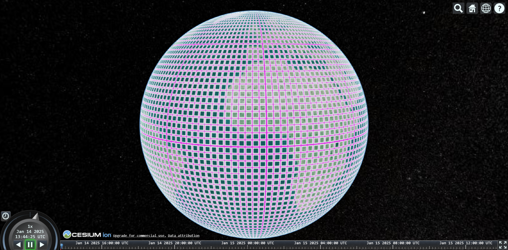
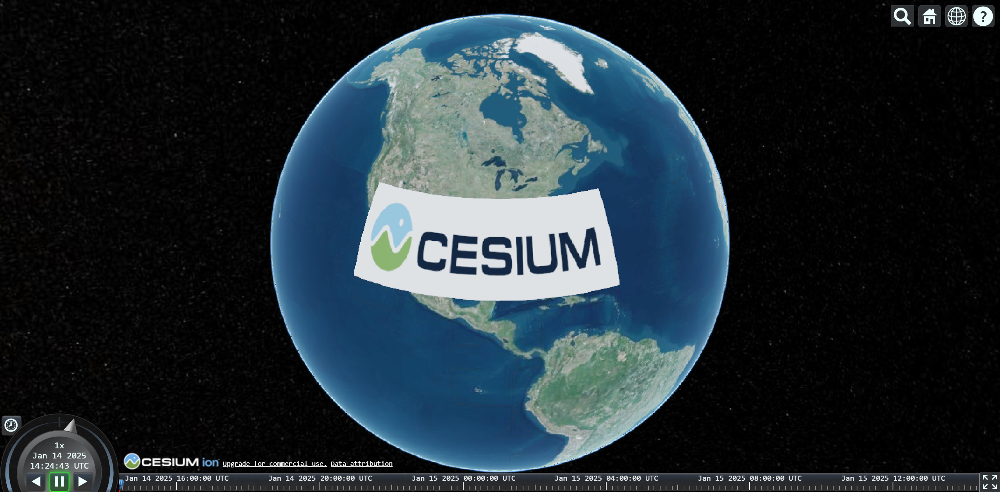

# 加载影像图层

## 清除默认底图

```ts
viewer.imageryLayers.remove(viewer.imageryLayers.get(0));
```


## Bing Map

[BingMapsImageryProvider↗](https://cesium.com/learn/cesiumjs/ref-doc/BingMapsImageryProvider.html?classFilter=BingMapsImageryProvider)
用于加载 BingMap 提供的地图，但是在使用前需要到 BingMap 官网 [申请 key↗](https://www.bingmapsportal.com/Application#)。

```ts {13}
const viewer = new Cesium.Viewer("cesiumContainer", {
  infoBox: false
});

const provider = await Cesium.BingMapsImageryProvider.fromUrl( // [!code ++]
  "https://dev.virtualearth.net",
  {
    key: "giFaiDHM1LyFwGLeyIkKYJogVB_JJQyXLC1G-yuMY8KPJw8wI6XqfppPFWMc7",
    // BingMapsStyle 枚举类，里面包含了可加载的地图种类
    mapStyle: Cesium.BingMapsStyle.CANVAS_DARK
  }
);
viewer.imageryLayers.addImageryProvider(provider);
```


## Cesium Map

Cesium Ion 在线服务，默认全局基础图像图层（当前为 Bing Maps）。

::: code-group

```ts [方式一] {13}
const viewer = new Cesium.Viewer("cesiumContainer", {
  infoBox: false
});

const imageryLayer = Cesium.ImageryLayer.fromProviderAsync(
  Cesium.IonImageryProvider.fromAssetId(3812), // [!code ++]
  {
    // options
  },
);

// imageryLayer 的类型是 Cesium.ImageryLayer，所以用 add() 添加
viewer.imageryLayers.add(imageryLayer);
```

```ts [方式二] {4}
const provider = await Cesium.IonImageryProvider.fromAssetId(3812);

// provider 的类型是 Cesium.IonImageryProvider，用 addImageryProvider() 添加
viewer.imageryLayers.addImageryProvider(provider);
```

:::


## ArcGIS Map

::: details ArcGIS 在线地图地址

```json
[
  {
    name: "ArcGIS 影像地图",
    url: "https://services.arcgisonline.com/ArcGIS/rest/services/World_Imagery/MapServer"
  },
  {
    name: "ArcGIS 街道地图",
    url: "https://services.arcgisonline.com/ArcGIS/rest/services/World_Street_Map/MapServer"
  }
]
```

:::

::: code-group

```ts [方式一]
const viewer = new Cesium.Viewer("cesiumContainer", {
  infoBox: false,
  baseLayerPicker: false,
  // 直接添加图层
  baseLayer: Cesium.ImageryLayer.fromProviderAsync(
    Cesium.ArcGisMapServerImageryProvider.fromUrl( // [!code ++]
      "https://services.arcgisonline.com/ArcGIS/rest/services/World_Imagery/MapServer",
      {
        // options
      }
    )
  )
});
```

```ts [方式二] {15}
const viewer = new Cesium.Viewer("cesiumContainer", {
  infoBox: false,
  baseLayerPicker: false
});

const imageryLayer = Cesium.ImageryLayer.fromProviderAsync(
  Cesium.ArcGisMapServerImageryProvider.fromUrl( // [!code ++]
    "https://services.arcgisonline.com/ArcGIS/rest/services/World_Imagery/MapServer",
    {
      // options
    },
  ),
);
// 运行时加载图层
viewer.imageryLayers.add(imageryLayer);
```

```ts [方式三] {13}
const viewer = new Cesium.Viewer("cesiumContainer", {
  infoBox: false,
  baseLayerPicker: false
});

const provider = await Cesium.ArcGisMapServerImageryProvider.fromUrl( // [!code ++]
  "https://services.arcgisonline.com/ArcGIS/rest/services/World_Imagery/MapServer",
  {
    // options
  }
);

viewer.imageryLayers.addImageryProvider(provider);
```

:::


## Google Map

[GoogleEarthEnterpriseImageryProvider↗](https://cesium.com/learn/cesiumjs/ref-doc/GoogleEarthEnterpriseImageryProvider.html?classFilter=goog)
用来加载谷歌地球企业级提供的瓦片图像，可与 Google Earth Enterprise 的 3D Earth API 一起使用。

> 官网示例：[Google Earth Enterprise | Sandcastle | CesiumJS](https://sandcastle.cesium.com/?id=google-earth-enterprise)

```ts {14,15,24}
const viewer = new Cesium.Viewer("cesiumContainer", {
  infoBox: false
});

const geeMetadata = await Cesium.GoogleEarthEnterpriseMetadata.fromUrl(// [!code ++]
  new Cesium.Resource({
    url: "http://www.earthenterprise.org/3d",
    // 处理跨域请求，确保数据能够安全加载。
    proxy: new Cesium.DefaultProxy("/proxy/"),
  }),
);

// Google Earth 地形服务
viewer.scene.terrainProvider =
  Cesium.GoogleEarthEnterpriseTerrainProvider.fromMetadata(geeMetadata, {});

// Google Earth 影像服务
const provider = Cesium.GoogleEarthEnterpriseImageryProvider.fromMetadata(// [!code ++]
  geeMetadata,
  {
    // options
  },
);
viewer.imageryLayers.addImageryProvider(provider);
```


## Mapbox Map

[MapboxImageryProvider↗](https://cesium.com/learn/cesiumjs/ref-doc/MapboxImageryProvider.html#MapboxImageryProvider)
用来加载 mapbox 提供的影像地图。

```ts {26}
const mapIds = [
  "mapbox.satellite", // 显示，其余都不显示
  "mapbox.streets",
  "mapbox.streets-basic",
  "mapbox.light",
  "mapbox.streets-satellite",
  "mapbox.wheatpaste",
  "mapbox.comic",
  "mapbox.outdoors",
  "mapbox.run-bike-hike",
  "mapbox.pencil",
  "mapbox.pirates",
  "mapbox.emerald",
  "mapbox.high-contrast"
];

const provider = new Cesium.MapboxImageryProvider({ // [!code ++]
  url: "https://api.mapbox.com/v4/",
  mapId: mapIds[0],
  format: "png",
  minimumLevel: 0,
  maximumLevel: 24,
  accessToken:
  "pk.eyJ1IjoiNzc5MjIiLCJhIjoiY201bm45amJmMGEwbTJwczgzMTNoNXRmcCJ9.TY7n-MTlMJ3cTUfjkRS9SQ"
});
viewer.imageryLayers.addImageryProvider(provider);
```

[MapboxStyleImageryProvider↗](https://cesium.com/learn/cesiumjs/ref-doc/MapboxStyleImageryProvider.html?classFilter=MapboxStyleImageryProvider)
用来加载 mapbox 提供的样式相关的地图。

```ts
// 都没测试通
const styleIds = [
  "streets-v11",
  "outdoors-v11",
  "light-v10",
  "dark-v10",
  "satellite-v9"
];

const provider = new Cesium.MapboxStyleImageryProvider({
  url: "https://api.mapbox.com/styles/v1/",
  username: "mapbox-style-imagery",
  styleId: styleIds[3],
  tilesize: 512,
  minimumLevel: 0,
  maximumLevel: 24,
  accessToken:
  "pk.eyJ1IjoiNzc5MjIiLCJhIjoiY201bm45amJmMGEwbTJwczgzMTNoNXRmcCJ9.TY7n-MTlMJ3cTUfjkRS9SQ"
});
viewer.imageryLayers.addImageryProvider(provider);
```


## OpenStreet Map

[OpenStreetMapImageryProvider↗](https://cesium.com/learn/cesiumjs/ref-doc/OpenStreetMapImageryProvider.html?classFilter=OpenStreetMapImageryProvider)
用来加载 OpenStreet 提供的 OSM 类型的地图数据。

> 在 [OpenStreet 官网 ↗](https://www.openstreetmap.org/#map=12/1.3903/103.8629&layers=YNDG) 还能导出地图，有空学习一下。

```ts {11}
const viewer = new Cesium.Viewer("cesiumContainer", {
  infoBox: false
});

const provider = new Cesium.OpenStreetMapImageryProvider({ // [!code ++]
  url: "https://a.tile.openstreetmap.org/",
  minimumLevel: 0,
  maximumLevel: 18,
  fileExtension: "png",
});
viewer.imageryLayers.addImageryProvider(provider);
```


## 高德影像

[UrlTemplateImageryProvider↗](https://cesium.com/learn/cesiumjs/ref-doc/UrlTemplateImageryProvider.html?classFilter=UrlTemplateImageryProvider)
用于加载基于 HTTP/HTTPS 协议的网络栅格切片数据，支持多种格式、规格和级别范围，需要提供包含切片路径和后缀的 URL 模板。

国内高德、腾讯、天地图等影像均可使用此 API 进行加载。

```ts [高德影像] {11}
const viewer = new Cesium.Viewer("cesiumContainer", {
  infoBox: false
});

const provider = new Cesium.UrlTemplateImageryProvider({ // [!code ++]
  url: "https://webst02.is.autonavi.com/appmaptile?style=6&x={x}&y={y}&z={z}",
  minimumLevel: 1,
  maximumLevel: 18,
  credit: "GDMap",
});
viewer.imageryLayers.addImageryProvider(provider);
```

```ts [高德矢量地图(带注记)] {12}
const viewer = new Cesium.Viewer("cesiumContainer", {
  infoBox: false
});

const provider = new Cesium.UrlTemplateImageryProvider({// [!code ++]
  url: "http://webrd0{s}.is.autonavi.com/appmaptile?lang=zh_cn&size=1&scale=1&style=8&x={x}&y={y}&z={z}",
  subdomains: ["1", "2", "3", "4"],
  minimumLevel: 1,
  maximumLevel: 18,
  credit: "GDMap",
});
viewer.imageryLayers.addImageryProvider(provider);
```


## 腾讯影像

```ts {21}
const viewer = new Cesium.Viewer("cesiumContainer", {
  infoBox: false
});

const provider = new Cesium.UrlTemplateImageryProvider({ // [!code ++]
  url: "https://p2.map.gtimg.com/sateTiles/{z}/{sx}/{sy}/{x}_{reverseY}.jpg?version=400",
  customTags: {
    // sx 会被传递到 url 中，填充占位
    sx: (imageryProvider, x, y, level) => {
      return x >> 4;
    },
    // sy 也会被传递到 url 中，填充占位
    sy: (imageryProvider, x, y, level) => {
      return ((1 << level) - y) >> 4;
    },
  },
  minimumLevel: 1,
  maximumLevel: 18,
  credit: "TencentMap",
});
viewer.imageryLayers.addImageryProvider(provider);
```


## 天地图影像

> [!NOTE] 提示
>
> `customTags` 中定义的变量，必须要有一个返回值，该返回值会插入到 url 模板中变量存在的位置！

::: code-group

```ts [天地图影像] {26}
const viewer = new Cesium.Viewer("cesiumContainer", {
  infoBox: false
});

const provider = new Cesium.UrlTemplateImageryProvider({ // [!code ++]
  url: "http://t{s}.tianditu.com/DataServer?T=img_w&X={x}&Y={y}&L={z}&tk={tk}",
  subdomains: ["0", "1", "2", "3", "4", "5", "6", "7"], // 服务器轮询
  minimumLevel: 1,
  maximumLevel: 18,
  credit: "TDTMap",
  customTags: {
    // 配置多个 token，随机挑选一个使用
    tk: () => {
      const tokens = [
        "5c8bc9610bcf5041062d1f7948b148c8",
        "37f7eceb3cbc53a2f00f4ed320303499",
        "2488993853d974668bf9eba549ac1e7f",
        "a167c30ba6609fe40a6807df94f42691",
        "f1142f4debf6ae0885055a3892bd6ce1",
      ];
      const random = Math.floor(Math.random() * tokens.length);
      return tokens[random];
    },
  },
});
viewer.imageryLayers.addImageryProvider(provider);
```

```ts [天地图影像+边界]
const viewer = new Cesium.Viewer("cesiumContainer", {
  infoBox: false
});  

// 影像数据
const imgMap = new Cesium.UrlTemplateImageryProvider({
  url: "https://t{s}.tianditu.gov.cn/DataServer?T=img_w&x={x}&y={y}&l={z}&tk={tk}",
  subdomains: ["0", "1", "2", "3", "4", "5", "6", "7"],
  tilingScheme: new Cesium.WebMercatorTilingScheme(),
  minimumLevel: 1,
  maximumLevel: 18,
  credit: "TDTMap",
  customTags: {
    tk: () => {
      const tokens = [
        "5c8bc9610bcf5041062d1f7948b148c8",
        "37f7eceb3cbc53a2f00f4ed320303499",
        "2488993853d974668bf9eba549ac1e7f",
        "a167c30ba6609fe40a6807df94f42691",
        "f1142f4debf6ae0885055a3892bd6ce1",
      ];
      const random = Math.floor(Math.random() * tokens.length);
      return tokens[random];
    },
  },
});
viewer.imageryLayers.addImageryProvider(imgMap);

// 地理边界
const iboMap = new Cesium.UrlTemplateImageryProvider({
  url: "https://t{s}.tianditu.gov.cn/DataServer?T=ibo_w&x={x}&y={y}&l={z}&tk={tk}",
  subdomains: ["0", "1", "2", "3", "4", "5", "6", "7"],
  tilingScheme: new Cesium.WebMercatorTilingScheme(),
  minimumLevel: 1,
  maximumLevel: 18,
  customTags: {
    tk: () => {
      const tokens = [
        "5c8bc9610bcf5041062d1f7948b148c8",
        "37f7eceb3cbc53a2f00f4ed320303499",
        "2488993853d974668bf9eba549ac1e7f",
        "a167c30ba6609fe40a6807df94f42691",
        "f1142f4debf6ae0885055a3892bd6ce1",
      ];
      const random = Math.floor(Math.random() * tokens.length);
      return tokens[random];
    },
  },
});
viewer.imageryLayers.addImageryProvider(iboMap);
```

```js [TMS影像]
const viewer = new Cesium.Viewer("cesiumContainer", {
  infoBox: false
});

const tms = new Cesium.UrlTemplateImageryProvider({
  url:
  Cesium.buildModuleUrl("Assets/Textures/NaturalEarthII") +
  "/{z}/{x}/{reverseY}.jpg",
  tilingScheme: new Cesium.GeographicTilingScheme(),
  maximumLevel: 18
});
viewer.imageryLayers.addImageryProvider(tms);
```

```ts [Carto矢量地图]
const viewer = new Cesium.Viewer("cesiumContainer", {
  infoBox: false
});

const provider = new Cesium.UrlTemplateImageryProvider({
  url: "http://{s}.basemaps.cartocdn.com/light_all/{z}/{x}/{y}.png",
  credit: "CartoMap",
  minimumLevel: 1,
  maximumLevel: 18,
});
viewer.imageryLayers.addImageryProvider(provider);
```

:::


## 栅格网格

栅格网格类似于经纬度，将地球表面划分为无数个小格子，可以了解每个瓦片的精细度，便于调试地形和图像渲染问题。

```ts {12}
const viewer = new Cesium.Viewer("cesiumContainer", {
  infoBox: false
});

const provider = new Cesium.GridImageryProvider({ // [!code ++]
  color: Cesium.Color.fromCssColorString("rgba(255,0,255,0.8)"),
  cells: 8, // 网格单元格数
  glowColor: Cesium.Color.WHITE, // 网格线光晕颜色
  glowWidth: 3 // 网格线线宽
});

viewer.scene.imageryLayers.addImageryProvider(provider);
```




## 瓦片图片

[TileMapServiceImageryProvider↗](https://cesium.com/learn/cesiumjs/ref-doc/TileMapServiceImageryProvider.html?classFilter=TileMapServiceImageryProvider)
可以添加由 MapTiler、GDAL2Tiles 等生成的平铺图像。

>
案例中使用到的图片获取地址：[Cesium_Logo_Color](https://github.com/CesiumGS/cesium/tree/main/Apps/Sandcastle/images/cesium_maptiler/Cesium_Logo_Color)

```ts {14}
const tms = await Cesium.TileMapServiceImageryProvider.fromUrl( // [!code ++]
  "/Cesium_Logo_Color",
  {
    fileExtension: "png",
    maximumLevel: 4,
    rectangle: new Cesium.Rectangle(
      Cesium.Math.toRadians(-120.0),
      Cesium.Math.toRadians(20.0),
      Cesium.Math.toRadians(-60.0),
      Cesium.Math.toRadians(40.0)
    )
  }
);
viewer.imageryLayers.addImageryProvider(tms);
```




## 单张图片

[SingleTileImageryProvider↗](https://cesium.com/learn/cesiumjs/ref-doc/SingleTileImageryProvider.html#.ConstructorOptions)
用于加载单张图片的影像服务，适合 **离线数据** 或 **对影像数据要求并不高** 的场景下。

```ts
const viewer = new Cesium.Viewer("cesiumContainer", {
  infoBox: false
});

const provider = new Cesium.SingleTileImageryProvider({
  url: "./images/worldimage.jpg"
});
viewer.imageryLayers.addImageryProvider(provider);
```


## WMS 瓦片地图

WebMapServiceImageryProvider 用于加载 Geoserver 发布的符合 WMS 规范的影像服务，指定具体参数实现。

```ts {11}
const viewer = new Cesium.Viewer("cesiumContainer", {
  infoBox: false
});

const provider = new Cesium.WebMapServiceImageryProvider({ // [!code ++]
  url : 'https://basemap.nationalmap.gov:443/arcgis/services/USGSHydroCached/MapServer/WMSServer',
  layers : '0',
  minimumLevel: 1,
  maximumLevel: 16,
});
viewer.imageryLayers.addImageryProvider(provider);
```


## WMTS 瓦片地图

WebMapTileServiceImageryProvider 用于加载 Geoserver 发布的符合 WMTS 规范的影像服务，比如国内的天地图。

::: code-group

```js [ArcGIS WMTS] {15}
const viewer = new Cesium.Viewer("cesiumContainer", {
  infoBox: false
});

const provider = new Cesium.WebMapTileServiceImageryProvider({ // [!code ++]
  url: "https://services.arcgisonline.com/arcgis/rest/services/World_Imagery/MapServer/WMTS",
  layer: "World_Imagery",
  style: "default",
  format: "image/jpeg",
  tileMatrixSetID: "default028mm",
  minimumLevel: 1,
  maximumLevel: 18,
  credit: new Cesium.Credit("ArcGIS WMTS Layer"),
});
viewer.imageryLayers.addImageryProvider(provider);
```

```js [天地图 WMTS] {15}
const viewer = new Cesium.Viewer("cesiumContainer", {
  infoBox: false
});

const provider = new Cesium.WebMapTileServiceImageryProvider({// [!code ++]
  url: "http://t{s}.tianditu.gov.cn/img_w/wmts?tk=5c8bc9610bcf5041062d1f7948b148c8",
  subdomains: ["0", "1", "2", "3", "4", "5", "6", "7"],
  layer: "img",
  style: "default",
  format: "tiles",
  tileMatrixSetID: "w",
  minimumLevel: 1,
  maximumLevel: 18,
});
viewer.imageryLayers.addImageryProvider(provider);
```

```ts [国遥Server7] {18}
const viewer = new Cesium.Viewer("cesiumContainer", {
  infoBox: false
});

const provider = new Cesium.WebMapTileServiceImageryProvider({ // [!code ++]
  url: "https://fengbo.windey.cn/earthview/rest/services/sjzserver/wmts",
  layer: "iamge",
  style: "default",
  format: "image/jpeg",
  minimumLevel: 0,
  maximumLevel: 19,
  tileMatrixSetID: "OGC_WebMercator",
  tilingScheme: new Cesium.GeographicTilingScheme({
    numberOfLevelZeroTilesX: 2,
    numberOfLevelZeroTilesY: 1,
  }),
});
viewer.imageryLayers.addImageryProvider(provider);
```

:::
