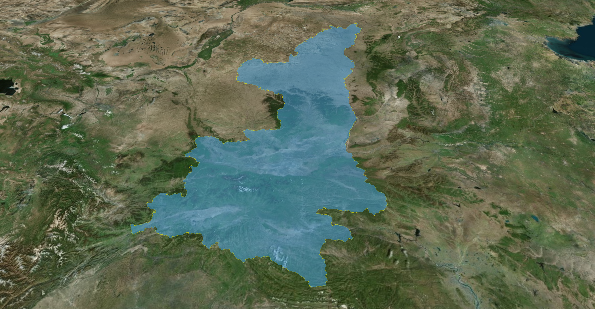
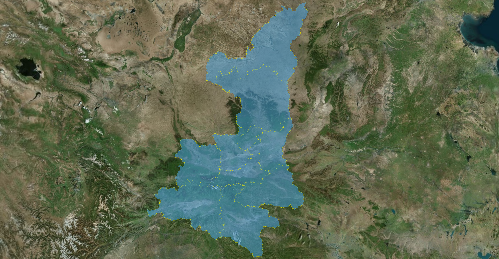
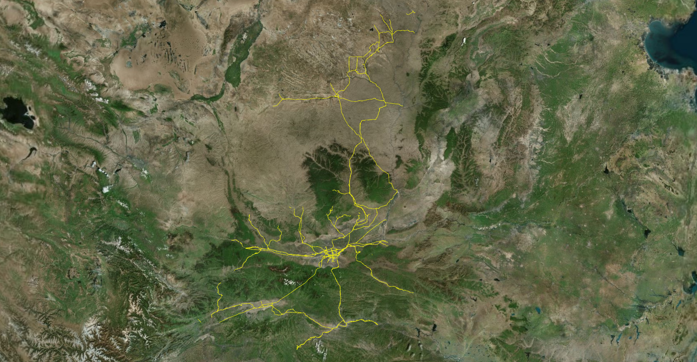

# 加载矢量数据

矢量数据（Vector Data）是 GIS 中用来表示地理特征的一种数学方式。它不像栅格数据是由一个个像素点组成的，而是通过 **坐标点** 以及连接这些点的 **线段** 和 **多边形** 来描述世界。

根据地理实体的形状和复杂度，矢量数据通常分为以下三种类型：

|      类型      | 描述                                                 | 实例                       |
| :------------: | ---------------------------------------------------- | -------------------------- |
|  点（Point）   | 由一组经纬度或平面坐标定义，代表没有长度和面积的实体 | 城市位置、树木、路灯       |
| 线（Polyline） | 由一系列按顺序连接的点组成，具有长度但没有面积       | 河流、道路、铁路           |
| 面（Polygon）  | 由封闭的点序列组成，起始点和终点重合，具有周长和面积 | 湖泊、国家边界、建筑物轮廓 |

> [!TIP] 矢量数据的优点
>
> - **无限放大不失真**：因为它是基于数学公式计算的，无论放大多少倍，图形的边缘不会出现锯齿状；
> - **属性存储能力强**：每个几何图形都可以挂载大量的非空间信息；
> - **拓扑关系清晰**：能很好地描述空间关系，如“路在哪里相交”、“公园位于哪个行政区内”，这对于导航和空间分析至关重要；
> - **数据量相对较小**：对于结构简单的地图，矢量文件通常比高分辨率的扫描图要小得多；

Cesium 直接支持的矢量数据格式包括 geojson、topojson、kml 及具有时间特性的 czml，它们都以 DataSource 后缀去命名相关的类。


## GeoJSON 数据

在 [GeoJSON↗](https://geojson.cn/docs/resources/geojson) 出现之前，GIS 领域常用的是 Shapefile。但 Shapefile 由多个文件组成，且是二进制格式，使用者无法直接阅读。

> [!NOTE] GeoJSON 优势
>
> - **可读性强**：它本质上就是文本，可以用记事本打开，看到里面的坐标和属性；
> - **轻量级**：非常适合在网页（WebGIS）和移动应用中传输数据；
> - **开发者友好**：几乎所有的现代编程语言都能原生支持处理 JSON；

::: code-group

```ts [加载GeoJSON]
async function loadGeoJson(url: string, name: string = "geojson") {
  const dataSource = await Cesium.GeoJsonDataSource.load(url, {
    // 外边线颜色
    stroke: Cesium.Color.fromCssColorString("#e6e610"),
    // 外边线宽度（Cesium加载GeoJSON数据时，用到了WebGL相关的手段，线宽可能会被默认加载为1px）
    strokeWidth: 1,
    // 面填充色
    fill: Cesium.Color.fromCssColorString("#48a6e8").withAlpha(0.5),
    // 面是否贴地（开启此属性时，strokeWidth将会失效）
    clampToGround: true,
  });
  // 设置数据源名称，移除数据时使用
  dataSource.name = name;
  viewer.dataSources.add(dataSource);
  
  viewer.zoomTo(dataSource);
}
```

```ts [移除GeoJSON] {7}
function removeGeoJson(name: string | string[]) {
  const names = Array.isArray(name) ? name : [name];
  const dataSources = window.viewer.dataSources._dataSources;
  // 注意：删除图层时，必须从后往前倒着删除，否则会图层错乱！
  for (let i = dataSources.length - 1; i >= 0; i--) {
    if (names.includes(dataSources[i].name)) {
      window.viewer.dataSources.remove(dataSources[i]);
    }
  }
}
```

```ts [显隐GeoJSON] {6}
function toggleVisible(name: string, visible: boolean) {
  const dataSources = window.viewer.dataSources._dataSources;
  for (let i = dataSources.length - 1; i >= 0; i--) {
    const dataSource = dataSources[i];
    if (dataSource.name === name) {
      dataSource.show = visible;
    }
  }
}
```

:::

> [!CAUTION] 注意
>
> 这里的 `clampToGround: true` 并没有实现贴地，不知为何。




## TopJSON 数据

[TopJSON↗](https://github.com/topojson/topojson-specification?tab=readme-ov-file#11-examples) 是由 D3.js 的作者 Mike Bostock 推出的一种地理数据格式。它通过一种非常聪明的方式，解决了 GeoJSON 的两个痛点：**文件太大** 和 **边界缝隙**。

- GeoJSON 的逻辑：每个多边形都是独立的。如果两个省份相邻，那么这条边界线会在文件中存储两次；
- TopJSON 的逻辑：它引入了 “拓扑”的概念。它会把所有的线拆解成一段段互不重叠的弧线，如果两个省份相邻，他们会共享同一段弧线的索引；

> [!NOTE] TopJSON 优势
>
> - **极高的压缩率**：由于消除了重复的边界坐标，文件体积通常比 GeoJSON 小 80% 左右；
> - **数据一致性**：在缩放地图时，GeoJSON 可能会因为浮点经度值导致相邻的两个区域之间出现微小的“缝隙”或重叠，而 TopJSON 因为共享同一段坐标，边缘永远是完美贴合的；
> - **整数坐标优化**：TopJSON 通常使用“量化”技术，将复杂的经纬度坐标转换为相对的整数坐标，进一步减小了体积；


官方提供的 TopJSON 数据可 [查看此处 ↗](https://github.com/CesiumGS/cesium/tree/main/Apps/SampleData)，也可以通过 [在线转换工具 ↗](https://jeffpaine.github.io/geojson-topojson/) 将 GeoJSON 转换为 TopJSON 再进行加载。

```ts
async function loadTopJson(url: string, name: string = "topjson") {
  const dataSource = await Cesium.GeoJsonDataSource.load(url, {
    // 外边线颜色
    stroke: Cesium.Color.fromCssColorString("#e6e610"),
    // 外边线宽度（Cesium加载GeoJSON数据时，用到了WebGL相关的手段，线宽可能会被默认加载为1px）
    strokeWidth: 1,
    // 面填充色
    fill: Cesium.Color.fromCssColorString("#48a6e8").withAlpha(0.5),
    // 面是否贴地（开启此属性时，strokeWidth将会失效）
    clampToGround: true,
  });
  // 设置数据源名称，移除数据时使用
  dataSource.name = name;
  viewer.dataSources.add(dataSource);

  viewer.zoomTo(dataSource);
}
```


## KML/KMZ 数据

KML 是一种基于 XML 语法的数据格式，它是专门为三维数字地球设计的，它不仅记录地理坐标，还记录怎么看这些数据。

KMZ 是 KML 数据的压缩包，原始的 KML 文件中，可以会引用很多本地的图标、3D 模型或图片，当你把这个 KML 发送给别人时，对方会因为缺少这些附件而无法正常显示。

> [!NOTE] KML 优势
>
> - **视角控制**：KML 可以保存你观察地球的角度、倾斜度和高度，打开文件时，地图会自动飞到预设的视角；
> - **样式定制**：可以直接在文件里定义图标的样式、线条的粗细、颜色的透明度，甚至可以给弹窗写 HTML 代码；
> - **时间维度**：支持时间戳，可以用来制作动态的轨迹回放；
> - **叠加层**：可以把一张历史地图的图片“贴”在数字地球的表面（图片叠加）；

```js
async function loadKmlData(url: string, name: string = "kml") {
  const dataSource = await Cesium.KmlDataSource.load(url, {
    camera: viewer.scene.camera,
    canvas: viewer.scene.canvas,
    clampToGround: true,
  });
  dataSource.name = name;
  viewer.dataSources.add(dataSource);
}
```


## CZML 数据

CZML 是一种基于 JSON 的数据格式，专门为 CesiumJS 开发的。它能够完美的描述随时间变化的属性，比如飞机的飞行轨迹、卫星的轨道设计、甚至是气温随时间的变化波动。官方提供的 CZML 数据可 [查看此处 ↗](https://github.com/CesiumGS/cesium/tree/main/Apps/SampleData)。

```typescript
const viewer = new Cesium.Viewer("cesium-container", {
  // 开启动画控件
  animation: true,
  // 启用动画效果
  shouldAnimate: true,
});

async function loadCzmlData(url: string) {
  // czml 数据源的 name 属性，默认就是 url 的文件名称
  const dataSource = await Cesium.CzmlDataSource.load(url);
  viewer.dataSources.add(dataSource);
}
```


## Shp 数据

Shp 数据是由 ESRI 公司开发的一种行业标准的地理信息系统矢量数据格式。它并不是一个单一的文件，而是一系列文件的集合（通常称为一个 Dataset）。

> [!NOTE] Shp 数据的组成
>
> - `.shp`：存储几何图形（如点、线、面）；
>- `.dbf`：存储属性数据（如名称、人口、编号等表格信息）；
> - `.shx`：索引文件，用于快速寻找几何图形；
> - `.prj`：存储投影信息，定义坐标系等；

Cesium 原生并不支持直接加载 .shp 文件，需要使用第三方库进行加载，例如 [`shpjs↗`](https://www.npmjs.com/package/shpjs)。

安装 shpjs 库：

```shell
pnpm install shpjs @types/shpjs
```

可以加载单个 shp 文件，也可以通过 zip 方式加载一整个 Dataset 文件集。

```ts {13,14}
/**
 * 加载 shp 文件或内含 Dataset 文件集的压缩包
 * @param url 文件的绝对路径，内部会自动拼接项目根地址
 * @param name 文件名称
 * @example
 * ``` js
 * loadShpData("/datas/shp/test.shp", "测试数据");
 * loadShpData("/datas/shp/shp.zip", "测试数据");
 * ```
 */
async function loadShpData(url: string, name: string = "shpfile") {
  // shpjs加载时需要拼接当前项目的根地址
  const fullUrl = window.location.origin + url;
  const geojson = await shp(fullUrl);
  
  // 使用加载 geojson 数据的方法
  const dataSource = await Cesium.GeoJsonDataSource.load(geojson, {
    // 外边线颜色
    stroke: Cesium.Color.fromCssColorString("#e6e610"),
    // 外边线宽度（Cesium加载GeoJSON数据时，用到了WebGL相关的手段，线宽可能会被默认加载为1px）
    strokeWidth: 1,
    // 面填充色
    fill: Cesium.Color.fromCssColorString("#48a6e8").withAlpha(0.5),
    // 面是否贴地（开启此属性时，strokeWidth将会失效）
    clampToGround: true,
  });
  // 设置数据源名称，移除数据时使用
  dataSource.name = name;

  viewer.dataSources.add(dataSource);
  viewer.zoomTo(dataSource);
}
```

|  |  |
| :------------------------------------------------------: | :------------------------------------------------------: |
|                        shp 面数据                         |                        shp 线数据                         |


## WKT 数据

WKT 是一种用于表示矢量几何对象的 **文本标记语言**，它是由 OGC 指定的标准，目的是为了让计算机系统（尤其是数据库）能用一种统一的、易读的字符串来存储和交换空间数据。

WKT 的最大特点是：它直接用 **大写字母描述形状，括号里填坐标**。它没有 JSON 那些繁琐的引号和冒号。

| 几何属性           | WKT 表示法示例                                   |
| ------------------ | ----------------------------------------------- |
| 点（Point）        | $POINT(116.39, 39.91)$                          |
| 线（LineString）   | $LINESTRING(30\ 10,10\ 30,40\ 40)$              |
| 面（Polygon）      | $POLYGON(30\ 10,40\ 40, 20\ 40, 10\ 20,30\ 10)$ |
| 多点（MultiPoint） | $MULTIPOINT((10\ 40), (40\ 30))$                |

```ts
```


## SVG 静态图标


## GIF 动态图标


## 大数据量点聚合


