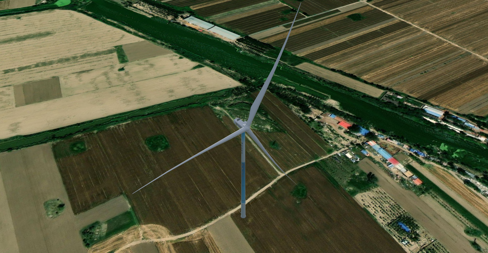
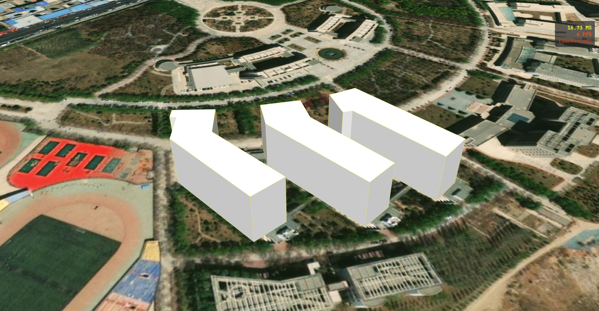
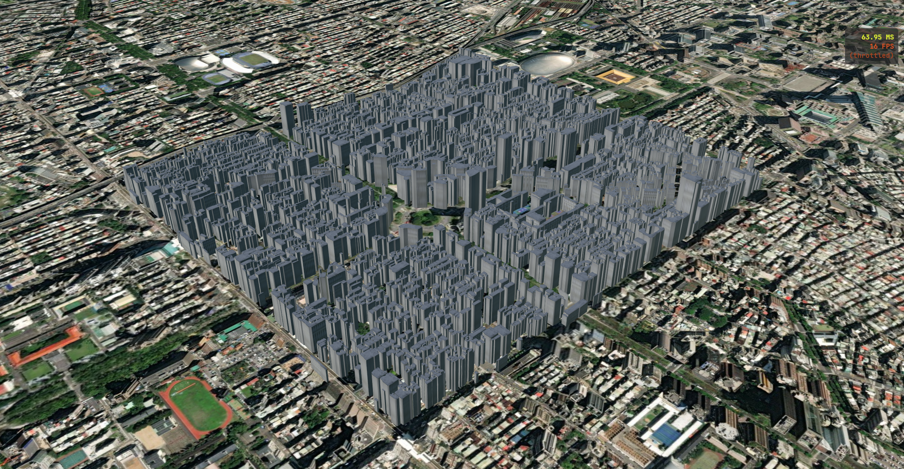
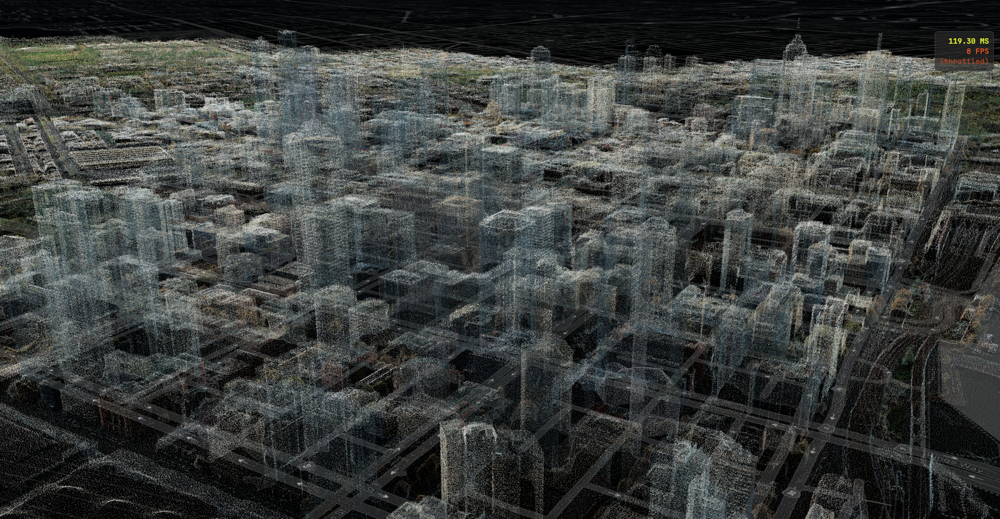
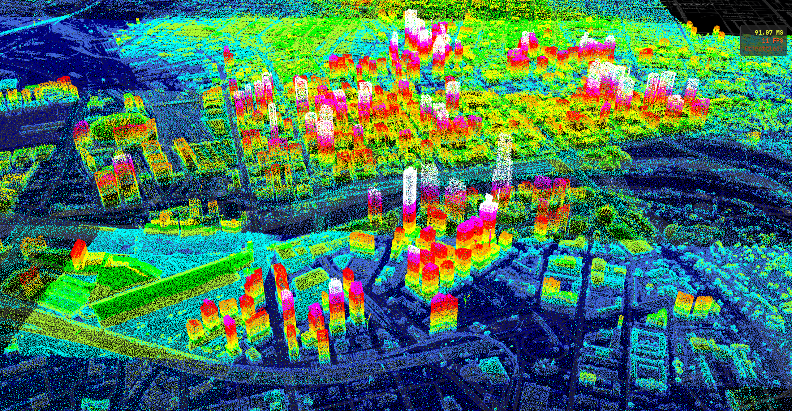
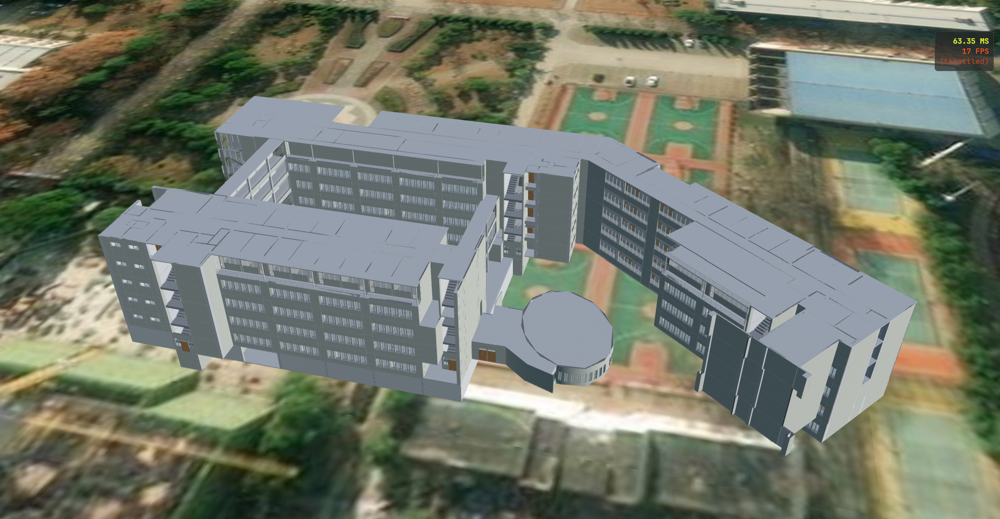
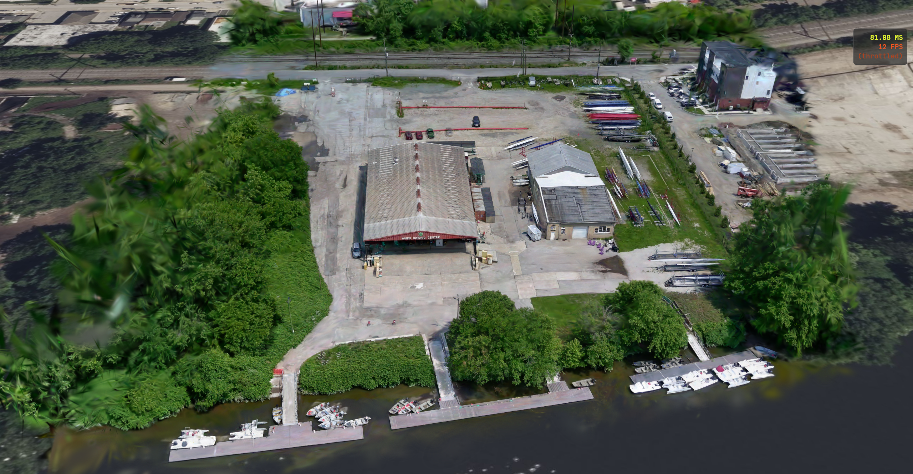

# 加载三维模型

## gltf 模型

> [!NOTE] 什么是 gltf 和 glb？
>
> gltf 是一种基于 JSON 格式的 3D 场景格式。它非常“散”，一个完整的 gltf 模型通常由多个文件组成：
>
> - `.gltf` 文件：核心的 JSON 文件，包含场景结构、节点层次、材质定义等文字信息；
> - `.bin` 文件：二进制数据，存储顶点坐标、法线、动画关键帧等负载的几何数据；
> - 贴图文件：如 jpg 或 png，负责表面的纹理；
>
> glb 是 gltf 的二进制版本。它就像是一个压缩包，把上面提到的所有文件全部塞进了一个后缀名为 `.glb` 的单一文件中，**体积更小**。

::: code-group

```ts [Entity加载]
function loadGltfModel(url: string) {
  const position = Cesium.Cartesian3.fromDegrees(116.39, 38.9, 0);
  const orientation = Cesium.Transforms.headingPitchRollQuaternion(
    position,
    new Cesium.HeadingPitchRoll(
      Cesium.Math.toRadians(0),
      Cesium.Math.toRadians(0),
      Cesium.Math.toRadians(0),
    ),
  );

  const model = viewer.entities.add({
    name: "gltf模型",
    position: position,
    orientation: orientation,
    model: {
      uri: url,
      // 模型缩放比例
      scale: 1.0,
      // 模型的最小像素大小
      minimumPixelSize: 200,
      // 最大缩放比例
      maximumScale: 10,
      // 开启渐进式纹理加载（先加载模型，然后慢慢加载纹理）
      incrementallyLoadTextures: true,
      // 是否开启模型动画
      runAnimations: true,
      // 模型动画是否停留在最后一帧的状态
      clampAnimations: true,
      // 模型阴影模式
      shadows: Cesium.ShadowMode.ENABLED,
      // 模型高度相对于什么计算
      heightReference: Cesium.HeightReference.NONE,
      // 设置模型的可见高度范围
      distanceDisplayCondition: new Cesium.DistanceDisplayCondition(0, 10000),

      // 模型外轮廓颜色（不生效）
      silhouetteColor: Cesium.Color.YELLOW,
      // 模型外轮廓宽度（不生效）
      silhouetteSize: 5,
      
      // 模型填充色
      color: Cesium.Color.WHITE,
      // 模型原始纹理颜色和上面的 color 如何混合（HIGHLIGHT：相乘混合；REPLACE：完全替换；MIX：线性插值）
      colorBlendMode: Cesium.ColorBlendMode.MIX,
      // 当 colorBlendMode 为 MIX 时的颜色强度
      colorBlendAmount: 0.1,
      // 设置模型受光面的颜色（背光面不发生变化，只改变迎光面）
      lightColor: Cesium.Color.RED,
      
      // 对模型的某个节点进行平移、旋转、缩放
      nodeTransformations: {
        "1-叶片-A": {
          rotation: Cesium.Quaternion.fromAxisAngle(
            Cesium.Cartesian3.UNIT_Z,
            Cesium.Math.toRadians(180)
          ),
          translation: Cesium.Cartesian3.ZERO,
          scale: new Cesium.Cartesian3(2, 2, 2),
        },
      },

      // 允许通过一个面将 3D 径直模型切开，露出内部的结构
      clippingPlanes: new Cesium.ClippingPlaneCollection({
        enabled: true,
        planes: [
          new Cesium.ClippingPlane(new Cesium.Cartesian3(1.0, 0.0, 0.0), 0.0),
        ],
        // 裁切边缘的颜色和宽度（让切口看起来像被切开的横截面）
        edgeColor: Cesium.Color.YELLOW,
        edgeWidth: 2.0,
      }),
    },
  });

  viewer.zoomTo(model, {
    heading: Cesium.Math.toRadians(-90),
    pitch: Cesium.Math.toRadians(-45),
    range: 400,
  });
}
```

```ts [Primitive加载]
async function loadGltfModel(url: string) {
  const position = Cesium.Cartesian3.fromDegrees(116.39, 38.9, 0);
  // 创建一个东北向上的坐标系
  const modelMatrix = Cesium.Transforms.eastNorthUpToFixedFrame(position);

  const model = await Cesium.Model.fromGltfAsync({
    id: 1,
    url: url,
    // 模型缩放比例
    scale: 1,
    // 模型 4×4 世界坐标矩阵
    modelMatrix: modelMatrix,
    // 模型的最小像素大小
    minimumPixelSize: 200,
    // 最大缩放比例
    maximumScale: 10,
    // 是否允许鼠标拾取模型
    allowPicking: true,
    // 开启渐进式纹理加载（先加载模型，然后慢慢加载纹理）
    incrementallyLoadTextures: true,
    // 是否异步加载模型纹理
    asynchronous: true,
    // 模型动画是否停留在最后一帧的状态
    clampAnimations: true,
    // 模型阴影模式
    shadows: Cesium.ShadowMode.ENABLED,
    // 模型高度相对于什么计算
    heightReference: Cesium.HeightReference.NONE,
    // 设置模型的可见高度范围
    distanceDisplayCondition: new Cesium.DistanceDisplayCondition(0, 10000),

    // 模型外轮廓颜色（不生效）
    silhouetteColor: Cesium.Color.YELLOW,
    // 模型外轮廓宽度（不生效）
    silhouetteSize: 5,

    // 模型填充色
    color: Cesium.Color.WHITE,
    // 模型原始纹理颜色和上面的 color 如何混合（HIGHLIGHT：相乘混合；REPLACE：完全替换；MIX：线性插值）
    colorBlendMode: Cesium.ColorBlendMode.MIX,
    // 当 colorBlendMode 为 MIX 时的颜色强度
    colorBlendAmount: 0.1,

    // 调试属性，是否打开模型球边界
    debugShowBoundingVolume: false,
    // 调试属性，是否以线框中绘制模型
    debugWireframe: false,
  });

  model.readyEvent.addEventListener(() => {
    model.activeAnimations.addAll({
      // 是否在模型动画结束时移除模型
      removeOnStop: false,
      // 模型动画的延迟时间（单位：秒）
      delay: 5,
      // 模型动画的转速
      multiplier: 1,
      // 是否反向转动
      reverse: false,
      // 模型动画播放模式
      loop: Cesium.ModelAnimationLoop.REPEAT,
    });

    // 使用相机直接飞向包围球
    viewer.camera.flyToBoundingSphere(model.boundingSphere, {
      offset: new Cesium.HeadingPitchRange(
        Cesium.Math.toRadians(-90),
        Cesium.Math.toRadians(-45),
        400,
      ),
      duration: 2,
    });
  });
  viewer.scene.primitives.add(model);
}
```

:::

::: details 关键参数详解

> [!TIP] minimumPixelSize
>
> **作用**：防止模型随距离变远而消失。
>
> 通常情况下，物体离相机越远，看起来就越小。如果把相机拉的非常高（比如大气层外），普通的 3D 模型会缩成一个点，最后完全看不到。
>
> 而设置 `minimumPixelSize：20` 后，无论把相机拉多远，这个模型永远在屏幕上会占用 200 个像素宽高。

> [!TIP] maximumScale
>
> 作用：给 `minimumPixelSize` 设置最大值。
>
> 虽然 `minimumPixelSize` 能让模型在远处也清楚可见，但如果不加限制，模型会被无限放大。

:::




## 城市建筑白膜

城市建筑白模是三维城市模型的一种最基础的表现形式，它不贴纹理、只保留几何形状和高度信息。

> [!NOTE] 白模的特征
>
> - 几何抽象化：通常只表现建筑物的体积、轮廓和屋顶形式，不包含复杂的立面细节（如窗户、阳台）。在标准上，它对应 LOD1（细节层次1）的 3D 城市模型；
> - 无纹理：表面通常是纯白色或单一的灰度颜色；

```ts
async function loadBuilding(url: string, name: string = "geojson") {
  const dataSource = await Cesium.GeoJsonDataSource.load(url, {
    // 是否贴地
    clampToGround: true,
  });
  // 为 geojson 数据设置名称，移除的时候使用
  dataSource.name = name;
  dataSource.entities.values.forEach((entity) => {
    if (Cesium.defined(entity.polygon)) {
      entity.name = entity.properties?.name.getValue();
      // height 的类型是 Cesium.Property，所以这里必须使用 Property 类型，不能使用原始的 number 赋值
      entity.polygon.height = new Cesium.ConstantProperty(0);
      entity.polygon.heightReference = new Cesium.ConstantProperty(Cesium.HeightReference.RELATIVE_TO_GROUND);
      entity.polygon.extrudedHeight = entity.properties?.height.getValue();
      entity.polygon.extrudedHeightReference = new Cesium.ConstantProperty(Cesium.HeightReference.RELATIVE_TO_GROUND);
      entity.polygon.material = new Cesium.ColorMaterialProperty(Cesium.Color.WHITE);
      entity.polygon.outline = new Cesium.ConstantProperty(true);
      entity.polygon.outlineWidth = new Cesium.ConstantProperty(1); // WebGL限制，线宽始终为1
      entity.polygon.outlineColor = new Cesium.ConstantProperty(Cesium.Color.YELLOW);
    }
  });
  await viewer.dataSources.add(dataSource);

  await viewer.flyTo(dataSource);
}
```




## 倾斜摄影模型

倾斜摄影模型是目前地理信息系统和数字孪生领域最主流的建模技术之一。简单来说，它是通过无人机搭载多台传感器（通常是 5 个），从 **垂直** 和 **倾斜**（前后左右）五个方向同时拍摄照片，再利用计算机视觉算法自动生成的高精度实景模型。[倾斜摄影模型下载↗](https://wwaxx.lanzout.com/iw5dl3osjqef)

> [!NOTE] 倾斜摄影的工作原理
>
> 传统的测绘（正射影像）就像是从正上方“证件照”，只能看到屋顶。而倾斜摄影更像是给建筑拍“全身照”。
>
> - **五目相机**：无人机底部有一个相机阵列，1 个相机垂直向下，另外 4 个相机分别从前后左右倾斜 45° 左右拍摄；
> - **多源感知**：这种方式不仅能抓取建筑的顶面信息，还能完整记录侧面的纹理、窗户、植被等细节；
> - **自动化建模**：系统根据数千张带有位置信息（GPS/RTK）的照片，通过“多视影像匹配”技术自动生成带纹理的三维模型；

> [!TIP] 常见的输出格式
>
> - OSGB：最常见的原始切片格式，Cesium 无法直接读取；
> - 3D Tiles：倾斜摄影通过 `.json` 的格式进入 web 端，但需要将 OSGB 转换后使用；

```ts
async function load3DTiles() {
  const tileset = await Cesium.Cesium3DTileset.fromUrl(
    "/datas/3DTiles/tileset.json",
  );
  viewer.scene.primitives.add(tileset);
  viewer.flyTo(tileset);
}
```




## 点云模型

点云（Point Cloud）是由大量在三维坐标系中的“点”组成的数据集。如果把物体表面想象成密密麻麻的针尖，这些针尖在空间中的位置（$X$、$Y$、$Z$ 坐标）组合在一起，就构成了物体的几何形状。

> [!NOTE] 点云模型的核心组成
>
> 一个标准的点云模型不仅包含位置信息，通常还携带以下属性：
>
> - **空间坐标**：$(x,y,z)$ 确定点在空间中的位置；
> - **颜色信息**：$(R,G,B)$ 赋予点云真实感（通常由相机同步拍摄获取）；
> - **反射强度**：反映物体表面对激光等信号的反射能力；
> - **法向量**：表示该点所在表面的朝向，对后续的 3D 渲染非常关键；

> [!TIP] 点云的优势
>
> 为什么在三位领域点云如此流行？主要归功于以下几点：
>
> - **还原度极高**：点云通常通过激光雷达（LiDAR）或摄影测量直接获取，能够捕获到极其细微的细节；
> - **获取速度快**：利用激光扫描仪，可以在几秒钟内获取数百万个点的空间数据。这对于需要实时感知环境的设备（如 **自动驾驶汽车**）来说至关重要；
> - **易于测量与分析**：因为每个点都有精确的坐标，可以直接在点云模型上测量长度、高度、体积甚至坡度，精度通常可以达到厘米甚至毫米级；

```ts
async function loadPointCloud() {
  const tileset = viewer.scene.primitives.add(
    await Cesium.Cesium3DTileset.fromIonAssetId(43978),
  );
  // 点云按高度上色
  tileset.style = new Cesium.Cesium3DTileStyle({
    color: {
      conditions: [
        ["${POSITION}.z < 10.0", "color('navy')"],
        ["${POSITION}.z < 20.0", "color('royalblue')"],
        ["${POSITION}.z < 30.0", "color('cyan')"],
        ["${POSITION}.z < 40.0", "color('greenyellow')"],
        ["${POSITION}.z < 50.0", "color('lime')"],
        ["${POSITION}.z < 70.0", "color('yellow')"],
        ["${POSITION}.z < 90.0", "color('orange')"],
        ["${POSITION}.z < 120.0", "color('red')"],
        ["${POSITION}.z < 150.0", "color('magenta')"],
        ["true", "color('white')"],
      ],
    },
    pointSize: 2.0,
  });
  viewer.flyTo(tileset);
}
```

|  |  |
| :------------------------------------------------------: | :------------------------------------------------------: |
|                         原始点云                         |                         点云上色                         |


## BIM 模型

BIM（建筑信息模型）是以建筑工程项目的各项相关信息数据为基础而建立的建筑模型，通过数字信息仿真，模拟建筑物所具有的真实信息。

BIM 让建筑过程从“看图纸猜结果”变成了“先在电脑里盖一遍，确认无误再施工”。

::: info 提示

在 Cesium 中加载 BIM 模型，核心在于将 BIM 软件生成的原始文件（如 Revit）转换为 3D Tiles 格式。

:::

```ts
async function loadBIMModel() {
  const tileset = await Cesium.Cesium3DTileset.fromUrl(
    "https://data.mars3d.cn/3dtiles/bim-daxue/tileset.json"
  );
  viewer.scene.primitives.add(tileset);
  viewer.flyTo(tileset);
}
```




## 高斯泼溅

高斯泼溅是一种光栅化技术，主要用于实时渲染三维场景。它通过将场景中的物体表示为三维高斯分布（即高斯椭球），并利用泼溅算法将这些高斯分布投影到二维屏幕上，从而实现高效的渲染。

与传统的三角形网格渲染方法相比，高斯泼溅能够更好地处理复杂的场景和细节，提供更高的渲染质量和速度。[高斯泼溅模型下载↗](https://wwaxx.lanzout.com/iFrzc3os6nje)

> [!NOTE] 工作原理
>
> - **三维高斯表示**：高斯泼溅使用三维高斯分布来表示物体的表面特征。每个高斯分布通过其中心点和协方差矩阵来定义，协方差矩阵描述了高斯的形状和方向；
> - **泼溅算法**：在渲染过程中，泼溅算法将这些高斯分布投影到二维平面上，通过对多个高斯分布的合成，生成最终的图像。这种方式允许在保持高质量的同时，减少计算量；
> - **实时渲染**：高斯泼溅技术支持实时渲染，能够以超过 100 帧每秒的速度生成高质量的图像，适用于虚拟现实（VR）、增强现实（AR）等应用场景；

```ts
async function load3DGS() {
  const tileset = await Cesium.Cesium3DTileset.fromUrl("/datas/3DGS/tileset.json");
  viewer.scene.primitives.add(tileset);
  viewer.flyTo(tileset);
}
```




