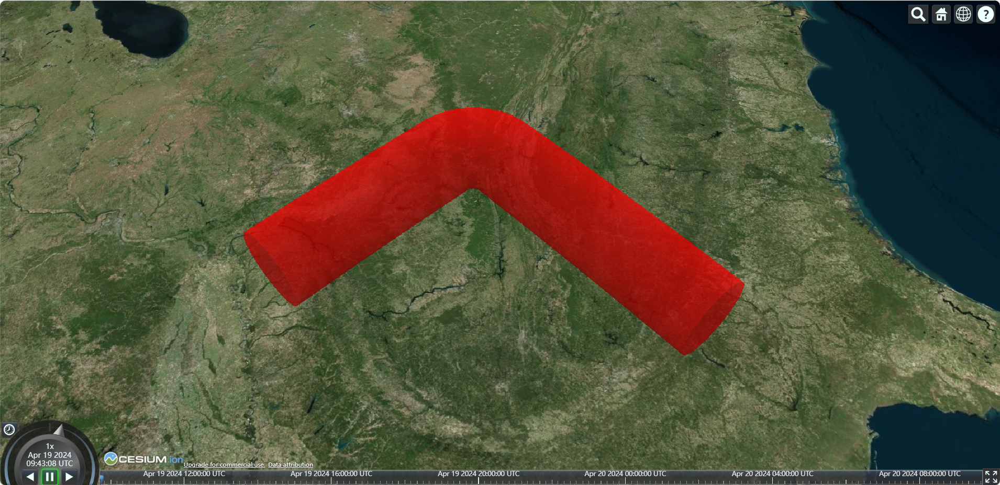

# 加载Entity实体

cesium 中空间数据可视化 API 共分为 2 部分：

- Entity实体：由 Primitive 图元封装组成，调用方便，但是加载大量数据时效率没有 Primitive 高；
- Primitive图元：灵活性高，更接近 webGL 的底层，没有像 Entity 一样带有附加属性，加载大量数据时效率更高；

> 参考文章：
>
> 1.  https://blog.csdn.net/appleshowc/article/details/123479194
> 2.  https://juejin.cn/post/6974592888420171790


## point 点

```js
const point = viewer.entities.add({
  id: "point",
  name: "point",
  position: Cesium.Cartesian3.fromDegrees(102.7362, 38.0249, 0),
  point: {
    show: true,
    pixelSize: 10,
    color: Cesium.Color.RED,
    outlineColor: Cesium.Color.YELLOW,
    outlineWidth: 0.4,
    // scaleByDistance: new Cesium.NearFarScalar(1.0e3, 10.0, 2.0e3, 1.0)
  }
});

viewer.zoomTo(point);
```


## polyline 线

```js
const polyline = viewer.entities.add({
  id: "polyline",
  name: "polyline",
  polyline: {
    show: true,
    width: 50,
    clampToGround: true,
    positions: Cesium.Cartesian3.fromDegreesArray([
      102.73523, 38.02712, 102.73625, 38.02405
    ]),
    material: new Cesium.PolylineGlowMaterialProperty({
      color: Cesium.Color.DEEPSKYBLUE.withAlpha(0.7),
      glowPower: 0.25 // 高亮发光
    })
  }
});

viewer.zoomTo(polyline);
```


## polylineVolume 多线段柱体

```js
async function addTerrainServer() {
  var redTube = viewer.entities.add({
    id: "polylineVolume",
    name: "polylineVolume",
    polylineVolume: {
      show: true,
      // 定义线带的 Cartesian3 位置的数组
      positions: Cesium.Cartesian3.fromDegreesArray([
        -85.0, 32.0, -85.0, 36.0, -89.0, 36.0
      ]),
      // 指定 Cartesian2 位置的数组，这些位置定义了要拉伸的形状
      shape: computeCircle(60000),
      cornerType: Cesium.CornerType.ROUNDED,
      fill: true,
      material: Cesium.Color.RED,
      outline: false,
      outlineColor: Cesium.Color.BLACK,
      outlineWidth: 1
    }
  });

  viewer.zoomTo(redTube);
}

function computeCircle(radius: number) {
  var positions = [];
  for (var i = 0; i < 360; i++) {
    var radians = Cesium.Math.toRadians(i);
    positions.push(
      new Cesium.Cartesian2(
        radius * Math.cos(radians),
        radius * Math.sin(radians)
      )
    );
  }
  return positions;
}
```



## plane 平面

```js
const plane = viewer.entities.add({
  name: "plane",
  position: Cesium.Cartesian3.fromDegrees(116.39, 38.9, 0.0),
  plane: {
    // UNIT_Z 表示垂直于 Z 轴，UNIT_X 表示垂直与 X 轴
    plane: new Cesium.Plane(Cesium.Cartesian3.UNIT_Z, 0.0),
    dimensions: new Cesium.Cartesian2(400, 300), // 平面的长度和宽度
    fill: true,
    material: Cesium.Color.RED.withAlpha(0.5),
    // material: "/cesium_stripes.png",
    outline: true,
    outlineWidth: 5,
    outlineColor: Cesium.Color.GREEN
  }
});

// 将视角绑定到图形
viewer.trackedEntity = plane;
```


## polygon 多边形

```js
const polygon = viewer.entities.add({
  polygon: {
    show: true,
    // 多边形层次
    hierarchy: {
      // 外边线环
      positions: Cesium.Cartesian3.fromDegreesArray([
        110, 30, 110, 25, 115, 30
      ]),
      // 层次结构数组
      holes: []
    },
    height: 0, 				// 多边形距离地面的高度
    extrudedHeight: 100000, // 多边形(柱体)的拉伸高度
    fill: true,
    material: Cesium.Color.YELLOW.withAlpha(0.5),
    outline: true,
    outlineColor: Cesium.Color.WHITE,
    outlineWidth: 2,

    perPositionHeight: true,
    closeTop: true,
    closeBottom: true,
    arcType: Cesium.ArcType.GEODESIC // 多边形边缘必须遵循的线型
  }
});

viewer.zoomTo(polygon);
```


## box 盒子

```js
const box = viewer.entities.add({
  position: Cesium.Cartesian3.fromDegrees(102.7362, 38.0249, 0),
  box: {
    show: true,
    dimensions: new Cesium.Cartesian3(40, 40, 40), 				// 长、宽、高
    heightReference: Cesium.HeightReference.CLAMP_TO_GROUND, 	// 指定距实体位置的高度是相对于什么的高度
    fill: true,
    material: Cesium.Color.BLANCHEDALMOND,
    outline: true,
    outlineColor: Cesium.Color.WHITE,
    outlineWidth: 5,
    shadows: Cesium.ShadowMode.DISABLED
  }
});

viewer.zoomTo(box);
```


## ellipse 椭圆

```js
const ellipse = viewer.entities.add({
  position: Cesium.Cartesian3.fromDegrees(102.7362, 38.0249, 0),
  ellipse: {
    show: true,
    semiMajorAxis: 100, 	// 长半轴
    semiMinorAxis: 50, 		// 短半轴
    height: 20, 			// 距离地面的高度
    heightReference: Cesium.HeightReference.CLAMP_TO_GROUND,
    extrudedHeight: 100, 	// 填充柱体高度
    extrudedHeightReference: Cesium.HeightReference.NONE,

    fill: true,
    material: Cesium.Color.YELLOW.withAlpha(0.5),
    rotation: Math.PI / 2, 	// 旋转角度(正北，逆时针旋转)
    outline: true,
    outlineColor: Cesium.Color.WHITE,
    outlineWidth: 2,
    numberOfVerticalLines: 16 // 轮廓线垂直数量
  }
});

viewer.zoomTo(ellipse);
```


## cylinder 圆柱/圆锥

圆柱本质上也是椭圆的一种情况，所以圆柱/圆锥也可以使用 椭圆 来绘制，只不过调整长半轴和短半轴相同而已。

```js
const cylinder = viewer.entities.add({
  name: "cylinder",
  position: Cesium.Cartesian3.fromDegrees(-105.0, 40.0, 200000.0),
  cylinder: {
    show: true,
    length: 400000.0, 		// 圆柱体长度
    topRadius: 200000.0, 	// 圆柱体顶部半径
    bottomRadius: 200000.0, // 圆柱体底部半径
    heightReference: Cesium.HeightReference.CLAMP_TO_GROUND,
    fill: true,
    material: Cesium.Color.GREEN.withAlpha(0.5),
    outline: true,
    outlineColor: Cesium.Color.AQUA,
    outlineWidth: 1,
    numberOfVerticalLines: 64, 	// 沿轮廓的周长绘制的垂直线的数量
    slices: 256, 				// 圆柱周围的边缘数量
    shadows: Cesium.ShadowMode.DISABLED,
  }
});

viewer.zoomTo(cylinder);
```


## ellipsoid 椭球体

```js
const ellipsoid = viewer.entities.add({
  name: "Spheres and Ellipsoids",
  position: Cesium.Cartesian3.fromDegrees(-100.0, 40.0, 300000.0),
  ellipsoid: {
    show: true,
    radii: new Cesium.Cartesian3(200000.0, 200000.0, 300000.0), // 椭球半径
    minimumClock: 0.0, 			// 最小时钟角度
    maximumClock: 2 * Math.PI, 	// 最大时钟角度
    minimumCone: 0.0, 			// 最小圆锥角
    maximumCone: Math.PI, 		// 最大圆锥角
    heightReference: Cesium.HeightReference.NONE,
    fill: true,
    material: Cesium.Color.BLUE.withAlpha(0.5),
    outline: true,
    outlineColor: Cesium.Color.YELLOW,
    outlineWidth: 1.0,
    stackPartitions: 64, 		// 延纬度线切割的次数
    slicePartitions: 64, 		// 延经度线切割的次数
    subdivisions: 128, 			// 每个轮廓环的样本数，确定曲率的粒度
    shadows: Cesium.ShadowMode.DISABLED
  }
});

viewer.zoomTo(ellipsoid);
```


## rectangle 矩形

```js
const rectangle = viewer.entities.add({
  position: Cesium.Cartesian3.fromDegrees(102.7362, 38.0249, 0),
  rectangle: {
    show: true,
    // 矩形的左下和右上
    coordinates: Cesium.Rectangle.fromDegrees(102.7357, 38.025, 102.737, 38.0258),
    rotation: Math.PI / 2, 	// 旋转角度(正北, 顺时针旋转)
    height: 10, 			// 距离地面的高度
    extrudedHeight: 200, 	// 拉伸高度

    fill: true,
    material: Cesium.Color.RED.withAlpha(0.5),
    outline: true,
    outlineColor: Cesium.Color.WHITE
  }
});

viewer.zoomTo(rectangle);
```


## corridor 走廊

```js
const corridor = viewer.entities.add({
  name: "corridor",
  corridor: {
    positions: Cesium.Cartesian3.fromDegreesArray([
      -80.0, 40.0, -85.0, 40.0, -85.0, 35.0
    ]),
    width: 200000,
    height: 200000,
    heightReference: Cesium.HeightReference.CLAMP_TO_GROUND,
    extrudedHeight: 100000,
    extrudedHeightReference: Cesium.HeightReference.NONE,
    cornerType: Cesium.CornerType.ROUNDED, // 拐角的类型
    granularity: Cesium.Math.RADIANS_PER_DEGREE, // 每个纬度和经度之间的距离
    fill: true,
    material: Cesium.Color.SKYBLUE.withAlpha(0.5),
    outline: true,
    outlineColor: Cesium.Color.WHITE,
    outlineWidth: 1,
    shadows: Cesium.ShadowMode.DISABLED,
    classificationType: Cesium.ClassificationType.BOTH // 是否对 地形 和 3D Tiles 进行分类
  }
});
viewer.zoomTo(corridor);
```


## wall 墙

```js
const wall = viewer.entities.add({
  id: "wall",
  name: "wall",
  wall: {
    show: true,
    positions: Cesium.Cartesian3.fromDegreesArrayHeights([
      -115.0, 44.0, 200000.0, -90.0, 44.0, 200000.0
    ]),
    minimumHeights: [100000.0, 100000.0],
    granularity: Cesium.Math.RADIANS_PER_DEGREE, // 指定矩形上各点之间的角度距离
      
    fill: true,
    material: Cesium.Color.RED,
    outline: false,
    outlineColor: Cesium.Color.BLACK,
    outlineWidth: 1.0,
    shadows: Cesium.ShadowMode.DISABLED
  }
});

viewer.zoomTo(wall);
```


## label 标签

```js
const label = viewer.entities.add({
  position: Cesium.Cartesian3.fromDegrees(102.7362, 38.0249, 0),
  label: {
    text: "home of my love",
    font: "26px sans-serif",
    scale: 1,
    style: Cesium.LabelStyle.FILL_AND_OUTLINE, 			// 设置该属性背景和外边线才会显示
    fillColor: Cesium.Color.fromCssColorString("#22385b"),
    outlineColor: Cesium.Color.fromCssColorString("#fff"),
    outlineWidth: 3,
    showBackground: false, 								// 是否显示背景颜色
    backgroundColor: new Cesium.Color(112, 86, 151), 	// 背景颜色
    backgroundPadding: new Cesium.Cartesian2(50, 50), 	// 背景 padding
    horizontalOrigin: Cesium.HorizontalOrigin.CENTER, 	// 水平居中
    verticalOrigin: Cesium.VerticalOrigin.CENTER, 		// 垂直居中
    pixelOffset: new Cesium.Cartesian2(0, -40) 			// 偏移
  }
});

viewer.zoomTo(label);
```


## Billboard 广告牌

广告牌使用 [`new Cesium.Billboard()`](https://cesium.com/learn/cesiumjs/ref-doc/Billboard.html?classFilter=billboard) 来创建。

```js
const enetity = viewer.entities.add({
  name: "billboard",
  position: Cesium.Cartesian3.fromDegrees(113.122717, 23.028762, 10),
  label: {
    text: "航路点",
    font: "bold 26px sans-serif",
    scale: 0.5,
    style: Cesium.LabelStyle.FILL_AND_OUTLINE,
    fillColor: Cesium.Color.fromCssColorString("#22385b"),
    outlineColor: Cesium.Color.fromCssColorString("#fff"),
    outlineWidth: 4,
    pixelOffset: new Cesium.Cartesian2(0, -40),
    showBackground: false,
    backgroundColor: Cesium.Color.WHITE.withAlpha(0.2),
    backgroundPadding: new Cesium.Cartesian2(20, 10),
    heightReference: Cesium.HeightReference.NONE
  },
  billboard: {
    image: "/位置.png",
    horizontalOrigin: Cesium.HorizontalOrigin.CENTER,
    verticalOrigin: Cesium.VerticalOrigin.BOTTOM,
    scale: 0.5,
    width: 50,
    height: 50,
    pixelOffset: new Cesium.Cartesian2(0, -50), 	  	// 像素偏移
    eyeOffset: new Cesium.Cartesian3(0, 0, 0), 	  		// 眼睛偏移
    heightReference: Cesium.HeightReference.NONE,  		// 高度参考
    color: Cesium.Color.LIME,
    rotation: Cesium.Math.PI_OVER_FOUR,            		// 旋转角度(弧度)
    alignedAxis: Cesium.Cartesian3.ZERO,           		// 世界空间中的对齐轴
    // 根据广告牌与相机的距离获取或设置广告牌的近和远缩放属性
    scaleByDistance: new Cesium.NearFarScalar(1.0e3, 2.0, 2.0e3, 1.0),
    // 根据广告牌到相机的距离，获取或设置广告牌的近和远半透明属性
    translucencyByDistance: new Cesium.NearFarScalar(1.0e3, 1.0, 1.5e6, 0.5),
    // 根据广告牌与摄像头的距离，获取或设置广告牌的近像素偏移量和远像素偏移量缩放属性
    pixelOffsetScaleByDistance: new Cesium.NearFarScalar(1.0e3, 1.0, 1.5e6, 0.5), 
    // 设置10000米和30000米之间可见
    distanceDisplayCondition: new Cesium.DistanceDisplayCondition(10000, 30000),
  }
});

viewer.zoomTo(enetity);
```
