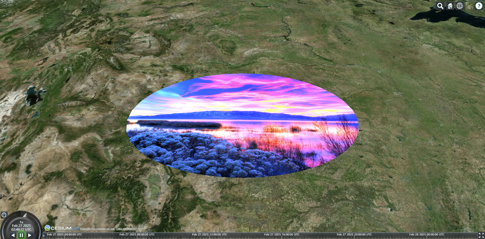
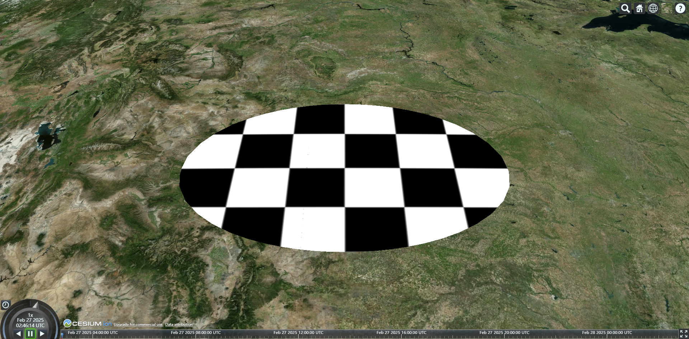

# Entity材质和轮廓

在 Entity API 中，不管是哪种几何定义的图形，所有形状和物体都有一组共同的属性来控制他们的外观。

```js
const viewer = new Cesium.Viewer("cesiumContainer", {
  infoBox: false
});

const entity = viewer.entities.add({
  position: Cesium.Cartesian3.fromDegrees(-103.0, 40.0),
  ellipse: {
    fill: true, // fill开启时，才可以填充images
    semiMinorAxis: 250000.0,
    semiMajorAxis: 400000.0,
    // 默认的材质是 蓝色带透明
    material: Cesium.Color.BLUE.withAlpha(0.5)
  }
});
viewer.zoomTo(viewer.entities);
```


## Image

可以将材质指定为一个图片链接（在线图片/离线图片均可）：

```js
// 填充图片
entity.ellipse.material = "/R.jpg";
```




## 棋盘

```js
entity.ellipse.material = new Cesium.CheckerboardMaterialProperty({
  evenColor: Cesium.Color.WHITE,
  oddColor: Cesium.Color.BLACK,
  // 奇偶交替的频次
  repeat: new Cesium.Cartesian2(6, 4)
});
```



## 条纹

```js
entity.ellipse.material = new Cesium.StripeMaterialProperty({
  // 条纹垂直或水平
  orientation: Cesium.StripeOrientation.VERTICAL,
  evenColor: Cesium.Color.WHITE,
  oddColor: Cesium.Color.BLACK,
  repeat: 32
});
```


## 网格

```js
entity.ellipse.material = new Cesium.GridMaterialProperty({
  color: Cesium.Color.YELLOW, // 线条颜色和背景色
  cellAlpha: 0, // 背景色透明度
  lineCount: new Cesium.Cartesian2(8, 8), // 线条条数
  lineThickness: new Cesium.Cartesian2(5, 5), // 线条粗细
  lineOffset: new Cesium.Cartesian2(10, 10) // 线条偏移量
});
```


## 外轮廓

与 fill 属性不同，outline 属性没有相应的材料填充，而是依赖于 outlineColor 和 outlineWidth 属性。

```js {4,5}
const entity = viewer.entities.add({
  position: Cesium.Cartesian3.fromDegrees(-103.0, 40.0),
  ellipse: {
    fill: false,
    outline: true,
    semiMinorAxis: 250000.0,
    semiMajorAxis: 400000.0,
    material: Cesium.Color.BLUE.withAlpha(0.5)
  }
});
viewer.zoomTo(viewer.entities);

entity.ellipse.outlineColor = Cesium.Color.YELLOW;
entity.ellipse.outlineWidth = 2;
```


## 折线轮廓

折线是特殊性情况，因为它没有填充或轮廓属性，它们需要依靠专门的 material 来代替颜色。

```js
const entity = viewer.entities.add({
  polyline: {
    positions: Cesium.Cartesian3.fromDegreesArray([
      102.73523, 38.02712, 102.73625, 38.02405
    ]),
    width: 10,
    // 默认材质为红色
    material: Cesium.Color.RED
  }
});
viewer.zoomTo(viewer.entities);

entity.polyline.material = new Cesium.PolylineOutlineMaterialProperty({
  color: Cesium.Color.ORANGE,
  outlineWidth: 5,
  outlineColor: Cesium.Color.BLACK
});
```


## 折现光晕

```js
entity.polyline.material = new Cesium.PolylineGlowMaterialProperty({
  color: Cesium.Color.BLUE,
  // 发光强度
  glowPower: 0.25,
  // 渐变效果，总长为1
  taperPower: 1
});
```


