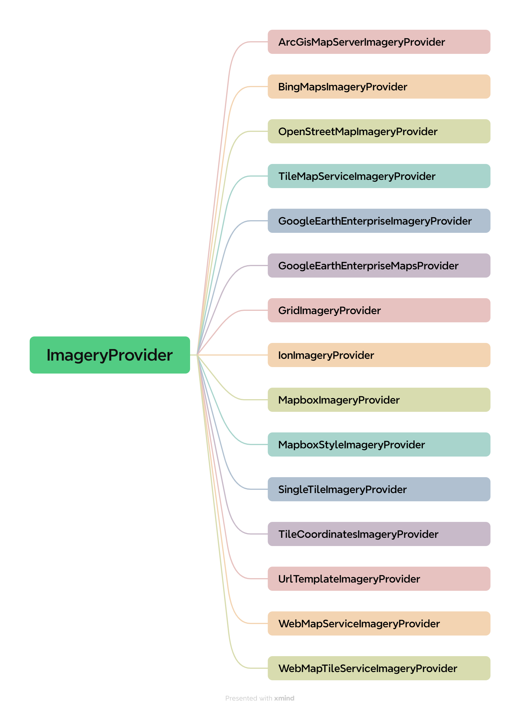

# 地图图层

Cesium 支持大量的数据格式，主要分为一下几类：

- 影像地图：Bing、天地图、ArcGIS、OSM、WMTS、WMS；
- 地形数据：ArcGIS、谷歌、STK；
- 矢量数据：KML、KMZ、GeoJSON、TopoJSON、CZML；
- 三维模型：GLTF、GLB（二进制 GLTF 文件）；
- 三维瓦片：3D Tiles（倾斜摄影、人工模型、三维建筑物、CAD、BIM、点云数据等）；


## ImageryLayer类

在 Cesium 中，使用 [`ImageryLayer`](https://cesium.com/learn/cesiumjs/ref-doc/ImageryLayer.html?classFilter=ImageryLayer) 对象来表示一个**影像图层**。

::: success 提示

1. `ImageryLayer` 需要 ImageryProvider数据源 为其提供内在丰富的地理空间信息和属性信息，同时，通过该类还能设置影像图层的相关属性，如透明度、亮度、对比度、色调等等；
2. 可以通过将其添加到 [`ImageryLayerCollection`](https://cesium.com/learn/cesiumjs/ref-doc/ImageryLayerCollection.html?classFilter=ImageryLayerCollection) 中来实现在场景中切换图层的效果；

:::

::: code-group

```js
const imagerLayer = new Cesium.ImageryLayer(imageryProvider, options);
```

```js [示例]
// 加载Cesium默认影像图
const imageryLayer = Cesium.ImageryLayer.fromWorldImagery({});
viewer.scene.imageryLayers.add(imageryLayer);

// 加载OpenStreetMaps地图
const imageryLayer = new Cesium.ImageryLayer(
  new Cesium.OpenStreetMapImageryProvider({
    url: "https://tile.openstreetmap.org/"
  })
);
viewer.scene.imageryLayers.add(imageryLayer);

// 加载Id为 3812 图层
const imageryLayer = Cesium.ImageryLayer.fromProviderAsync(
  Cesium.IonImageryProvider.fromAssetId(3812),
  {
    // options
  }
);
viewer.scene.imageryLayers.add(imageryLayer);
```

:::

|      参数       | 作用                                            |
| :-------------: | ----------------------------------------------- |
| imageryProvider | 一个 ImageryProvider 对象，用于提供地图影像数据 |

options：

|        参数         |   类型    | 作用                                                         |
| :-----------------: | :-------: | ------------------------------------------------------------ |
|        show         |  boolean  | 布尔类型，表示该图层是否可见，默认值为 true                  |
|      rectangle      | Rectangle | 一个 Rectangle 对象，表示该图层的可视范围                    |
|        alpha        |  Number   | 影像图层的透明度（0~1），默认值为 1                          |
|     brightness      |  Number   | 影像图层的亮度调整值（-1~1），默认值为 0                     |
|      contrast       |  Number   | 影像图层的对比度调整值（-1~1），默认值为 0                   |
|         hue         |  Number   | 影像图层的色调调整值（-1~1），默认值为 0                     |
|     saturation      |  Number   | 影像图层的饱和度调整值（-1~1），默认值为 0                   |
|        gamma        |  Number   | 影像图层的伽马调整值（>=1），默认值为 1                      |
| maximumTerrainLevel |  Number   | 表示在地形高程数据缺失时，该图层的最大可见级别，默认值为 Infinity |
|       zIndex        |  Number   | 表示图层的顺序，数值越大表示越靠前                           |

常用方法：

|                             方法                             | 描述                                                         |
| :----------------------------------------------------------: | ------------------------------------------------------------ |
| [fromProviderAsync()](https://cesium.com/learn/cesiumjs/ref-doc/ImageryLayer.html#.fromProviderAsync) | 异步加载 Cesium 提供的图层                                   |
| [fromWorldImagery()](https://cesium.com/learn/cesiumjs/ref-doc/ImageryLayer.html#.fromWorldImagery) | 异步加载全球基础的影像地图，默认是 BingMap                   |
| [getImageryRectangle()](https://cesium.com/learn/cesiumjs/ref-doc/ImageryLayer.html#getImageryRectangle) | 获取影像图层在地理坐标系下的矩形范围，如截取当前屏幕范围（结果是弧度，需要转为经纬度） |
| [destroy()](https://cesium.com/learn/cesiumjs/ref-doc/ImageryLayer.html#destroy) | 当不再需要该图层时，销毁该图层，释放资源，避免内存泄漏       |
|                        isDestroyed()                         | 返回布尔值，表示该图层是否已销毁                             |

```js {8,10}
const imageryLayer = Cesium.ImageryLayer.fromProviderAsync(
  Cesium.IonImageryProvider.fromAssetId(3812),
  // options
  {}
);
viewer.scene.imageryLayers.add(imageryLayer);

const rectangle = imageryLayer.getImageryRectangle();

imagerLayer.destroy();
const isDestroy = imagerLayer.isDestroyed();
```


## ImageryProvider类

在 Cesium 中，[ImageryProvider](https://cesium.com/learn/cesiumjs/ref-doc/ImageryProvider.html?classFilter=ImageryProvider)类是抽象类、基类，它不能被直接实例化。

我们可以把 ImageryProvider 看作是影像图层的数据源，想使用哪种影像图层数据或服务就使用对应的 ImageryProvider 子类去加载。

目前 Cesium 提供了[15种ImageryProvider](https://cesium.com/learn/cesiumjs/ref-doc/ImageryProvider.html)：



例如使用 ArcGisMapServerImageryProvider 子类：

```js {6}
async function addImageryLayer() {
  const provider = await Cesium.ArcGisMapServerImageryProvider.fromUrl(
    "https://map.geoq.cn/ArcGIS/rest/services/ChinaOnlineStreetPurplishBlue/MapServer"
  );
  viewer.scene.imageryLayers.addImageryProvider(provider);
}
```


## ImageryLayerCollection类

在 Cesium 中，[ImageryLayerCollection](https://cesium.com/learn/cesiumjs/ref-doc/ImageryLayerCollection.html?classFilter=ImageryLayerCollection) 类是 ImageryLayer 对象的容器，它可以装载、放置多个 ImageryLayer 或 ImageryProvider 类对象，并且内部是有序存储的。

`Cesium.viewer`对象中的 ImageryLayers 属性就是 ImageryLayerCollection 类的实例，它包含了当前 Cesium 应用程序中所有的 ImageryLayer 类对象，即所有的影像图层。


参数：

|     参数     | 描述                                                |
| :----------: | --------------------------------------------------- |
|    length    | 返回容器中 ImageryLayer 的数量                      |
|  layerAdded  | 图层添加到 ImageryLayerCollection集合中时发生的事件 |
|  layerMoved  | 图层在 ImageryLayerCollection集合中移动时发生的事件 |
| layerRemoved | 图层从 ImageryLayerCollection集合中删除时发生的事件 |

方法：

|                    方法                    | 描述                                                         |
| :----------------------------------------: | ------------------------------------------------------------ |
|             add(layer, index)              | 将给定的 ImageryLayer 对象添加到集合中的指定位置。（如果省略索引，则将该图像图层添加到末尾） |
|               remove(layer)                | 从集合中删除给定的 ImageryLayer 对象                         |
|                removeAll()                 | 从集合中删除所有 ImageryLayer 对象                           |
|             raiseToTop(layer)              | 将给定的 ImageryLayer 对象移动到集合的顶部                   |
|            lowerToBottom(layer)            | 将给定的 ImageryLayer 对象移动到集合的底部                   |
| addImageryProvider(imageryProvider, index) | 用于将给定的 ImageryProvider 对象创建的图像图层添加到集合中的指定位置。如果省略索引，则将该图像图层添加到末尾 |
