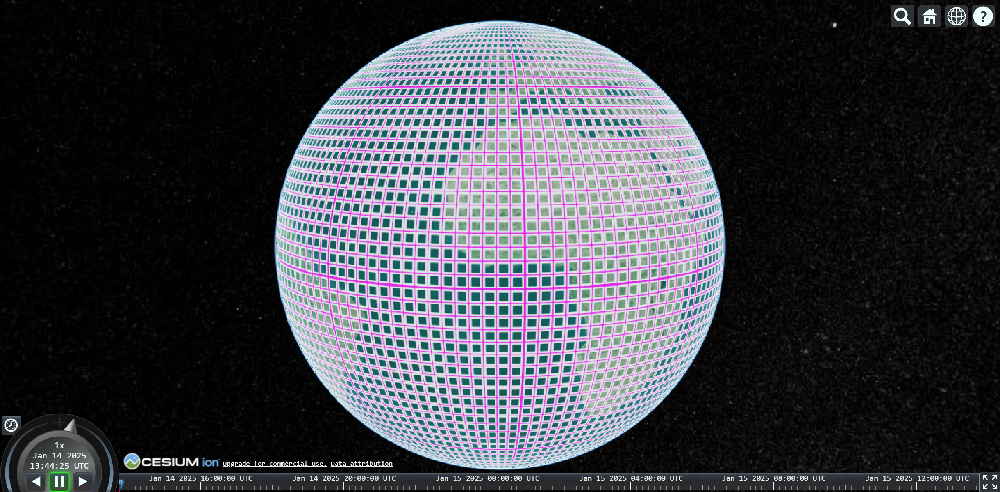
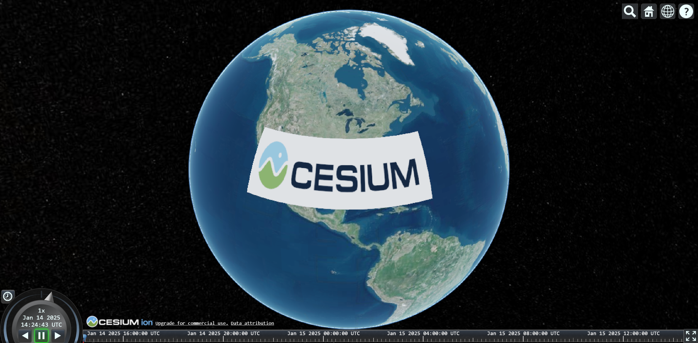

# 影像地图

## 清除默认底图

```js
viewer.imageryLayers.remove(viewer.imageryLayers.get(0))
```


## ArcGIS Map

::: details 常见地图URL

```json
[
  {
    name: "ArcGIS影像地图",
    url: "https://services.arcgisonline.com/ArcGIS/rest/services/World_Imagery/MapServer"
  },
  {
    name: "ArcGIS街道地图",
    url: "https://services.arcgisonline.com/ArcGIS/rest/services/World_Street_Map/MapServer"
  }
]
```

:::

::: code-group

```js [方式一] {4-11}
const viewer = new Cesium.Viewer("cesiumContainer", {
  infoBox: false,
  baseLayerPicker: false,
  baseLayer: Cesium.ImageryLayer.fromProviderAsync(
    Cesium.ArcGisMapServerImageryProvider.fromUrl(
      "https://services.arcgisonline.com/ArcGIS/rest/services/World_Imagery/MapServer",
      {
        // options
      }
    )
  )
});
```

```js [方式二] {14}
const provider = Cesium.ImageryLayer.fromProviderAsync(
  Cesium.ArcGisMapServerImageryProvider.fromUrl(
    "https://services.arcgisonline.com/ArcGIS/rest/services/World_Imagery/MapServer",
    {
      // options
    }
  )
);

const viewer = new Cesium.Viewer("cesiumContainer", {
  infoBox: false,
  baseLayerPicker: false,
  // 初始化时加载
  baseLayer: provider
});
```

```js [方式三] {16}
const provider = Cesium.ImageryLayer.fromProviderAsync(
  Cesium.ArcGisMapServerImageryProvider.fromUrl(
    "https://services.arcgisonline.com/ArcGIS/rest/services/World_Imagery/MapServer",
    {
      // options
    }
  )
);

const viewer = new Cesium.Viewer("cesiumContainer", {
  infoBox: false,
  baseLayerPicker: false
});

// 运行时加载图层
viewer.imageryLayers.add(provider);
```

```js [方式四] {13}
const provider = await Cesium.ArcGisMapServerImageryProvider.fromUrl(
  "https://services.arcgisonline.com/ArcGIS/rest/services/World_Imagery/MapServer",
  {
    // options
  }
);

const viewer = new Cesium.Viewer("cesiumContainer", {
  infoBox: false,
  baseLayerPicker: false
});

viewer.imageryLayers.addImageryProvider(provider);
```

```js [方式五] {12}
  const provider = Cesium.ImageryLayer.fromProviderAsync(
    Cesium.ArcGisMapServerImageryProvider.fromBasemapType(
      Cesium.ArcGisBaseMapType.HILLSHADE,
      {
        // options
      }
    )
  );

  const viewer = new Cesium.Viewer("cesiumContainer", {
    // 前面提到的几种方法，也适用于这里
    baseLayer: provider,
    infoBox: false
  });
```

:::


## Bing Map

[`BingMapsImageryProvider`](https://cesium.com/learn/cesiumjs/ref-doc/BingMapsImageryProvider.html?classFilter=BingMapsImageryProvider) 可以加载 BingMap 提供的地图，但是在使用前需要到BingMap官网 [申请key](https://www.bingmapsportal.com/Application#)。

```js {10,13}
const viewer = new Cesium.Viewer("cesiumContainer", {
  infoBox: false
});

const bing = await Cesium.BingMapsImageryProvider.fromUrl(
  "https://dev.virtualearth.net",
  {
    key: "AuTngMwN4lNgKFXy91uWt7eZjolIRsky9u2E3E9z6W7ru6b-zVvKtwz0n9ZSaD7i",
    // BingMapsStyle枚举类，里面包含了地图种类
    mapStyle: Cesium.BingMapsStyle.AERIAL_WITH_LABELS
  }
);
viewer.imageryLayers.addImageryProvider(bing);
```


## Google Map

[`GoogleEarthEnterpriseImageryProvider`](https://cesium.com/learn/cesiumjs/ref-doc/GoogleEarthEnterpriseImageryProvider.html?classFilter=goog) 用来加载谷歌地球企业级提供的瓦片图像，可与Google Earth Enterprise的3D Earth API一起使用。

```js {5-13}
const viewer = new Cesium.Viewer("cesiumContainer", {
  infoBox: false
});

const geeMetadata = await Cesium.GoogleEarthEnterpriseMetadata.fromUrl(
  "http://www.example.com"
);
const provider = Cesium.GoogleEarthEnterpriseImageryProvider.fromMetadata(
  geeMetadata,
  {
    // options
  }
);
viewer.imageryLayers.addImageryProvider(provider);
```


## Cesium Ion Map

Cesium Ion在线服务，默认全局基础图像图层（当前为Bing Maps）。

```js
const viewer = new Cesium.Viewer("cesiumContainer", {
  infoBox: false
});

const imageryLayer = Cesium.ImageryLayer.fromProviderAsync(
  Cesium.IonImageryProvider.fromAssetId(3812),
  {
    // options
  }
);
viewer.imageryLayers.add(imageryLayer);
```


## Mapbox Map

[`MapboxImageryProvider`](https://cesium.com/learn/cesiumjs/ref-doc/MapboxImageryProvider.html#MapboxImageryProvider) 用来加载 mapbox 提供的影像地图。

```js
const mapIds = [
  "mapbox.satellite", // 显示，其余都不显示
  "mapbox.streets",
  "mapbox.streets-basic",
  "mapbox.light",
  "mapbox.streets-satellite",
  "mapbox.wheatpaste",
  "mapbox.comic",
  "mapbox.outdoors",
  "mapbox.run-bike-hike",
  "mapbox.pencil",
  "mapbox.pirates",
  "mapbox.emerald",
  "mapbox.high-contrast"
];

const mapbox = new Cesium.MapboxImageryProvider({
  url: "https://api.mapbox.com/v4/",
  mapId: mapIds[0],
  format: "png",
  minimumLevel: 0,
  maximumLevel: 24,
  accessToken:
  "pk.eyJ1IjoiNzc5MjIiLCJhIjoiY201bm45amJmMGEwbTJwczgzMTNoNXRmcCJ9.TY7n-MTlMJ3cTUfjkRS9SQ"
});
viewer.imageryLayers.addImageryProvider(mapbox);
```

[`MapboxStyleImageryProvider`](https://cesium.com/learn/cesiumjs/ref-doc/MapboxStyleImageryProvider.html?classFilter=MapboxStyleImageryProvider) 用来加载 mapbox 提供的样式相关的地图。

```js
// 都没测试通
const styleIds = [
  "streets-v11",
  "outdoors-v11",
  "light-v10",
  "dark-v10",
  "satellite-v9"
];

const mapbox = new Cesium.MapboxStyleImageryProvider({
  url: "https://api.mapbox.com/styles/v1/",
  username: "mapbox-style-imagery",
  styleId: styleIds[3],
  tilesize: 512,
  minimumLevel: 0,
  maximumLevel: 24,
  accessToken:
  "pk.eyJ1IjoiNzc5MjIiLCJhIjoiY201bm45amJmMGEwbTJwczgzMTNoNXRmcCJ9.TY7n-MTlMJ3cTUfjkRS9SQ"
});
viewer.imageryLayers.addImageryProvider(mapbox);
```


## OpenStreet Map

[`OpenStreetMapImageryProvider`](https://cesium.com/learn/cesiumjs/ref-doc/OpenStreetMapImageryProvider.html?classFilter=OpenStreetMapImageryProvider) 用来加载 OpenStreet 提供的OSM类型的地图数据。

> 在 [OpenStreet官网](https://www.openstreetmap.org/#map=12/1.3903/103.8629&layers=YNDG) 还能导出地图，有空学习一下。

```js
const viewer = new Cesium.Viewer("cesiumContainer", {
  infoBox: false
});

const osm = new Cesium.OpenStreetMapImageryProvider({
  url: "https://a.tile.openstreetmap.org/",
  minimumLevel: 0,
  maximumLevel: 18,
  fileExtension: "png"
});
viewer.imageryLayers.addImageryProvider(osm);
```


## 高德&腾讯&天地图

[`UrlTemplateImageryProvider`](https://cesium.com/learn/cesiumjs/ref-doc/UrlTemplateImageryProvider.html?classFilter=UrlTemplateImageryProvider) 用于加载基于 HTTP/HTTPS 协议的网络栅格切片数据，支持多种格式、规格和级别范围，需要提供包含切片路径和后缀的URL模板。

UrlTemplateImageryProvider **指定 Url 的 format 模板**，方便用户实现自己的 Provider，国内的高德，腾讯等影像服务都可以使用它加载。

::: code-group

```js [高德影像]
const viewer = new Cesium.Viewer("cesiumContainer", {
  infoBox: false
});

const provider = new Cesium.UrlTemplateImageryProvider({
  url: "https://webst02.is.autonavi.com/appmaptile?style=6&x={x}&y={y}&z={z}",
  maximumLevel: 18,
  minimumLevel: 1,
  credit: "GaoDeMap"
});
viewer.imageryLayers.addImageryProvider(provider);
```

```js [高德矢量+标注]
const viewer = new Cesium.Viewer("cesiumContainer", {
  infoBox: false
});

const provider = new Cesium.UrlTemplateImageryProvider({
  url: "http://webrd0{s}.is.autonavi.com/appmaptile?lang=zh_cn&size=1&scale=1&style=8&x={x}&y={y}&z={z}",
  subdomains: ["1", "2", "3", "4"]
});
viewer.imageryLayers.addImageryProvider(provider);
```

:::

TMS：

```js
// TMS
const viewer = new Cesium.Viewer("cesiumContainer", {
  infoBox: false
});

const tms = new Cesium.UrlTemplateImageryProvider({
  url:
  Cesium.buildModuleUrl("Assets/Textures/NaturalEarthII") +
  "/{z}/{x}/{reverseY}.jpg",
  tilingScheme: new Cesium.GeographicTilingScheme(),
  maximumLevel: 18
});
viewer.imageryLayers.addImageryProvider(tms);
```

Carto：

```js
// Carto地图
const viewer = new Cesium.Viewer("cesiumContainer", {
  infoBox: false
});

const provider = new Cesium.UrlTemplateImageryProvider({
  url: "http://{s}.basemaps.cartocdn.com/light_all/{z}/{x}/{y}.png",
  credit: "Carto Map"
});
viewer.imageryLayers.addImageryProvider(provider);
```

腾讯影像地图：

```js {4-11}
const viewer = new Cesium.Viewer("cesiumContainer", {
  infoBox: false
});

const provider = new Cesium.UrlTemplateImageryProvider({
  url: "https://p2.map.gtimg.com/sateTiles/{z}/{sx}/{sy}/{x}_{reverseY}.jpg?version=400",
  customTags: {
    sx: function (imageryProvider, x, y, level) {
      return x >> 4;
    },
    sy: function (imageryProvider, x, y, level) {
      return ((1 << level) - y) >> 4;
    }
  },
  maximumLevel: 18,
  credit: "Tencent Map"
});
viewer.imageryLayers.addImageryProvider(provider);
```

天地图：

::: code-group

```js [天地图影像地图] {5,15,22}
// 天地图影像地图
const viewer = new Cesium.Viewer("cesiumContainer", {
  infoBox: false
});

const provider = new Cesium.UrlTemplateImageryProvider({
  url: "http://t{s}.tianditu.com/DataServer?T=img_w&X={x}&Y={y}&L={z}&tk=da7665c4b8e7593a2cb6bd910400a71f",
  subdomains: ["0", "1", "2", "3", "4", "5", "6", "7"], // 服务器轮询
  maximumLevel: 18,
  minimumLevel: 1,
  credit: "Tianditu"
});
viewer.imageryLayers.addImageryProvider(provider);
```

```js [天地图影像地图+国界]
const viewer = new Cesium.Viewer("cesiumContainer", {
  infoBox: false
});

// 天地图影像地图
var imgMap = new Cesium.UrlTemplateImageryProvider({
  url: "https://t{s}.tianditu.gov.cn/DataServer?T=img_w&x={x}&y={y}&l={z}&tk=da7665c4b8e7593a2cb6bd910400a71f",
  subdomains: ["0", "1", "2", "3", "4", "5", "6", "7"],
  tilingScheme: new Cesium.WebMercatorTilingScheme(),
  maximumLevel: 18
});
viewer.imageryLayers.addImageryProvider(imgMap);

// 国界和省界
var iboMap = new Cesium.UrlTemplateImageryProvider({
  url: "https://t{s}.tianditu.gov.cn/DataServer?T=ibo_w&x={x}&y={y}&l={z}&tk=da7665c4b8e7593a2cb6bd910400a71f",
  subdomains: ["0", "1", "2", "3", "4", "5", "6", "7"],
  tilingScheme: new Cesium.WebMercatorTilingScheme(),
  maximumLevel: 10
});
viewer.imageryLayers.addImageryProvider(iboMap);
```

:::


## 栅格网格

栅格网格类似于经纬度，将地球表面划分为无数个小格子，可以了解每个瓦片的精细度，便于调试地形和图像渲染问题。

使用 [`GridImageryProvider`](https://cesium.com/learn/cesiumjs/ref-doc/GridImageryProvider.html#.ConstructorOptions) 添加到地图：

```js
const viewer = new Cesium.Viewer("cesiumContainer", {
  infoBox: false
});

const gridImagery = new Cesium.GridImageryProvider({
  color: Cesium.Color.fromCssColorString("#ff00ff"),
  cells: 16, // 网格单元格数
  glowColor: Cesium.Color.WHITE, // 网格线光晕颜色
  glowWidth: 6 // 网格线线宽
});

viewer.scene.imageryLayers.addImageryProvider(gridImagery);
```




## 瓦片图片

[`TileMapServiceImageryProvider`](https://cesium.com/learn/cesiumjs/ref-doc/TileMapServiceImageryProvider.html?classFilter=TileMapServiceImageryProvider) 可以添加由MapTiler、GDAL2Tiles等生成的平铺图像。

实例中使用的图片地址：[Cesium_Logo_Color](https://github.com/CesiumGS/cesium/tree/main/Apps/Sandcastle/images/cesium_maptiler/Cesium_Logo_Color)

```js
const tms = await Cesium.TileMapServiceImageryProvider.fromUrl(
  "/Cesium_Logo_Color",
  {
    fileExtension: "png",
    maximumLevel: 4,
    rectangle: new Cesium.Rectangle(
      Cesium.Math.toRadians(-120.0),
      Cesium.Math.toRadians(20.0),
      Cesium.Math.toRadians(-60.0),
      Cesium.Math.toRadians(40.0)
    )
  }
);
viewer.imageryLayers.addImageryProvider(tms);
```




## 单张图片

[`SingleTileImageryProvider`](https://cesium.com/learn/cesiumjs/ref-doc/SingleTileImageryProvider.html#.ConstructorOptions) 用于加载单张图片的影像服务，适合**离线数据**或**对影像数据要求并不高**的场景下。

```js
const viewer = new Cesium.Viewer("cesiumContainer", {
  infoBox: false
});

const provider = new Cesium.SingleTileImageryProvider({
  url: "./images/worldimage.jpg"
});
viewer.imageryLayers.addImageryProvider(provider);
```


## WMS瓦片地图

WebMapServiceImageryProvider 用于加载 Geoserver 发布的符合WMS规范的影像服务，指定具体参数实现。

```js
const viewer = new Cesium.Viewer("cesiumContainer", {
  infoBox: false
});

const provider = new Cesium.WebMapServiceImageryProvider({
  url: "http://geoserver.nationalmap.nicta.com.au/geotopo_250k/ows",
  layers: "Hydrography:bores",
  parameters: {
    transparent: true,
    format: "image/png"
  }
});
viewer.imageryLayers.addImageryProvider(provider);
```


## WMTS瓦片地图

WebMapTileServiceImageryProvider 用于加载 Geoserver 发布的符合WMTS规范的影像服务，比如国内的天地图。

::: code-group

```js [ArcGIS WMTS]
// ArcGIS WMTS
const viewer = new Cesium.Viewer("cesiumContainer", {
  infoBox: false
});

const provider = new Cesium.WebMapTileServiceImageryProvider({
  url: "https://services.arcgisonline.com/arcgis/rest/services/World_Imagery/MapServer/WMTS",
  layer: "World_Imagery",
  style: "default",
  format: "image/jpeg",
  tileMatrixSetID: "default028mm",
  maximumLevel: 23
});
viewer.imageryLayers.addImageryProvider(provider);
```

```js [天地图 WMTS]
// 天地图 WMTS
const viewer = new Cesium.Viewer("cesiumContainer", {
  infoBox: false
});

const provider = new Cesium.WebMapTileServiceImageryProvider({
  url: "http://t0.tianditu.gov.cn/img_w/wmts?tk=da7665c4b8e7593a2cb6bd910400a71f",
  layer: "img",
  style: "default",
  format: "tiles",
  tileMatrixSetID: "w",
  maximumLevel: 18
});
viewer.imageryLayers.addImageryProvider(provider);
```

:::
