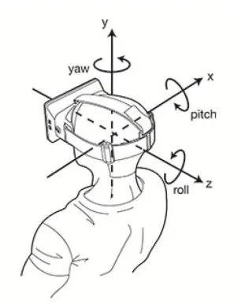

# 飞行视角

相机视角主要用于控制相机的飞行定位，例如系统初始化位置定位、视点切换、设备定位、报警事件定位等，这些都是通过对相机进行操作实现的。

Cesium 虽然提供了很多种方法用于实现相机的飞行定位，但这些方法都是**基于 Viewer 和 Camera 类实现的**。


## 相机参数

在 cesium 中，我们要想确定相机视角，需要设置相机的两个参数：

- 位置（destination）

- 方向（orientation）

  |  参数   |                描述                | 默认值 |
  | :-----: | :--------------------------------: | :----: |
  | heading |          偏航角，正北为0           |   0    |
  |  pitch  |         俯仰角，俯视为-90          |  -90   |
  |  roll   |               翻滚角               |   0    |
  |  range  | 范围（米），代表相机距离目标的高度 |        |




## Viewer类

在 Viewer 类中有两个方法用于实现飞行定位：

|  方法  |              描述              | 是否有动画 |
| :----: | :----------------------------: | :--------: |
| flyTo  |   带有动画地切换视角到位置点   |     有     |
| zoomTo | 视角跳转到给定的 数据源 的位置 |     无     |

::: success 使用场景

1. 适用于导航到某个具体的对象，如 Entity、Primitive、DataSource 等；

2. Cesium 内部会自动计算合适的视角，让目标对象在屏幕上完全可见；

   ```js
   // 飞行到所有实体对象，使它们全部可见
   viewer.flyTo(viewer.entities);
   ```

:::

::: code-group

```js [flyTo方法] {14-17}
const entity = viewer.entities.add({
  rectangle: {
    coordinates: Cesium.Rectangle.fromDegrees(102.7357, 38.025, 102.737, 38.0258),
    material: Cesium.Color.GREEN.withAlpha(1.0),
    height: 10.0,
    outline: false
  }
})

const heading = Cesium.Math.toRadians(0.0)
const pitch = Cesium.Math.toRadians(-25.0)
const range = 0
// 飞行到某个具体的 Entity 实体
viewer.flyTo(entity, {
  duration: 5,
  offset: new Cesium.HeadingPitchRange(heading, pitch, range)
})
```

```js [zoomTo方法] {11-15}
const point = viewer.entities.add({
  id: "point",
  position: Cesium.Cartesian3.fromDegrees(102.7362, 38.0249, 500),
  point: {
    color: Cesium.Color.RED,
    pixelSize: 20
  }
});

// 视角跳转到某个 Entity 实体
viewer.zoomTo(point, {
  heading: Cesium.Math.toRadians(0),
  pitch: Cesium.Math.toRadians(-90),
  range: 500 // 距离中心点的高度
});
```

:::

>flyTo() 的第二个参数中有 duration、offset 等参数，其中 offset 指定了相机参数，而 zoomTo() 的第二个参数就直接是 offset 相机参数了。


## Camera类

Camera类对应的相机定位方法比较多，包括了如下五个方法：

|        方法         |                      描述                      | 是否有动画 |
| :-----------------: | :--------------------------------------------: | :--------: |
|        flyTo        |           带有动画的切换视角到位置点           |     有     |
|       lookAt        | 视角跳转到指定位置点，视角可以旋转，但不能拖动 |     无     |
|       setView       |              视角跳转到指定位置点              |     无     |
|   lookAtTransform   |     使相机“看向”指定的变换举证所表示的目标     |     无     |
| flyToBoundingSphere |        将相机平滑的移动到指定的 包围球         |     有     |

>有飞行动画的方法，其中飞行参数 duration 默认为 3秒。


::: code-group

```js [flyTo方法]
// 将相机位置移动到多边形区域
viewer.camera.flyTo({
  destination: Cesium.Rectangle.fromDegrees(102.7357, 38.025, 102.737, 38.0258),
  orientation: {
    heading: Cesium.Math.toRadians(0),
    pitch: Cesium.Math.toRadians(-90),
    roll: Cesium.Math.toRadians(0)
  },
  duration: 5
})
```

```js [setView方法]
// 直接跳转到目标点，没有飞行动画
viewer.camera.setView({
  destination: Cesium.Cartesian3.fromDegrees(102.7362, 38.0249, 500);,
  orientation: {
    heading: Cesium.Math.toRadians(0),
    pitch: Cesium.Math.toRadians(-90),
    roll: Cesium.Math.toRadians(0)
  }
});
```

```js [lookAt方法]
 // lookAt是将视角固定在设置的点上，可以旋转，但不能拖动位置
viewer.camera.lookAt(
  Cesium.Cartesian3.fromDegrees(102.7362, 38.0249, 500),
  new Cesium.HeadingPitchRange(
    Cesium.Math.toRadians(0), 
    Cesium.Math.toRadians(-90), 
    500) // 高度为500
);
```

:::
